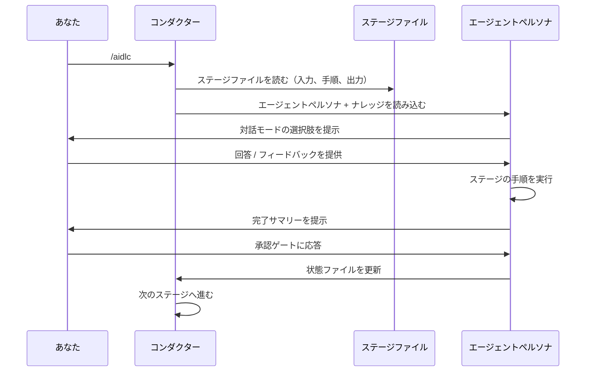
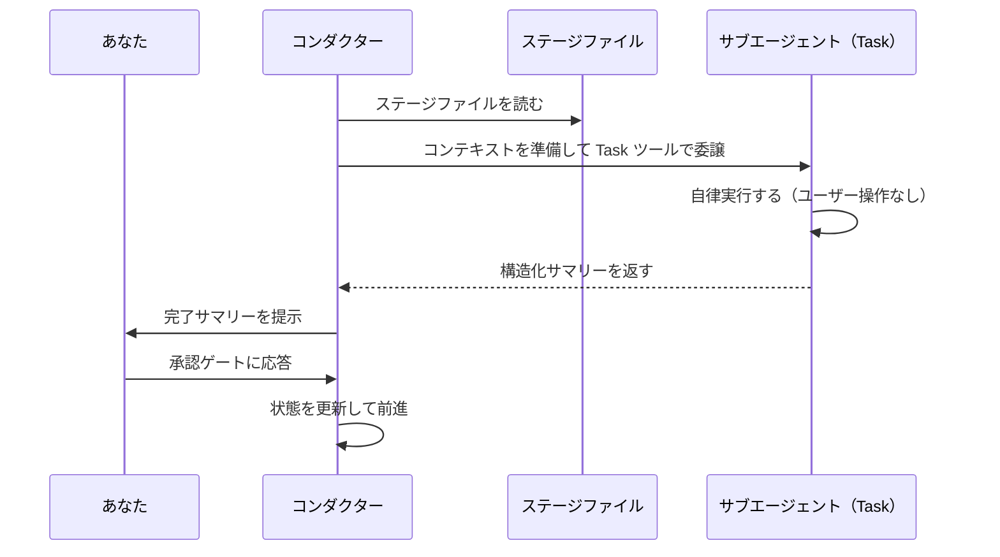

この章では、AI-DLC の完全なワークフロー実行を 1 回通しで追いながら、各ステップで何が表示され、どのような判断を行うのかを説明します。例では `feature` スコープのワークフローで REST API を構築します。

---

<a id="starting-the-workflow"></a>
## ワークフローを開始する

```
/aidlc Build a REST API for inventory management
```

セッション開始時、Claude Code は `settings.json` の `companyAnnouncements` エントリを通して AI-DLC のウェルカムメッセージを表示します。そこでは AI-DLC の仕組みと、ステージマップ、およびスコープの選択肢が説明されます。

```
# Welcome to AI-DLC

**AI-DLC** (AI-Driven Development Life Cycle) is an adaptive methodology that
structures AI-assisted software development into repeatable, traceable phases
while keeping you in control at every decision point.

## How It Works

- **You decide, AI executes.** Every material decision goes through an approval gate.
- **Adaptive scope.** Choose a scope or let AI auto-detect from your intent.
- **Traceable artifacts.** Every stage produces versioned documents in the intent's record dir.
- **11 domain experts.** Specialized agent personas guide each stage.
```

---

<a id="initialization-phase-automatic"></a>
## 初期化フェーズ (Initialization)（自動）

3 つの初期化ステージは、`aidlc-utility init` の中で決定論的に実行されます。これは 1 回のツール呼び出しで完了し、所要時間は 1 秒未満です。初期化に対してあなたが操作することはありません。このフェーズはアクティブなスペースの中に最初のインテントを自動で誕生させ、そのワークフロー用に記録ディレクトリを準備します。

<a id="stage-01-workspace-scaffold"></a>
### ステージ 0.1: ワークスペースの作成 (Workspace Scaffold)

フレームワークは最初のインテントを誕生させ、`aidlc/spaces/<space>/intents/<YYMMDD>-<label>/` に記録ディレクトリを作成します（名前付きスペースを使わない限り `<space>` は `default` です）。

```
Intent born — record dir scaffolded:
  aidlc/spaces/default/intents/<YYMMDD>-<label>/initialization/   (3 stage artifact dirs)
  aidlc/spaces/default/intents/<YYMMDD>-<label>/ideation/         (7 stage artifact dirs)
  ...
Space-level dirs ensured:
  aidlc/spaces/default/knowledge/                             (team knowledge — empty; you add files)
```

<a id="stage-02-workspace-detection"></a>
### ステージ 0.2: ワークスペースの検出 (Workspace Detection)

決定論的なルールベースのスキャナーが、プロジェクトと既知のソースディレクトリ（`src/`、`app/`、`lib/`、`pages/`、`components/`、`tests/`）を 1 階層だけ走査します。ソースファイル、フレームワーク設定、パッケージマニフェストを見て、新規プロジェクト（greenfield）か既存プロジェクト（brownfield）かを分類します。最上位で手がかりが見つからない場合は、任意名の各サブディレクトリにも 1 階層だけ降りるため、ソースが入れ物のフォルダ（例: `wordbook/`、`backend/`）の中にあるプロジェクトでも brownfield として検出されます。

<a id="stage-03-state-initialization"></a>
### ステージ 0.3: 状態の初期化 (State Initialization)

オーケストレーターは、あなたのスコープ、深度、テスト戦略、およびスキャナーの分類に基づく完全なステージ計画を持つ、インテントの `aidlc-state.md`（記録ディレクトリ配下）を書き込みます。同時に、あなたの入力を解析してスコープを確認します。

```
─── Scope Detection ───────────────────────────────────────────────────────────
Detected scope: feature (Standard depth, Standard test strategy, all 32 stages)
▸ Approve scope? [Yes / Change scope / Change depth / Change test strategy]
> Yes
```

検出されたスコープをそのまま受け入れることも、別のスコープ（例: `mvp`）へ変更することも、深度レベルやテスト戦略を調整することもできます。選び方の指針は [スコープ、深度、テスト戦略](/guide/scopes-and-depth) を参照してください。

---

<a id="ideation-phase-interactive"></a>
## アイデア創出フェーズ (Ideation)（対話型）

初期化の後、ワークフローはアイデア創出フェーズに入ります。ここから先の各ステージは対話的に実行され、承認ゲートを伴います。

<a id="stage-11-intent-capture-aidlc-product-agent"></a>
### ステージ 1.1: 意図の取り込み (Intent Capture)(aidlc-product-agent)

ターミナルの下部にあるステータスラインが更新されます。

```
[AIDLC] IDEATION > Intent Capture [▓▓▓▓▓░░░░░] 4/7 -- product
```

ここには、現在のフェーズ、ステージの表示名、フェーズ進捗バー、フェーズ進捗比、リードエージェントが表示されます。バーと比率は同じ集計範囲を共有しており、どちらも現在のフェーズ内の `[x]` ステージを数えるため、比率が進むたびにバーも進みます。残りのコンテキスト（`ctx:N%`）は常に右側に表示され、減るにつれて色分けされます。

aidlc-product-agent は、まず対話モードを選ぶよう尋ねます。

```
▸ Choose interaction mode:
  (1) Guide Me — agent asks structured questions
  (2) Edit File — write directly to the artifact
  (3) Chat — freeform discussion
```

- **Guide Me** は質問を 1 つずつ順に進めます
- **Edit File** は成果物を直接編集する形で進めます
- **Chat** は自由に議論し、エージェントが意思決定を抽出します

各モードの詳細は [対話モード](/guide/interaction-modes) を参照してください。ステージの途中でモードを切り替えることもできます。

<a id="approval-gate"></a>
### 承認ゲート (Approval Gate)

エージェントが作業を完了すると、完了サマリーと承認ゲートが表示されます。

```
# Intent Capture & Framing Complete

| Artifact | Contents |
|----------|----------|
| intent-capture.md | Problem statement, target users, success criteria |
| intent-capture-questions.md | 5 questions, all answered |

**Review:** `<record>/ideation/intent-capture/` (the intent's record dir)

▸ How would you like to proceed?
  (1) Approve — Continue to Market Research
  (2) Request Changes — Provide revision feedback
```

続行するには **Approve**、修正フィードバックを返すには **Request Changes** を選びます。修正プロセスの詳細は [対話モード](/guide/interaction-modes) を参照してください。

承認後には進捗行が表示されます。

```
Progress: 4/32 overall | 1/7 IDEATION stages complete. Next: Market Research
```

<a id="remaining-ideation-stages"></a>
### 残りのアイデア創出ステージ

ワークフローは、Market Research、Feasibility & Constraints、Scope Definition、Team Formation、Rough Mockups、Approval & Handoff と続きます。どれも同じパターンです。エージェントが作業し、あなたがレビューし、承認します。

一部のステージは **条件付き** で、スコープに応じてスキップされることがあります。ステージがスキップされる場合、オーケストレーターは理由を表示し、自動的に次へ進みます。

---

<a id="inception-phase"></a>
## インセプションフェーズ (Inception)

インセプションでは要件を具体化し、解決策を設計します。ステージ 2.1（Reverse Engineering）は **サブエージェント** として動く点が特徴的です。コンダクターは aidlc-developer-agent にコードスキャンを委譲し、その後 aidlc-architect-agent に統合を委譲します。このステージは既存コードベース（**brownfield**）のプロジェクトでのみ実行されます。

```
─── Stage 2.1: Reverse Engineering (subagent) ──────────────────────────────
Delegating to aidlc-developer-agent for code scan...
[Running in background — no interaction needed]
...
Developer scan complete. Delegating to aidlc-architect-agent for synthesis...
...
✓ 9 reverse engineering artifacts produced
```

残りのインセプションステージ（Requirements Analysis から Delivery Planning まで）は、あなたと対話しながらインラインで進行します。

---

<a id="construction-phase"></a>
## コンストラクションフェーズ (Construction)

コンストラクションでは、解決策を **Bolt 単位** で構築します。[Bolt](/guide/glossary) とは、1 つの Unit（または依存関係で結ばれた小さな Unit 群）に対するステージ 3.1–3.5 の 1 周です。各 Bolt はレビュー可能なひとまとまりの成果を出荷します。2.8 の計画がその順序を決め、最初の Bolt を **ウォーキングスケルトン**（walking skeleton）としてマークします。これはアーキテクチャを実証する最小のエンドツーエンドのスライスです。

```
─── Construction: Bolt 1 — notification-core (walking skeleton) ───────────
```

ウォーキングスケルトンには **必ずゲートが設けられます**。他の Bolt が走る前に、その設計成果物と生成コードをあなたがレビューします。承認の直後、**ラダープロンプト**がちょうど 1 回だけ発火します。

```
The walking skeleton shipped. How should the remaining Bolts run?
  ▸ Continue autonomously
  ▸ Gate every Bolt
```

あなたの回答は `aidlc-state.md` に `Construction Autonomy Mode` として記録され、このワークフローの残りすべての Bolt に適用されます（セッションを再開しても保持されます）。ステージ 3.5（Code Generation）は、Bolt 内の各 Unit ごとにサブエージェントとして実行されますが、そのステージファイルにある Unit ごとのゲートは抑制され、代わりに 1 つの Bolt レベル（またはバッチレベル）のゲートが使われます。

依存関係が解決されていて互いに依存しない Bolt は **並列バッチ** として実行されます。オーケストレーターは 1 つのターンの中で複数の `Task` 呼び出しを発行します。失敗した場合は、自律モードを選んでいても必ず停止し、再試行 / スキップ / 中止を尋ねます。

すべての Bolt が完了した後、ステージ 3.6（Build and Test）と 3.7（CI Pipeline）が解決策全体に対して 1 回だけ実行されます。

---

<a id="operation-phase"></a>
## 運用フェーズ (Operation)

運用フェーズでは、解決策をデプロイし、監視し、改善します。7 つすべてのステージが条件付きであり、`poc` や `bugfix` のような小さなスコープでは、このフェーズ全体がスキップされることもあります。

最後のステージ（4.7 Feedback & Optimization）の後、ワークフローは完了です。

---

<a id="how-execution-modes-work"></a>
## 実行モードの仕組み

ワークフロー全体を通して、2 つの実行モードに出会います。

<a id="inline-execution"></a>
### インライン実行 (Inline Execution)

大半のステージはインラインで実行されます。コンダクターはエージェントペルソナを読み込み、ステージの手順を会話の中で直接実行します。あなたはリアルタイムでエージェントとやり取りします。



\{/* Text fallback: あなたが /aidlc を実行します。コンダクターがステージファイルを読み、ナレッジとともにエージェントペルソナを読み込みます。エージェントが対話モードを提示し、あなたが入力し、エージェントが手順を実行して完了サマリーを提示します。あなたが承認ゲートに応答すると、コンダクターが結果をエンジンに伝え、状態が進みます。 */\}

<a id="subagent-delegation"></a>
### サブエージェントへの委譲 (Subagent Delegation)

2 つのステージ（2.1 Reverse Engineering、3.5 Code Generation）はサブエージェントとして実行されます。コンダクターはバックグラウンドのサブプロセスに委譲し、実行中にあなたが対話することはありません。ワークスペース検出（0.2）は現在ではサブエージェントではなく、`aidlc-utility init` の中で決定論的に実行されます。



\{/* Text fallback: コンダクターがステージファイルを読み、コンテキストを準備して Task ツール経由で委譲します。サブエージェントはユーザー操作なしで自律実行し、構造化サマリーを返します。コンダクターはそのサマリーをあなたに提示し、あなたが承認ゲートに応答すると、コンダクターが結果をエンジンに伝えて状態を進めます。 */\}

---

<a id="artifacts-produced"></a>
## 生成される成果物

`feature` スコープのワークフローが終わると、インテントの記録ディレクトリ（`aidlc/spaces/<space>/intents/<YYMMDD>-<label>/`）には次が入ります。

```
aidlc/spaces/<space>/intents/<YYMMDD>-<label>/
├── aidlc-state.md          # Workflow state (all stages marked [x])
├── audit/                  # Full decision audit trail (per-clone shards, merged by timestamp)
├── ideation/               # Intent, market research, scope, mockups
├── inception/              # Requirements, stories, design, units
├── construction/           # Per-unit code + test artifacts
├── operation/              # Deployment, observability, incident plans
└── verification/           # Phase boundary verification reports
```

（チームナレッジは 1 つ上のスペースレベル、すなわち `aidlc/spaces/<space>/knowledge/` に置かれます。これは `intents/` の隣にあり、そのスペースのすべてのインテントを通して蓄積されます。同様に、チームが承認したプラクティスと学習内容は `aidlc/spaces/<space>/memory/` にあるそのスペースのメモリ層に置かれ、インテントをまたいで持続します。）

---

<a id="status-line"></a>
## ステータスライン (Status Line)

ワークフローの間、ターミナルのステータスラインは現在位置を表示し続けます。

```
[AIDLC] IDEATION > Intent Capture [▓▓▓▓▓░░░░░] 4/7 -- product
```

| 表示部分 | 意味 |
|---------|---------|
| `IDEATION` | 現在のフェーズ |
| `> Intent Capture` | 現在のステージの表示名 |
| `[▓▓▓▓▓░░░░░]` | フェーズ進捗バー（10 文字、`n/m` の比率と同じ集計範囲） |
| `4/7` | フェーズ内でのステージ進捗 |
| `-- product` | このステージのリードエージェント |
| `ctx:N%` | 残りのコンテキスト（常に表示され、減るにつれて色分けされる） |

---

<a id="next-steps"></a>
## 次のステップ

- [スペースとインテント](/guide/spaces-and-intents) — ワークスペースが複数の実行をどう保持し、それらをどう開始・切り替えるか
- [フェーズとステージ](/guide/phases-and-stages) — 5 つのフェーズと 32 のステージの詳細な内訳
- [対話モード](/guide/interaction-modes) — Guide Me、Edit File、Chat の解説
- [セッション管理](/guide/session-management) — ステージ間の再開・やり直し・ジャンプ
- [用語集](/guide/glossary) — 用語リファレンス
