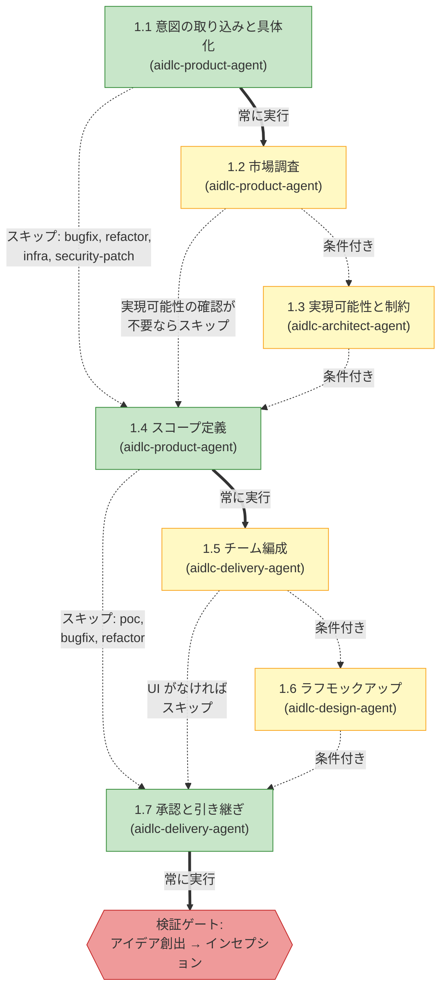
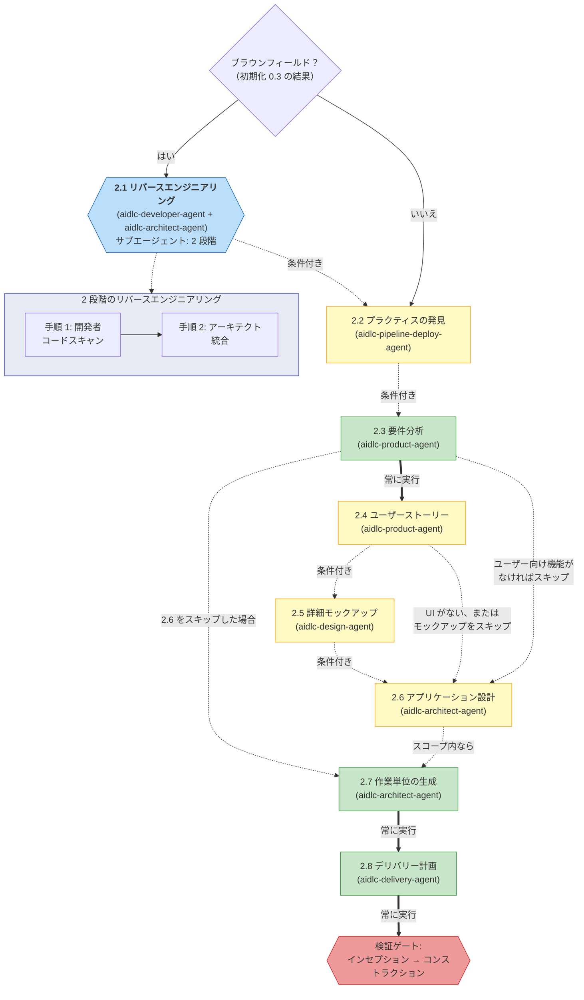
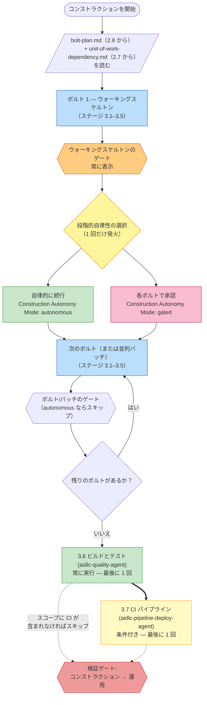
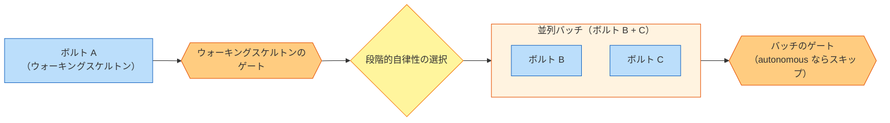
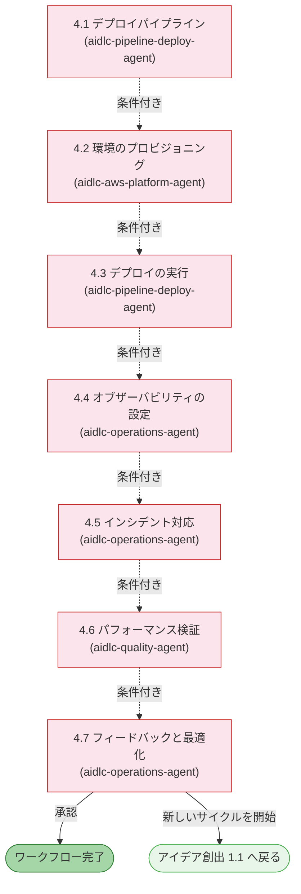

AI-DLC のライフサイクルは、32 のステージを含む 5 つのフェーズで構成されています。この章では各フェーズを説明し、そのステージを列挙し、どのように接続されているかを示します。

> **ハーネスに関する注記。** このガイドが説明する方法論、すなわちフェーズ、ステージ、エージェント、ゲートは、どのハーネスでも同一です。仕組みにハーネス差がある場合（ゲートがどう表示されるか、サブエージェントをどうディスパッチするか、設定がどこにあるか）は、その差異を明示し、対応するハーネスの章に表でまとめています: [他のハーネスでの実行](/guide/harnesses)。特記がない限り、ここでの例は Claude Code を使います。

---

## ライフサイクルの概要

```mermaid
graph LR
    subgraph INITIALIZATION["初期化 (0.1-0.3)"]
        Z1["ワークスペースの作成"]
        Z4["状態の初期化"]
        Z1 -.->|"3 ステージ"| Z4
    end

    subgraph IDEATION["アイデア創出 (1.1-1.7)"]
        I1["意図の取り込み"]
        I7["承認と引き継ぎ"]
        I1 -.->|"7 ステージ"| I7
    end

    subgraph INCEPTION["インセプション (2.1-2.8)"]
        N1["リバースエンジニアリング"]
        N7["デリバリー計画"]
        N1 -.->|"8 ステージ"| N7
    end

    subgraph CONSTRUCTION["コンストラクション (3.1-3.7)"]
        C1["機能設計"]
        C7["CI パイプライン"]
        C1 -.->|"ユニットごとに 7 ステージ"| C7
    end

    subgraph OPERATION["運用 (4.1-4.7)"]
        O1["デプロイパイプライン"]
        O7["フィードバックと最適化"]
        O1 -.->|"7 ステージ"| O7
    end

    Z4 -->|"自動で次へ"| I1
    I7 -->|"検証ゲート 1"| N1
    N7 -->|"検証ゲート 2"| C1
    C7 -->|"検証ゲート 3"| O1
    O7 -.->|"フィードバックループ"| I1

    style INITIALIZATION fill:#f3e5f5,stroke:#9c27b0
    style IDEATION fill:#e8f5e9,stroke:#4caf50
    style INCEPTION fill:#e3f2fd,stroke:#2196f3
    style CONSTRUCTION fill:#fff3e0,stroke:#ff9800
    style OPERATION fill:#fce4ec,stroke:#e91e63
```

\{/* Text fallback: 直線的な流れです。初期化（0.1-0.3）が自動でアイデア創出（1.1-1.7）へ進み、そこから検証ゲート 1 を通ってインセプション（2.1-2.8）へ、検証ゲート 2 を通ってコンストラクション（3.1-3.7）へ、検証ゲート 3 を通って運用（4.1-4.7）へ進みます。4.7 からは 1.1 へ戻るフィードバックループがあります。 */\}

フェーズは順番に実行されます。各フェーズ境界では（初期化 → アイデア創出を除く）、**検証ゲート** が自動で走り、下流のステージがその上に積み上がる前に、欠けたつながり、孤立した成果物、不整合を検出します。

---

## フェーズ 0: 初期化 (Initialization)

**目的:** ワークスペースをブートストラップします。ドキュメントディレクトリの雛形を作り、ワークスペースを検出し、状態を初期化します。ウェルカムメッセージは `settings.json` の `companyAnnouncements` エントリによりセッション開始時に表示されます（ステージではありません）。

初期化のステージは **自動的に** 実行され、承認ゲートはありません。3 つとも 1 回の決定論的なツール呼び出し（`aidlc-utility init`）の中で実行され、完了まで 1 秒もかかりません。

| # | ステージ | 主担当 | 主な成果物 | 条件 |
|---|-------|------|---------------|-----------|
| 0.1 | ワークスペースの作成 | オーケストレーター | 最初のインテントの記録ディレクトリ（`aidlc/spaces/<space>/intents/<YYMMDD>-<label>/`） | ALWAYS |
| 0.2 | ワークスペースの検出 | オーケストレーター | `aidlc-state.md`（ワークスペース状態） | ALWAYS |
| 0.3 | 状態の初期化 | オーケストレーター | `aidlc-state.md`、`audit/` シャード | ALWAYS |

**実行上の注意:**
- 3 つすべてのステージは `aidlc-utility init` 内でインラインに実行されます。LLM サブエージェントへの委譲も、ステージごとのプロンプトもありません
- ワークスペース検出はルールベースのスキャナーです（ファイル拡張子、既知の設定ファイル名、パッケージマニフェスト）
- このフェーズでユーザー操作は不要です

---

## フェーズ 1: アイデア創出 (Ideation)

**目的:** 取り組みの妥当性を確認します。インテントを取り込み、実現可能性を評価し、スコープを定義し、チームを編成し、先へ進む承認を得ます。

\{/* Text fallback: 1.1 意図の取り込み（ALWAYS）から 1.2 市場調査（CONDITIONAL）へ進むか、直接 1.4 へ進みます。1.2 からは 1.3 実現可能性（CONDITIONAL）または 1.4 へ進みます。1.3 からは 1.4 スコープ定義（ALWAYS）へ進みます。1.4 からは 1.5 チーム編成（CONDITIONAL）または 1.7 へ進みます。1.5 からは 1.6 ラフモックアップ（CONDITIONAL、UI がなければスキップ）または 1.7 へ進みます。1.6 から 1.7 承認と引き継ぎ（ALWAYS）へ進み、その後に検証ゲート 1 があります。 */\}

| # | ステージ | 主担当 | 支援 | 主な成果物 | 条件 |
|---|-------|------|-----------|---------------|-----------|
| 1.1 | 意図の取り込みと具体化 | aidlc-product-agent | aidlc-architect-agent | インテント文書、ステークホルダーマップ | ALWAYS |
| 1.2 | 市場調査 | aidlc-product-agent | — | 競合分析、構築か購入かの判断 | CONDITIONAL |
| 1.3 | 実現可能性と制約 | aidlc-architect-agent | aidlc-aws-platform-agent、aidlc-compliance-agent | 実現可能性評価、制約台帳、RAID ログ | CONDITIONAL |
| 1.4 | スコープ定義 | aidlc-product-agent | aidlc-delivery-agent | スコープ定義、インテントバックログ | ALWAYS |
| 1.5 | チーム編成 | aidlc-delivery-agent | — | チーム評価、モブ編成計画 | CONDITIONAL |
| 1.6 | ラフモックアップ | aidlc-design-agent | aidlc-product-agent | ワイヤーフレーム、ユーザーフロー、コンセプト資料 | CONDITIONAL |
| 1.7 | 承認と引き継ぎ | aidlc-delivery-agent | aidlc-product-agent | 取り組み概要書、意思決定ログ | ALWAYS |

**ステージの色:** 緑 = ALWAYS（すべてのスコープで実行）。黄 = CONDITIONAL（一部のスコープではスキップ）。

---

## フェーズ 2: インセプション (Inception)

**目的:** 要件を詳細化します。コードベースを分析し、要件を引き出し、アーキテクチャを設計し、作業単位に分解し、デリバリーを計画します。

\{/* Text fallback: ブラウンフィールド判定（ステージ 0.3 の結果）を行います。はいの場合、2.1 リバースエンジニアリングが 2 段階の委譲（開発者によるコードスキャンの後にアーキテクトによる統合）で実行されます。その後、2.2 プラクティスの発見（CONDITIONAL。チームの作業方法を発見し、確認ゲートで team/project ルールファイルへ昇格させます）、2.3 要件分析（ALWAYS）、必要に応じて 2.4 ユーザーストーリー、必要に応じて 2.5 詳細モックアップ、必要に応じて 2.6 アプリケーション設計、2.7 作業単位の生成（ALWAYS）、2.8 デリバリー計画（ALWAYS）と続き、最後に検証ゲート 2 を通ります。 */\}

| # | ステージ | 主担当 | 支援 | 主な成果物 | 条件 |
|---|-------|------|-----------|---------------|-----------|
| 2.1 | リバースエンジニアリング | aidlc-developer-agent | aidlc-architect-agent | 9 つのリバースエンジニアリング成果物 | ブラウンフィールドプロジェクト |
| 2.2 | プラクティスの発見 | aidlc-pipeline-deploy-agent | aidlc-quality-agent、aidlc-developer-agent、aidlc-devsecops-agent | `team-practices.md`、`discovered-rules.md`、`evidence.md`（承認・確定時に `aidlc/spaces/<space>/memory/team.md` / `memory/project.md` へ昇格） | CONDITIONAL |
| 2.3 | 要件分析 | aidlc-product-agent | — | `requirements.md` | ALWAYS |
| 2.4 | ユーザーストーリー | aidlc-product-agent | aidlc-design-agent | `stories.md`、`personas.md` | ユーザー向け機能がある場合 |
| 2.5 | 詳細モックアップ | aidlc-design-agent | aidlc-product-agent | 高精細モックアップ、インタラクション仕様 | UI のあるプロジェクト |
| 2.6 | アプリケーション設計 | aidlc-architect-agent | aidlc-aws-platform-agent、aidlc-design-agent | アプリケーション設計成果物、ADR | 実行計画による |
| 2.7 | 作業単位の生成 | aidlc-architect-agent | aidlc-delivery-agent | `unit-of-work.md`、`unit-of-work-dependency.md`（DAG）、`unit-of-work-story-map.md` | ALWAYS |
| 2.8 | デリバリー計画 | aidlc-delivery-agent | aidlc-architect-agent | `bolt-plan.md`、`team-allocation.md`、`risk-and-sequencing-rationale.md`、`external-dependency-map.md` | ALWAYS |

**主な動作:** ステージ 2.1 は **サブエージェント** として、2 段階のリバースエンジニアリングパターンで動作します。最初に aidlc-developer-agent がコードスキャンを行い、その後 aidlc-architect-agent が統合を行います。これはブラウンフィールド（既存コードベースのある）プロジェクトでのみ実行されます。

---

## フェーズ 3: コンストラクション (Construction)

**目的:** レビュー可能なスライスで、ソリューションを設計し、実装し、テストします。

### なぜコンストラクションはこの形なのか

コンストラクションは以前、[作業単位](/guide/glossary) ごとにステージを 1 つずつ実行し、各ステージの後に承認ゲートがありました。3 つの作業単位を持つプロジェクトでは、テスト済みのコードが 1 行も出荷される前に 15 個のゲートが必要でした。利用者はそれを過剰な付き添いだと感じました。

最初の改善では、質問、設計成果物、そしてコード生成を全作業単位に対してまとめてバッチ化し、最後に 1 回だけレビューするようにしました。しかしそれは振り子を反対側へ振り切り過ぎました。15 の作業単位を持つ実行では、ビルドとテストのゲートに 15,000 行のコードが一気に到達しうるからです。1 回のレビューで検証するには多過ぎます。

現在の形はその中間です。コンストラクションは **ボルト単位（Bolt by Bolt）** で進みます。各 [ボルト](/guide/glossary) は、1 つの作業単位（または依存関係で結ばれた少数の作業単位）に対するステージ 3.1–3.5 の 1 周です。最初のボルトは **ウォーキングスケルトン** であり、ゲート付きかつ対話的です。つまり、アーキテクチャを証明する最小のエンドツーエンドのスライスです。これが出荷されると、**ラダープロンプト** がちょうど 1 回だけ発火します。「continue autonomously, or gate every Bolt?（自律的に続行するか、すべてのボルトでゲートを挟むか）」という問いです。あなたの回答は状態に記録され、このワークフローの残りすべてのボルトを支配します。ステージ 3.6（ビルドとテスト）と 3.7（CI パイプライン）は、最後に全体に対して 1 回だけ実行されます。

この形により、早い段階で確信を得るチェックポイントを持ちつつ、自律実行を意図的に選択でき、2.8 で計画済みのボルトの大きさに合った、レビュー可能なスライスを保てます。

### コンストラクションの流れ

\{/* Text fallback: コンストラクションを開始し、bolt-plan.md と unit-of-work-dependency.md を読みます。次にボルト 1（ウォーキングスケルトン、ステージ 3.1–3.5）を実行し、必ずウォーキングスケルトンのゲートを通り、ラダープロンプトが 1 回だけ発火して autonomous か gated かを選びます。その後、残りのボルト（それぞれ 3.1–3.5）を、選んだモードに応じてゲートありまたはなしでループ実行します。すべてのボルトが終わったら、3.6 ビルドとテストを実行し、必要なら 3.7 CI パイプラインを実行し、最後に検証ゲート 3 を通ります。 */\}

### ボルト (Bolt) の並列バッチ

2 つのボルトが同じ依存前提を共有し（たとえば B と C がどちらも A のみを前提とする場合）、互いに依存していないとき、それらは 1 つの **バッチ** として並行実行されます。バッチの終わりにある 1 つのゲートが、その中のすべてのボルトをまとめてカバーします。

\{/* Text fallback: まずボルト A（ウォーキングスケルトン）が実行され、そのゲートとラダープロンプトが続きます。B と C の両方が A のみに依存する場合、それらは並列バッチを構成して同時に実行されます。そのバッチ全体を、最後の 1 つのバッチレベルのゲートがカバーします（ユーザーが「自律的に続行」を選んだ場合はスキップされます）。 */\}

コンダクター（ライブの `/aidlc` セッション）は、1 ターンの中で複数の `Task` 呼び出しを発行することで、並列ボルトをディスパッチします。Claude Code の組み込みの並列実行により、各ボルトのコード生成ステージが同時に実行されます。一方で、質問の収集と設計成果物の生成はボルトごとに実行されます。これらは軽量であり、質問への回答はどのみちユーザーを通じて直列化される必要があるからです。

### 失敗時は停止して確認する

自律モードを選んでいても、失敗した場合はコンストラクションは必ず停止します。これだけは自律モードでも中断される箇所です。

- 単独のボルトが失敗した場合、コンストラクションは即座に停止し、**再試行**（そのボルトだけ再実行）、**スキップ**（`[S]` としてマークして続行。依存するボルトも高確率で失敗します）、**中止**（コンストラクション全体を停止）の選択肢を提示します
- 並列バッチの中で 1 つのボルトが失敗し、他が成功した場合、コンダクターはバッチ全体の完了を待ち、成功したボルトの成果物はディスクに保持したまま、失敗したボルトだけに対して同じ再試行 / スキップ / 中止を提示します

### ステージリファレンス

| # | ステージ | 主担当 | 支援 | 主な成果物 | 実行単位 |
|---|-------|------|-----------|---------------|------|
| 3.1 | 機能設計 | aidlc-architect-agent | aidlc-developer-agent | `business-logic-model.md`、`business-rules.md` | ボルトごと（実行計画により CONDITIONAL） |
| 3.2 | NFR 要件 | aidlc-architect-agent | aidlc-devsecops-agent、aidlc-compliance-agent、aidlc-quality-agent | セキュリティ・パフォーマンス・信頼性の NFR | ボルトごと（CONDITIONAL） |
| 3.3 | NFR 設計 | aidlc-architect-agent | aidlc-aws-platform-agent | NFR 設計仕様 | ボルトごと（CONDITIONAL） |
| 3.4 | インフラストラクチャ設計 | aidlc-aws-platform-agent | aidlc-devsecops-agent、aidlc-compliance-agent | インフラ仕様、IaC 設計 | ボルトごと（CONDITIONAL） |
| 3.5 | コード生成 | aidlc-developer-agent | — | アプリケーションコード + コードドキュメント | ボルトごと（ALWAYS、ボルト内では作業単位ごと） |
| 3.6 | ビルドとテスト | aidlc-quality-agent | aidlc-devsecops-agent | テスト結果、品質レポート | ALWAYS、最後に 1 回 |
| 3.7 | CI パイプライン | aidlc-pipeline-deploy-agent | — | CI 設定、品質ゲート | CONDITIONAL、最後に 1 回 |

**主な動作:**

- 各ボルトの中では、ステージ 3.1–3.4 に対する質問が、成果物を生成する前に、そのボルトの作業単位全体を横断する 1 回の対話パスで集められます。その後、1 つのボルトレベルの回答ゲートが、設計成果物の生成前にすべての回答を確認します
- `stages/construction/code-generation.md` の中にある作業単位ごとの承認ゲートは、通常のボルト実行中は **コンダクターにより抑制** されます。代わりに 1 つのボルトレベル（またはバッチレベル）のゲートが使われます
- ラダープロンプトはワークフローごとにちょうど 1 回、ウォーキングスケルトンのゲートの直後に発火します。あなたの回答は `aidlc-state.md` に `Construction Autonomy Mode` として記録され、セッション再開後も尊重されます
- 並列バッチを使うには、複数の `Task` 対応サブエージェントスロットが利用可能である必要があります。並行実行の制約は [エージェント](/guide/agents-overview) を参照してください

---

## フェーズ 4: 運用 (Operation)

**目的:** デプロイと運用を行います。デプロイパイプラインを整え、環境を用意し、オブザーバビリティを設定し、フィードバックループを確立します。

\{/* Text fallback: すべての運用ステージは CONDITIONAL です。4.1 から 4.7 へ順に進みます。ステージ 4.7 では、そのままワークフローを完了するか、新しいアイデア創出サイクルを 1.1 から始めるかを選べます。 */\}

| # | ステージ | 主担当 | 支援 | 主な成果物 | 条件 |
|---|-------|------|-----------|---------------|-----------|
| 4.1 | デプロイパイプライン | aidlc-pipeline-deploy-agent | — | CD 設定、デプロイ戦略、ロールバック手順書 | CONDITIONAL |
| 4.2 | 環境のプロビジョニング | aidlc-aws-platform-agent | aidlc-devsecops-agent、aidlc-compliance-agent | 環境一覧、検証レポート | CONDITIONAL |
| 4.3 | デプロイの実行 | aidlc-pipeline-deploy-agent | aidlc-developer-agent | デプロイログ、スモークテスト、ヘルスチェック | CONDITIONAL |
| 4.4 | オブザーバビリティの設定 | aidlc-operations-agent | — | ダッシュボード、アラーム、SLO 設定 | CONDITIONAL |
| 4.5 | インシデント対応 | aidlc-operations-agent | — | SSM 手順書、インシデント対応計画、エスカレーションマトリクス | CONDITIONAL |
| 4.6 | パフォーマンス検証 | aidlc-quality-agent | — | 負荷テスト結果、NFR 検証マトリクス | CONDITIONAL |
| 4.7 | フィードバックと最適化 | aidlc-operations-agent | aidlc-aws-platform-agent | SLO レポート、コスト分析、フィードバックループ文書 | CONDITIONAL |

**主な動作:**
- 7 つすべてのステージは **条件付き** です。`mvp`、`poc`、`bugfix`、`refactor` の各スコープでは、フェーズ全体がスキップされることがあります
- ステージ 4.7 は **終端ステージ** です。ここを承認するとワークフローは完了します
- 4.7 から 1.1 へ戻る **フィードバックループ** により、反復的な開発サイクルを回せます

---

## フェーズ遷移と検証ゲート

各フェーズ境界（アイデア創出 → インセプション、インセプション → コンストラクション、コンストラクション → 運用）で、フレームワークは **フェーズ境界検証** を実行します。この自動チェックは次を検証します。

- 完了したフェーズに必要な成果物がすべて存在すること
- 成果物間のトレーサビリティリンクが保たれていること（例: すべての要件がストーリーに対応していること）
- 孤立した成果物や欠落した参照がないこと
- 関連する成果物同士に一貫性があること

検証が失敗すると、コンダクターは問題点を報告し、このまま進むか、戻って直すかを尋ねます。

---

## ステージ実行モードのリファレンス

| モード | ステージ | ユーザー操作 | 説明 |
|------|--------|-----------------|-------------|
| インライン（自動続行） | 0.1、0.2、0.3 | なし | `aidlc-utility init` の中で決定論的に実行、承認ゲートなし |
| インライン | それ以外のすべてのステージ | あり | エージェントが会話の中で作業し、最後に承認ゲートを出す |
| サブエージェント（単純） | 3.5 | 承認ゲートのみ | コード生成がバックグラウンドで動く |
| サブエージェント（2 段階） | 2.1 | 承認ゲートのみ | 開発者によるスキャン + アーキテクトによる統合 |

---

## 次のステップ

- [スコープ、深度、テスト戦略](/guide/scopes-and-depth) — スコープがどのステージを実行するかをどう制御するか
- [エージェント](/guide/agents-overview) — 11 のエージェントとその役割
- [最初のワークフロー](/guide/your-first-workflow) — 注釈付きウォークスルー
- [用語集](/guide/glossary) — 用語リファレンス
