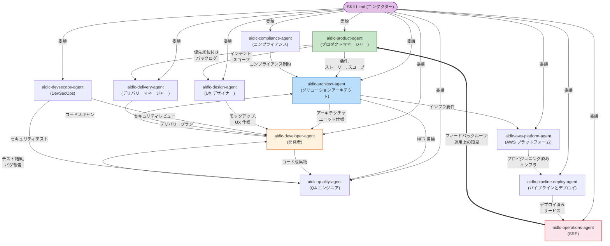

AI-DLC は、conductor がステージ中に有効化する 11 の domain-expert エージェント personas を使います。この章では、エージェント設計の背後にある考え方、各エージェントの役割、そしてそれらがいつ登場するのかを説明します。

---

## 哲学: 少人数のモブ、幅広い能力を持つエージェント (Small Mob, Broad Agents)

何十もの狭い専門家に分けるのではなく（それではウォーターフォール型の引き継ぎ連鎖を再現してしまいます）、AI-DLC は **11 人の幅広く対応可能なエージェント** を使い、それぞれが複数のステージとフェーズにまたがって参加します。

### なぜ 30 人ではなく 11 人なのか？

人間のソフトウェアチームでは、3〜5 人の mob が要件からデプロイまで機能全体をカバーします。各人は複数の専門領域にまたがる幅広いスキルセットを持ち寄ります。AI-DLC はこのモデルをなぞっています。

- **各エージェントが、多くのタスクにまたがる 1 つのドメイン全体を担当します。** aidlc-architect-agent は feasibility、application design、units generation、functional design、NFR requirements、NFR design を扱います。これは 3 フェーズにまたがる 6 ステージです。狭い専門家モデルでは、ほぼ同一の knowledge base を持つ 6 つの別エージェントが必要になります。

- **エージェントが少ないほど handoff も少なくなります。** どのエージェント境界も情報損失の起点になり得ます。同じ aidlc-architect-agent が Application Design と Functional Design の両方を主導すれば、明示的な handoff 成果物を要求せずに自然にコンテキストを保持できます。

- **支援役によって、数を増やさずに協調できます。** "security-reviewer-agent" や "compliance-reviewer-agent" や "cost-reviewer-agent" を作る代わりに、aidlc-devsecops-agent と aidlc-compliance-agent が、他者主導のステージで support エージェントとして参加します。inline ステージ（出荷される graph にあるすべての multi-agent ステージ）では、conductor は各 support エージェントを `Task` として dispatch するのではなく、自身のコンテキスト内で persona として採用します。`Task` は `mode: subagent` のステージ専用です。いずれにせよ、すべての delegation を実行するのは conductor です。エージェントが互いを呼び出すことは決してありません。

- **ナレッジの読み込みはエージェント単位です。** 各エージェントは `.claude/knowledge/<agent-name>/` から方法論ナレッジを、そしてチームが作成していれば space level の `aidlc/knowledge/<agent-name>/` からチームナレッジを読み込みます。エージェントが少ないほど、管理すべき knowledge ディレクトリも減り、矛盾した guidance が入り込む余地も少なくなります。

---

## エージェント連携マップ

次の図は、ワークフロー中にエージェントがどのように情報をやり取りするかを示しています。実線の矢印は主要な成果物の流れを表します。破線の矢印は助言やレビューの関係を表します。operations から product へのフィードバックループが、ライフサイクル全体を閉じます。

\{/* テキスト代替: SKILL.md の conductor は 11 のエージェントすべてに作業を委譲します。主な流れは次のとおりです。aidlc-product-agent は要件とストーリーを aidlc-architect-agent に送り、aidlc-architect-agent は仕様を aidlc-developer-agent に送ります。aidlc-developer-agent はコードを aidlc-quality-agent に送り、aidlc-quality-agent はテスト結果を返します。aidlc-aws-platform-agent は aidlc-pipeline-deploy-agent のためにインフラストラクチャをプロビジョニングし、aidlc-pipeline-deploy-agent は aidlc-operations-agent のためにデプロイします。フィードバックループでは、aidlc-operations-agent が運用上の知見を aidlc-product-agent に返し、サイクルを閉じます。 */\}

---

## 11 のエージェント

> **出荷済みエージェントが知っている内容をカスタマイズしたいですか？** `.claude/agents/*.md` にある出荷済み 11 エージェントファイルは編集しないでください。これらは framework ファイルであり、upgrade 時に上書きされます。代わりに、space level の `aidlc/knowledge/<agent-name>/` に自社標準を追加してください。完全な手順は [ナレッジ](/guide/knowledge) を参照してください。チームが既存 11 エージェント用の knowledge ではなく *新しい* エージェントを欲しい場合は、必要な frontmatter を付けて `.claude/agents/<slug>.md` にファイルを置けます。そのファイルは user-owned です。[Contributing: Adding an Agent](/reference/contributing#adding-an-agent) を参照してください。

以下の各エージェントには **詳細ページ** があります。そこでは完全な責務、主導・支援するステージ、読み込む knowledge を確認できます。[エージェント詳細インデックス](/guide/agents) に 11 すべてが一覧されており、各エージェントへのリンクは各見出しの下にあります。

### [aidlc-product-agent](/guide/agents/product-agent)

**ドメイン:** 要件、user stories、スコープ、市場調査

aidlc-product-agent は product manager と business analyst の役割を果たします。intent を取り込み、市場調査を行い、スコープを定義し、要件を引き出し、user stories を作成します。Ideation と Inception の各フェーズでもっとも活発に動くエージェントです。

- **主導:** intent-capture, market-research, scope-definition, requirements-analysis, user-stories
- **支援:** rough-mockups, approval-handoff, refined-mockups
- **特別なツール:** WebSearch（市場調査用）

### [aidlc-design-agent](/guide/agents/design-agent)

**ドメイン:** UX/UI design、wireframes、interaction design、accessibility

aidlc-design-agent は wireframes、mockups、interaction specifications を作成します。user-facing feature では aidlc-product-agent と密接に連携し、design が実装可能であることを確かめるために aidlc-developer-agent とも連携します。

- **主導:** rough-mockups, refined-mockups
- **支援:** user-stories, application-design
- **特別なツール:** WebSearch（design 調査用）

### [aidlc-delivery-agent](/guide/agents/delivery-agent)

**ドメイン:** チーム編成、capacity planning、delivery sequencing

aidlc-delivery-agent は engineering manager の役割を果たします。チーム capacity を評価し、mob composition を組み、delivery sequencing を計画し、フェーズ handoff を管理します。

- **主導:** team-formation, approval-handoff, delivery-planning
- **支援:** scope-definition, units-generation
- **特別なツール:** 共有セット以外はなし

### [aidlc-architect-agent](/guide/agents/architect-agent)

**ドメイン:** application design、domain modelling、NFRs、component decomposition

aidlc-architect-agent は中心的な design authority です。もっとも広くステージに関与し（3 フェーズにまたがる 9 ステージ）、`judgment` tier を担います。これは 7 つの他の high-judgment エージェント（product、design、developer、quality、devsecops、compliance、aws-platform）と並ぶものです。judgment エージェントは、あなたの session 自身の model と effort を継承するため、あなたが選んだものより低く downgrade されることはありません。`templated` tier（effort を抑えた中規模 model）を担うのは delivery、pipeline-deploy、operations だけです。なぜなら、それらの出力は主として templated planning、CI/CD YAML、runbook scaffolding だからです。

- **主導:** feasibility, application-design, units-generation, functional-design, nfr-requirements, nfr-design
- **支援:** intent-capture, reverse-engineering (synthesis), delivery-planning

### [aidlc-aws-platform-agent](/guide/agents/aws-platform-agent)

**ドメイン:** AWS infrastructure、CDK/CloudFormation、cost optimization

aidlc-aws-platform-agent は infrastructure を設計し、environment を provision し、cost を最適化します。AWS CLI と CDK commands を実行するための Bash access を持っています。

- **主導:** infrastructure-design, environment-provisioning
- **支援:** feasibility, application-design, nfr-design, feedback-optimization
- **特別なツール:** Bash（`aws`、`cdk` commands 用）

### [aidlc-compliance-agent](/guide/agents/compliance-agent)

**ドメイン:** regulatory scanning、data classification、risk assessment

aidlc-compliance-agent は純粋に advisory な立場で動作し、主導ステージはありません。とくに aidlc-architect-agent と aidlc-devsecops-agent が主導するステージに regulatory constraints を供給します。

- **主導:** なし（支援のみ）
- **支援:** feasibility, nfr-requirements, infrastructure-design, environment-provisioning
- **特別なツール:** WebSearch（regulatory 調査用）

### [aidlc-devsecops-agent](/guide/agents/devsecops-agent)

**ドメイン:** threat modelling、security scanning、DevSecOps pipelines

aidlc-devsecops-agent は design を security の観点でレビューし、security requirements を定義し、CI/CD pipelines に security を統合します。aidlc-compliance-agent と同様に、支援役として動作します。

- **主導:** なし（支援のみ）
- **支援:** practices-discovery, nfr-requirements, infrastructure-design, build-and-test, environment-provisioning
- **特別なツール:** Bash（security scanning 用）

### [aidlc-developer-agent](/guide/agents/developer-agent)

**ドメイン:** code implementation、code analysis、workspace detection

aidlc-developer-agent は 3 つのフェーズにまたがります。Inception での reverse engineering から Operation での deployment support までを担います。既存 codebase の code scan を実行し、実装コードを生成します。

- **主導:** reverse-engineering (code scan), code-generation
- **支援:** practices-discovery, functional-design, deployment-execution

workspace detection（workspace-detection）は、以前は aidlc-developer-agent の subagent でしたが、現在は rule-based ファイル and manifest detection を使って `aidlc-utility init` 内で決定論的に実行されます。
- **特別なツール:** Bash（build と run commands 用）

### [aidlc-quality-agent](/guide/agents/quality-agent)

**ドメイン:** test strategy、test generation、performance validation

aidlc-quality-agent は test strategy を定義し、test suites を生成し、quality ゲートを検証し、performance testing を実行します。

- **主導:** build-and-test, performance-validation
- **支援:** practices-discovery, nfr-requirements
- **特別なツール:** Bash（test execution 用）

### [aidlc-pipeline-deploy-agent](/guide/agents/pipeline-deploy-agent)

**ドメイン:** CI/CD pipelines、deployment strategy、release execution

aidlc-pipeline-deploy-agent は CI/CD pipelines を設定し、deployment strategy を計画し、rollback capabilities を備えた release を実行します。

- **主導:** practices-discovery, ci-pipeline, deployment-pipeline, deployment-execution
- **支援:** なし
- **特別なツール:** Bash（pipeline と deployment commands 用）

### [aidlc-operations-agent](/guide/agents/operations-agent)

**ドメイン:** observability、incident response、SLO tracking、feedback loops

aidlc-operations-agent は monitoring をセットアップし、incident response procedures を定義し、運用上の知見を次の iteration のために aidlc-product-agent へ戻すことでライフサイクルのループを閉じます。

- **主導:** observability-setup, incident-response, feedback-optimization
- **支援:** performance-validation
- **特別なツール:** Bash（observability と monitoring commands 用）

---

## フェーズ参加状況

この表は、どのエージェントがどのフェーズで active か、そしてその役割が lead（L）か support（S）かを示します。

| エージェント | フェーズ 0 | フェーズ 1 | フェーズ 2 | フェーズ 3 | フェーズ 4 |
|-------|---------|---------|---------|---------|---------|
| aidlc-product-agent | — | L (intent-capture, market-research, scope-definition), S (rough-mockups, approval-handoff) | L (requirements-analysis, user-stories), S (refined-mockups) | — | — |
| aidlc-design-agent | — | L (rough-mockups) | L (refined-mockups), S (user-stories, application-design) | — | — |
| aidlc-delivery-agent | — | L (team-formation, approval-handoff), S (scope-definition) | L (delivery-planning), S (units-generation) | — | — |
| aidlc-architect-agent | — | L (feasibility), S (intent-capture) | L (application-design, units-generation), S (reverse-engineering, delivery-planning) | L (functional-design, nfr-requirements, nfr-design) | — |
| aidlc-aws-platform-agent | — | S (feasibility) | S (application-design) | L (infrastructure-design), S (nfr-design) | L (environment-provisioning), S (feedback-optimization) |
| aidlc-compliance-agent | — | S (feasibility) | — | S (nfr-requirements, infrastructure-design) | S (environment-provisioning) |
| aidlc-devsecops-agent | — | — | S (practices-discovery) | S (nfr-requirements, infrastructure-design, build-and-test) | S (environment-provisioning) |
| aidlc-developer-agent | — | — | L (reverse-engineering), S (practices-discovery) | L (code-generation), S (functional-design) | S (deployment-execution) |
| aidlc-quality-agent | — | — | S (practices-discovery) | L (build-and-test), S (nfr-requirements) | L (performance-validation) |
| aidlc-pipeline-deploy-agent | — | — | L (practices-discovery) | L (ci-pipeline) | L (deployment-pipeline, deployment-execution) |
| aidlc-operations-agent | — | — | — | — | L (observability-setup, incident-response, feedback-optimization) |

### 観察ポイント

- **aidlc-architect-agent** がもっとも広く関与しています（3 フェーズにまたがる 9 ステージ）。これは `judgment` tier を担い、他の 7 つの high-judgment エージェントも同様です。**aidlc-delivery-agent**、**aidlc-pipeline-deploy-agent**、**aidlc-operations-agent** だけが `templated` tier を担います
- **aidlc-developer-agent** は Inception、Construction、Operation の 3 フェーズにまたがります
- **aidlc-compliance-agent** と **aidlc-devsecops-agent** は純粋に support role として動作し、他者主導のステージに参加します
- **aidlc-operations-agent** は知見を aidlc-product-agent に戻すことでライフサイクルループを閉じます

---

## エージェントのツールアクセス

すべてのエージェントは **完全な session toolset** を継承します。Claude Code のすべての built-in tools と、session に provision された任意の MCP tools です。出荷時に唯一かかっている制限は `disallowedTools: Task`（subagent を spawn するのは conductor だけ）であり、11 エージェントのどれも `tools:` allowlist を宣言していません。したがって、下の表はエージェントごとの grant 一覧ではなく、各 persona がステージ作業で *使うことが期待されている* tool を記録したものです。

| ツール | 使用が想定されるペルソナ |
|------|-------------|
| Read, Edit, Write, Glob, Grep, AskUserQuestion | 全 11 エージェント |
| Bash | aidlc-aws-platform-agent, aidlc-devsecops-agent, aidlc-developer-agent, aidlc-quality-agent, aidlc-pipeline-deploy-agent, aidlc-operations-agent |
| WebSearch | aidlc-product-agent, aidlc-design-agent, aidlc-compliance-agent |
| Task | なし（すべてのエージェントで `disallowedTools: Task` によりブロック） |

persona を本当に絞り込みたいなら、その frontmatter に任意の `tools:` allowlist を追加してください。ただし、その場合は fully-qualified な `mcp__<server>__<tool>` ids も列挙しない限り、継承されていた MCP access は落ちます。この実装では、現時点でそのような制限は出荷していません。

### MCP サーバーはエージェントごとではなく共有されます

上の表は、各 persona が使うことを期待される built-in tools を示していますが、実際にはすべてのエージェントがそれらをすべて継承します。MCP servers も同じく「すべて継承する」モデルです。この実装では project root（`.claude/` の隣）にある `.mcp.json` で一度だけ宣言し、Claude Code がそれらを session に provision し、すべてのエージェントがそれらを継承します。エージェントごとの grant はありません。11 エージェントのそれぞれが、追加設定なしで宣言されたすべての server（`context7` と 4 つの AWS servers）に到達できます。credentials を持たない server は、ブロッカーになるのではなく単に unavailable になります。特定のエージェントが server に到達できないようにしたい場合は、そのエージェントの `tools:` allowlist を、そのエージェントが保持すべき fully-qualified `mcp__<server>__<tool>` ids のみに絞ってください（例: `mcp__context7__<tool>`）。この実装では、現時点でそのような制限は出荷していません。

server registry と credentials については [はじめに](/guide/getting-started) を、MCP が Claude Code の native tool model にどう対応するかについては [Harness Primitives Mapping](/reference/claude-features#mcp-servers) を参照してください。

---

## レビュアーエージェント

11 の domain-expert エージェントに加えて、AI-DLC は **2 つの quality-gate reviewer エージェント** を出荷します。これらは成果物を作成しません。builder が作ったものをレビューし、異議を唱え、ゲートにおいて customer（または review board）を代表します。

| レビュアー | レビュー対象 | ティア |
|----------|---------|------|
| `aidlc-product-lead-agent` | 要件、ユーザーストーリー、UX／モックアップの成果物 — 完全性、ビジネスとの整合性、テスト可能性 | balanced |
| `aidlc-architecture-reviewer-agent` | 技術設計の成果物 — 妥当性、実装可能性、壊れた相互参照、達成不可能な NFR 目標 | balanced |

## Composer エージェント

もう 1 つ、両グループの外側に位置するエージェントがいます。`aidlc-composer-agent`、adaptive-workflows composer です。conductor は compose request（`/aidlc compose`、cold start 時の compose offer、`--report`、または `--new-scope`）でこれを dispatch します。このエージェントは task と workspace scan を読み、EXECUTE/SKIP ステージ grid を各 SKIP の rationale 付きで提案し、そしてゲートでのあなたの承認 *後にのみ*、composed スコープ（front/report）を著述するか、deterministic な `recompose` verb が適用する pending-stage flips（in-flight）を提案します。その persona は意図的に keep-biased です。存在理由を正当化し、欠落を吟味しますが、「速くするため」にステージを削ることは決してありません。[スコープ、深度、テスト戦略 - Adaptive Composer](/guide/scopes-and-depth#the-adaptive-composer) を参照してください。

reviewer が起動するのは、ステージが `reviewer:` field を宣言しているときだけです。現時点では product lead が `rough-mockups`、`refined-mockups`、`requirements-analysis`、`user-stories` をレビューし、architecture reviewer が `application-design`、`units-generation`、`functional-design`、`nfr-requirements`、`nfr-design`、`infrastructure-design`、`code-generation` をレビューします。

**reviewer step。** ステージ本文が成果物を作成し、learnings ritual と承認ゲートの前に、conductor は指名された reviewer を **別の sub-agent** として呼び出します。reviewer はステージ定義、Q&A、成果物を読みます（builder の `memory.md` や plan は読みません。独立した judgment を形成するためです）。そのうえで `## Review` セクションを追加し、**READY** または **NOT-READY** の verdict を付けます。NOT-READY の場合、builder は findings に対応するため再実行され、reviewer が再確認します。このループは `reviewer_max_iterations` 回まで（既定 2 回）繰り返されます。上限後も findings が残る場合、ワークフローは未解決 findings を記したまま承認ゲートに進みます。reviewer がブロックすることはなく、最終判断は常に人間が持ちます。

（**重要:** 上記のように、エージェント名は backtick で囲んだプレーンテキストにしてください。Markdown リンクにはしないでください。reviewer エージェントごとのドキュメントページはまだ存在しません。）

---

## 次のステップ

- [フェーズとステージ](/guide/phases-and-stages) — 完全なステージフローの中でエージェントの働きを確認する
- [ナレッジ](/guide/knowledge) — エージェントが方法論ナレッジとチームナレッジをどう読み込むか
- [ルールと学習ループ](/guide/rules-and-the-learning-loop) — エージェントの行動を制約する振る舞いのルール
- [用語集](/guide/glossary) — 用語リファレンス
