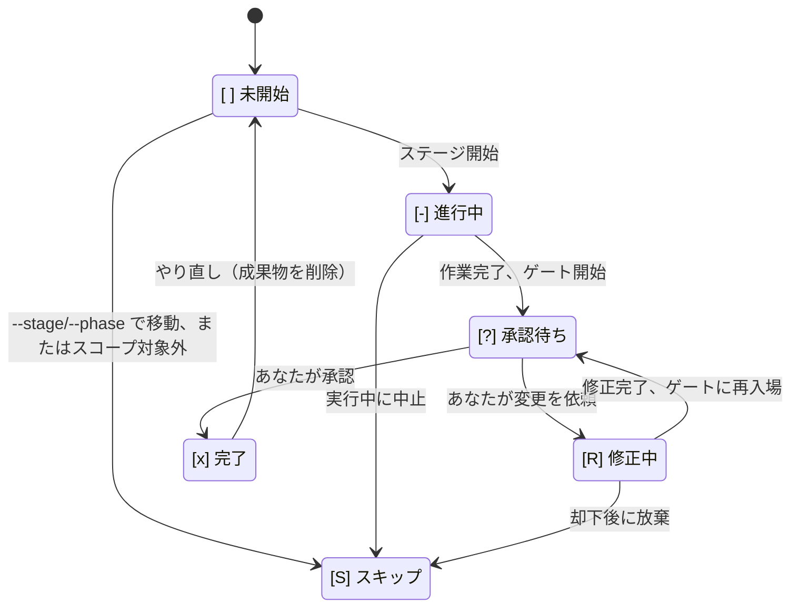
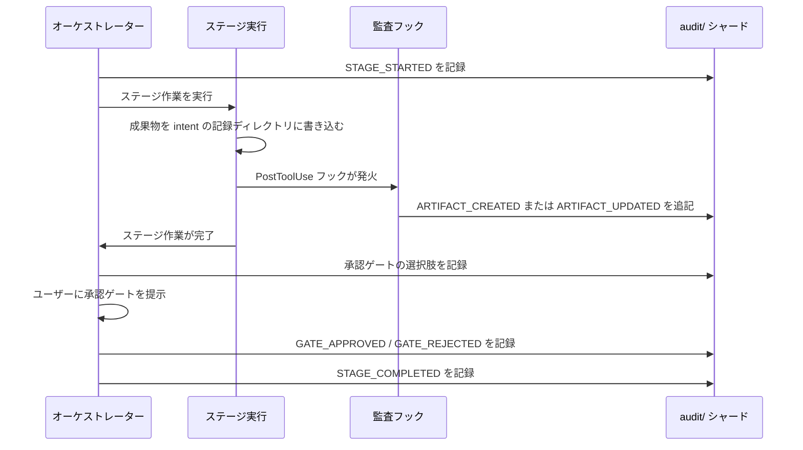

AI-DLC は、インテントから本番までの完全な追跡可能性を提供するために、2 つの永続ファイルを維持します。**状態ファイル** はワークフローのどこにいるかを追跡し、**監査証跡** はその過程におけるすべての判断、行動、イベントを記録します。

---

## 状態ファイル（State File: `aidlc-state.md`）

各インテントは `aidlc/spaces/<space>/intents/<YYMMDD>-<label>/aidlc-state.md` に自身の状態ファイルを持ちます（インテントの記録ディレクトリの下です）。これがそのインテントのワークフロー進捗に関する唯一の正式な情報源です。エンジンはセッション開始のたびにアクティブなインテントの状態ファイルを読み、何が完了し、何が進行中で、次に何が来るかを判断します。

### 含まれるもの

| セクション | 目的 |
|---------|---------|
| **プロジェクト情報（Project Information）** | プロジェクトの説明、種類（新規開発（greenfield）／既存開発（brownfield））、スコープ、開始日、現在のフェーズ、稼働中のエージェント |
| **スコープ設定（Scope Configuration）** | 実行するステージ、スキップするステージ（理由付き）、深度レベル |
| **ワークスペース状態（Workspace State）** | プロジェクトルート、検出した言語、フレームワーク、ビルドシステム |
| **実行計画の概要（Execution Plan Summary）** | ステージの総数、完了数、進行中のステージ |
| **実行時状態（Runtime State）** | 現在のステージの修正回数 |
| **ステージ進捗（Stage Progress）** | 完了状態を追跡するステージごとのチェックボックス |
| **現在の状態（Current Status）** | ライフサイクルフェーズ、現在／次のステージ、状態、最終更新日時 |
| **セッション再開地点（Session Resume Point）** | 最後に完了したステージ、次のアクション、保留中の成果物 |

### 6 状態のチェックボックス

ステージの進捗には、6 状態のチェックボックス記法を使います。

| チェックボックス | 意味 |
|----------|---------|
| `[ ]` | 未開始 |
| `[-]` | 進行中 |
| `[?]` | あなたの承認待ち（ゲートが開いている） |
| `[R]` | 修正中（あなたがゲートで却下し、ステージを改訂中） |
| `[x]` | 完了 |
| `[S]` | スキップ（スコープ対象外、`skip` で除外、または `--stage`／`--phase` で移動して迂回） |

正常系では、ステージは `[ ]` → `[-]` → `[?]` → `[x]` と遷移します。ゲートで却下すると、修正中は `[R]` に移り、再び準備が整うと `[?]` に戻り、承認で最終的に `[x]` になります。`/aidlc --status` はチェックボックスを読み、誰がボトルネックになっているかを示します。`[?]` なら "Awaiting your approval on \<stage>"、`[R]` なら "Revising \<stage> (revision N of 3)" という具合です。

正式な状態機械のリファレンス（遷移表、監査イベントの発行元）については [開発者リファレンス: 状態機械](/reference/state-machine) を参照してください。

### 状態遷移

\{/* テキスト代替: ステージが始まると [ ] 未開始から [-] 進行中へ遷移します。作業が完了してゲートが開くと、[-] 進行中から [?] 承認待ちへ遷移します。承認すると [?] 承認待ちから [x] 完了へ、変更を依頼すると [R] 修正中へ遷移します。修正が完了すると [R] 修正中から [?] 承認待ちへ戻ります。[ ] 未開始、[-] 進行中、[R] 修正中は、ジャンプ、スコープ対象外、放棄によって [S] スキップへ遷移できます。[x] 完了はやり直し（成果物を削除）によって [ ] 未開始へ戻ります。 */\}

### 通常・修正・スキップ・やり直し・ジャンプの流れ

- **通常フロー**: `[ ]` -> `[-]` -> `[?]` -> `[x]`（ステージが始まり、作業が完了し、ゲートが開き、あなたが承認する）
- **修正フロー**: `[?]` -> `[R]` -> `[?]` -> `[x]`（あなたが却下し、ステージが修正され、ゲートが再度開き、あなたが承認する）
- **スコープスキップフロー**: `[ ]` -> `[S]`（そのワークフローのスコープに含まれず、初期化時に記録される）
- **やり直しフロー**: `[x]` または `[-]` -> `[ ]` -> `[-]`（あなたがやり直しを要求し、成果物が削除され、ステージが再実行される）
- **ジャンプフロー**: ステージ A で `[-]` の状態からステージ B へのジャンプを要求すると、間のステージは `[S]` として記録される

---

## 監査証跡（Audit Trail: `audit/`）

監査証跡はインテントの記録ディレクトリ内、`aidlc/spaces/<space>/intents/<YYMMDD>-<label>/audit/` にあります。これは **クローンごとのシャード**（`<host>-<clone>.md`）として書かれる追記専用のイベントログです。各クローンは自分自身のシャードにしか追記しないため、並行するワークツリーからの同時追記でも git の競合が起きません。読み手は `audit/*.md` をグロブで集めて ISO タイムスタンプ順にマージソートし、判断とイベントの完全な時系列履歴を復元します。

### 68 種類のイベント分類

イベントは 18 のカテゴリに整理されています。

| カテゴリ | 件数 | イベント |
|----------|------:|--------|
| **ワークフローのライフサイクル** | 4 | `WORKFLOW_STARTED`, `WORKFLOW_COMPLETED`, `WORKFLOW_PARKED`, `WORKFLOW_UNPARKED` |
| **フェーズのライフサイクル** | 4 | `PHASE_STARTED`, `PHASE_COMPLETED`, `PHASE_VERIFIED`, `PHASE_SKIPPED` |
| **ステージのライフサイクル** | 6 | `STAGE_STARTED`, `STAGE_AWAITING_APPROVAL`, `STAGE_REVISING`, `STAGE_COMPLETED`, `STAGE_SKIPPED`, `STAGE_JUMPED` |
| **セッション** | 4 | `SESSION_STARTED`, `SESSION_RESUMED`, `SESSION_COMPACTED`, `SESSION_ENDED`（フックが出力） |
| **初期化** | 3 | `WORKSPACE_SCAFFOLDED`, `WORKSPACE_SCANNED`, `WORKSPACE_INITIALISED` |
| **移動** | 4 | `SCOPE_CHANGED`, `SCOPE_DETECTED`, `DEPTH_CHANGED`, `TEST_STRATEGY_CHANGED` |
| **対話** | 4 | `DECISION_RECORDED`, `GATE_APPROVED`, `GATE_REJECTED`, `QUESTION_ANSWERED` |
| **成果物** | 3 | `ARTIFACT_CREATED`, `ARTIFACT_UPDATED`（audit-logger フック）、`ARTIFACT_REUSED` |
| **サブエージェント** | 1 | `SUBAGENT_COMPLETED`（log-subagent フック） |
| **ユーティリティ** | 1 | `HEALTH_CHECKED` |
| **エラー／回復** | 2 | `ERROR_LOGGED`, `RECOVERY_COMPLETED` |
| **構築ボルト（Construction Bolt）** | 4 | `BOLT_STARTED`, `BOLT_COMPLETED`, `BOLT_FAILED`, `AUTONOMY_MODE_SET` |
| **ワークツリー（Worktree）** | 7 | `WORKTREE_CREATED`, `WORKTREE_MERGED`, `WORKTREE_DISCARDED`, `STATE_FORKED`, `STATE_MERGED`, `AUDIT_FORKED`, `AUDIT_MERGED` |
| **プラクティス** | 4 | `PRACTICES_DISCOVERED`, `PRACTICES_AFFIRMED`, `PRACTICES_OVERRIDE`, `PRACTICES_SECTION_EMPTY` |
| **マージ委譲** | 3 | `MERGE_DISPATCH_INVOKED`, `MERGE_DISPATCH_RETURNED`, `MERGE_DISPATCH_FALLBACK` |
| **センサー** | 5 | `SENSOR_FIRED`, `SENSOR_PASSED`, `SENSOR_FAILED`, `SENSOR_BUDGET_OVERRIDE`, `GUARDRAIL_LOADED` |
| **学習ループ** | 3 | `MEMORY_EMPTY`, `RULE_LEARNED`, `SENSOR_PROPOSED` |
| **スウォーム** | 6 | `SWARM_STARTED`, `SWARM_UNIT_CONVERGED`, `SWARM_UNIT_FAILED`, `SWARM_BATON_RETURNED`, `SWARM_COMPLETED`, `SWARM_DEGRADED` |

### 何が、いつ記録されるか

- **すべてのステージの開始と完了** は `STAGE_STARTED` と `STAGE_COMPLETED` イベントとして記録されます
- **インテントの記録ディレクトリへのすべてのファイル書き込み**（`audit/` シャード自体を除く）は、audit-logger フックによって自動的に記録されます
- **すべての承認ゲートでの判断**（承認、変更依頼、そのまま受け入れ）が記録されます
- **あなたが答えたすべての質問** が記録されます
- **すべてのサブエージェントの完了** は log-subagent フックによって記録されます
- **すべてのエラーと復旧** が記録されます

### 監査ログの読み方

各エントリは次のフィールドを持つ構造化形式です。

- **タイムスタンプ（Timestamp）** — ISO 8601 形式の日時
- **イベント（Event）** — 68 種類のイベント種別のいずれか
- **詳細（Details）** — イベントごとのデータ（ステージ名、判断内容、成果物のパスなど）

エントリは時系列順に追記されます。特定のステージの履歴を見たいなら、その `STAGE_STARTED` と `STAGE_COMPLETED` のエントリを探し、その間にあるものを見てください。

### 監査イベントの流れ

ステージが実行されて成果物を生成すると、監査証跡はその一連の流れをすべて記録します。

\{/* テキスト代替: オーケストレーターはこのクローンの audit/ シャードに STAGE_STARTED を記録します。ステージ実行が成果物を書き込むと PostToolUse フックが発火し、ARTIFACT_CREATED または ARTIFACT_UPDATED イベントを追記します。ステージが完了すると、オーケストレーターは承認ゲートの選択肢、ユーザーの判断、STAGE_COMPLETED の順に記録します。 */\}

---

## 状態と監査はどう連携するか

状態ファイルと監査証跡は、補完し合う役割を担います。

| 観点 | 状態ファイル | 監査証跡 |
|---------|-----------|-------------|
| **目的** | 現在位置と進捗を追跡する | イベントの完全な履歴を記録する |
| **読み手** | オーケストレーター（経路選択と再開のため） | ユーザーと監査担当者（追跡可能性のため） |
| **更新方法** | 状態変化のたびに上書き | 追記のみ（決して変更しない） |
| **セッション再開** | どこから続けるかを判断する主情報源 | 元のプロジェクト説明と意思決定コンテキストを提供する |
| **Git ポリシー** | バージョン管理へコミットする | コミットする（`audit/` 配下のクローンごとのシャード。マージ競合なし） |

オーケストレーターは、経路選択の判断のために `aidlc-state.md` を使います。経路選択のために `audit/` シャードを読むことはありません。監査証跡は追跡可能性の記録であり、インテントから本番までのすべての判断をたどれるようにするものです。

状態ファイルが壊れた場合でも、`STAGE_STARTED` と `STAGE_COMPLETED` のイベントを見直せば監査証跡から復元できます。修復手順は [トラブルシューティング](/guide/troubleshooting) を参照してください。

---

## 次のステップ

- [セッション管理](/guide/session-management) — 状態がセッション再開にどう使われるか
- [成果物リファレンス](/guide/artifacts-reference) — インテントの記録ディレクトリに何が保存されるか
- [トラブルシューティング](/guide/troubleshooting) — 状態破損の修復
- [用語集](/guide/glossary) — 状態ファイル、監査証跡、チェックポイント、コンテキスト圧縮の定義
