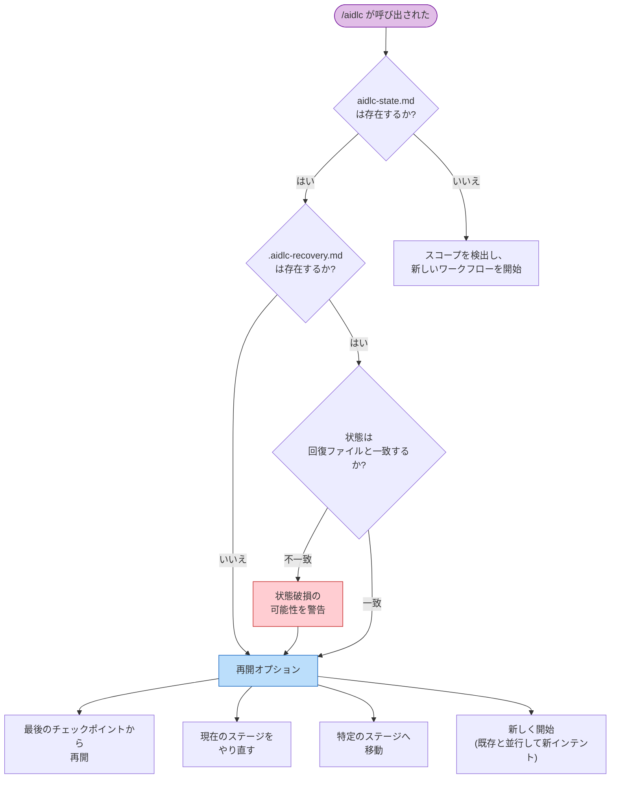

1 つのワークフローは複数のハーネスセッションにまたがる場合があります。AI-DLC はすべての進捗をディスクに保存するため、いつでも再開、やり直し、ジャンプ、または新規開始ができます。

> **ハーネスに関する注記:** セッション再開はすべてのハーネスで機能します。状態はハーネスではなくインテントの記録ディレクトリに保存されるためです。ただし、セッションの *ライフサイクルイベント* は異なります。Claude Code は `SESSION_STARTED/RESUMED/ENDED` と `SESSION_COMPACTED` を出力し、Kiro は `SESSION_STARTED` だけを出力します。Codex は `SESSION_ENDED` を推定し、コンテキスト圧縮後にミッションを再注入します。[他のハーネスでの実行](/guide/harnesses) を参照してください。

---

<a id="resume-flow"></a>
## 再開フロー（Resume Flow）

前回のセッションからアクティブなインテントの `aidlc-state.md`（その記録ディレクトリの下）が残っている状態で `/aidlc` を実行すると、AI-DLC は状態の要約を表示し、4 つの再開オプションを提示します。



\{/* テキスト代替: /aidlc が呼び出されます。状態ファイルが存在すれば回復ファイルを確認します。回復ファイルが存在し、そのステージが状態と一致しなければ、破損の可能性を警告します。その後、4 つの再開オプションを表示します。状態ファイルが存在しなければ、スコープを検出して新しいワークフローを開始します。 */\}

<a id="four-resume-options"></a>
### 4 つの再開オプション

| オプション | 起こること | 保持されるもの | 失われるもの |
|--------|-------------|-------------------|-------------|
| **最後のチェックポイントから再開（Resume from last checkpoint）** | 進行中のステージまたは次の保留中ステージから継続します。タスクサイドバーは状態ファイルから再構築されます。 | すべての成果物、状態、監査証跡 | 前セッションのメモリ内会話コンテキスト |
| **現在のステージをやり直す（Redo current stage）** | 現在のステージのチェックボックスをリセットし（`aidlc-jump.ts execute --direction redo` を使用）、最初から再実行します。 | 他のすべての成果物と状態 | 現在のステージの完了ステータスと途中作業 |
| **ステージへ移動（Jump to stage）** | 特定のステージへ移動します（`next --stage <slug>` を使用）。スキップされるステージと、下流成果物が無効になる可能性について警告します。 | 既存のすべての成果物 | 現在位置と移動先の間のステージは `[S]`（スキップ）として記録される |
| **新しく開始（Start fresh）** | 既存のインテントと並行して新しいインテントを開始します（スコープと説明を確認したうえで `next --new-intent` を使用）。 | 既存ワークフローの成果物、状態、監査証跡（そのまま残る） | なし — 以前のインテントは再開可能なまま残る |

ディスパッチされたアンサンブル作業は、ディスク上のエビデンスから再開されます。プラクティスの発見では、コンダクターは主担当のドラフトと既存のすべてのコントリビューションファイルを保持し、欠けている quality/developer/devsecops のスポークだけをディスパッチしてから、人間へのインタビューと主担当による統合へ進みます。完了済みのスポークを繰り返すことはありません。

---

<a id="recovery-breadcrumb"></a>
## 回復用の手がかり（Recovery Breadcrumb）

Claude Code が会話コンテキストを圧縮する前に、`validate-state.ts` フックはアクティブなインテントの記録ディレクトリに `.aidlc-recovery.md` という隠し復旧ファイルを書きます。このファイルには次が含まれます。

- 最後に検証したタイムスタンプ
- 現在のステージ名（`aidlc-state.md` から抽出）
- 状態ファイルが有効かどうか

次に `/aidlc` を呼び出したとき、AI-DLC は `.aidlc-recovery.md` を `aidlc-state.md` と比較します。`"Current stage"` フィールドが異なっていれば、コンテキスト圧縮に起因する状態破損の可能性を警告します。

---

<a id="context-compaction"></a>
## コンテキスト圧縮（Context Compaction）

Claude Code は、コンテキストウィンドウがいっぱいになると、以前の会話コンテキストを自動で要約します。これを **コンテキスト圧縮（compaction）** と呼びます。この実装には、圧縮イベントをまたいでもワークフロー状態を保つ安全策が入っています。

<a id="what-is-preserved-vs-lost"></a>
### 保持されるものと失われるもの

| 保持されるもの | 失われるもの |
|-----------|------|
| 記録ディレクトリのすべての成果物（ディスク上のファイル） | メモリ内の会話コンテキスト（以前の議論） |
| `aidlc-state.md`（ステージ進捗、スコープ、プロジェクト情報） | まだファイルに書かれていない途中作業 |
| `audit/` シャード（意思決定とアクションの完全な履歴） | Task ID（状態ファイルから再開時に再構築される） |
| `.aidlc-recovery.md`（ステージのチェックポイント） | エージェントのペルソナコンテキスト（エージェントファイルから再読み込みされる） |

<a id="how-to-recover-after-compaction"></a>
### コンテキスト圧縮後の復旧方法

1. `/aidlc` を実行する — AI-DLC が状態ファイルを読み、再開オプションを提示します
2. 復旧用の手がかりが不一致を警告したら、**現在のステージをやり直す（Redo current stage）** を選び、圧縮中だったステージを再実行します
3. 警告がなければ、**最後のチェックポイントから再開（Resume from last checkpoint）** を選んで通常どおり継続します

コンテキスト圧縮は、長いセッションでは普通に起こるものです。状態ファイルとディスク上の成果物により、完了済みの作業は失われません。

---

<a id="stage-jumps"></a>
## ステージ間の移動（Stage Jumps）

ユーティリティコマンドを使って、ワークフロー内を前後にジャンプできます。

<a id="jump-to-a-specific-stage"></a>
### 特定のステージへジャンプする

```
/aidlc --stage code-generation
/aidlc --stage 3.5
```

前方へジャンプする場合、現在位置と対象の間にあるステージは `[S]`（スキップ）として記録されます。オーケストレーターは次について警告します。

- スキップされるステージ
- 下流ステージが期待するが見つからなくなる成果物
- 追跡可能性への潜在的な影響

後方へジャンプする場合、対象ステージは `[ ]`（未開始）に戻され、再実行されます。すでに完了済みの下流ステージは `[x]` のままですが、その成果物は古くなる可能性があります。

<a id="jump-to-the-start-of-a-phase"></a>
### フェーズの先頭へジャンプする

```
/aidlc --phase construction
/aidlc --phase 3
```

これにより、指定フェーズの最初のステージへジャンプします。同じく、スキップされるステージと成果物の無効化に関する警告が適用されます。

<a id="combining-jumps-with-scope"></a>
### ジャンプとスコープを組み合わせる

状態ファイルのないプロジェクトでは、`--stage` または `--phase` を `--scope` と組み合わせられます。

```
/aidlc --stage code-generation --scope bugfix
```

これにより、指定スコープで新しいワークフローが作成され、対象ステージへ直接ジャンプします。

---

<a id="session-skills"></a>
## セッションスキル（Session Skills）

3 つの読み取り専用スキルが、現在のワークフローを変更せずに報告を行います。どれもコマンドのように入力でき、`/` のスキル選択画面に現れます。

| スキル | 機能 | 出力 |
|-------|--------------|--------|
| `/aidlc-session-cost` | 所要時間、ステージの結果、メモリエントリ、センサーの発火、取り込んだ学習を含む決定論的なコスト表示を出力する | ターミナルのみ |
| `/aidlc-replay` | 同席しなかった関係者向けに、何をなぜ決めたかを読みやすいセッション記録として表示する | ターミナルのみ |
| `/aidlc-outcomes-pack` | ワークフローを再実行せずにチームがシステムを引き継いで継続できるよう、引き継ぎ文書を生成する | `OUTCOMES.md` に書き込む |

**これらは読み取り専用です。** どれもワークフローのステージポインタを進めず、監査イベントも出しません。そのためステージの途中を含め、どの時点でも安全に実行できます。`/aidlc-session-cost` と `/aidlc-replay` はターミナルに出力するだけで何も書きません。ファイルを書くのは `/aidlc-outcomes-pack` だけで、ワークスペースルートに `OUTCOMES.md` を出力します。

**報告される数値はすべてデータプレーンから直接取得されます。** 各スキルは `bun .claude/tools/aidlc-runtime.ts summary --json` から数値を読みます。これは `runtime-graph.json` に対する具体化ビューです。スキルは見積もったり再集計したりせず、数値の周囲にある文章（経緯や判断理由）だけが監査証跡と成果物から合成されます。トークンの見積もりは意図的にありません。以前のファイルサイズからトークン数を推定するヒューリスティックは推測に過ぎず、削除されました。

```
/aidlc-session-cost      # quick "where are we" snapshot, any time
/aidlc-replay            # narrate the session for async review
/aidlc-outcomes-pack     # at workflow close — write the handover doc
```

どのスキルも、読み取り対象となるコンパイル済みの `runtime-graph.json` を必要とします。ワークフローが最初のステージをまだ開始していないうちに実行すると、短い "no session data yet" という注記を表示して停止します。

---

<a id="next-steps"></a>
## 次のステップ

- [状態管理と監査証跡](/guide/state-and-audit) — 状態ファイルの構造とチェックポイント記法
- [スキルとランナーコマンド](/guide/skills) — 読み取り専用のセッションビュー（`/aidlc-session-cost`、`/aidlc-replay`、`/aidlc-outcomes-pack`）とランナー系コマンド
- [CLI コマンド](/guide/cli-commands) — `--stage`、`--phase`、その他のフラグの完全リファレンス
- [トラブルシューティング](/guide/troubleshooting) — コンテキスト圧縮からの復旧と状態破損
- [用語集](/guide/glossary) — コンテキスト圧縮、復旧用の手がかり、セッションの定義
