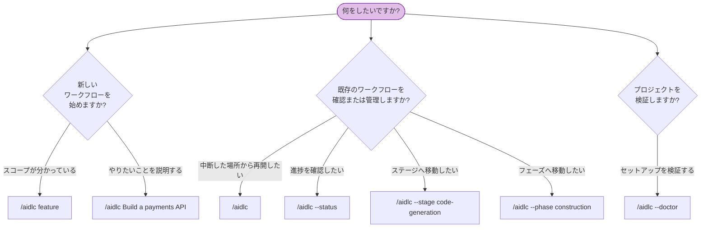

AI-DLC のすべてのコマンドは、オーケストレーターの呼び出しから始まります。この章は、あらゆる呼び出しパターンとフラグを網羅する完全リファレンスです。

> **呼び出しプレフィックスはハーネスごとに異なります。** Claude Code、Kiro IDE、Kiro CLI、opencode では `/aidlc` を入力します。Codex CLI では `$aidlc`（または `/skills` → aidlc）です。以下のフラグと挙動はどちらでも同一で、変わるのはプレフィックスだけです。例では `/aidlc` を使います。Codex では `$aidlc` に置き換えてください。[Kiro CLI](/guide/harnesses/kiro-cli)、[Kiro IDE](/guide/harnesses/kiro-ide)、[Codex CLI](/guide/harnesses/codex-cli)、[opencode](/guide/harnesses/opencode) の各ハーネスガイドを参照してください。

---

<a id="quick-reference"></a>
## クイックリファレンス

| コマンド | 説明 |
|---------|-------------|
| `/aidlc [scope]` | 明示したスコープで新しいワークフローを開始する |
| `/aidlc [description]` | 新しいワークフローを開始する。スコープは説明文から自動検出される（情報量の多い説明や未一致の文章には構成提案が出る） |
| `/aidlc compose "<task>"` | アダプティブコンポーザーを強制する。対象タスク向けに調整した EXECUTE/SKIP プランを提案する |
| `/aidlc compose --report <path>` | スキャンレポートから構成する（指摘事項を簡潔な修正・出荷作業に仕分ける） |
| `/aidlc --new-scope "<task>"` | 既存スコープが一致してもコンポーザーに独自スコープの合成を強制する |
| `/aidlc` | 既存ワークフローを再開する（インテントが存在する場合）。存在しなければ最初のインテントを作成して新規開始する |
| `/aidlc intent [name]` | アクティブなスペースのインテントを一覧表示、または既存インテントへ切り替える |
| `/aidlc space [name]` | スペースを一覧表示、または既存スペースへ切り替える |
| `/aidlc space-create <name>` | フレームワークのベースラインから新しいスペースを作成する |
| `/aidlc --status` | 読み取り専用のステータス要約を表示する |
| `/aidlc --doctor` | セットアップの健全性チェックを実行する |
| `/aidlc --doctor --export` | 新規の健全性チェックを実行し、共有用の小さく秘匿化された診断レポートを書き出す |
| `/aidlc --stage <slug\|#>` | 特定のステージへ移動する |
| `/aidlc --stage <slug> --single` | メインのワークフローを進めずに、1 ステージだけを独立実行する |
| `/aidlc --phase <name\|#>` | フェーズ先頭へ移動する |
| `/aidlc --scope <name>` | アクティブなスコープを変更する |
| `/aidlc --depth <level>` | 深さレベル（minimal、standard、comprehensive）を上書きする |
| `/aidlc --test-strategy <level>` | テスト戦略（minimal、standard、comprehensive）を上書きする |
| `/aidlc config get <key>` | アクティブなワークフロー設定（`depth`、`test-strategy`）を表示する |
| `/aidlc config set <key> <value>` | アクティブなワークフロー設定（`depth`、`test-strategy`）を変更する |
| `/aidlc config list` | アクティブなワークフロー設定を一覧表示する（`--json` で構造化出力） |
| `/aidlc plugin list` | インストール済みプラグインと有効状態を一覧表示する |
| `/aidlc plugin sync` | インストール済みプラグインのルートを現在のインストールへ合成する |
| `/aidlc --version` | フレームワークのバージョンを表示する |
| `/aidlc --help` | 使用方法を表示する |
| `bun .claude/tools/aidlc-utility.ts select-plugins [names]` | 直接呼び出し専用: このインストールで有効なプラグイン一覧を表示または設定する |

---

<a id="command-decision-tree"></a>
## コマンド判断ツリー



\{/* テキスト代替: 新しいワークフローを始めるには、/aidlc feature（既知のスコープ）または /aidlc Build a payments API（自動検出。最初のインテントは自動作成）を使います。既存ワークフローを管理するには、/aidlc（再開）、/aidlc --status（進捗表示）、/aidlc --stage（ステージへ移動）、/aidlc --phase（フェーズへ移動）を使います。セットアップ検証には /aidlc --doctor（健全性チェック）を使います。 */\}

---

<a id="detailed-reference"></a>
## 詳細リファレンス

<a id="aidlc-scope-start-with-explicit-scope"></a>
### `/aidlc [scope]` — 明示したスコープで開始する

有効なスコープのいずれかを指定して、新しいワークフローを開始します。コアには 9 個の名前付きスコープが同梱されており、プラグインでさらに追加できます。また、無効化したプラグイン / コアのスコープは `select-plugins` で実行時から隠せます。

**構文:**

```
/aidlc enterprise
/aidlc feature
/aidlc mvp
/aidlc poc
/aidlc bugfix
/aidlc refactor
/aidlc infra
/aidlc security-patch
```

**挙動:** フレームワークはスコープキーワードを認識し、何を作りたいかを尋ねたあと、初期化フェーズを実行して最初の分野別ステージを開始します。すでに状態ファイルが存在する場合は、代わりに再開オプションを提示します。

**例:**

```
/aidlc bugfix
> What would you like to fix?
> The login API returns 500 when email contains a plus sign
```

---

<a id="aidlc-description-start-with-auto-detection"></a>
### `/aidlc [description]` — 自動検出で開始する

作りたいものを説明すると、エンジンが適切なスコープを自動検出します。

**構文:**

```
/aidlc Build a REST API for inventory management
/aidlc Fix the login timeout bug
```

**挙動:** エンジンは説明文内のキーワードを解析します（たとえば "fix" は bugfix を示唆します）。明確に一致した場合は、MATCHED スコープ名とその手続き量（ステージ数、承認ゲート数、コンパイル済みグリッドに基づく作業ユニットごとの展開数）を示す 1 行確認を出します。情報量の多い説明や一致しない文章には、黙って既定値を使わず構成提案（以下の `/aidlc compose` を参照）を出します。ワークフロー開始前に確認または上書きできます。

**例:**

```
/aidlc Fix the null pointer in ProfileSerializer
> Starting a "bugfix" workflow for: "Fix the null pointer in ProfileSerializer" - 7 of 32 stages, 4 approval gates, 1 stage repeats per unit of work in Construction. Confirm to proceed, name a different scope, or say "compose" for a tailored plan.
```

---

<a id="aidlc-compose-the-adaptive-composer"></a>
### `/aidlc compose` - アダプティブコンポーザー

既存の標準スコープが一致する場合でも、コンポーザーを強制します。利用できるタイミングは 3 つあります。

```
/aidlc compose "harden the deployment pipeline and add observability"
/aidlc compose --report sonar.json
/aidlc compose            (mid-workflow: re-shape the pending stages)
```

**挙動:** コンダクターはコンポーザーエージェントへ処理を委譲します。エージェントはタスク、スキャンレポート、または進行中ワークフローの状態を読み、読み取り専用の `detect` 走査を実行し、実装エントロピーの 5 成分（意図の曖昧さ、構造的不確実性、検証エントロピー、リスク、未解決の前提。CodeKB MCP が設定されていればその分析に、なければワークスペース走査に基づきます）を推定したうえで、スコア内訳と各 EXECUTE / SKIP の理由を添えた必要最小限の EXECUTE/SKIP グリッドを提案します。利用者はゲートで承認、編集、却下のいずれかを選びます。承認した提案が標準スコープに一致すれば、そのままインテントを作成します。独自グリッドの場合は、インストール済みツリーに実在する 2 ファイル構成のスコープとして書き込み、同じターン内にそのスコープでワークフローを作成します。進行中の提案では、`recompose` 動作により保留中ステージの後半部分を反転適用します（監査ロック下で厳密に検証し、`RECOMPOSED` を監査します）。`--new-scope` は強制合成、`--report <path>` は仕分け済みの指摘をインテントへ投入する機能です。`/aidlc-compose` スキルは同じ経路を直接入力できる短縮形です。ワークフロー途中では、"can we skip market research?" のようにチャットで通常の依頼もできます。コンダクターが再形成要求として認識し、同じゲートと動作へ流します。`compose` という文字列を明示する必要はありません（Claude 以外のハーネスでは、明示的な動詞が引き続き文書化された確実な経路です）。

[スコープと深さ - アダプティブコンポーザー](/guide/scopes-and-depth#the-adaptive-composer) に完全な流れがあります。

---

<a id="aidlc-resume-existing-workflow"></a>
### `/aidlc` — 既存ワークフローを再開する

状態ファイルが存在する場合は、引数なしで実行して再開します。

**構文:**

```
/aidlc
```

**挙動:** `aidlc-state.md` を読み、`.aidlc-recovery.md` を確認して破損がないか調べたうえで、4 つの再開オプション（チェックポイントから再開、現在ステージのやり直し、ステージへの移動、新しく開始）を提示します。詳細は [セッション管理](/guide/session-management) を参照してください。

状態ファイルがない場合、フレームワークはこれを新しいワークフローとして扱い、スコープまたは説明を尋ねます。

---

<a id="initialization-automatic-no-command"></a>
### 初期化 — 自動実行、専用コマンドなし

足場作成コマンドはありません。配布される `dist/<harness>/` のワークスペース環境はあらかじめ構築済みで（`.claude/` エンジンと `aidlc/spaces/default/memory/` を含む）、最初の `/aidlc` 実行時（または作りたいものを説明したとき）にエンジンが最初のインテントを**自動作成**します。作成処理では、3 つの初期化ステージ（ワークスペース足場作成、ワークスペース検出、状態初期化）を 1 回の決定論的なツール呼び出しとして実行します。インテントの記録ディレクトリを `aidlc/spaces/<space>/intents/<YYMMDD>-<label>/` に作成し（`audit/` シャードディレクトリ、各フェーズの成果物ディレクトリ、`verification/` を含む）、空のスペース単位 `aidlc/knowledge/` ディレクトリを作り、ルールベースでワークスペースを走査し、そのインテントの `aidlc-state.md` にスコープ計画を書き込みます。

この処理では初期化イベント（`WORKFLOW_STARTED`、`WORKSPACE_SCAFFOLDED`、`WORKSPACE_SCANNED`、`WORKSPACE_INITIALISED` と、各ステージの `STAGE_STARTED` / `STAGE_COMPLETED`）を記録します。スコープ名を指定すると（`/aidlc --scope feature`）初期スコープとして使われます。指定がなければ `poc` が既定値です。最初の実行前にチームナレッジやガードレールを加えたい場合は、配布済みの `aidlc/spaces/default/memory/` ファイルを編集します。スペース単位の `aidlc/knowledge/` ディレクトリは最初のインテント作成後に空の状態で作られ、その後は自由形式のファイルを追加できます。

歓迎メッセージは、セッション開始時に `settings.json` の `companyAnnouncements` エントリ経由で描画されます。

**複数リポジトリのワークスペース。** ワークスペースルートに複数の同階層コードリポジトリ（直下の子ディレクトリで、それぞれに `.git` があるもの）が存在する場合、作成ステップはそのインテントが扱うリポジトリ集合を `intents.json` 行に記録します。既定ではすべての同階層リポジトリを**自動検出**します。特定の部分集合に限定したい場合、作成ツールは `--repos a,b`（リポジトリディレクトリ名のカンマ区切り）を受け付けます。これはエンジンが内部で実行する決定論的な `aidlc-utility intent-birth` ステップのフラグであり、利用者が直接入力する `/aidlc` フラグではありません。構築フェーズ中は、各 Git 操作（ワークツリー、群処理、Bolt）が 1 つのリポジトリを対象にします。コンダクターは対象を固定するため `--repo <name>` を渡します。インテントが複数リポジトリにまたがる場合だけ必須です。記録済みリポジトリを持たないインテントは単一リポジトリの既定ケースであり、Git はワークスペースまたはプロジェクトのディレクトリで実行されます。[成果物リファレンス](/guide/artifacts-reference) を参照してください。

---

<a id="aidlc-intent-name--list-or-switch-intents"></a>
### `/aidlc intent [name]` — インテントの一覧表示と切り替え

引数なしの `/aidlc intent` はアクティブなスペースのインテントを一覧表示します。`--json` を付けると構造化出力になります。`/aidlc intent <name>` は、曖昧さのないスラッグまたは完全なレコードディレクトリ名で、利用者ごとのアクティブインテントカーソルを既存インテントへ切り替えます。インテントの作成やワークフローの前進は決して行いません。

<a id="aidlc-space-name--list-or-switch-spaces"></a>
### `/aidlc space [name]` — スペースの一覧表示と切り替え

引数なしの `/aidlc space` はスペースを一覧表示します。`--json` を付けると構造化出力になります。`/aidlc space <name>` は利用者ごとのアクティブスペースカーソルを切り替え、ハーネスネイティブのメソッドインクルードをそのスペースへ付け替えます。スペースの作成やインテントの前進は決して行いません。

<a id="aidlc-space-create-name--create-a-space"></a>
### `/aidlc space-create <name>` — スペースの作成

`memory/`、`knowledge/`、`codekb/`、`intents/` の完全な形を持つ新しいチームスペースを作成します。シードは他チームの学習済みプラクティスではなくフレームワークのベースラインです。スペースの自動切り替えは行いません。ワークスペースモデル、切り替え例、コミット対象については [スペースとインテント](/guide/spaces-and-intents) を参照してください。

---

<a id="aidlc-status-read-only-status"></a>
### `/aidlc --status` — 読み取り専用ステータス

何も変更せず、現在のワークフロー進捗を表示します。

**構文:**

```
/aidlc --status
```

**挙動:** 現在のインテントの `aidlc-state.md` を読み、現在のフェーズ、現在のステージ、完了済み / 全ステージ数、スコープ、深さ、ステージ進捗一覧を表示します。現在のワークフローがない場合は、進行中のワークフローがないことを報告します。

---

<a id="aidlc-doctor-health-check"></a>
### `/aidlc --doctor` — 健全性チェック

この実装に必要な前提条件、設定、ステージグラフ整合性がすべて揃っているかを検証します。完全に成功すれば終了コード 0、何か失敗すれば 1 を返します。どちらの場合も完全なレポートを標準出力へ書くため、オーケストレーターはそのまま表示できます。`--doctor` は**読み取り専用**です。まだインテントが存在しない新しい実行環境（`audit/` シャードがない状態）ではファイルを作らないため、最初のインテント作成前でも安全に実行できます。インテントが存在するようになった後は、`HEALTH_CHECKED` 監査行を記録します。

ワークフローに問題があるときは、`--doctor` は **ワークフロー診断** セクションも表示し、未解決のゲート、古い・欠落した実行時グラフ、休止状態のフックなど「先に進まない」原因に対する構造化された指摘（例: `gate-unresolved`、`runtime-graph-stale`）を一覧します。ライブレポートと `--export` は 1 つの分析を共有するため、指摘内容はどちらでも同一です。

**構文:**

```
/aidlc --doctor
```

**検証項目:**

| チェック | 検証内容 |
|-------|-------------------|
| 前提条件 | `bun` がインストールされ、PATH 上にある |
| フックの存在 | `settings.json` が配線するすべてのフック（`hooks` ブロックと `statusLine` コマンドに含まれる 13 個のフレームワークフックすべて）が `.claude/hooks/` に存在する。配線済みなのに欠けているフックは明示的に失敗する。期待一覧を `settings.json` から取得するため、そこにフックを追加すると自動で検査対象になる |
| プロジェクト構造 | `.claude/settings.json` が存在する（内容検証はしない） |
| ワークスペース環境 | `.claude/` と `aidlc/spaces/default/memory/` が存在する（出荷済み環境） |
| サブモジュール | `.gitmodules` が存在する場合、宣言されたサブモジュールパス数と未初期化数を報告し、必要なら `git submodule update --init --recursive` を示す（助言のみ。失敗にはしない） |
| 環境変数のスコープ | `AWS_AIDLC_DEFAULT_SCOPE`（設定されている場合）が有効なスコープ名である |
| フックの生存確認 | `.aidlc-hooks-health/` に最近のフック実行時刻がある |
| フックの処理落ち | `.aidlc-hooks-health/<hook>.drops` の診断情報を表示する。各ファイルには、フックがツール呼び出しを壊さないよう抑止した失敗が記録される。フックごとの件数、最終時刻、対処法（確認後にファイル削除）を示す。助言のみで、失敗にはしない |
| 状態のずれ | 現在のインテントの `aidlc-state.md` が監査内の最後の `WORKFLOW_COMPLETED` と一致する |
| 循環検出 | `stage-graph.json` に循環がない |
| 孤立したステージファイル | グラフ内のすべてのスラッグに対して、対応する `<phase>/<slug>.md` がディスク上にある |
| 未コンパイルのステージファイル | ディスク上にあるステージ `.md` のうち、コンパイル済みグラフにスラッグが存在しないものを表示する。`aidlc-graph.ts compile` を実行するまでそれらは実行されない（助言のみ。失敗にはしない） |
| プラグイン選択 | 有効なプラグイン一覧、プラグインごとの有効ステージ数、グラフ全体での `enabled:false` フラグの整合、途中で途切れた選択の復旧ヒント |
| スコープ検証 | 有効なすべてのスコープ（プラグイン選択適用後の `.claude/scopes/*.md` 由来）を正しく走査できる（スコープ切り詰め差分に関する助言は想定内） |
| スキーマ検証 | 各ステージの YAML フロントマターが `validateStageFrontmatter` を通過する |
| グラフ参照 | すべての `consumes[].artifact` と `requires_stage[]` の参照先を解決できる |
| キーワード重複 | 1 つのキーワードを複数スコープが使用していない |
| ルールのずれ | 内容のある組織方針見出しと重複するチーム / プロジェクトルール見出しを表示し、矛盾の可能性を確認できるようにする（助言のみ。失敗にはしない） |
| 対応センサーの網羅性 | 対応センサーを指定したすべてのルールが、実際にいずれかのステージで発火するセンサーへ解決されることを確認する（助言のみ。失敗にはしない） |

**出力例:**

```
✓ bun installed (required for CLI tools and hooks)
✓ aidlc-audit-logger.ts present
✓ aidlc-sync-statusline.ts present
✓ aidlc-validate-state.ts present
✓ aidlc-log-subagent.ts present
✓ aidlc-session-start.ts present
✓ aidlc-session-end.ts present
✓ aidlc-statusline.ts present
✓ settings.json present
✓ AWS_AIDLC_DEFAULT_SCOPE (unset — no project default)
✓ workspace shell ready (.claude/ + aidlc/spaces/default/memory/)
✓ Submodules: no .gitmodules at workspace root
✓ Hook heartbeats: not yet fired (first workflow stage will populate)
✓ Hook drops: none recorded
✓ State matches last audit event (no drift)
✓ Cycle detection: 0 cycles
✓ Orphan stage files: 32 graph entries all have files
✓ Uncompiled stage files: 0 stage files missing from the compiled graph
✓ Enabled plugins: all enabled (no selection); enabled stage counts: aidlc=32
✓ Scope validation: 9 scopes valid (29 advisories)
✓ Schema validation: 32/32 stages valid
✓ Graph references: 122 artifacts + edges resolved
✓ Keyword overlap: no conflicts
✓ Rule drift: no team/project rule overlaps org policy
✓ Paired sensor coverage: no sensor-bound rules (0 feedforward-only)
```

---

<a id="aidlc-doctor-export-write-a-diagnostic-report"></a>
### `/aidlc --doctor --export` — 診断レポートを書き出す

`--doctor` に `--export` を付けると、小さく秘匿化された診断レポートを書き出し、プロジェクトディレクトリ全体を共有しなくても不調なワークフローをデバッグできるようにします。まず**新規の** doctor 実行を行い（レポートがキャッシュ済みの診断を反映することはありません）、その後にレポートを書き出します。レポートの書き出しが doctor の終了コードを変えることはありません。

**構文:**

```
/aidlc --doctor --export
/aidlc --doctor --export --output <dir>
```

`--output <dir>` で出力先を上書きできます。既定はプロジェクト配下の `aidlc/diagnostics/` です。

**生成されるもの:** システムに `tar` があればタイムスタンプ付きの `.tar.gz` を作成します。なければレポートディレクトリをそのまま残し、共有前に自分で圧縮するよう案内します（新しいパッケージ依存も独自のアーカイブ書き込み処理も追加しません）。レポートの内容は次のとおりです。

| ファイル | 内容 |
|------|----------|
| `report.md` | 人間が読めるワークフロータイムラインと指摘事項 |
| `report.json` | 機械可読のタイムライン、指摘事項、要約 |
| `manifest.json` | レポートスキーマバージョン、AI-DLC バージョン、ハーネス、ハッシュ化したインテント ID、ファイルごとの SHA-256 チェックサム、適用した秘匿化、切り詰め通知、除外一覧 |
| `evidence/normalized.json` | 許可リストに載った正規化済みフィールドのみ。生ファイルは決して含まない |

**診断内容:** レポートは監査証跡からワークフローの**タイムライン**（ステージ所要時間、ゲート、改訂、空白期間、異常 / 未完了フラグ）を再構築し、次に「先に進まない」よくある原因、すなわち未解決の承認ゲート、状態と監査のずれ、古い・欠落した実行時グラフ / 休止・凍結したフック生存確認に対して、**決定論的な**「条件→対処」ルール（LLM 不使用）を実行します。指摘はライブの `--doctor` と同じ共有 `DoctorFinding` モデルから生成されるため、コマンドとレポートが食い違うことはありません。復旧用バイパス（たとえば `AIDLC_DISABLE_*` 環境変数や「ワークスペースをアーカイブする」指示）を名指しする対処は、常に自動化には安全でないものとしてフラグ付けされます。

**安全性。** レポートには、ワークスペースのソース、生の状態 / 監査 / 実行時グラフのファイル、成果物・寄与・質問・メモリの本文、環境変数、コマンド出力は決して含まれません。出力されるすべての文字列は秘匿化されます。ホームディレクトリは `~` に、プロジェクトルートは `<project>` になり、インテント ID はハッシュ化され、シークレットらしき値は除去されます。実パスがプロジェクトルートの外へ出る入力は拒否され（シンボリックリンクされた末端や親をたどってツリー外へ出ることはありません）、ファイルごとおよび合計のサイズには上限があり（切り詰めはマニフェストに記録されます）、プラットフォームが対応していればファイルは所有者のみアクセス可能な権限で作成されます。

**出力例:**

```
Diagnostic report created:
  aidlc/diagnostics/aidlc-diagnostic-report-20260714-153000-3f9a1c22.tar.gz

Findings:
  ERROR gate-unresolved
  WARNING runtime-graph-stale

No source files or artifact bodies were included.
```

---

<a id="aidlc-stage-slug-jump-to-stage"></a>
### `/aidlc --stage <slug|#>` — ステージへ移動する

スラッグまたは番号で、特定のステージへ直接移動します。

**構文:**

```
/aidlc --stage code-generation
/aidlc --stage 3.5
/aidlc --stage requirements-analysis
/aidlc --stage 2.3
```

**挙動:** ワークフローが動作中の場合は、対象ステージへ移動します（間のステージは警告付きでスキップされます）。ワークフローが存在しない場合は、`--scope` と組み合わせられます。

```
/aidlc --stage code-generation --scope bugfix
```

---

<a id="aidlc-stage-slug-single-run-one-stage-in-isolation"></a>
### `/aidlc --stage <slug> --single` — 1 ステージだけを独立実行する

`--single` を付けると、メインのワークフローに触れず、そのステージだけを単独で実行します。ステージを実行して成果物を書き、そこで停止します。ワークフローの `Current Stage` は一切進みません。この独立性は慣習ではなくエンジンが強制します。要件分析やリバースエンジニアリング走査など、方法論の一部分だけを適用し、まだライフサイクル全体には入りたくない場合に使います。独立実行でも、そのステージに設定されたエージェントとレビュー担当者は使われますが、ワークフローの学習処理は実行されず、ワークフロー承認も求められません。その合成的な完了は監査ログに記録され、その後コマンドは停止します。

```
/aidlc --stage requirements-analysis --single
/aidlc --stage reverse-engineering --single
```

実行可能なすべてのステージには、直接入力できる 1 語のランナー `/aidlc-<slug>` も用意されています。これは `/aidlc --stage <slug> --single` をパッケージ化したものです。ランナー群全体（スコープランナー、ステージランナー、`/aidlc-init`、セッション表示）については、[スキルとランナーコマンド](/guide/skills) に記載しています。

---

<a id="aidlc-phase-name-jump-to-phase"></a>
### `/aidlc --phase <name|#>` — フェーズへ移動する

特定のフェーズの最初のステージへ移動します。

**構文:**

```
/aidlc --phase construction
/aidlc --phase 3
/aidlc --phase ideation
/aidlc --phase 1
```

**挙動:** `--stage` と同じですが、対象は指定フェーズの最初のステージです。`--scope` と組み合わせることもできます。

---

<a id="aidlc-scope-name-change-scope"></a>
### `/aidlc --scope <name>` — スコープを変更する

実行中ワークフローのアクティブスコープを変更します。

**構文:**

```
/aidlc --scope bugfix
/aidlc --scope enterprise
```

**挙動:** `aidlc-state.md` のスコープ設定を更新し、実行またはスキップするステージを再計算して、`SCOPE_CHANGED` 監査イベントを記録します。`--depth` と組み合わせると、新しいスコープの既定の深さを上書きできます。

自律構築中（`Construction Autonomy Mode: autonomous`）は拒否されます。`recompose` と同じルールで、計画の再形成にはゲートで人間の判断が必要ですが、無人実行にはそれがありません。まずゲート付き構築へ切り替えてください（`aidlc-bolt set-autonomy --mode gated`）。または群処理の完了を待ってください。

ワークフローがまだ存在しない新規プロジェクトで `--scope <name>` を使うと、そのまま開始します。挙動は `/aidlc <name>` と完全に同じで、ワークスペースは指定スコープで初期化され、ワークフローは最初のステージから始まります。

---

<a id="aidlc-depth-level-override-depth"></a>
### `/aidlc --depth <level>` — 深さを上書きする

現在または新規ワークフローの深さレベルを上書きします。

**構文:**

```
/aidlc --depth minimal
/aidlc --depth standard
/aidlc --depth comprehensive
```

**挙動:** ワークフローが動作中の場合、`aidlc-state.md` の `Depth` フィールドを更新し、`DEPTH_CHANGED` 監査イベントを記録します。`--scope` と組み合わせると、新しいスコープの既定の深さを上書きします。`--stage` または `--phase` と組み合わせると、移動先の実行コンテキストに対する深さを設定します。動作中のワークフローがない場合はエラーになります。

**有効な値:** `minimal`, `standard`, `comprehensive`（大文字小文字を区別しない）。

**例:**

```
/aidlc --depth minimal                            Change depth of active workflow
/aidlc --scope bugfix --depth comprehensive        Bugfix with comprehensive analysis
/aidlc --stage code-generation --depth minimal     Jump with minimal depth
```

---

<a id="aidlc-test-strategy-level-override-test-strategy"></a>
### `/aidlc --test-strategy <level>` — テスト戦略を上書きする

深さとは独立して、テスト量の戦略を上書きします。

**構文:**

```
/aidlc --test-strategy minimal
/aidlc --test-strategy standard
/aidlc --test-strategy comprehensive
```

**挙動:** 指定しない場合の既定値は現在の深さレベルです。ただしスコープが独自の既定値を宣言している場合（たとえば `workshop` は Minimal）はそれに従います。独立して設定することで、Standard の深さ（完全な成果物）と Minimal のテスト（Nyquist モデル）のような組み合わせを使えます。`aidlc-state.md` の `Test Strategy` フィールドを更新し、`TEST_STRATEGY_CHANGED` 監査イベントを記録します。

**有効な値:** `minimal`, `standard`, `comprehensive`（大文字小文字を区別しない）。

**テスト戦略モデル:**
- **Minimal（Nyquist）:** 要件ごとに 1 テスト、正常系の最低限、単体テストのみ（合計およそ 5〜15）
- **Standard:** コンポーネントごとに 5〜8 テスト、単体 + 結合
- **Comprehensive:** コンポーネントごとに 10〜15 テスト、すべてのテスト種別

各レベルの詳細、既定化の挙動、よく使う組み合わせについては、[スコープ、深さ、テスト戦略](/guide/scopes-and-depth#the-3-test-strategy-levels) を参照してください。

**例:**

```
/aidlc --test-strategy minimal                         Minimal testing for active workflow
/aidlc --depth standard --test-strategy minimal        Full artifacts, minimal tests
/aidlc --scope bugfix --test-strategy comprehensive    Bugfix with thorough testing
```

---

<a id="aidlc-version-framework-version"></a>
### `/aidlc --version` — フレームワークのバージョン

フレームワークのバージョン（`aidlc <X.Y.Z>`）を表示して終了します。読み取り専用で、ワークフローがなくても動作し、再開を促すこともありません。

**構文:**

```
/aidlc --version
```

---

<a id="aidlc-help-usage-information"></a>
### `/aidlc --help` — 使用方法

利用できるコマンドとフラグの要約を表示します。

**構文:**

```
/aidlc --help
```

---

<a id="deterministic-cli-tools"></a>
## 決定論的 CLI ツール

上記の `/aidlc` フラグに加えて、この実装には、ワークフロー実行中にフックとステージプロトコルが呼び出す複数の Bun/TypeScript ツールが含まれています。手動で呼び出すことはほとんどありませんが、それぞれが有用なデバッグ手段でもあります。

`bun <harness-dir>/tools/<tool>.ts <subcommand>` の形で使います。`<harness-dir>` は Claude Code では `.claude`、Kiro CLI と Kiro IDE では `.kiro`、Codex CLI では `.codex` です。

<a id="aidlc-utility-codekb-path-resolve-the-code-knowledge-directory"></a>
### `aidlc-utility codekb-path` - コードナレッジディレクトリの解決

これは **直接ユーティリティ呼び出し** であり、`/aidlc codekb-path` というコマンドではありません。

```bash
bun .claude/tools/aidlc-utility.ts codekb-path --repo <repo>
bun .kiro/tools/aidlc-utility.ts codekb-path --repo <repo>
bun .codex/tools/aidlc-utility.ts codekb-path --repo <repo>
```

アクティブなスペースの決定論的な `aidlc/spaces/<space>/codekb/<repo>/` パスを表示します。`--json` を付けると `{space, repo, dir}` を出力します。このクエリは何も書き込まず、ディレクトリを作らず、監査イベントも発行しません。リバースエンジニアリングステージの本文がこれを直接呼び出すため、パスが手作業で導出されることはありません。

<a id="aidlc-utility-detect-read-only-workspace-scan"></a>
### `aidlc-utility detect` - 読み取り専用のワークスペース走査

`bun .claude/tools/aidlc-utility.ts detect --json` は、ワークスペース走査結果（プロジェクト種別、言語、フレームワーク、ビルドシステム、および宣言された Git サブモジュールの初期化状態を含む `submodules` 配列）に加え、解決済みのスコープディレクトリとスコープグリッドのパスを表示します。完全に読み取り専用です。コンポーザーはこれを使って、現在のハーネスにおけるスコープデータの場所を把握します。

<a id="aidlc-utility-select-plugins-install-plugin-selection"></a>
### `aidlc-utility select-plugins` - インストールのプラグイン選択

`/aidlc plugin list` は、インストール済みプラグイン名と各プラグインの有効状態を表示します。`select-plugins` は **直接ユーティリティ呼び出し** であり、`/aidlc select-plugins` というコマンドではありません。`bun .claude/tools/aidlc-utility.ts select-plugins` は、現在の選択（`plugins` キーがない場合は `all enabled (no selection)`）と既知のプラグイン名を表示します。カンマ区切りの一覧を渡すと設定できます。

```bash
bun .claude/tools/aidlc-utility.ts select-plugins test-pro
bun .claude/tools/aidlc-utility.ts select-plugins aidlc,test-pro
```

このコマンドは名前を検証し、`.claude/tools/data/harness.json` を書き込み、新たに無効化されたプラグインがコアのステージソースへマージ済みの寄与を取り除き（構造的な追加はコンポーズが書き込むサイドカー経由、差し込まれた本文はそのセンチネルマーカー経由。再有効化すると次のセッション開始時に復元されます）、無効化されたノードへ `enabled:false` を付けてグラフ全体を再コンパイルし、ステージランナーとスコープランナーを削除 / 再生成し、生成された SKILL.md のスコープ表 / ステージ表を更新します。これらすべてを 1 トランザクションで行います。`aidlc` はコアです。これを省略すると、常時実行の初期化ステージを除くコアの表面が無効になります。アクティブなワークフローを立ち往生させる変更（そのスコープ、または計画内の保留中 EXECUTE ステージを、新しい選択で無効になるプラグインが所有している場合）は、依存対象を 1 つずつ名指しして拒否されます。先にワークフローを完了または駐車させるか、そのプラグインを有効のまま維持してください。

`/aidlc plugin sync` は、インストール済みプラグインの compose フックを実行します。繰り返し実行しても安全です。プラグインルートが存在しない場合は `no installed plugins; nothing to sync` を出力して 0 で終了します。

<a id="aidlc-utility-recompose-in-flight-plan-flips"></a>
### `aidlc-utility recompose` - 進行中プランの反転

`bun .claude/tools/aidlc-utility.ts recompose --skip <slugs> --add <slugs>`（カンマ区切り）は、現在の状態ファイル上で、まだ PENDING かつカーソルより先にあるステージの計画後半を反転します。監査ロック下で実行し、残りのステージへ必要な入力が届かなくなる反転を拒否します。完了済みまたは進行中のステージ、カーソルより後ろのステージ、構築フェーズ最初の EXECUTE ステージであるワーキングスケルトンの基点を前後に動かす反転、`Status` が `Running` でないワークフローの再構成、自律構築中の再構成も拒否します。計画の再形成には人間のゲートが必要なため、まずゲート付きへ戻すか、群処理の完了を待ってください。派生状態フィールドを再構築し、`RECOMPOSED` を出力します。通常はワークフロー途中の `/aidlc compose` 経由で到達し、直接入力するものではありません。

<a id="aidlc-graph-validate-grid-arbitrary-grid-dependency-check"></a>
### `aidlc-graph validate-grid` - 任意グリッドの依存関係チェック

`bun .claude/tools/aidlc-graph.ts validate-grid --proposal <path> [--strict] [--project-type <t>] [--keywords <csv>]` は、任意の `{"<stage>": "EXECUTE"|"SKIP"}` JSON グリッドを検証します。寛容モードは `validate-scope` を模倣し、経路外にある必須の生成元を助言扱いにします。`--strict` を付けると厳密に拒否します（再構成と同じ方針です）。`--keywords` は、付与した各キーワードが既存スコープのキーワードと競合しないか調べます。競合時は既存スコープ名を含む重大エラーになります（コンポーザーは、ゲート承認済みキーワードを書き込む前にこれを実行します）。無効な場合だけ終了コード 1 を返し、JSON 結果を標準出力へ書きます。

<a id="aidlc-sensor-inspect-and-fire-sensors"></a>
### `aidlc-sensor` — センサーを調べて発火する

センサーは、各ステージ出力への `Write` または `Edit` のあとに実行する決定論的な検査です（[ルールと学習ループ](/guide/rules-and-the-learning-loop) およびリファレンスの [センサーシステム](/reference/sensor-system) を参照）。`PostToolUse` フックが自動で発火させます。このツールを使うと、一覧表示、説明確認、手動発火ができます。

| サブコマンド | 機能 |
|------------|--------------|
| `list` | フレームワークに含まれる全センサー（`id`、`kind`、`description`）をアルファベット順に表示する |
| `describe <id>` | 1 つのセンサーの完全なマニフェスト（コマンド、既定の重大度、`matches` グロブ、タイムアウト）を表示する |
| `fire <id> --stage <slug> --output-path <path>` | ファイルに対してセンサーを実行し、`SENSOR_FIRED` 行と対応する結果行を出す |

手動発火では、まず `SENSOR_FIRED` 監査行を出し、その後ちょうど 1 行の端末出力として `SENSOR_PASSED`、`SENSOR_FAILED`、`SENSOR_BUDGET_OVERRIDE` のいずれかを出します。失敗した場合、詳細ファイルはインテントの記録ディレクトリ内にある `<record>/.aidlc-sensors/<stage>/` へ書きます。センサーは助言用なので、失敗してもツールの失敗にはならず、コマンドは終了コード 0 を返します。フレームワークに同梱される 4 つのセンサーは `required-sections`、`upstream-coverage`、`linter`、`type-check` です。

```
bun .claude/tools/aidlc-sensor.ts list
bun .claude/tools/aidlc-sensor.ts describe required-sections
bun .claude/tools/aidlc-sensor.ts fire required-sections \
  --stage requirements-analysis \
  --output-path aidlc/spaces/default/intents/<YYMMDD>-<label>/inception/requirements-analysis/requirements.md
```

<a id="aidlc-learnings-the-learning-gate-tool"></a>
### `aidlc-learnings` — 学習ゲート用ツール

これは §13 の学習ゲートにおける決定論的な処理部分です。ステージが承認されたあと、オーケストレーターはこれを使って、そのステージの `memory.md` 日誌をレビュー可能な学習候補へ変換し、利用者が確認したものだけを永続化します。通常は直接呼び出しません。オーケストレーターが `AskUserQuestion` ゲートの前後で両方の手順を進めます。ここで説明することで、そこから出る監査行の意味を確認できます。

| サブコマンド | 機能 |
|------------|--------------|
| `surface --slug <stage-slug>` | 直前に承認されたステージの `memory.md` を読み、構造化した候補（解釈、逸脱、トレードオフ）と保留中の未解決質問を表示する。読み取り専用 |
| `persist --slug <stage-slug> --selections-json <path>` | 確認済みの学び（確定した学びは実践事項）を `aidlc/spaces/<active-space>/memory/project.md` / `team.md` に書き込む（センサーと結び付く学びなら、プロジェクト階層のセンサー雛形を作り、関連付ける）。`RULE_LEARNED` / `SENSOR_PROPOSED` を出す |

確認済みの学びは、現在のワークフローではなく次のワークフローから適用されます。

<a id="aidlc-runtime-read-the-runtime-graph"></a>
### `aidlc-runtime` — 実行時グラフを読む

実行時グラフ（インテントの記録ディレクトリにある `runtime-graph.json`）は、このワークフローで実際に起きたことを記録するデータプレーンの表示です。実行したステージ、各 `memory.md` 日誌の記入量、発火したセンサーとその結果を保持します。構造的な `stage-graph.json` に対する実行時の写しです。フレームワークは各ステージ遷移後に再コンパイルします。このツールではコンパイルを手動実行したり、1 ステージ分の行を読んだりできます。

| サブコマンド | 機能 |
|------------|--------------|
| `compile` | `audit/` シャードと各ステージの `memory.md` を走査して `runtime-graph.json` を書き直す。各遷移でフックが自動発火する |
| `read <stage-slug>` | `runtime-graph.json` から 1 ステージ分の行（時刻、エージェント、メモリ内訳、センサー発火、結果）を表示する |
| `summary [--json]` | グラフ全体の決定論的集計を表示する。ステージ / フェーズの結果集計、メモリ項目数、センサーの 4 状態集計、取り込んだ学び、ワークフロー所要時間を含む。読み取り専用のセッションスキルが参照するデータ源 |

```
bun .claude/tools/aidlc-runtime.ts read requirements-analysis
```

`runtime-graph.json` は Git 管理外です。成果物の形状については [成果物リファレンス](/guide/artifacts-reference)、完全なスキーマについてはリファレンス章 [実行時グラフ](/reference/runtime-graph) を参照してください。

<a id="session-skills-report-on-a-workflow"></a>
### セッションスキル — ワークフローを報告する

3 つの読み取り専用スキルが、`aidlc-runtime summary` の内容を読みやすい出力で表示します。コマンドのように入力できます。

| スキル | 機能 |
|-------|--------------|
| `/aidlc-session-cost` | 決定論的なコスト表示（所要時間、ステージ結果、メモリ、センサー、学び）。端末のみ |
| `/aidlc-replay` | 非同期レビュー向けの読みやすいセッション記録。端末のみ |
| `/aidlc-outcomes-pack` | チーム向けの引き継ぎ文書。`OUTCOMES.md` に書き込む |

3 つとも読み取り専用で、ステージ進行も監査出力も行いません。また、すべての数値は `aidlc-runtime summary --json` を唯一の情報源として読み取ります。完全な流れは [セッション管理 § セッションスキル](/guide/session-management#session-skills) を参照してください。

---

<a id="environment-variables"></a>
## 環境変数

<a id="aws-aidlc-default-scope"></a>
### 環境変数 `AWS_AIDLC_DEFAULT_SCOPE`

プロジェクトの既定スコープを事前設定します。ワークフロー初期化時に、`.claude/settings.json` の `env` ブロックから読み取られます。

**構文（`.claude/settings.json` 内）:**

```json
{
  "env": {
    "AWS_AIDLC_DEFAULT_SCOPE": "workshop"
  }
}
```

**有効な値:** `enterprise`, `feature`, `mvp`, `poc`, `bugfix`, `refactor`, `infra`, `security-patch`, `workshop`。

**優先順位:** 明示的な CLI フラグ > キーワード検出 > `AWS_AIDLC_DEFAULT_SCOPE` > ハードコードされた代替値。

**適用範囲:** 効くのはワークフロー初期化時だけです。インテントの `aidlc-state.md` が存在した後は、状態ファイルが正本になります。完全な流れは [カスタマイズ § プロジェクトごとの既定スコープ](/guide/customization#per-project-default-scope) を参照してください。

---

<a id="next-steps"></a>
## 次のステップ

- [スキルとランナーコマンド](/guide/skills) — 直接入力できる `/aidlc-<scope>` と `/aidlc-<stage>` のランナー、および `--single` の意味
- [セッション管理](/guide/session-management) — 再開オプションとステージ移動の詳細
- [スコープ、深さ、テスト戦略](/guide/scopes-and-depth) — スコープ定義、ステージ対応、テスト戦略レベル
- [トラブルシューティング](/guide/troubleshooting) — コマンドが期待通りに動かない場合
- [用語集](/guide/glossary) — コマンド、ユーティリティコマンド、スコープの定義
