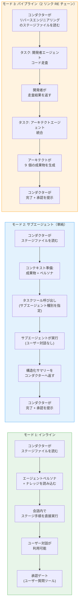
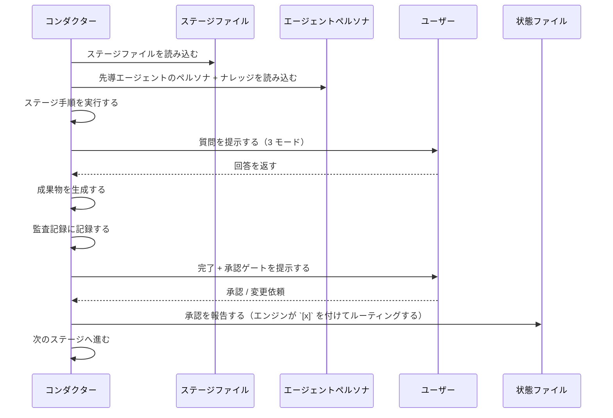
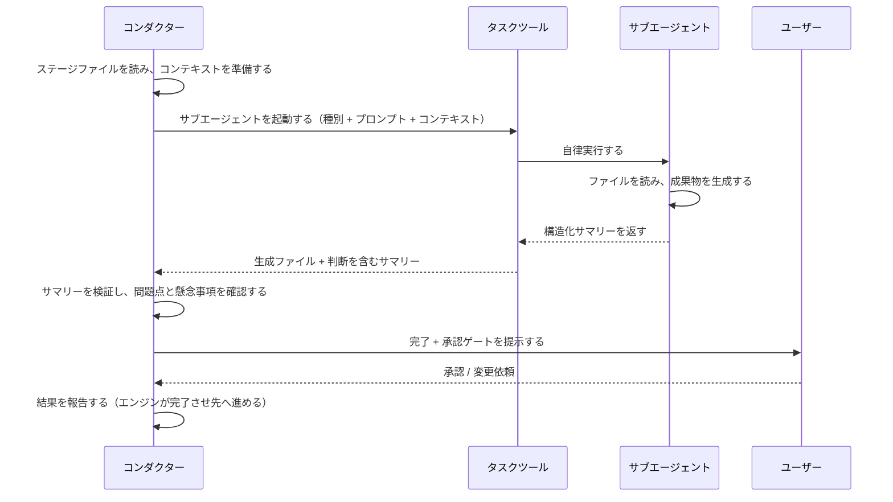

> **出典**: エンジンとコンダクター（`.claude/tools/aidlc-orchestrate.ts` と `.claude/skills/aidlc/SKILL.md`）およびその周辺ファイルから導出。

<a id="overview"></a>
## 概要

AI-DLC はハイブリッド実行モデルを採用します。いくつかのステージはインラインで実行され（コンダクターがエージェントペルソナを読み込み、会話内で直接実行する）、別のステージは Claude Code のタスクツール経由でサブエージェントへ委譲されます。インラインステージはユーザーとの対話（質問、確認、承認）を支えます。サブエージェントステージは自律的に実行され、構造化サマリーを返します。

```mermaid
graph LR
    subgraph INITIALIZATION["初期化 (0.1-0.3)"]
        Z1["ワークスペーススキャフォールド"]
        Z4["状態初期化"]
        Z1 -.->|"3 ステージ"| Z4
    end

    subgraph IDEATION["アイデエーション (1.1-1.7)"]
        I1["インテント取得"]
        I7["承認とハンドオフ"]
        I1 -.->|"7 ステージ"| I7
    end

    subgraph INCEPTION["インセプション (2.1-2.8)"]
        N1["リバースエンジニアリング"]
        N7["デリバリープランニング"]
        N1 -.->|"8 ステージ"| N7
    end

    subgraph CONSTRUCTION["コンストラクション (3.1-3.7)"]
        C1["機能設計"]
        C7["CI パイプライン"]
        C1 -.->|"ユニットごとに 7 ステージ"| C7
    end

    subgraph OPERATION["オペレーション (4.1-4.7)"]
        O1["デプロイメントパイプライン"]
        O7["フィードバックと最適化"]
        O1 -.->|"7 ステージ"| O7
    end

    Z4 -->|"自動進行"| I1
    I7 -->|"検証ゲート 1"| N1
    N7 -->|"検証ゲート 2"| C1
    C7 -->|"検証ゲート 3"| O1
    O7 -.->|"フィードバックループ"| I1

    style INITIALIZATION fill:#f3e5f5,stroke:#9c27b0
    style IDEATION fill:#e8f5e9,stroke:#4caf50
    style INCEPTION fill:#e3f2fd,stroke:#2196f3
    style CONSTRUCTION fill:#fff3e0,stroke:#ff9800
    style OPERATION fill:#fce4ec,stroke:#e91e63
```



<a id="five-layers"></a>
## 5 層

**ルール**（`rules/`） -- 組織とプロジェクトのガードレールです。自己学習型であり、人間の修正は永続的な振る舞いルールになります。合計およそ 35 行だけに抑えられており、AI-DLC 以外の会話でコンテキストが膨らむのを避けています。

**エージェント**（`agents/*.md`） -- 11 個のフラットなエージェントファイルで、各ファイルがロール、責務、ステージ所有、コラボレーションパターン、Claude Code ツール、ナレッジ読み込み順を持つドメイン専門家ペルソナを定義します。すべて `disallowedTools: Task` を持ち、委譲するのはコンダクターだけです。

**ナレッジ**（`knowledge/`） -- 2 層の方法論リファレンスです。
- `aidlc-shared/` -- 原則、検証、ブラウンフィールド保護策、**監査イベント分類体系**（正準イベントレジストリ）、状態テンプレート
- `aidlc-<agent>-agent/` -- エージェントごとの方法論ファイル（アーキテクチャパターン、テスト戦略など）

**スキル**（`skills/aidlc/`） -- オーケストレーターのエントリポイント（`SKILL.md`）、ステージプロトコルファイル（`stage-protocol.md`, `stage-protocol-recovery.md`, `stage-protocol-governance.md`）、そして 5 つのフェーズディレクトリ（`stages/initialization/`, `stages/ideation/`, `stages/inception/`, `stages/construction/`, `stages/operation/`）にまたがる 32 個のステージファイルです。

**フック**（`hooks/`） -- 監査出力（書き込み・編集後のツール使用時）、セッションライフサイクル（開始・終了）、状態同期（タスク更新後のツール使用時）、状態検証（圧縮前）、サブエージェント追跡（停止時）、ステータスライン描画のためのフレームワークフックです。フレームワークファイルはすべて `aidlc-*.ts` という接頭辞を持ちます。

<a id="configuration-layers"></a>
## 設定レイヤー

> **対象読者**: 新しい関心事（ルール、方法論の一片、センサー束縛、ドメインナレッジの事実）をどこへ置くべきか判断するコントリビューター。
> **正本としての位置付け**: これはルーティング原理です。コードとこの節が食い違う場合は、この節が正であり、コードの分類が誤っています。

このリポジトリの設定は、1 つではなく**2 つの直交軸**に沿って分割されます。

<a id="axis-1--who-authors-it"></a>
### 軸 1 -- 誰が著述するか?

- **フレームワーク著述** -- AI-DLC 配布物に同梱されます。すべてのプロジェクトで内容は同じです。フレームワークのリリース時に更新されます。ユーザーが自分のワークスペースで編集することはありません。
- **チーム著述** -- 人間が書くものです（または、このワークスペースで動くステージが書き、その後に人間が確認したもの）。このプロジェクト固有であり、このワークスペース内ではワークフローをまたいで永続します。編集可能です。

<a id="axis-2--when-is-it-consumed"></a>
### 軸 2 -- いつ消費されるか?

- **継続的に読み込まれる（ハーネス設定）** -- セッション開始時に読まれ、このワークスペースで走るあらゆるワークフローのすべてのステージで利用可能です。`.claude/` 配下にあります。
- **ワークフロー単位の成果物** -- 特定ステージが出力として生成し、後続ステージが入力として読むものです。インテントの記録ディレクトリ（`aidlc/spaces/<space>/intents/<YYMMDD>-<label>/`。以下では `<record>/` と表記）に置かれます。ワークフローの実行ごとに再生成されます。

<a id="the-four-quadrants"></a>
### 4 つの象限

2 つの軸を掛け合わせると 4 つの象限になります。3 つは使われ、1 つは意図的に空です。

|  | フレームワーク著述 | チーム著述 |
|---|---|---|
| **継続的に読み込まれる**（ハーネス設定） | `.claude/skills/`, `.claude/agents/`, `.claude/knowledge/`, `aidlc/spaces/<active-space>/memory/org.md`, `aidlc/spaces/<active-space>/memory/phases/*.md`, `.claude/scopes/`, `.claude/tools/data/scope-grid.json`, `.claude/tools/data/stage-graph.json` | `aidlc/spaces/<active-space>/memory/team.md`, `aidlc/spaces/<active-space>/memory/project.md` |
| **ワークフロー単位の成果物** | *(設計上空)* | `<record>/aidlc-state.md`, `<record>/audit/*.md`（クローンごとの分割記録）, `<record>/<phase>/<stage>/*.md`, `.aidlc/worktrees/bolt-*/` |

フレームワークはワークフロー単位の成果物を生成しません。そうした出力は配布物とともに出荷しなければならず、その時点でそれはワークフロー出力ではなくフレームワーク著述のハーネス設定になるからです。この空セルは欠落ではなく、ルーティング規則の特徴です。

> **フレームワーク著述 = 上流から届くもの。プロジェクト内では不変として扱います。** これはバージョン管理やファイルシステムで強制されるわけではありません。`.claude/` は編集可能な領域であり、`org.md` や `phases/*.md` をその気になれば編集できます。ただし慣例は、フレームワーク既定値を直接書き換えるのではなく、`team.md` / `project.md`（右側のセル）で上書きすることです。そうすればレビュー時にオーバーライドが可視化され、フレームワークのアップグレードもきれいに通り、同じフレームワークバージョンを共有する複数プロジェクト間のドリフトも防げます。

<a id="boundary-tests-for-placing-a-new-concern"></a>
### 新しい関心事を配置するための境界テスト

新しい関心事が来たとき、配置先は次の 2 つの問いで決まります。

1. **すべてのプロジェクトで同じ内容か、それともプロジェクト固有か?** フレームワーク著述かチーム著述か。
2. **毎セッション、エージェントコンテキストへ読み込まれるか、それとも特定ステージだけが読むか?** ハーネス設定かワークフロー単位の成果物か。

具体例:

- *「常に既定ブランチへスカッシュマージする」* -- プロジェクト固有です（ほかのチームはリベースを使う）し、継続的に読み込まれます（コンダクターは毎回のボルトマージでそれを読みます）。置き場所は `aidlc/spaces/<active-space>/memory/team.md` です。
- *「サービスレイヤーでは常に成功値またはエラー値を返し、例外は絶対に投げない」* -- プロジェクト固有で、継続的に読み込まれます（エージェントが毎回のコード生成で読みます）。置き場所は `aidlc/spaces/<active-space>/memory/project.md` です。
- *「推奨ブランチ戦略はトランクベース開発である」* -- すべてのプロジェクトで同じ内容（フレームワークの見解）であり、継続的に読み込まれます（デリバリープランニングで読まれます）。置き場所は `aidlc/spaces/<active-space>/memory/org.md` です。
- *「一般的な 5 つのブランチ戦略とそのトレードオフ」* -- すべてのプロジェクトで同じ内容（フレームワークリファレンス）であり、継続的に読み込まれます（分岐戦略を発見するときにパイプラインデプロイ担当エージェントが読みます）。置き場所は `.claude/knowledge/aidlc-pipeline-deploy-agent/branching-strategies.md` です。
- *「この実行の要求分析」* -- プロジェクト固有で、ワークフロー単位です（各実行が新しい分析を生みます）。置き場所は `<record>/inception/requirements-analysis/` です。
- *「コンストラクション途中のボルト 1 のワークツリー状態」* -- プロジェクト固有で、ワークフロー単位です（各ボルトごとに再生成されます）。置き場所はボルトワークツリー側の記録ディレクトリのコピー、`.aidlc/worktrees/bolt-1/<record>/aidlc-state.md` です。

<a id="sub-categories-of-harness-config-top-row"></a>
### ハーネス設定（上段）の下位分類

上段はさらに**内容の形**で分割されます。

- **フレームワークのハーネスメカニクス** → メタデータ / JSON。ワークフロー順序、ステージ定義、成果物生成、ゲート意味論。ツールが決定論的に読みます。配置先は `.claude/skills/`, `.claude/tools/data/` です。
- **フレームワークのドメインリファレンス** → `.claude/knowledge/aidlc-<agent>-agent/` 配下のエージェント KB 散文。各ドメインにおける選択肢のメニュー（5 つのブランチ戦略、デプロイメントパターン、テスト方法論）。必要になった時に所有エージェントが読みます。
- **フレームワークの方法論既定値** → `aidlc/spaces/<active-space>/memory/org.md` にある散文。チームが別の確認をしない限りフレームワークが推奨する内容です。チームの声で書かれます（チームが上書きしないなら、組織層の既定値がそのままチームの声になるため）。
- **チームのプラクティス** → `aidlc/spaces/<active-space>/memory/team.md` にある散文。チームが選んだやり方、つまり「これが私たちの働き方」です。プラクティス発見の確認ゲートによって内容が入ります。エージェントは意思決定点で読みます（デリバリープランニングはブランチ戦略を読み、コンダクターは `SKILL.md` のウォーキングスケルトン方針を読みます）。
- **プロジェクトオーバーライド** → `aidlc/spaces/<active-space>/memory/project.md` にある散文。チーム層と組織層の既定値を上書きする、プロジェクト固有の修正です。これもプラクティス発見の確認ゲートによって内容が入ります。
- **ガードレール**（`## Forbidden`, `## Mandated`, `## Corrections` セクション） -- `org.md`, `team.md`, `project.md` に存在します。エージェント向けの是正ルール、つまり `ALWAYS X`, `NEVER Y` です。継続的にエージェントコンテキストへ読み込まれます。

<a id="what-not-to-put-in-claude-directly"></a>
### `.claude/` 直下へ置いてはいけないもの

設定のように見えても、そうではないケースが 2 つあります。

- **永続的なリポジトリ分析出力。** リバースエンジニアリングの 9 つのブラウンフィールド成果物（`code-structure.md`, `architecture.md` など）は、1 つのリポジトリに対する最新の走査を記述するものです。`.claude/` やインテントの記録ではなく、`aidlc/spaces/<active-space>/codekb/<repo>/` に置かれます。リバースエンジニアリングは該当する各ワークフローで再実行され、そのリポジトリ単位の共有ナレッジを更新します。
- **実行状態。** `aidlc-state.md` ファイルは、ワークフロー単位の現在時点の真実です。`.claude/` ではなくインテントの記録ディレクトリに属します。`audit/` の分割記録も同様です。

<a id="cross-row-promotion--the-practices-discovery-exception"></a>
### 行をまたぐ昇格 -- プラクティス発見の例外

ほとんどのステージは 1 行だけに書き込みます。少数のステージは両方の行に書き込みますが、その行またぎ書き込みはチームの確認によってゲートされます。**これを行う唯一のステージがプラクティス発見（インセプション 2.2）です。** その出力は次のとおりです。

- `<record>/inception/practices-discovery/team-practices.md` -- ワークフロー単位の監査証跡（下段）。
- 確認後、内容はスペースメモリ層へコピーされます。`aidlc/spaces/<active-space>/memory/team.md` と `memory/project.md` の両方、つまりチーム著述のハーネス設定（右上セル）です。

監査証跡側のコピーは、この実行で何が確認されたかを証明します。`.claude/` 側のコピーは、今後のすべてのワークフローで読み込まれるチームの常設設定になります。

このパターン（走査 → 下書き → 確認 → 公開）は、構造としてはリバースエンジニアリングに一致します。違いは**結果**です。リバースエンジニアリングの確認は単に「この走査は正確だ」を意味しますが、プラクティス発見の確認は「フレームワークがこの文言を私たちの常設設定へ書き込み、今後のすべてのワークフローで読み込んでよい」を意味します。

この確認ゲートがなければ、フレームワークがチームの口を勝手に借りることになります。しかもその言葉はワークフローをまたいで永続します。ゲートがあることで、最終的には常にチーム自身がそれを書いたことになります。

このパターンはまれであり、意図的であるべきです。使ってよいのは次の 3 条件がすべて真のときだけです。
1. そのステージの出力が、チーム、プロジェクト、またはワークスペースに関する構成的真実である。
2. その真実が、この実行の下流ステージだけでなく、今後のすべてのワークフロー実行へ影響すべきである。
3. チームがその真実の著述者になる意思を持ち、単にフレームワークに書かせるのではなく、ゲートでレビューして承認する。

3 条件のどれか 1 つでも偽なら、既定はワークフロー単位専用です。

<a id="cross-references"></a>
### 参照先

- [エージェントシステム](/reference/agent-system) -- エージェントファイル構造（左上セルのメカニクス）。
- [ナレッジシステム](/reference/knowledge-system) -- `knowledge/` の 2 層構造。
- [ステージ定義](/reference/stage-definition) -- ステージメタデータ仕様（ハーネスメカニクスのフォーマット）。
- [ステージプロトコル](/reference/stage-protocol) -- ステージごとの実行規則。

<a id="execution-models"></a>
## 実行モデル

**インラインステージ** -- コンダクターは、ペルソナの枠組みとして先導エージェントのフラットファイル（例: `agents/aidlc-architect-agent.md`）と `knowledge/[agent]/` 内のナレッジを読み、そのうえで会話内でステージを直接実行します。これにより、質問、曖昧さの解消、承認前の成果物反復といったリアルタイムのユーザー対話が可能になります。

28 のステージがインライン実行です。これには 3 つすべての初期化ステージ（ワークスペーススキャフォールド、ワークスペース検出、状態初期化 — すべて `aidlc-utility intent-birth` 内で決定論的に実行）、すべてのアイデエーションステージ、5 つのインセプションステージ（要件分析、精緻化モックアップ、アプリケーション設計、ユニット生成、デリバリープランニング）、6 つのコンストラクションステージ（機能設計、非機能要件、非機能設計、インフラ設計、ビルドとテスト、CI パイプライン）、およびすべてのオペレーションステージが含まれます。注記として、ビルドとテスト（3.6）は各ユニットごとではなく、すべてのユニット完了後に 1 回だけ実行されます。

**サブエージェントステージ** -- コンダクターはコンテキスト（先行成果物、プロジェクト記述、ワークスペースの所見）を準備し、Claude Code のタスクツールのサブエージェントへ委譲します。サブエージェントは自律実行し、構造化サマリーを返します。これは、実行中のユーザー対話なしで、集中した独立作業に向くステージで使われます。サブエージェント呼び出しが失敗した場合、コンダクターはコンテキストを減らしたプロンプトで 1 回再試行し、それでもだめならフォールバックとしてインライン実行か保留して再訪をユーザーへ提示します。

ディスパッチ実行を使うステージは 4 つです。リバースエンジニアリング（2.1、`mode: pipeline` — 開発者の走査の後にアーキテクトが統合と書き込みを行う）、プラクティス発見（2.2、`mode: subagent` — パイプラインデプロイのリードが下書きし、互いに見えない品質 / 開発者 / DevSecOps のスポークが検査し、人間インタビューを経てリードが統合する）、ユーザーストーリー（2.4、`mode: mob` — プロダクトリードの下書きにデザイン / 開発者 / 品質のコントリビューションラウンドが続く）、コード生成（3.5、集中した開発者サブエージェント）です。トポロジー全体は 28 インライン / 2 サブエージェント / 1 パイプライン / 1 モブです。ワークスペース検出（0.2）はサブエージェントではなく、`aidlc-utility intent-birth` の内部で決定論的に実行されます。



<a id="conductor-inline-stage-execution"></a>
### コンダクターのインラインステージ実行



<a id="conductor-subagent-delegation"></a>
### コンダクターのサブエージェント委譲



<a id="source-vs-distribution-one-core-many-harnesses"></a>
## ソース対ディストリビューション（1 つのコア、複数のハーネス）

このフレームワークは**1 回だけ著述し、ハーネスごとに生成**されます。現在は Claude Code、Kiro CLI、Codex CLI、そしてそれを移植できるあらゆる CLI が対象です。
人手で著述するソースはハーネス中立な `core/` と、CLI ごとの薄い `harness/<name>/`
サーフェスから成り、`bun scripts/package.ts` がコミット済みかつ
差分監視付きの `dist/<harness>/` ツリーを再生成します。

```
core/                  # hand-authored, harness-neutral (tools, aidlc-common,
                       #   agents, rules, scopes, sensors, knowledge, hooks,
                       #   3 session skills); prose uses the {{HARNESS_DIR}} token
harness/<name>/        # per-CLI surface: manifest.ts + orchestrator skill +
                       #   harness files (+ emit.ts for codex)
scripts/package.ts     # the build: copy core (token→.claude/.kiro/.codex) +
                       #   harness, compile the graph, generate runners, emit;
                       #   `--check` is the byte-parity drift guard
dist/<harness>/        # GENERATED + committed: claude/.claude, kiro/.kiro,
                       #   codex/{.codex,.agents} — never hand-edited
```

`core/` の `.ts` は変換なしでバイトコピーされます。ランタイムの `harnessDir()` という継ぎ目
（`core/tools/aidlc-lib.ts`）は、ハードコードした一覧ではなくツール自身のパスから出荷済みレイアウトを
実行時に導出するため、新しいハーネスを追加してもここへの編集は不要です。またルールディレクトリの名前変更は、
ツリーごとに生成される `tools/data/harness.json` により出荷され、`rulesSubdir()` の継ぎ目がそれを読みます。
1 セットのツールソースがすべてのハーネスで動きます。詳しくは
[新しいハーネスへの移植](/harness-engineering/porting-to-a-new-harness) を参照してください。

<a id="directory-structure"></a>
## ディレクトリ構造

出荷される Claude ディストリビューション（`dist/claude/.claude/`。`core/` + `harness/claude/` からバイト単位で再生成）:

```
dist/claude/.claude/
+-- CLAUDE.md
+-- settings.json
+-- hooks/
|   +-- aidlc-audit-logger.ts
|   +-- aidlc-sync-statusline.ts
|   +-- aidlc-validate-state.ts
|   +-- aidlc-log-subagent.ts
|   +-- aidlc-session-start.ts
|   +-- aidlc-session-end.ts
|   +-- aidlc-statusline.ts
+-- rules/
|   +-- aidlc.md                  # @-import stub -> ../../aidlc/spaces/<active-space>/memory/ (NOT a copy; re-pointed in place on `space` switch)
+-- agents/
|   +-- aidlc-product-agent.md
|   +-- aidlc-design-agent.md
|   +-- aidlc-delivery-agent.md
|   +-- aidlc-architect-agent.md
|   +-- aidlc-aws-platform-agent.md
|   +-- aidlc-compliance-agent.md
|   +-- aidlc-devsecops-agent.md
|   +-- aidlc-developer-agent.md
|   +-- aidlc-quality-agent.md
|   +-- aidlc-pipeline-deploy-agent.md
|   +-- aidlc-operations-agent.md
+-- knowledge/
|   +-- aidlc-shared/
|   |   +-- ai-dlc-principles.md
|   |   +-- verification.md
|   |   +-- brownfield.md
|   |   +-- audit-format.md
|   |   +-- state-template.md
|   |   +-- knowledge-readme-template.md
|   +-- aidlc-product-agent/
|   |   +-- requirements-guide.md
|   |   +-- product-guide.md
|   |   +-- functional-design-guide.md
|   |   +-- requirements-elicitation.md
|   |   +-- prioritization-frameworks.md
|   |   +-- user-story-patterns.md
|   |   +-- market-research-methods.md
|   +-- aidlc-architect-agent/
|   |   +-- architecture-guide.md
|   |   +-- nfr-design-guide.md
|   |   +-- ddd-patterns.md
|   |   +-- architecture-patterns.md
|   |   +-- nfr-design-patterns.md
|   |   +-- adr-template.md
|   +-- aidlc-developer-agent/
|   |   +-- code-analysis-guide.md
|   |   +-- code-generation-guide.md
|   |   +-- code-generation-patterns.md
|   |   +-- api-design-guide.md
|   |   +-- data-modelling-patterns.md
|   |   +-- re-artifacts.md
|   +-- [... 8 more agent knowledge dirs]
+-- skills/
    +-- aidlc/
        +-- SKILL.md
        +-- stage-protocol.md
        +-- stage-protocol-recovery.md
        +-- stage-protocol-governance.md
        +-- stages/
            +-- initialization/
            |   +-- workspace-scaffold.md
            |   +-- workspace-detection.md
            |   +-- state-init.md
            +-- ideation/
            |   +-- intent-capture.md
            |   +-- market-research.md
            |   +-- feasibility.md
            |   +-- scope-definition.md
            |   +-- team-formation.md
            |   +-- rough-mockups.md
            |   +-- approval-handoff.md
            +-- inception/
            |   +-- reverse-engineering.md
            |   +-- practices-discovery.md
            |   +-- requirements-analysis.md
            |   +-- user-stories.md
            |   +-- refined-mockups.md
            |   +-- application-design.md
            |   +-- units-generation.md
            |   +-- delivery-planning.md
            +-- construction/
            |   +-- functional-design.md
            |   +-- nfr-requirements.md
            |   +-- nfr-design.md
            |   +-- infrastructure-design.md
            |   +-- code-generation.md
            |   +-- build-and-test.md
            |   +-- ci-pipeline.md
            +-- operation/
                +-- deployment-pipeline.md
                +-- environment-provisioning.md
                +-- deployment-execution.md
                +-- observability-setup.md
                +-- incident-response.md
                +-- performance-validation.md
                +-- feedback-optimization.md
```

<a id="the-workspace-spaces-and-intents"></a>
### ワークスペース: スペースとインテント

上のツリーは**エンジン**であり、ハーネス固有で、ユーザーが閲覧するものではありません。
エンジンが**実行時に読み書きする**ものはすべて、プロジェクトルートの別個の中立ディレクトリ
`aidlc/` に置かれ、2 段コンテナとして整理されます。
**スペース → インテント** です（利用者向けの導入はユーザーガイドの
[スペースとインテント](/guide/spaces-and-intents) を参照。この節は
エンジンが解決対象とするデータモデルです）。

```
aidlc/                                    # neutral, harness-independent, committed to git
+-- active-space                          # cursor: active space name (gitignored, per-user)
+-- spaces/
    +-- default/                          # one space per team; "default" is auto-resolved
        +-- memory/                        # the method — org.md/team.md/project.md, phases/, templates/
        +-- knowledge/                     # space-level domain knowledge (free-form)
        +-- codekb/<repo>/                 # per-repo code knowledge base
        +-- intents/
            +-- active-intent              # cursor: active intent record dir (gitignored, per-user)
            +-- intents.json               # the registry: [{ uuid, slug, dirName, scope, repos, status }]
            +-- <YYMMDD>-<label>/          # one record dir per intent (date-prefixed, short kebab label; UUIDv7 carries identity in intents.json)
                +-- aidlc-state.md          # per-intent workflow state
                +-- audit/<host>-<clone>.md # per-clone audit shards (glob-and-merge by timestamp)
                +-- <phase>/<stage>/*.md    # artifacts + the per-stage memory.md diary
```

**解決。** 利用者ごとに持つ 2 つのカーソルがコンテキストを選択します。どちらも決してエラーにはならず（カーソルがなければ既定へフォールバックします）。

- **スペース** -- `aidlc/active-space`。優先順位は `explicit arg > cursor > "default"` です
  （`DEFAULT_SPACE`, `core/tools/aidlc-lib.ts:285`; 解決器 `activeSpace()`,
  `aidlc-lib.ts:354-366`）。`listSpaces()` はディスク上に何もなくても常に `default` を報告します
  （`aidlc-lib.ts:713-728`）。
- **インテント** -- `aidlc/spaces/<space>/intents/active-intent`。優先順位は、明示指定の引数、既存の状態ファイルを指すカーソル、単独のインテント、インテントなしの順です（アクティブインテントを解決する内部実装による）。インテントなしは
  「まだ記録が存在しない」を意味し、オーケストレーターが最初のインテントを自動誕生させる合図になります。

パスヘルパーである `intentsDir`, `knowledgeDir`, `codekbDir`（`aidlc-lib.ts`）、
および `memoryDirFor`（`aidlc-graph.ts:234`）は、いずれもスペース引数を既定で
`activeSpace(projectDir)` にするため、AI-DLC 自身の解決器もカーソルに追従します。
`/aidlc space <name>` でスペースを切り替えると、
各ハーネス固有のルール取り込み（上で述べた Claude の `@` による取り込み用スタブ、
Kiro のリソースグロブ、Codex のルールディレクトリ）も切り替え先スペースの
`memory/` を指すよう再ポイントされます。`default` では再ポイントはバイト単位で同一の無操作なので、
単一チームのコミット済みツリーが無駄に書き換わることはありません。

**コミット対象と無視設定。** `aidlc/` はチームで作業を共有するためチェックインされます。
その分割（`harness/claude/dot-gitignore:34-54`）は次のとおりです。2 つのカーソル
（`active-space`, `active-intent`）、クローンごとのランタイム（`.aidlc-clone-id`,
`.aidlc-sessions/`）、派生状態（`runtime-graph.json`、記録配下の `.aidlc-*`）
は **無視対象**です。一方で、方法論（`memory/**`）、ナレッジ（`knowledge/**`,
`codekb/**`）、`intents.json` レジストリ、各記録の `aidlc-state.md`、`audit/`
の分割記録、成果物は **コミット対象**です。監査はクローンごとの分割記録
（`audit/<host>-<clone>.md`）としてコミットされます。これはバージョン管理が同時追記を
マージしなくて済むようにするためで、意図的に `merge=union` 属性はありません。

<a id="key-design-decisions"></a>
## 主要な設計判断

1. **ハイブリッド実行モデル（インライン + ディスパッチトポロジー）** -- ユーザー対話（質問、曖昧さの解消、承認反復）が必要なステージは、コンダクターが会話へ直接アクセスできるインラインで走ります。集中した自律作業（コード走査、コード生成）や本物のマルチエージェント協働（モブ）を行うステージは、ステージの `mode` トポロジーに従ってサブエージェントへディスパッチされます。純サブエージェントモデルではステージ途中のユーザー対話が不可能になり、純インラインモデルでは集中したエージェント特化や独立した視点の利点を活かせません。

2. **インラインステージ向けエージェントペルソナ** -- インラインステージでは、コンダクターはサブエージェントへ委譲する代わりに、視点付けのためにエージェントのフラットファイルをコンテキストとして読み込みます。これにより、ドメイン専門家としてのフレーミング（アプリケーション設計中にコンダクターがアーキテクトのように考える）という利点を得つつ、サブエージェントへのコンテキスト転送コストやユーザー対話喪失を避けられます。

3. **2 リンクのリバースエンジニアリングパイプライン** -- リバースエンジニアリング（`mode: pipeline`）では、まずコード走査のための開発者サブエージェント、次に統合と成果物書き込みのためのアーキテクトサブエージェントを使います。コンダクターがバスとなり（Claude Code ではサブエージェントがサブエージェントを起動できません）、開発者のコード走査結果をアーキテクトへ渡します。これはチェーントポロジーが設計どおりに機能している姿です。

4. **`aidlc-state.md` による状態追跡** -- 単一の Markdown 状態ファイルが、ステージ完了状況、現在ステータス、ワークスペース文脈、スコープ設定、実行計画、ランタイム状態（改訂回数）を追跡します。ステージは結果をオーケストレーションエンジンへ報告します。エンジンの内部状態遷移がこのファイルを更新し、ライフサイクル監査行を出力し、原子的にルーティングします。ステージの散文がライフサイクルのチェックボックスを直接編集することは決してありません。ツール使用後フックが、書き込みのたびに状態ファイル構造を検証します。ステージレベルのタスク ID は状態ファイルへ保存せず、実行時に `TaskList` から解決されます（`"Inception - Requirements Analysis"` のような件名で照合）。これはコンテキスト圧縮後でも実際のタスクシステム状態を反映するため、より堅牢です。

5. **共有契約としてのステージプロトコル** -- 32 個すべてのステージは、承認ゲート、質問フォーマット（3 モード: ガイド、ファイル編集、チャット）、完了メッセージ、状態追跡、エラー回復、変更ハンドリング、§13 の学習儀式、フェーズ境界検証のために `stage-protocol.md` に従います。これにより、各ステージファイルへ同じ指示を繰り返し書かずに、一貫した振る舞いを保証します。

6. **2 層ナレッジアーキテクチャ** -- 方法論ナレッジはフレームワーク同梱の `knowledge/` に出荷されます（共有原則 + エージェント別方法論）。ユーザー管理のチームナレッジは、スペースレベルの `aidlc/knowledge/`（そのスペースの `intents/` の兄弟）に置かれ、エンジンが空で作成し、チームが中身を入れます。これにより、フレームワークのアップグレードとチームのカスタマイズが分離されます。

7. **フラットなエージェントファイル** -- 各エージェントは `agents/` 内の単一 `.md` ファイルです（`agent.md` + `knowledge/` を持つサブディレクトリではありません）。これにより構造が単純になり、エージェントが見つけやすくなります。方法論ナレッジは `knowledge/[agent]/` に分離して置かれます。

8. **スコープ駆動の適応深度** -- 9 個の命名済みスコープ（エンタープライズ、機能、MVP、概念実証、バグ修正、リファクタリング、インフラ、セキュリティパッチ、ワークショップ）と自動検出が、どのステージをどの深さで実行するかを決めます。各スコープは `.claude/scopes/aidlc-<name>.md` ファイル（アイデンティティ）であり、所属は各ステージのメタデータ `scopes:` タグです。これはコンパイル時に EXECUTE/SKIP グリッド（`.claude/tools/data/scope-grid.json`、正本）へ転置され、`SKILL.md` 内のサマリーテーブルにもコンパイルされます（参考用）。自然言語のキーワードからスコープへの推論は、各スコープ `.md` メタデータの `keywords` を読みます。ユーザーはどの承認ゲートでも上書きできます。

9. **最小限のルール** -- ガードレールだけ（合計およそ 35 行）がアクティブなスペースメモリ層（`aidlc/spaces/<active-space>/memory/`。`.claude/rules/aidlc.md` の `@` による取り込み用スタブ経由で読み込まれる）に置かれます。それ以外（検証、ブラウンフィールド保護策、監査フォーマット、適応パターン）は `knowledge/aidlc-shared/` に置くか、`SKILL.md` / `stage-protocol.md` に埋め込みます。ルールは常に読み込まれるため、これにより AI-DLC 以外の会話でコンテキスト膨張を防げます。

10. **自己学習ループ** -- 人間がエージェントの振る舞いを修正すると、その修正は永続的なルールになり得ます。§13 の学習儀式（ツールが主体。`aidlc-learnings.ts` が候補を提示して永続化し、ユーザーが確認する）は、確認済み学習を各プラクティスとしてアクティブなスペースメモリ層へ書き込みます。既定では `aidlc/spaces/<active-space>/memory/project.md`、ワンクリックで `memory/team.md` へ昇格もできます。あるいはセンサーをスキャフォールドし、次のワークフローのコンパイルで適用されます。詳細は [ルールシステム](/reference/rule-system) を参照してください。

11. **フェーズ境界検証** -- トレーサビリティチェックはフェーズ遷移時に自動実行されます（初期化→アイデエーションの自動進行、アイデエーション→インセプション、インセプション→コンストラクション、コンストラクション→オペレーション）。これにより、要件から設計へのリンク欠落、孤立した成果物、不整合を、下流ステージが不完全な基盤の上に積み上がる前に捕捉します。

12. **フックベースの監査ロギング** -- 書き込み・編集操作に対するツール使用後フックが、成果物の作成と変更をインテントの `audit/` 分割記録へ自動記録します。圧縮前フックはコンテキスト圧縮前に状態ファイル構造を検証します。サブエージェント停止フックはサブエージェント完了を記録します。68 イベントの分類体系（`knowledge/aidlc-shared/audit-format.md` で定義。[状態機械](/reference/state-machine) にイベント発生元レジストリの説明あり）により事後分析が可能です。主要イベントには `STAGE_STARTED`, `STAGE_COMPLETED`, `DECISION_RECORDED`, `SCOPE_CHANGED`, `RULE_LEARNED` があります。

13. **ネストした委譲なし** -- コンダクター（`SKILL.md`）がすべてのエージェントタスク呼び出しを行います。エージェント同士が互いを呼び出したり、サブエージェントを起動したりはしません。これにより、委譲グラフがフラットでデバッグしやすく保たれます。

14. **4 つのセッション再開オプション** -- チェックポイントから再開、現在ステージをやり直し、特定ステージへジャンプ、または新規開始（アーカイブ確認付き）です。これにより、ユーザーは状態ファイルを手編集せずに、ワークフローの進行を細かく制御できます。

15. **ステージ / フェーズジャンプコマンド** -- `--stage <slug|#>` と `--phase <name|#>` は、特定のステージまたはフェーズへ直接ジャンプします。`--scope <scope>` はワークフロースコープを設定または上書きします。前方ジャンプは中間ステージを `[S]`（スキップ済み）としてマークし、後方ジャンプは下流ステージを `[ ]` に戻して対象から前方再生します。相互に組み合わせ可能です。

<a id="directory-structure-tests"></a>
## ディレクトリ構造: テスト

```
tests/
+-- run-tests.ts              # Native Bun test runner (all levels, flag-selectable)
+-- run-tests.sh              # POSIX compatibility wrapper for run-tests.ts
+-- gen-coverage-registry.ts  # Generates .coverage-registry.json from covers: headers
+-- .coverage-registry.json   # Machine-checked coverage index (units x test files)
+-- .coverage-ratchet.json    # Coverage floor the registry --check enforces
+-- README.md                 # Discoverable suite index + quick reference
+-- lib/
|   +-- bun-junit-to-meta.ts  # Bun JUnit -> runner metadata glue
+-- harness/                  # Shared TS helpers: fixtures, sdk-drive, tui-drive, windows/
+-- fixtures/                 # State files, stub projects, RE artifacts
+-- hooks/
|   +-- pre-commit            # Git hook: runs the default levels (smoke + unit + integration)
+-- smoke/                    # Level: structural validation (no LLM, seconds)
+-- unit/                     # Level: single-component isolation (no LLM)
+-- integration/              # Level: cross-component contracts + live stage/CLI utilities
+-- e2e/                      # Level: full lifecycle, worktree, rendered terminal journeys
```

あらゆるテストは `bun` で走る `t*.test.ts` ファイルであり、シェルテスト
ファイルはありません。4 つのディレクトリが、このスイートの 4 レベルを構成します。

<a id="testing"></a>
## テスト

このプロジェクトのテストスイートは**完全に TypeScript** 製で（`.sh` テストファイルは 0）、
`smoke`, `unit`, `integration`, `e2e` の 4 レベルに整理されています。これは
古典的な 3 層ピラミッド（スモーク + ユニット = L1 プロトコル、統合 =
L2 ステージ、エンドツーエンド = L3 受け入れ）に対応します。すべて TS であることで、スイートは
構造上クロスプラットフォームになります。つまり、同じファイルが主要なデスクトップ・サーバー OS とネイティブ
Windows で同一に動きます。テストはファイル存在確認からレンダリング済みターミナルの
一連の操作まであらゆるものを検証し、フック、エージェント、ステージ、設定への変更が
リグレッションを持ち込まないことを保証します。

<a id="test-levels"></a>
### テストレベル

| レベル | ディレクトリ | 対象 |
|-------|-----------|----------------|
| **スモーク** (L1) | `tests/smoke/` | ファイル存在、エージェント / ステージ / プロトコル構造、`SKILL.md` グラフ整合性、`settings.json` スキーマ。欠落ファイルや誤命名ファイルを捕捉する高速な構造チェックです。LLM は使いません。 |
| **ユニット** (L1) | `tests/unit/` | 13 個のフック、CLI ツール、ステージ / エージェントのメタデータ、ナレッジインベントリ、オーケストレーションエンジンハンドラー、そのほか単一コンポーネント契約。各テストは 1 コンポーネントを隔離します。LLM は使いません。 |
| **統合** (L2) | `tests/integration/` | コンポーネント横断契約（スコープからステージへの対応、ステージとエージェントのクロスチェック、プロトコル準拠、監査 / ランタイムグラフのエンドツーエンド）と、`claude` CLI または SDK を通して駆動される実行中のステージ / CLI ユーティリティ。`claude` がなければ実行中のファイルはきれいにスキップされます。 |
| **E2E** (L3) | `tests/e2e/` | フルライフサイクルとワークツリープリミティブ、さらに実際のユーザー質問ゲートへ答えるとディスク状態が進むことを証明するレンダリング済みターミナル（`tui-drive.ts`）の一連の操作。実行中の一連の操作には `claude` + Bedrock 認証情報が必要で、`AIDLC_TUI_LIVE=1` の後ろにゲートされています。 |

完全なテスト戦略、網羅率レジストリ、テスト追加方法については [テスト](/reference/testing) を参照してください。

<a id="cross-references-1"></a>
## 参照先

- [オーケストレーター](/reference/orchestrator) -- `SKILL.md` の詳細
- [ステージプロトコル](/reference/stage-protocol) -- 振る舞い契約
- [エージェントシステム](/reference/agent-system) -- エージェント構造と設定
- [フックとツール](/reference/hooks-and-tools) -- フック実装
- [ナレッジシステム](/reference/knowledge-system) -- 2 層アーキテクチャ
- [図版集](/reference/diagrams) -- すべての Mermaid 図を 1 か所に集約
