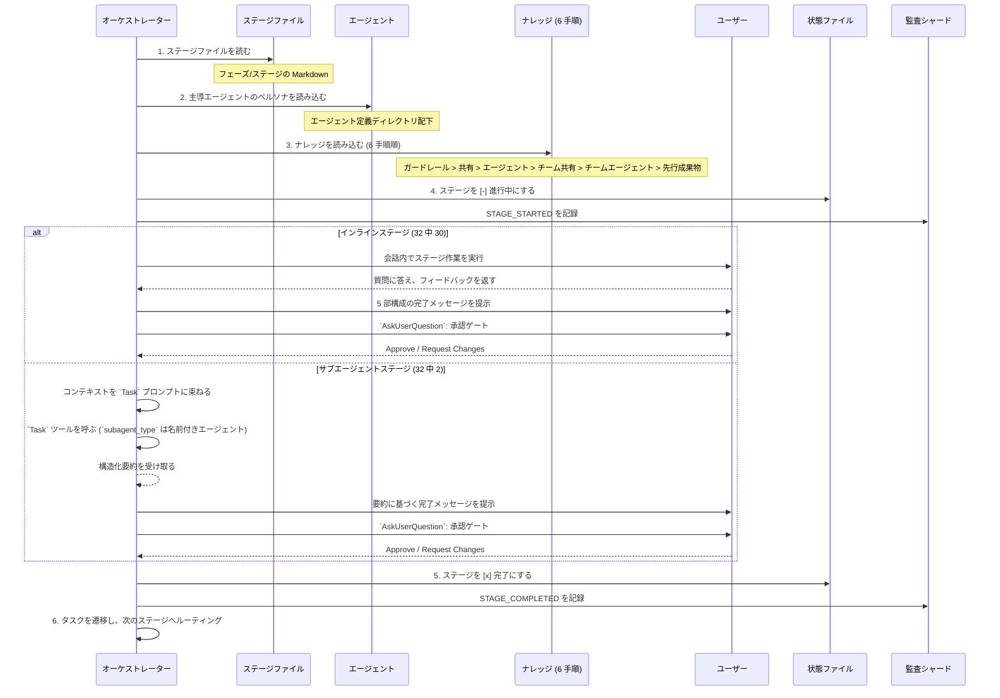
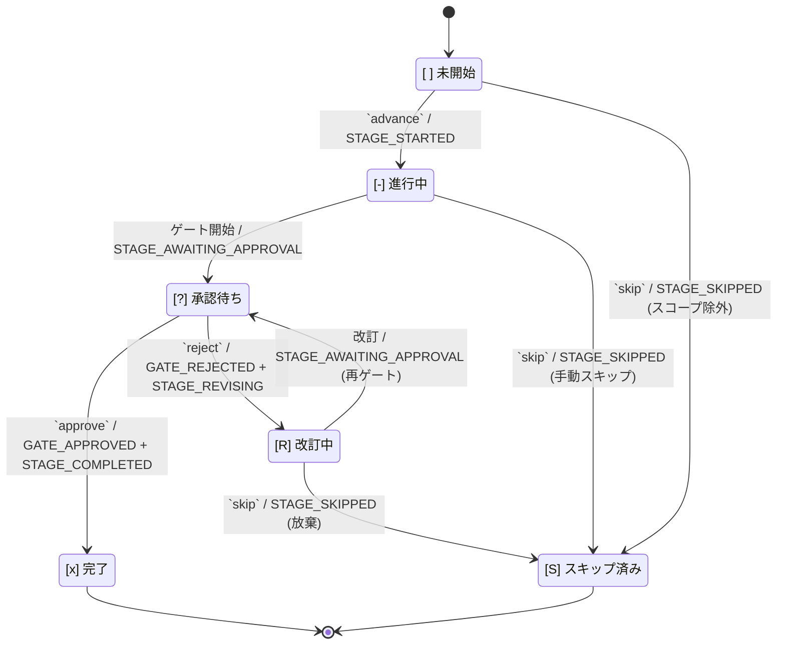

オーケストレーションは 2 つの要素に分かれます。決定論的な **エンジン**（`aidlc-orchestrate.ts`、サブコマンドは `next` / `report` / `park`）が、スコープ判定、ステージのルーティング、ジャンプ先の解決、再開および初期化のガード、ゲート状態、ワークフロー完了という、ステージ間のあらゆる判断を担い、各 `next` で型付きの **ディレクティブ**を出力します。**コンダクター**（`.claude/skills/aidlc/SKILL.md`、`/aidlc` 経由で起動）は、各ディレクティブに従って動く薄い転送ループです。指定されたステージを実行し、人間に質問し、スウォームをファンアウトして、結果を `report` で返します。`SKILL.md` は制御プレーンではありません。ルーティングの判断はエンジンと、それが読むコンパイル済みデータ（`tools/data/stage-graph.json`、`tools/data/scope-grid.json`）にあります。`SKILL.md` は、エンジンが指定した処理の内側での実行品質を担います。

この章では、ワークフローの振る舞いをコンダクター側から文書化します。対象は、エントリポイント、セッション管理、スコープからステージへの対応付け、ステージ実行と前進のプロトコル、意図的な逸脱点です。エンジンの内部、すなわち `next` / `report` 契約、型付きディレクティブ共用体、コンダクターのペルソナ、複数形スキル、スコープの形状、スウォーム審判については、[エンジンとスキルシステム](/reference/skill-system) を参照してください。利用者向けのコマンド使用法は、[ユーザーガイド -- CLI コマンド](/guide/cli-commands) を参照してください。

> **責務に関する注記。** この章で説明する振る舞い、たとえば引数解決、スコープ検出、ジャンプ検証、再開時の分岐は、すべて各 `next` ごとに **エンジン** が計算し、ディレクティブとしてコンダクターへ渡します。古い文で「オーケストレーターが X を行う」と書かれていた場合は、「エンジンが X を判断してディレクティブを出し、コンダクターがそれを実行する」と読み替えてください。判断ロジックは常に決定論的なツールコードであり、`SKILL.md` の文章ではありません。

> **パスの表記規則。** 各インテントの状態、監査証跡、成果物は、その **記録ディレクトリ**、すなわち `aidlc/spaces/<space>/intents/<YYMMDD>-<label>/` 配下にあり、以下では `<record>/` と表記します。監査証跡は `<record>/audit/` 配下にあるクローンごとのシャードディレクトリであり、単一ファイルではありません。

---

<a id="table-of-contents"></a>
## 目次

- [エントリポイント](#entry-points)
- [セッション管理](#session-management)
- [スコープからステージへの対応付け](#scope-to-stage-mapping)
- [ステージ実行エンジン](#stage-execution-engine)
- [ステージ前進プロトコル](#stage-advancement-protocol)
- [タスク追跡](#task-tracking)
- [意図的な逸脱点](#deliberate-deviations)
- [エラー処理](#error-handling)
- [付録 A: ステージグラフリファレンス](#appendix-a-stage-graph-reference)
- [付録 B: フックリファレンス](#appendix-b-hook-reference)
- [付録 C: 承認ゲートのパターン](#appendix-c-approval-gate-patterns)

---

<a id="entry-points"></a>
## エントリポイント

コンダクターはエンジンの最初の `next` に `$ARGUMENTS` をそのまま渡します。事前解析は行いません。エンジンがフラグと自由記述テキストを解析し、以下のどの呼び出しパターンに当たるかを解決して、対応するディレクティブを出力します。これらのパターンはエンジン側で解決される入力であり、コンダクター側の分岐ではありません。

<a id="aidlc-scope----explicit-scope"></a>
### `/aidlc [scope]` -- 明示スコープ

引数が既知の 9 つのスコープ（`enterprise`, `feature`, `mvp`, `poc`, `bugfix`, `refactor`, `infra`, `security-patch`, `workshop`）のいずれかに一致する場合:

新しいワークスペース（まだインテントがない、つまり `aidlc/spaces/*/intents/*/` 配下に `aidlc-state.md` がない状態）で明示的にスコープを指定すると、**最初のインテントが誕生します**。エンジンの `next` は、実行後に継続する `print` ディレクティブを出力し、`aidlc-utility.ts intent-birth --scope <scope>` を指名します（`--depth` / `--test-strategy` フラグがあれば、そのままそのコマンドへ渡します）。コンダクターはそれを実行し、最初のステージへ着地するために `next` を再実行します。裸の位置引数（`/aidlc bugfix`）でも明示フラグ（`/aidlc --scope bugfix`）でも、出力される誕生用の表示は同一です。何を作るかを説明する形（`/aidlc "build the auth service"`）でも誕生します。スコープ名も説明もない裸の `/aidlc` は誕生しません（環境変数や既定値で解決されたスコープは誕生の合図ではありません）。代わりに、何を作るかを説明するかスコープを名指しするよう促す、状態未作成エラーを出します。

1. `aidlc/spaces/<space>/memory/` からガードレールを読み込みます。
2. ユーザーへ "What would you like to build?" と尋ねます。
3. スコープからステージへの対応付けに従って、実行すべきステージを決定します。
4. 初期化フェーズ（ワークスペーススキャフォールド、ワークスペース検出、状態初期化）を、決定論的な `aidlc-utility init` 呼び出し 1 回として実行します。ウェルカムメッセージはセッション開始時に、`settings.json` の `companyAnnouncements` 経由で描画されます。
5. スコープ内のすべてのステージについて、ステージ単位のタスクを作成します。最初のステージは `in_progress`、残りは `pending` に設定されます。スコープ外のステージにはタスク自体が作られません。
6. 初期化後の最初のステージを開始します。

<a id="aidlc-freeform----ai-scope-detection"></a>
### `/aidlc [freeform]` -- AI スコープ検出

引数が自由記述テキスト（既知のスコープキーワードではない）である場合:

1. `aidlc/spaces/<space>/memory/` からガードレールを読み込みます。
2. キーワードパターンに照らしてインテントを分析します。
   - 修正・不具合・破損を示す語は `bugfix` に対応します
   - リファクタ・整理・単純化を示す語は `refactor` に対応します
   - インフラ・デプロイを示す語は `infra` に対応します
   - セキュリティ・脆弱性・パッチを示す語（および `CVE`）は `security-patch` に対応します
   - 概念実証・試作・スパイクを示す語は `poc` に対応します
   - 最小実用を示す語は `mvp` に対応します
   - それ以外はすべて既定で `feature` になります
3. 曖昧性解消ルール: テキストがスコープキーワード **も** 長めのプロジェクト説明（5 語超） **も**含む場合、その一致は偶発的とみなし、静かな既定値ではなくコンポーズ提案を発火します。
4. 明確なキーワード一致があれば、コンパイル済みグリッドからセレモニー名を引いて、ユーザーへ次を確認します。`Starting a "[scope]" workflow for: "[text]" - [N] of [T] stages, [G] approval gates. Confirm to proceed, name a different scope, or say "compose" for a tailored plan.`（構築ステージが作業単位ごとにファンアウトするスコープでは、作業単位ごとの句が追記されます。）
5. 一致なし / 文章が豊富な場合は、適応コンポーザーを提案します。コンポーザーエージェントが、そのタスク向けの EXECUTE/SKIP グリッドを人間ゲート付きで提案します（下の `compose` 入口を参照）。提案に含まれるスコープ例一覧にも件数が付きます（`bugfix = 7 of 32 stages, poc = 8, feature = all 32`）ので、選ぶ前に規模差が見えます。
6. 確認後は、明示スコープと同様に進みます。元の自由記述テキストは `aidlc-state.md` に `Initial Intent` として保存されます。
7. ユーザーが検出結果のスコープを上書きした場合は、ユーザーが選んだスコープを使います。

<a id="aidlc-compose----the-adaptive-composer"></a>
### `/aidlc compose` -- 適応コンポーザー

`compose` の入口（先頭の `compose` 動詞、`--new-scope`、または `--report <path>`）は、スコープ確認の代わりに、コンポーザーディスパッチ用の `print` をエンジンに出させます。この動詞は意図的にワークスペース動詞ではありません（ワークスペース動詞は Kiro 継ぎ目が帯域外で実行する端末ユーティリティコマンドであるのに対し、`compose` はコンダクターがディスパッチするワークフロー作業だからです）。2 つのモードが状態ファイルの有無で分岐します。

1. **前方 / 報告（まだワークフローなし）:** コンダクターは `aidlc-composer-agent` をディスパッチし、そのエージェントが読み取り専用の `detect --json` 走査を実行して標準スコープを読み、構造化提案（`mode matched|custom`、グリッド、各 SKIP の根拠、バリデータ由来の `summary`）を返します。これは `aidlc-graph.ts validate-grid` で検証され、その JSON にはグリッドのステージ / ゲート / 作業単位あたり件数を含む `summary` フィールドも入ります。コンダクターは承認 / 編集 / 却下のゲートを表示し、先頭にはバリデータの要約行（`N stages EXECUTE / M SKIP, G approval gates`）を出します。承認時、標準一致はそのまま誕生し、カスタムグリッドはスコープデータ（`scopes/aidlc-<name>.md` と `scope-grid.json` エントリ、既定は `keywords: []`）として著述され、その同じターンの中で誕生が続行されます。
2. **実行中（ワークフロー稼働中）:** コンポーザーは、カーソルより先にある PENDING ステージに対する SKIP / 解除の切り替えを提案します。コンダクターはゲートの前に保留提案マーカー（`aidlc/.aidlc-compose-pending`）を書きます（`Stop` フックはこれをターン停止合図として尊重します）。解決後に削除します。承認されると `aidlc-utility.ts recompose --skip <slugs> --add <slugs>` を実行し、これが監査ロック下で計画接尾辞を反転し、新しい飢餓に対して厳密検証し、導出フィールドを再構築して `RECOMPOSED` を発行します。マーカーは有界です。`Stop` フックはそれが新しい間だけ（ファイル更新時刻基準で 24 時間未満）尊重し、古い孤児（書き込みと解決の間でセッションが落ちたもの）は無視したうえで最善努力で削除します。つまり取り残されたマーカーが転送ループ強制を黙って無効化することはありません。`--doctor` もマーカーの存在と経過時間を報告します（新しい = 助言的合格、古い = 失敗）。`recompose` は自律構築中は拒否されます（ゲートに人間が必要なためです）。先にゲート付きへ切り替えるか、スウォームが終わるのを待ってください。検出はチャット優先です。コンダクターの転送前判断ステップ（新規作業を見つけるのと同じもの）が、平文チャットの再構成要求を分類し、それをそのまま転送する代わりに `next compose "<their words>"` としてルーティングします（そのまま転送すると分岐 10 に落ちて現在ステージが実行されてしまいます）。要求が特定のステージを命令形で名指ししている場合、コンダクターはコンポーザーディスパッチを省いてゲートを自前で提示し、承認時に直接 `recompose` を実行しても構いません。これは、その動詞自体が飢餓 / 凍結 / カーソル後方 / スケルトンゲートの切り替え（および自律構築中のすべての呼び出し）を、誰が呼んだかに関係なく拒否するため安全です。人間ゲートとマーカー規律は、どちらの経路でも同一です。

<a id="aidlc---status----progress-check"></a>
### `/aidlc --status` -- 進捗確認

ワークフローを前進させずに、現在の状態を参照だけで調べる読み取り専用コマンドです。

1. アクティブインテントの `aidlc-state.md`（`aidlc/spaces/<space>/intents/<YYMMDD>-<label>/` 配下）を読みます。
2. 現在のフェーズ、現在のステージ、完了率、保留中の判断、アクティブエージェントを表示します。
3. 必要なら、`stage-protocol-governance.md` の第 13 節に従ってフェーズ境界検査を実行します。
4. ワークフローは **進めません**。厳密に読み取り専用です。

<a id="aidlc---stage-id--aidlc---phase-name----jump-to-stagephase"></a>
### `/aidlc --stage <id>` / `/aidlc --phase <name>` -- ステージ / フェーズへジャンプ

特定のステージまたはフェーズへ直接ジャンプします。前方ジャンプと後方ジャンプの両方をサポートします。エンジンが対象を解決し、スコープ所属を検証し、ジャンプ方向を計算します。そのうえで `aidlc-jump.ts execute` ツールを指名する、実行後継続の `print` ディレクティブを出します。コンダクターはそのツールを実行し、再び `next` を走らせます。ジャンプの解決や検証はコンダクター自身では行いません。以下の番号付き手順は、ジャンプ計算（エンジン + ツール）が実施する内容を説明します。

**前方ジャンプ**（対象が現在位置より先）:
1. 対象を解決します。`--stage` はスラッグ（`code-generation`）または表示番号（`3.5`）を受け付けます。`--phase` は名前（`construction`）または番号（`3`）を受け付け、そのフェーズ内で最初のスコープ内ステージへ解決されます。
2. 既存の状態ファイルの有無を確認します。なければ自動初期化します（3 つの初期化ステージを実行）。
3. 対象が現在 / 指定スコープ内にあることを検証します。
4. 間にあるスコープ内ステージを `[S]`（ジャンプによるスキップ）としてマークします。すでに完了済みの `[x]` ステージは変更しません。
5. 上流成果物の不足について警告し、確認を求めます。
6. ステージ単位のタスクを作成し、対象ステージから実行を開始します。

**後方ジャンプ**（対象が現在位置より後ろ）:
1. 前方ジャンプと同じ解決・検証を行います。
2. 下流ステージ（対象より後）をすべて `[ ]`（未開始）へリセットします。ディスク上の成果物は保持され、削除されません。
3. 対象ステージとその後続ステージが再実行されるとき、既存成果物を検出し、「保持 / 変更 / ゼロからやり直し」を提示します。
4. ステージ単位のタスクを作成し、対象ステージから実行を開始します。

`--scope`（スコープの設定 / 上書き）、`--depth`（深さレベルの上書き）、`--test-strategy`（テスト量の上書き）と組み合わせ可能です。

<a id="aidlc---scope-scope----setoverride-scope"></a>
### `/aidlc --scope <scope>` -- スコープの設定 / 上書き

ワークフロースコープを設定します。単独で使う場合（`/aidlc --scope bugfix`）は `/aidlc bugfix` と同じです。`--stage` または `--phase` と組み合わせた場合は、ジャンプ操作に対するスコープを提供します。`--depth` および `--test-strategy` と組み合わせて既定値を上書きできます。

<a id="aidlc---depth-level----override-depth"></a>
### `/aidlc --depth <level>` -- 深さの上書き

深さレベル（最小・標準・包括的）を上書きします。単独で使う場合は、アクティブワークフローの深さを更新します。`--scope` と組み合わせた場合は、新しいスコープの既定値を上書きします。単独変更では `DEPTH_CHANGED` 監査イベントを記録します。

<a id="aidlc---test-strategy-level----override-test-strategy"></a>
### `/aidlc --test-strategy <level>` -- テスト戦略の上書き

深さとは独立してテスト量戦略（最小・標準・包括的）を上書きします。未指定時は現在の深さが既定です。`--depth standard --test-strategy minimal` のように、成果物は充実、テストは最小、といった組み合わせを可能にします。単独変更では `TEST_STRATEGY_CHANGED` 監査イベントを記録します。

<a id="intent-birth----the-initialization-phase"></a>
### インテント誕生 -- 初期化フェーズ

別個のスキャフォールドコマンドはありません（以前の `init` フラグは廃止され、ワークスペース殻は `dist/<harness>/` に事前構築済みで配布されます）。3 つの初期化ステージ（ワークスペーススキャフォールド、ワークスペース検出、状態初期化）は、`aidlc-utility intent-birth` の中で決定論的に実行されます。これは最初の `/aidlc`（または `/aidlc <description>`）で自動起動されるか、`/aidlc-init` パッケージから明示的に起動されます。誕生は、`aidlc/spaces/<space>/intents/<YYMMDD>-<label>/` にインテントの記録ディレクトリを発行し、状態を初期化し、スコープルーティングを適用し、ワークフローを初期化後の最初のステージへ配置します。

1. 記録ディレクトリツリーを作成します（冪等。既存ディレクトリ / ファイルはスキップ）。対象は `audit/` シャードディレクトリ、ステージ成果物ディレクトリ群（空のまま）、検証ディレクトリです。
2. 空のスペース級 `aidlc/knowledge/` ディレクトリを作成します（そのスペースの `intents/` の兄弟）。ここは固定ファイル集合を持たない自由形式であり、誕生時にエージェントごとのサブディレクトリも README も種まきしません。チームが自分でファイルを追加します。
3. ワークスペースを走査し、実際のフェーズ（例: `--scope feature` なら `IDEATION`）、解決されたスコープ、コンパイル済みスコープグリッド（`scope-grid.json`、各ステージの `scopes:` フロントマターを転置したもの）から導かれたステージ計画を `aidlc-state.md` に書き込みます。
4. 完全なイベント列を発行します。`WORKFLOW_STARTED`, `WORKSPACE_SCAFFOLDED`, `WORKSPACE_SCANNED`, `WORKSPACE_INITIALISED`、最初に実行されるフェーズの `PHASE_STARTED`、各初期化ステージに対する `STAGE_STARTED` + `STAGE_COMPLETED`、そしてそのスコープでスキップされるフェーズに対する `PHASE_SKIPPED` を含みます。
5. 自動誕生はインテントが 0 件のワークスペースでのみ行われます。インテントがすでに存在し、かつアクティブカーソルがない場合、エンジンは重複を誕生させる代わりに、どれを使うか選ばせます（`/aidlc intent <slug>`）。再初期化フラグはありません。
6. 自動誕生の表示経由で誕生に到達した場合、コンダクターは `next` を再実行して初期化後の最初のステージへ進みます。明示的な `/aidlc-init` パッケージは初期化の後で停止するため、対話を始めるにはユーザーが改めて `/aidlc` を呼ぶ必要があります。

<a id="resume-state-file-exists"></a>
### 再開（状態ファイルが存在する場合）

アクティブインテントの `aidlc-state.md` が存在し、ユーザーが `/aidlc` を呼び出すと、エンジンの `next` は既存状態を検出し、再開 / 回復ガードを実行し、再開選択肢の質問を含む `ask` ディレクティブを出します。コンダクターはそれを `AskUserQuestion` で表示し、選択結果を `report --user-input` で返します。コンダクター自身が状態ファイルの有無で分岐することはありません。以下のガード論理はエンジン内で実行されます。

1. エンジンが状態ファイルを読み、状態要約を準備します。
2. `.aidlc-recovery.md`（インテントの記録ディレクトリ内）の有無を確認します。存在する場合は、その「現在ステージ」フィールドと `aidlc-state.md` を比較し、圧縮起因の状態破損の可能性を検出します。
3. 再開選択肢を含む `ask` ディレクティブを出し、コンダクターが `AskUserQuestion` で表示します。
4. 回答を受けると、コンダクターは現在のワークフロー状態に一致するステージ単位のタスクを再作成します。

---

<a id="session-management"></a>
## セッション管理

<a id="session-resume-flow"></a>
### セッション再開フロー

以下の分岐は **エンジン** の `next` における判断ロジックです。引数、初期化、状態ファイル検査はすべて `aidlc-orchestrate next` の内部で実行され、1 つのディレクティブを出します（状態用の `print`、スキャフォールド用の `print`、再開メニュー用の `ask`、あるいは作業開始の `run-stage`）。コンダクター自身の流れは転送ループだけです。`next` を呼び、ディレクティブに従って動き、`report` し、繰り返します。

```mermaid
flowchart TD
    START(["`/aidlc` が呼び出される"])
    ARG_CHECK{"引数が\nあるか?"}
    STATUS_CHECK{"引数 =\n`--status`?"}
    STATE_EXISTS{"アクティブ\nインテントが\n存在するか?"}
    RECOVERY_CHECK{"`.aidlc-recovery.md` が\n存在するか?"}
    CORRUPTION{"状態は回復ファイルと\n一致するか?"}
    WARN["破損の可能性について\nユーザーに警告"]

    RESUME_MENU["`AskUserQuestion`:\n再開の選択肢"]
    OPT_RESUME["前回の\nチェックポイントから再開"]
    OPT_REDO["現在のステージを\nやり直す"]
    OPT_JUMP["特定のステージへ\nジャンプする"]
    OPT_FRESH["新しく開始\n（既存をアーカイブ）"]

    STATUS_DISPLAY["読み取り専用の\n状態要約を表示"]
    SCOPE_DETECT{"既知のスコープか\n自由記述か?"}
    KNOWN_SCOPE["明示スコープを使う"]
    FREEFORM["キーワードから\nスコープを自動検出"]
    CONFIRM_SCOPE["スコープを\nユーザーに確認"]
    BIRTH["インテントを誕生:\n記録ディレクトリを発行し、\n状態 + 監査を作成して\n最初のステージを開始"]

    START --> ARG_CHECK
    ARG_CHECK -->|はい| STATUS_CHECK
    ARG_CHECK -->|いいえ| STATE_EXISTS

    STATUS_CHECK -->|はい| STATUS_DISPLAY
    STATUS_CHECK -->|いいえ| STATE_EXISTS

    STATE_EXISTS -->|はい| RECOVERY_CHECK
    STATE_EXISTS -->|いいえ| SCOPE_DETECT

    RECOVERY_CHECK -->|はい| CORRUPTION
    RECOVERY_CHECK -->|いいえ| RESUME_MENU
    CORRUPTION -->|不一致| WARN --> RESUME_MENU
    CORRUPTION -->|一致| RESUME_MENU

    RESUME_MENU --> OPT_RESUME
    RESUME_MENU --> OPT_REDO
    RESUME_MENU --> OPT_JUMP
    RESUME_MENU --> OPT_FRESH

    OPT_FRESH -->|"アーカイブ + 確認"| BIRTH

    SCOPE_DETECT -->|"既知のスコープ"| KNOWN_SCOPE --> CONFIRM_SCOPE
    SCOPE_DETECT -->|"自由記述"| FREEFORM --> CONFIRM_SCOPE
    CONFIRM_SCOPE --> BIRTH

    style START fill:#e1bee7,stroke:#7b1fa2
    style RESUME_MENU fill:#bbdefb,stroke:#1565c0
    style BIRTH fill:#c8e6c9,stroke:#388e3c
    style WARN fill:#ffcdd2,stroke:#c62828
```

<a id="state-file-schema"></a>
### 状態ファイルのスキーマ

`aidlc/spaces/<space>/intents/<YYMMDD>-<label>/aidlc-state.md`（インテントの記録ディレクトリ）にある状態ファイルは、`.claude/knowledge/aidlc-shared/state-template.md` のテンプレートから生成されます。状態版 7 を使用し、以下を含みます。

| セクション | 内容 |
|---------|----------|
| プロジェクト情報 | プロジェクト記述、種別（グリーンフィールド / ブラウンフィールド）、スコープ、開始日、ライフサイクルフェーズ、アクティブエージェント、ワークツリーパス、ボルト参照、プラクティス確認タイムスタンプ |
| スコープ設定 | 実行するステージ、スキップするステージ（理由付き）、深さレベル |
| ワークスペース状態 | プロジェクトルート、検出された言語、フレームワーク、ビルドシステム |
| 実行計画サマリー | 総ステージ数、完了数、進行中ステージ |
| ランタイム状態 | 現在ステージの改訂回数 |
| ステージ進捗 | フェーズごとに整理されたステージチェックボックス群（下記参照） |
| 現在状態 | ライフサイクルフェーズ、現在 / 次ステージ、ステータス、最終更新タイムスタンプ |
| セッション再開地点 | 直前に完了したステージ、次アクション、保留中の成果物 |

**ステージ進捗** は 6 状態のチェックボックスを使います。
- `[ ]` 未開始
- `[-]` 進行中
- `[?]` あなたの承認待ち（ゲート開放）
- `[R]` 改訂中（ゲートを却下され、ステージを改訂している）
- `[x]` 完了（ユーザー承認済み）
- `[S]` スキップ（初期化時のスコープ除外、`skip` によるカット、または `--stage` / `--phase` ジャンプによる迂回）

構築フェーズのセクションは特別です。[構築実行](#construction-execution) で説明する通り、ボルトごとに実行されるため、`bolt-plan.md` に定義された各ボルト内の各単位ごとにチェックボックスが 1 回ずつ現れます。さらに **現在状態** の下に `Construction Autonomy Mode: [unset|autonomous|gated]` が記録されます。これははしごプロンプト発火後に書き込まれ、セッション再開時にも尊重されます。

<a id="recovery-breadcrumb"></a>
### 回復用ブレッドクラム

回復用ブレッドクラム（インテントの記録ディレクトリにある `.aidlc-recovery.md`）は、`validate-state.ts` の `PreCompact` フックによって書き込まれます。これはコンテキスト圧縮が発生する前の、ワークフローの最後の既知良好状態のスナップショットを記録します。

セッション再開時、オーケストレーターはブレッドクラムの「現在ステージ」と状態ファイルの「現在ステージ」を比較します。異なっていれば、圧縮によって状態破損が起きた可能性をユーザーへ警告します。これは、`PreCompact` フックが情報提供のみであり、圧縮自体を阻止できないため重要です。

<a id="resume-options"></a>
### 再開の選択肢

状態ファイルが検出されると、オーケストレーターは 4 つの選択肢を提示します。

**1. 最後のチェックポイントから再開** -- 進行中ステージから継続します。`aidlc-state.md` を読み、完了 / 進行中 / 未開始のステージを判定します。現在状態に一致するステージタスクを再作成します。

**2. 現在ステージをやり直す** -- 現在ステージの途中成果物を破棄して再実行します。成果物ディレクトリ全体を削除し、状態チェックボックスを `[ ]` に戻して、最初から再実行します。

**3. ステージへジャンプ** -- ユーザーが選べるように完全なステージ一覧を提示します。下流成果物が無効化されることを警告します。

**4. 新規開始** -- 明示的な確認の後、アクティブインテントの記録ディレクトリを `aidlc/spaces/<space>/intents/` 配下でアーカイブし、新しいインテントを誕生させます。

<a id="session-resume-context-loading"></a>
### セッション再開時のコンテキスト読み込み

| フェーズ / ステージ種別 | 読み込むコンテキスト |
|---|---|
| 初期化 (0.1-0.3) | ガードレールのみ（ワークスペースはまだ検出されていない） |
| アイデア化 (1.1-1.7) | ここまでに完了した `<record>/ideation/` 成果物 + ガードレール |
| 構想化 -- 逆工学ステージ | `<record>/inception/reverse-engineering/` + アイデア化成果物 |
| 構想化 -- 要件ステージ | 逆工学成果物（実施されていれば） + 要件成果物 |
| 構想化 -- 設計ステージ | 要件 + ユーザーストーリー + アプリケーション設計成果物 |
| 構想化 -- デリバリー計画 | すべての構想化成果物 |
| 構築 -- コード生成 | 現在単位の設計成果物 + ストーリー設計 + 受入基準 + 先行コード |
| 構築 -- ビルド / テスト | その単位のコード出力 + テスト計画 + ビルド構成 |
| 構築 -- CI / インフラ | インフラ設計 + コード生成出力 |
| 運用 (4.1-4.7) | 構築出力 + 運用成果物。後半ステージ（4.4+）では 4.1-4.3 のデプロイ出力も読み込む |

---

<a id="scope-to-stage-mapping"></a>
## スコープからステージへの対応付け

スコープは、32 個のステージのうちどれを、どの深さで実行するかを決めます。スコープ外のステージは完全にスキップされます。タスクは作成されず、承認ゲートも提示されません。すべてのスコープは初期化フェーズ（0.1-0.3）から始まります。

<a id="complete-mapping"></a>
### 完全な対応表

権威データは `.claude/scopes/aidlc-<name>.md` ファイル群と各ステージの `scopes:` フロントマターにあり、これが `.claude/tools/data/scope-grid.json` にコンパイルされます。ライブのコンパイル済み件数を見るには `bun .claude/tools/aidlc-utility.ts scope-table` を実行してください。

| スコープ | 含まれるステージ | EXECUTE / 合計 | 深さ | テスト戦略 |
|---|---|---|---|---|
| `enterprise` | 全部: 0.1-0.3, 1.1-1.7, 2.1-2.8, 3.1-3.7, 4.1-4.7 | 32 / 32 | 包括的 | 包括的 |
| `feature` | 全部: 0.1-0.3, 1.1-1.7, 2.1-2.8, 3.1-3.7, 4.1-4.7 | 32 / 32 | 標準 | 標準 |
| `mvp` | 0.1-0.3, 1.1, 1.3（簡易）, 1.4, 2.1（ブラウンフィールドの場合）, 2.2, 2.3, 2.4, 2.5（UI がある場合）, 2.6, 2.7, 2.8, 3.1-3.7 | 22 / 32 | 標準 | 標準 |
| `poc` | 0.1-0.3, 1.1（最小）, 2.1（ブラウンフィールドの場合）, 2.3（最小）, 3.5, 3.6 | 8 / 32 | 最小 | 最小 |
| `bugfix` | 0.1-0.3, 2.1（常に）, 2.3（最小）, 3.5, 3.6 | 7 / 32 | 最小 | 最小 |
| `refactor` | 0.1-0.3, 2.1（常に）, 2.3（最小）, 3.1（リファクタリング計画）, 3.5, 3.6 | 8 / 32 | 最小 | 最小 |
| `infra` | 0.1-0.3, 2.2, 2.3（インフラ要件）, 3.2, 3.3, 3.4, 3.7, 4.1, 4.2, 4.3, 4.4 | 13 / 32 | 標準 | 標準 |
| `security-patch` | 0.1-0.3, 2.1（脆弱性文脈を見つける）, 2.3（最小）, 3.2, 3.5, 3.6, 4.1, 4.3 | 10 / 32 | 最小 | 最小 |
| `workshop` | 0.1-0.3, 2.1-2.8, 3.1-3.7, 4.1-4.7（アイデア化 1.1-1.7 はすべてスキップ） | 25 / 32 | 標準 | **最小** |

<a id="detailed-scope-breakdown"></a>
### スコープ別の詳細

- **`enterprise`** -- 包括的な深さで全 32 ステージ。すべてのステージを、完全な成果物詳細、深い分析、すべての任意ステージを含めて実行します。完全な追跡可能性が必要な規制環境の企業向け機能に適しています。
- **`feature`** -- 標準の深さで全 32 ステージ。`enterprise` と同じステージ集合ですが、成果物詳細は中程度です。新しい機能の既定スコープです。
- **`mvp`** -- アイデア化の大半をスキップします（残すのは意図捕捉、軽い実現可能性、スコープ定義のみ）。構想化と構築はすべて実行します。運用ステージは任意です。
- **`poc`** -- 最小限のアイデア化（意図捕捉のみ）。中核的な構想化。構築ではコード生成とビルドおよびテストのみ。運用はありません。
- **`bugfix`** -- アイデア化はなし。不具合を見つけるため逆工学を常に含め、要件分析は最小です。コード生成とビルドおよびテストのみを実行します。
- **`refactor`** -- アイデア化はなし。構想化の開始部分は `bugfix` と同じです。機能設計（リファクタリング計画として）を追加します。
- **`infra`** -- アイデア化はなし。インフラに特化した要件分析。構築では NFR ステージ + インフラ設計 + CI パイプライン。運用ではデプロイと可観測性を実行します。
- **`security-patch`** -- アイデア化はなし。脆弱性の文脈を見つける逆工学と、脆弱性および是正基準を監査可能な形で述べる最小の要件分析を行います。NFR 要件、コード生成、ビルドおよびテスト、さらに運用ではデプロイパイプラインとデプロイ実行を実行します。
- **`workshop`** -- アイデア化はなし（プロジェクトは進行役により事前決定済み）。構想化、構築、運用の全ステージを実行します。既定の深さは標準（学習のため成果物詳細を十分に出す）。既定のテスト戦略は最小（ワークショップのペースを保つためナイキスト式テスト）。複数日にまたがる AI-DLC ワークショップで、参加者がモブとしてライフサイクル全体を進める用途を想定しています。

<a id="depth-levels"></a>
### 深さレベル

| 深さ | 対象スコープ | 特性 |
|---|---|---|
| 最小 | `poc`, `bugfix`, `refactor`, `security-patch` | 最小限の成果物、簡潔な分析、任意ステージをスキップ |
| 標準 | `feature`, `mvp`, `infra`, `workshop` | 中程度の詳細で十分な成果物 |
| 包括的 | `enterprise` | 深い分析を伴う包括的成果物、全ステージ実行 |

**注:** `workshop` だけは深さとテスト戦略の既定が独立しています。深さは標準（学習のための十分な成果物）ですが、テスト戦略は最小（ペースのためのナイキスト式テスト）です。他のスコープは、既定のテスト戦略が深さレベルと一致します。`--test-strategy` で上書きしてください。

---

<a id="stage-execution-engine"></a>
## ステージ実行エンジン

すべてのステージは、インラインまたはサブエージェントのいずれか 2 つの実行パターンに従います。コンパイル済みステージグラフ（`tools/data/stage-graph.json`）が各ステージのモードを保持しており、エンジンはそれを読み、`run-stage` ディレクティブの `directive.mode` として渡します。`SKILL.md` にあるステージグラフ表は人間向けの鏡像であり、ディスパッチ源ではありません。

<a id="full-stage-lifecycle"></a>
### 完全なステージライフサイクル



<a id="inline-execution"></a>
### インライン実行

インラインステージはオーケストレーター会話内で直接実行されます。ユーザーはリアルタイムでステージとやり取りできます。大半のステージ（32 中 30）はインラインです。

6 段階の流れ:

1. **ステージファイルを読む。** オーケストレーターは `stages/[phase]/[stage-name].md` からステージファイルを読みます。
2. **主導エージェントのペルソナを読み込む。** 役割の枠組みのために、そのエージェントのフラットファイルを読みます。
3. **6 手順の読み込み順に従ってナレッジを読み込む。**（ガードレール、共有方法論、エージェント方法論、チーム共有、チームエージェント、先行ステージ成果物）
4. **会話内で手順を直接実行する。** オーケストレーターはステージ作業をインラインに実施します。質問し、回答を分析し、成果物を作り、ユーザーと対話します。
5. **承認ゲートでは `stage-protocol.md` に従う。** すべてのインラインステージ（3 つの初期化ステージを除く）は、5 部構成の完了メッセージと `AskUserQuestion` 承認ゲートで終わります。
6. **ステージ前進プロトコルへ制御を戻す。** 承認後、オーケストレーターは状態を更新し、完了を記録し、タスクを遷移し、次のステージへルーティングします。

<a id="subagent-execution"></a>
### サブエージェント実行

サブエージェントステージは、Claude Code の `Task` ツールを通じて別の Claude Code タスクに作業を委譲します。このパターンを使うステージは 2 つです。

| ステージ | Claude Code のサブエージェント種別 | エージェント | 理由 |
|-------|---------------------------|-------|--------|
| 2.1 逆工学 | `aidlc-developer-agent` の後に `aidlc-architect-agent`（2 段階） | `aidlc-developer-agent` + `aidlc-architect-agent` | 深いコード分析は中間出力が大きくなる |
| 3.5 コード生成 | `aidlc-developer-agent` | `aidlc-developer-agent` | コード記述は単位仕様に集中した清潔なコンテキストの恩恵が大きい |

ワークスペース検出（0.2）は以前はサブエージェントでした。現在は `aidlc-utility init` 内の決定論的な規則ベース走査器です。規則は `aidlc-common/stages/initialization/workspace-detection.md` に文書化されています。

6 段階の流れ:

1. **ステージファイルを読む。**
2. **コンテキストを準備する。** サブエージェントは会話履歴にアクセスできないため、必要なコンテキスト（先行成果物、プロジェクト記述、ワークスペース所見、エージェントペルソナ）をすべて `Task` プロンプトに束ねます。
3. **適切な `subagent_type` で Claude Code の `Task` ツールを呼ぶ。**
4. **コンテキスト予算規則を適用する。** 現在単位の設計成果物のみを渡し、構想化成果物はファイルパス付き 1–2 行要約にまとめ、ナレッジファイルは最も関連する 3 件までに制限します。
5. **構造化要約を受け取る。** 4 つの節、生成物、主な判断、課題 / 懸念、次の手順を含みます。
6. **その要約を完了メッセージに使い、承認ゲートを提示する。**

<a id="multi-agent-coordination"></a>
### 複数エージェントの調整

一部のステージには複数エージェントが関与します。主導エージェントと、1 つ以上の支援エージェントです。調整パターンは厳密に逐次的で、オーケストレーターを介して行われます。

1. まず主導エージェントの作業を実行し、主要成果物を生成します。
2. 続いて、各支援エージェントを主導の出力をコンテキストとして呼び込みます。インラインステージ（出荷済みグラフにおける複数エージェントステージはすべてこれ）では、オーケストレーターは `Task` をディスパッチせず、支援エージェントを自分のコンテキスト内のペルソナとして読み込みます。`Task` は `mode: subagent` ステージ専用です。
3. すべてのエージェント出力を総合し、最終的なステージ成果物にまとめます。
4. エージェント同士が互いを呼び出すことは **ありません**。委譲するのはオーケストレーターだけです。すべてのエージェントファイルに `disallowedTools: Task` を設定することで強制されています。

<a id="two-step-reverse-engineering-pattern"></a>
### 2 段階の逆工学パターン

ステージ 2.1 は、固有の 2 手順委譲を使います。

1. **開発者サブエージェント（コード走査）:** コードベースを走査し、コード構造を分析し、コンポーネントを特定し、依存関係をマッピングし、生の分析結果を生成します。
2. **アーキテクトサブエージェント（統合）:** 開発者の生分析を受け取り、それをアーキテクチャ文書に統合します。

逆工学には **常再実行方針** があります。ブラウンフィールドプロジェクトでは、既存成果物があっても必ず再実行されます。これにより、分析が常に現在のコードベース状態を反映します。

<a id="construction-execution"></a>
### 構築実行

構築（ステージ 3.1–3.7）は、標準の「ステージごとにインライン実行する」モデルから逸脱します。代わりに、`<record>/inception/delivery-planning/bolt-plan.md`（ボルトの並び + ウォーキングスケルトン標識）と `<record>/inception/units-generation/unit-of-work-dependency.md`（DAG）に駆動されて、**ボルトごと**に実行されます。

ボルトごとの構造:

1. ボルト内の単位群にまたがって、ステージ 3.1–3.4 の質問を質問のみモードで収集します。ゲートは回答 1 回です。
2. ステージ 3.1–3.4 の設計成果物を成果物のみモードで生成します。
3. ステージ 3.5 コード生成を単位ごとに `Task` ツール（`subagent_type="aidlc-developer-agent"`）でディスパッチします。`code-generation.md` 内にある単位ごとの承認ゲートは、オーケストレーターにより **抑制** されます。
4. ボルト単位（またはバッチ単位）の承認ゲートを 1 つだけ提示します。

`bolt-plan.md` の最初のボルトは **ウォーキングスケルトン** です。そのゲートは自律モードに関係なく常に提示されます。ウォーキングスケルトンゲートが承認された直後、オーケストレーターは **はしごプロンプト** をワークフローごとに 1 回だけ発火し、`aidlc-state.md` に `Construction Autonomy Mode: autonomous|gated` を記録し、`AUTONOMY_MODE_SET` を発行します。残りのボルトはそのモードに従います。

並列実行可能なボルト（依存前提を満たし、互いに依存がないもの）は **バッチ** を形成します。オーケストレーターは、そのバッチ内で質問 / 設計をボルトごとに順次実行した後、ステージ 3.5 コード生成を **1 つのアシスタントメッセージ内で N 個の `Task` 呼び出し** を発行して並列ディスパッチします。フレームワークは N 個のサブエージェントセッションを同時に起動し、結果はオーケストレーターの次ターンに届きます。ゲートはバッチ単位で 1 つだけです。監査ログでは、`BOLT_STARTED` / `BOLT_COMPLETED` の `Batch` フィールドにより並列ボルトを結び付けます。

失敗処理は **停止して尋ねる** であり、自律モードに関係なく実行されます。

- 単独ボルト失敗: 停止し、`BOLT_FAILED` を発行し、再試行 / スキップ / 中止を提示します。
- 並列バッチの部分失敗: すべての並列 `Task` が戻るまで待ち、成功したボルトの成果物はディスクに保持したまま、`Succeeded=[names]` を伴う `BOLT_FAILED` を発行し、失敗したボルトに範囲を絞った同じ選択肢を提示します。再試行では失敗したボルトだけを再実行し、そのバッチの兄弟は `[x]` のままです。

```mermaid
sequenceDiagram
    participant U as ユーザー
    participant O as オーケストレーター
    participant T as タスク基盤
    participant BA as サブエージェント (ボルト A)
    participant BB as サブエージェント (ボルト B)
    participant BC as サブエージェント (ボルト C)

    O->>O: `bolt-plan.md` と単位依存 DAG を読む
    O->>U: ボルト A（ウォーキングスケルトン）を実行 — 質問、設計、コード生成
    U->>O: ウォーキングスケルトンゲートを承認
    O->>U: はしごプロンプト（1 回だけ発火）
    U->>O: "Continue autonomously"
    O->>O: `Construction Autonomy Mode: autonomous` を書き込み; AUTONOMY_MODE_SET を発行

    Note over O,T: ボルト B + C が並列バッチの対象になる
    O->>T: 1 つのメッセージで `Task`(B コード生成) + `Task`(C コード生成)
    par 並列実行
        T->>BB: ボルト B 用サブエージェントを起動
        T->>BC: ボルト C 用サブエージェントを起動
    end
    BB-->>O: ボルト B 成果物 + 要約
    BC-->>O: ボルト C 成果物 + 要約
    O->>O: B と C に対して BOLT_COMPLETED を発行（共有 `Batch`=N）
    Note over O,U: 自律モードなのでゲートなし。失敗があればモードに関係なく停止して尋ねる。

    O->>O: すべてのボルトが完了 → 3.6 ビルドおよびテスト、続いて 3.7 CI パイプラインを実行
```

\{/* Text fallback: The orchestrator reads bolt-plan.md and the dependency DAG. It runs Bolt A as the walking skeleton, the user approves the gate, and the ladder prompt fires once. User picks "Continue autonomously", orchestrator writes Construction Autonomy Mode and emits AUTONOMY_MODE_SET. For Bolts B and C (eligible in parallel), the orchestrator issues both Task calls in a single message; the framework runs them concurrently; the orchestrator receives both results in the next turn and emits BOLT_COMPLETED for each with a shared Batch field. No gate because autonomy mode is autonomous — a failure would still halt. Once all Bolts are done, 3.6 and 3.7 run once at the end. */\}

並列ディスパッチ下での状態と監査の安全性: `aidlc-audit.ts` はディレクトリ作成ベースのロックを使うので、並行追記でも安全です。`aidlc-state.ts advance` はロックを持ちませんが、オーケストレーターが自然に状態書き込みを直列化します。`Task` の結果が返った後にのみ書き込み、実行中には書きません。したがって状態競合のリスクはありません。

---

<a id="stage-advancement-protocol"></a>
## ステージ前進プロトコル

状態遷移はツールが所有します。オーケストレーターは、いつ前進するかを判断するだけで、状態ファイルの更新 + 監査発行の原子的な実施は `aidlc-state.ts` コマンドが担います。ワークフロー / フェーズ / ステージの状態図と完全な監査イベント分類体系については、[状態機械](/reference/state-machine) を参照してください。

<a id="stage-lifecycle"></a>
### ステージライフサイクル



上のすべての遷移は状態ツールが所有します。オーケストレーターがチェックボックス状態を直接書いたり、ステージ / ゲート / フェーズ監査イベントを文章で発行したりすることはありません。

<a id="when-a-stage-completes-user-approves-via-the-gate"></a>
### ステージが完了したとき（ユーザーがゲートで承認したとき）

1. **完了検証を実行する** - 成果物がディスク上に存在し、ガードレールが守られているか確認します。これは正しさ検査であり、状態遷移ではありません。さらに決定論的にも強制されています。`approve` は、ゲート付きステージが宣言した `produces` 成果物を欠いている場合（`AIDLC_SKIP_ARTIFACT_GUARD=1` でない限り）拒否するため、出力なしでステージを完了にすることはできません（#366）。単位ごとの構築ステージは代わりにスウォーム審判が検証します。

2. **ゲートに入る**（任意）: `bun .claude/tools/aidlc-state.ts gate-start <slug>`。`[-]` → `[?]` にし、`STAGE_AWAITING_APPROVAL` を発行し、`/aidlc --status` に対象ステージの承認待ちを表示させます。これをスキップした場合でも、エンジンの `report` / `reject` 経路が結果を記録する前に、欠けている `STAGE_AWAITING_APPROVAL` 行を（`Recovered=true` を付けて）埋め戻します。

3. **承認ゲートを提示する**（`AskUserQuestion`）。

4. **ユーザーの応答を記録する**:
   - **Approve** -> `bun .claude/tools/aidlc-orchestrate.ts report --stage <slug> --result approved --user-input "<exact choice>"`。不足しているゲート行を発行し、その後 `GATE_APPROVED` + `STAGE_COMPLETED` を発行して前進します。ステージの `produces` 出力が存在しない場合は欠落生成成果物エラーで拒否します。
   - **Request Changes** → `bun .claude/tools/aidlc-state.ts reject <slug> --feedback "<text>"`。`GATE_REJECTED` + `STAGE_REVISING` を発行し、`[?]` → `[R]` にし、改訂回数を増やします。
   - `[R]` ステージの作業をやり直した後は、`bun .claude/tools/aidlc-state.ts revise <slug>` を呼んでゲートに再入場します（新しい `STAGE_AWAITING_APPROVAL` を発行し、`[R]` → `[?]` にします）。

5. **次のステージへ前進する**: `bun .claude/tools/aidlc-state.ts advance <slug>`。このツールは、状態ファイルの EXECUTE/SKIP 接尾辞（`init` が設定）と、コンパイル済みスコープグリッド（`scope-grid.json`）から次のスコープ内ステージを導出します。完了したステージに `[x]`、次のステージに `[-]` を付け、現在ステージ / ライフサイクルフェーズ / アクティブエージェント / 次ステージ / 最終完了ステージ / 最終更新 / 完了数を更新し、次ステージの `STAGE_STARTED` を発行します。フェーズ境界ではさらに `PHASE_COMPLETED` + `PHASE_VERIFIED` + `PHASE_STARTED` を原子的に発行します。

   このツールは冪等です。`advance <slug>` を 2 回再生すると、イベントを再発行せず `{replay: true}` を返します。

6. **これが最後のスコープ内ステージだった場合**: `bun .claude/tools/aidlc-state.ts complete-workflow <slug>`。`[x]` を付け、状態=完了を設定し、`PHASE_COMPLETED` + `PHASE_VERIFIED` + `WORKFLOW_COMPLETED` を発行します。完了要約を提示します。

7. **タスクを遷移する**: 古いタスクを `completed` にし、新しいタスクを `in_progress`、`activeForm: "Running <Next Stage> [slug]"` で設定します。この `[slug]` 接尾辞は、ステータスラインフィールドを同期する `PostToolUse` フックを発火させます。

<a id="phase-boundary-verification"></a>
### フェーズ境界検証

フェーズ遷移（初期化→アイデア化 / 構想化 / …、アイデア化→構想化、構想化→構築、構築→運用）では、`advance` が `PHASE_COMPLETED` + `PHASE_VERIFIED` + `PHASE_STARTED` を発行します。`advance` を呼ぶ **前に**、`.claude/knowledge/aidlc-shared/verification.md` の追跡可能性検査を実行するのはオーケストレーターの責務です。検証が失敗した場合は、問題をユーザーへ提示し、前進してはいけません。

---

<a id="task-tracking"></a>
## タスク追跡

オーケストレーターは、Claude Code のタスク作成 / `TaskUpdate` / `TaskList` ツールを使って、ワークフロー全体を通して見える進捗サイドバーを維持します。

<a id="stage-level-tasks"></a>
### ステージ単位のタスク

タスクはステージ単位で作成されます。スコープ内のステージごとに 1 タスクです。タスクは Claude Code のタスクサイドバーにのみ存在し（状態ファイルには保存されません）、コンテキスト圧縮後にタスク ID を失った場合は、件名ベースの検索によって `TaskList` から復旧します。

<a id="task-creation-timing"></a>
### タスク作成のタイミング

タスクはフェーズバッチごとに作成されます。

- **初期化**: すべての初期化ステージタスク（ワークスペーススキャフォールド、ワークスペース検出、状態初期化）を、`aidlc-utility init` 実行前に作成します。このツールは 3 ステージを 1 回の呼び出しで完了させるため、タスクはツールが戻った後で完了へ切り替わります。
- **アイデア化**: すべてのアイデア化ステージタスクを、ステージ 1.1 開始前に作成します。
- **構想化**: すべての構想化ステージタスクを、ステージ 2.1 開始前に作成します。
- **構築**: デリバリー計画の実行計画に基づいてタスクを作成します。各単位ごとの単位別ステージタスクと、横断タスクを作成します。
- **運用**: すべての運用ステージタスクを、ステージ 4.1 開始前に作成します。

<a id="per-unit-task-naming-conventions"></a>
### 単位ごとのタスク命名規則

| フェーズ | パターン | 例 |
|---|---|---|
| 初期化 | `"Initialization - [Stage Name]"` | `"Initialization - Workspace Scaffold"` |
| アイデア化 | `"Ideation - [Stage Name]"` | `"Ideation - Intent Capture"` |
| 構想化 | `"Inception - [Stage Name]"` | `"Inception - Requirements Analysis"` |
| 構築（ボルトごと） | `"Construction — Bolt: [bolt-name]"`（最初のボルトには `" (walking skeleton)"` を付ける） | `"Construction — Bolt: notification-core (walking skeleton)"` |
| 構築（単位ごとのコード生成） | `"Construction — Code Generation (Unit: [unit-name])"` | `"Construction — Code Generation (Unit: notification-email)"` |
| 構築（ボルト横断） | `"Construction — [Stage Name]"` | `"Construction — Build and Test"` |
| 運用 | `"Operation - [Stage Name]"` | `"Operation - Observability Setup"` |

<a id="skipped-stage-handling"></a>
### スキップ済みステージの扱い

実行計画で SKIP とマークされたステージについて、オーケストレーターはタスクを作成しますが、即座にスキップの説明付きで完了にします。これにより、サイドバーには完全なステージ集合が表示され、どこがスキップされたかが明確になります。

<a id="mandatory-status-line-updates"></a>
### 必須のステータスライン更新

どのステージを実行する前でも、オーケストレーターは必ず次を行わなければなりません。

1. 前のステージタスク（存在すれば）を `completed` にする。
2. 現在のステージタスクを `in_progress` にし、`activeForm` を `"Running [Stage Name]"` に設定する。

`activeForm` のスピナーを表示するには、タスクが `in_progress` でなければなりません。この更新は、ステージファイルを読む **前に** 行う必要があります。

---

<a id="deliberate-deviations"></a>
## 意図的な逸脱点

上流の `aidlc-workflows/` リファレンスおよび第 2 版フレームワーク仕様との差異で、意図的なものを以下に示します。将来それを「修正」しようとする試みを防ぐため、`SKILL.md` と `stage-protocol.md` に記録されています。

| # | 逸脱 | リファレンス | 実装 | 根拠 |
|---|-----------|-----------|----------------|-----------|
| 1 | NFR 成果物の粒度 | 各 2 ファイル | 5 つの NFR 要件 + 5 つの NFR 設計ファイル | より細かい粒度が追跡可能性を高める |
| 2 | 計画 / 質問ファイルの同居 | 平坦な集中パターン | ステージ成果物と同居 | 発見しやすさの向上 |
| 3 | インフラ設計の拡張 | 2–3 ファイル | 5 ファイル（監視設計と CI/CD パイプラインの追記を含む） | 運用可視性 |
| 4 | インライン質問 | すべての質問をファイルに | 1–3 個の単純な選択肢には `AskUserQuestion` | Claude Code の構造化 UI |
| 5 | アーキテクチャ決定記録 | なし | アプリケーション設計に `decisions.md` | アーキテクチャ上の追跡可能性 |
| 6 | ウェルカムメッセージ | より長いユニコードベース | より短く ASCII 安全。`settings.json` の `companyAnnouncements` 経由で描画（ステージではない） | リファレンス自身の図版 ASCII 標準違反を修正 |
| 7 | 逆工学の常再実行方針 | キャッシュ成果物を使用 | ブラウンフィールドでは常に再実行 | 現在のコードベース分析を保証 |
| 8 | セッション再開 | ファイルベースの `[Answer]:` タグ | `AskUserQuestion` を使用 | Claude Code でより自然 |
| 9 | 明確化の質問 | 別ファイル | インラインで処理 | 通常は 1–2 個の的を絞った問い合わせで足りる |
| 10 | 監査ログ形式 | 単一形式 | 追加 3 種: エラー、回復、変更要求 | 事後分析 |
| 11 | 三モード質問フロー | ファイルベースのみ | "Guide me" / "I'll edit the file" / "Chat" | 異なる嗜好に対応 |
| 12 | デリバリー計画 | ワークフロー計画（ステージ選択器） | 改名し、作業分解分析を追加 | 構築計画をより実践的に |
| 13 | 状態ファイル命名 | `state.md` | `aidlc-state.md` | フックがパスをハードコードしており、変えるとスクリプトが壊れる |
| 14 | 最小ルール | 複数ルールファイル | ガードレールのみ（約 35 行） | AI-DLC 以外の会話でコンテキスト肥大を避ける |
| 15 | スコープ→ステージ対応の場所 | ルール内 | ファイル著述: `.claude/scopes/aidlc-<name>.md`（身元）+ ステージごとの `scopes:` フロントマター（所属）。コンパイル時に転置して `scope-grid.json`（エンジンが読む実行時源）へ | スコープはファイル著述プリミティブ。`scope-mapping.json` も `SKILL.md` 常駐ルーティングも不要 |
| 16 | エージェントのツールアクセス | 範囲付き制限 | 二値: 完全な `Bash` かなし | Claude Code は範囲付きツール制限をサポートしない |
| 17 | 入れ子委譲なし | エージェントが委譲できる | 全エージェントに `disallowedTools: Task` | 連鎖するサブエージェント列を防ぐ |
| 18 | フラットなエージェント配置 | `.claude/agents/aidlc/*.md` | `.claude/agents/*.md` | Claude Code の標準発見に合わせる |
| 19 | エージェントメモリ | `memory: project` を定義 | 省略 | Claude Code のフロントマターで未サポート |
| 20 | 設計エージェント支援の追加 | 1.6, 2.5 のみ | 2.4, 2.6 にも支援として追加 | UX に根ざした開発 |

---

<a id="error-handling"></a>
## エラー処理

<a id="subagent-failure-retry"></a>
### サブエージェント失敗時の再試行

Claude Code の `Task` ツール呼び出しが失敗したとき:

1. **1 回だけ再試行** します。コンテキストを減らしたプロンプトを使います（構想化成果物を要約化し、現在単位の設計成果物だけを渡す）。
2. **再試行でも失敗した場合** は、2 つの選択肢を提示します。「インラインで実行」（オーケストレーター会話内で実行）または「スキップして後で見直す」（未完了のまま継続）。
3. **失敗を記録する** ため、`audit/` シャードにエラー形式を使って記録します。

<a id="state-corruption-recovery"></a>
### 状態破損からの回復

`aidlc-state.md` は存在するが解析できない場合:

1. バックアップ（`aidlc-state.md.bak`）を作成します。
2. インテントの記録ディレクトリを走査し、どのステージが実際に完了しているかを成果物証拠から判定します。
3. 成果物証拠から状態ファイルを再構築します。
4. ユーザーへ通知します: 「状態ファイルが破損していました。成果物から再構築しました。内容を確認してください。」

再開時に `.aidlc-recovery.md` が `aidlc-state.md` と一致しない場合は、圧縮に起因する破損の可能性を警告します。

<a id="missing-artifact-recovery"></a>
### 欠落成果物からの回復

あるステージが先行成果物を参照しているのに、実際には存在しない場合:

1. どの期待成果物が欠けているかを確認します。
2. 状態と照合します（その生成ステージは完了になっているか?）。
3. 完了扱いなのに成果物が欠けていれば、ステージを再実行するか、成果物を手動提供するかを提示します。
4. 完了でなければ、そのまま通常どおりステージを実行します。

<a id="contradictory-inputs-recovery"></a>
### 矛盾する入力からの回復

異なるステージ由来のユーザー入力が互いに矛盾する場合:

1. 具体的な矛盾箇所を、両ソースからの引用を添えて示します。
2. 一方の解釈を勝手に選んで解決しては **いけません**。
3. どちらを優先するかをユーザーに尋ねます。
4. 上書きされた成果物を更新し、その解決を記録します。

<a id="error-severity-levels"></a>
### エラー重大度レベル

| 重大度 | 行動 | 例 |
|---|---|---|
| **重大** | 直ちに停止し、ユーザーへ問い合わせる | 破損した状態、欠落した重要成果物、回復不能な解析エラー |
| **高** | 直ちに停止し、ユーザーへ問い合わせる | 矛盾する入力、不完全な回答、欠落した依存関係 |
| **中** | 解決を試み、未解決ならユーザーへ問い合わせる | 曖昧な応答、部分的コンテキスト、曖昧な要件 |
| **低** | 黙って処理し、記録のみ残す | 書式の不整合、軽微な命名不一致 |

---

<a id="appendix-a-stage-graph-reference"></a>
## 付録 A: ステージグラフリファレンス

実行メタデータを含む 32 ステージ全体の完全なリファレンスです。ウェルカムメッセージはセッション開始時に `settings.json` の `companyAnnouncements` 経由で描画されるもので、ステージではありません。

| # | ステージ | フェーズ | 実行 | 主導エージェント | 支援エージェント | モード |
|---|---|---|---|---|---|---|
| 0.1 | ワークスペーススキャフォールド | 初期化 | 常時 | （オーケストレーター） | -- | インライン |
| 0.2 | ワークスペース検出 | 初期化 | 常時 | （オーケストレーター） | -- | インライン |
| 0.3 | 状態初期化 | 初期化 | 常時 | （オーケストレーター） | -- | インライン |
| 1.1 | 意図捕捉と枠組み | アイデア化 | 常時 | プロダクト | `aidlc-architect-agent` | インライン |
| 1.2 | 市場調査 | アイデア化 | 条件付き | プロダクト | -- | インライン |
| 1.3 | 実現可能性と制約 | アイデア化 | 条件付き | `aidlc-architect-agent` | `aidlc-aws-platform-agent`, `aidlc-compliance-agent` | インライン |
| 1.4 | スコープ定義 | アイデア化 | 常時 | プロダクト | デリバリー | インライン |
| 1.5 | チーム編成 | アイデア化 | 条件付き | デリバリー | -- | インライン |
| 1.6 | 粗いモックアップ | アイデア化 | 条件付き | 設計 | プロダクト | インライン |
| 1.7 | 承認と引き渡し | アイデア化 | 常時 | デリバリー | プロダクト | インライン |
| 2.1 | 逆工学 | 構想化 | 条件付き | `aidlc-developer-agent` | `aidlc-architect-agent` | サブエージェント（`aidlc-developer-agent` → `aidlc-architect-agent`） |
| 2.2 | プラクティス発見 | 構想化 | 条件付き | パイプラインデプロイ | 品質, `aidlc-developer-agent`, 開発セキュリティ運用 | インライン |
| 2.3 | 要件分析 | 構想化 | 常時 | プロダクト | -- | インライン |
| 2.4 | ユーザーストーリー | 構想化 | 条件付き | プロダクト | 設計 | インライン |
| 2.5 | 洗練モックアップ | 構想化 | 条件付き | 設計 | プロダクト | インライン |
| 2.6 | アプリケーション設計 | 構想化 | 条件付き | `aidlc-architect-agent` | `aidlc-aws-platform-agent`, 設計 | インライン |
| 2.7 | 単位生成 | 構想化 | 常時 | `aidlc-architect-agent` | デリバリー | インライン |
| 2.8 | デリバリー計画 | 構想化 | 常時 | デリバリー | `aidlc-architect-agent` | インライン |
| 3.1 | 機能設計 | 構築 | 条件付き | `aidlc-architect-agent` | `aidlc-developer-agent` | インライン |
| 3.2 | NFR 要件 | 構築 | 条件付き | `aidlc-architect-agent` | 開発セキュリティ運用, `aidlc-compliance-agent`, 品質 | インライン |
| 3.3 | NFR 設計 | 構築 | 条件付き | `aidlc-architect-agent` | `aidlc-aws-platform-agent` | インライン |
| 3.4 | インフラ設計 | 構築 | 条件付き | `aidlc-aws-platform-agent` | 開発セキュリティ運用, `aidlc-compliance-agent` | インライン |
| 3.5 | コード生成 | 構築 | 常時 | `aidlc-developer-agent` | -- | サブエージェント（`aidlc-developer-agent`） |
| 3.6 | ビルドおよびテスト | 構築 | 常時 | 品質 | 開発セキュリティ運用 | インライン |
| 3.7 | CI パイプライン | 構築 | 条件付き | パイプラインデプロイ | -- | インライン |
| 4.1 | デプロイパイプライン | 運用 | 条件付き | パイプラインデプロイ | -- | インライン |
| 4.2 | 環境プロビジョニング | 運用 | 条件付き | `aidlc-aws-platform-agent` | 開発セキュリティ運用, `aidlc-compliance-agent` | インライン |
| 4.3 | デプロイ実行 | 運用 | 条件付き | パイプラインデプロイ | `aidlc-developer-agent` | インライン |
| 4.4 | 可観測性セットアップ | 運用 | 条件付き | 運用 | -- | インライン |
| 4.5 | インシデント対応 | 運用 | 条件付き | 運用 | -- | インライン |
| 4.6 | 性能検証 | 運用 | 条件付き | 品質 | -- | インライン |
| 4.7 | フィードバックと最適化 | 運用 | 条件付き | 運用 | `aidlc-aws-platform-agent` | インライン |

**実行の凡例:**
- 常時: このステージを含むすべてのスコープで実行されます。
- 条件付き: スコープ、プロジェクト種別、実行計画によってスキップされることがあります。

**モードの凡例:**
- `inline`: オーケストレーター会話内で実行されます。ユーザーが対話できます。
- `subagent (<agent-name>)`: Claude Code の `Task` ツール経由で委譲され、`subagent_type` にはそのエージェント名（例: `aidlc-developer-agent`）を設定します。サブエージェントは、エージェントフロントマターの任意の `tools:` 許可リストで絞られない限り完全なセッションツール一式を継承します。出荷済みの制限は `disallowedTools: Task` だけです。

---

<a id="appendix-b-hook-reference"></a>
## 付録 B: フックリファレンス

フレームワークフックは `settings.json` にプロジェクト全体で登録されます（0.6.0 でのフック移動。ワークフローがアクティブでないときは自己ゲートします）。そのうち 3 つを以下で詳述します。残り、たとえば `aidlc-sensor-fire.ts`, `aidlc-sync-statusline.ts`, `aidlc-runtime-compile.ts` などは [フックとツール](/reference/hooks-and-tools) で扱っています。そちらが権威的なフック一覧と、全フックの完全なソース水準の文書を持ちます。

<a id="posttooluse-audit-loggerts"></a>
### `PostToolUse`: `audit-logger.ts`

- **マッチャー**: `Write|Edit`
- **発火条件**: スキルセッション中の、Claude Code によるすべての `Write` または `Edit` ツール呼び出し。
- **振る舞い**: インテントの記録ディレクトリパスにのみ絞り込みます。`audit/` シャード自身はスキップします（再帰回避）。`appendAuditEntry` 経由で、正準の `ARTIFACT_CREATED`（新規パスへの `Write`）または `ARTIFACT_UPDATED`（`Edit`、または既存パスへの上書き `Write`）イベントを発行します。`lib.ts` 経由のディレクトリ作成ベースのロックを使います。
- アクティブインテントの `audit/` シャードが存在しない場合は、黙って終了します。

<a id="precompact-validate-statets"></a>
### `PreCompact`: `validate-state.ts`

- **マッチャー**: （空 -- すべての圧縮イベントに一致）
- **発火条件**: Claude Code がコンテキスト圧縮を実行する前。
- **振る舞い**: 状態ファイルがなければ黙って終了します。`aidlc-state.md` に「ステージ進捗」と「現在状態」節が含まれることを検証し、`.aidlc-recovery.md` ブレッドクラムを書き込みます。

<a id="subagentstop-log-subagentts"></a>
### サブエージェント停止: `log-subagent.ts`

- **マッチャー**: （空 -- すべてのサブエージェント完了に一致）
- **発火条件**: いずれかのサブエージェントが実行を終了したとき。
- **振る舞い**: `appendAuditEntry` 経由で、正準の `SUBAGENT_COMPLETED` 監査イベントを発行します（以前の自由形式の 「サブエージェント完了」見出し Markdown 書き込みを置き換えます）。フィールドはエージェント種別、エージェント ID、切り詰めメッセージ（先頭 200 文字）です。`lib.ts` 経由のディレクトリ作成ベースのロックを使います。

これらのフックは TypeScript で書かれており、`bun` で実行されます。`jq` は不要です。

---

<a id="appendix-c-approval-gate-patterns"></a>
## 付録 C: 承認ゲートのパターン

<a id="standard-2-option-gate-construction-and-operation"></a>
### 標準 2 選択肢ゲート（構築と運用）

```
AskUserQuestion({
  questions: [{
    question: "[Stage Name] complete. How would you like to proceed?",
    header: "Approval",
    multiSelect: false,
    options: [
      { label: "Approve", description: "Continue to [next stage]" },
      { label: "Request Changes", description: "Provide revision feedback" }
    ]
  }]
})
```

`[next stage]` は、`run-stage` ディレクティブの `next_stage`
フィールド（エンジンが発行時に計算した、次のスコープ内ステージの表示名）を
逐語で描画したものです。`next_stage` が空の場合は "Complete workflow" になります。
コンダクターが次ステージを推測することはありません。

<a id="conditional-3-option-gate-ideation-and-inception-only"></a>
### 条件付き 3 選択肢ゲート（アイデア化と構想化のみ）

```
AskUserQuestion({
  questions: [{
    question: "[Stage Name] complete. How to proceed?",
    header: "Approval",
    multiSelect: false,
    options: [
      { label: "Approve", description: "Continue to [next stage]" },
      { label: "Request Changes", description: "Provide revision feedback" },
      { label: "Add [Skipped Stage]", description: "Include [stage] which was skipped" }
    ]
  }]
})
```

<a id="revision-loop-escape-hatch"></a>
### 改訂ループの脱出ハッチ

同じステージで "Request Changes" が 3 周期続いた後、3 番目の選択肢が現れます。

```
AskUserQuestion({
  questions: [{
    question: "[Stage Name] -- this is revision cycle [N]. How would you like to proceed?",
    options: [
      { label: "Approve" },
      { label: "Request Changes" },
      { label: "Accept as-is", description: "Archive current version and move on" }
    ]
  }]
})
```

"Accept as-is" 選択肢は、その判断を記録し、ステージを完了にし、その特定ステージに限って「創発的振る舞い禁止規則」を上書きします。

2 回目の改訂周期の後（脱出ハッチが有効になる前）には、承認質問に次の注記が含まれます: After one more revision, an 'Accept as-is' option will become available.

<a id="final-stage-gate-47-feedback--optimization"></a>
### 最終ステージゲート（4.7 フィードバックと最適化）

```
Options:
  - Approve (workflow complete)
  - Request Changes
  - Start New Ideation Cycle
```

<a id="no-emergent-behavior-rule"></a>
### 創発的振る舞い禁止規則

構築と運用のステージは、標準化された 2 選択肢の完了メッセージを **必ず**使わなければなりません。オーケストレーターが、これらのフェーズに対して 3 選択肢メニューやその他の創発的な導線パターンを作ってはいけません。条件付きで 3 番目の選択肢（以前スキップしたステージを追加するため）を含めてよいのはアイデア化と構想化のステージだけです。唯一の例外は改訂ループ脱出ハッチ（3 回以上の改訂周期）です。

---

<a id="cross-references"></a>
## 相互参照

- [アーキテクチャ](/reference/architecture) -- 5 層モデル、実行モデル
- [ステージプロトコル](/reference/stage-protocol) -- 全ステージに共通する振る舞い契約
- [エージェントシステム](/reference/agent-system) -- エージェントフロントマター、ツール制限
- [フックとツール](/reference/hooks-and-tools) -- フックシステム、監査イベント分類体系
- [ナレッジシステム](/reference/knowledge-system) -- 6 手順のナレッジ読み込み順
- [図版集](/reference/diagrams) -- すべての Mermaid 図を集約
