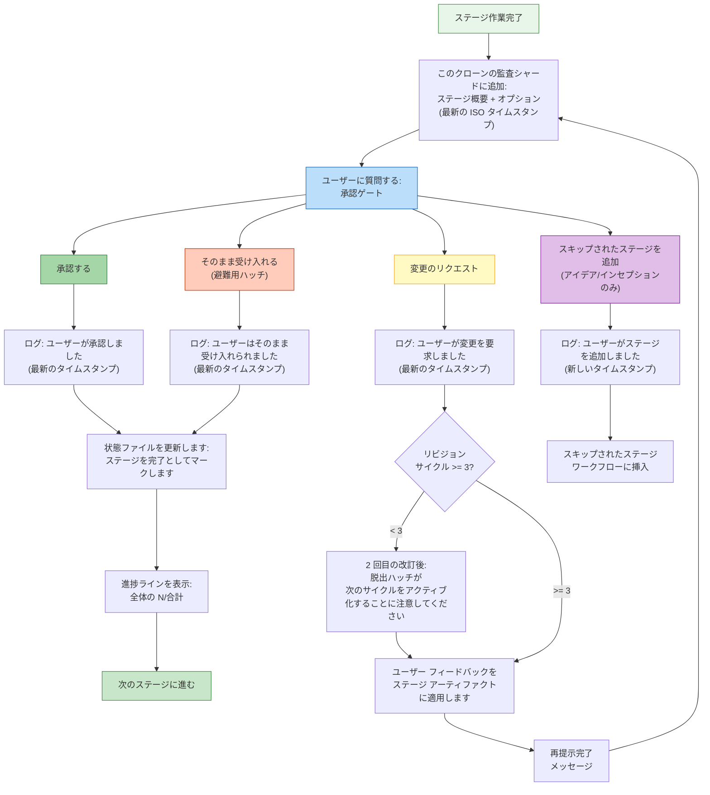

機械指向を人間が読めるように再構築
`dist/claude/.claude/aidlc-common/protocols/stage-protocol.md`。すべてを保存します
開発者向けに再編成する際のルール、条件、動作。
セクション参照 (例: 「プロトコル セクション 1」) はソース ファイルにマップされます。

> ステージ ファイル *形式* (YAML フロントマター、本体規則) については、を参照してください。
> [ステージ定義](/reference/stage-definition)。この章ではランタイムについて説明します
> 実行動作。

> **パス規則** アーティファクト、状態、および監査証跡は、
> アクティブなインテントの **レコード ディレクトリ** — `aidlc/spaces/<space>/intents/<YYMMDD>-<label>/`、
> 以下に `<record>/` と書かれています。監査証跡は、クローンごとのシャードのディレクトリです。
> `<record>/audit/<host>-<clone>.md` (リーダーはタイムスタンプによってグロブおよびマージします)、
> 単一のファイルではありません。

---

<a id="protocol-file-structure"></a>
## プロトコルファイル構造

ステージ プロトコルは 3 つのファイルに分割されており、
ワークフロー コンテキストに基づくコンダクター:

|ファイル |目次 |ロード時 |
|------|----------|---------------|
| `stage-protocol.md` |コア プロトコル: 承認ゲート、完了メッセージ、質問フロー、状態追跡、エージェント ペルソナの読み込み、深度ガイダンス、用語集、コンテンツ検証、サブエージェント返信形式、および §13 学習儀式 |すべての段階 (必須) |
| `stage-protocol-recovery.md` |エラー回復 + 変更処理 |セッション再開時、またはステージ途中で変更イベントが検出されたとき |
| `stage-protocol-governance.md` |位相境界検証 (§13) |位相境界 (1.7->2.1、2.8->3.1、3.7->4.1) |

<a id="conditional-loading-logic-from-skillmd-routing"></a>
### 条件付き読み込みロジック (スキル定義のルーティングより)

コンダクターのルーティング セクションでは、読み込みルールを定義します。

- **`stage-protocol.md`**: すべてのステージをロード -- コアゲート、質問形式、
  状態追跡、完了メッセージ。
- **`stage-protocol-recovery.md`**: セッション再開時または変更時の負荷
  イベントはステージの途中で検出されます。これにより、エラー回復と変更処理が維持されます。
  通常の前進段階では文脈から外れます。
- **`stage-protocol-governance.md`**: 位相境界での負荷
  (1.7->2.1、2.8->3.1、3.7->4.1) で位相境界検証を実行します。
  トレーサビリティチェック。これにより、ガバナンスのオーバーヘッドが制限される範囲に制限されます。
  が必要です。

分割により、通常ステージの実行中にコンテキスト サイズが削減されますが、
リカバリおよびガバナンスのルールは、必要に応じて利用できます。ステージ内での撮影
永続的なルールとしての修正は、§13 学習儀式によって処理されます。
`stage-protocol.md` (ステージごとにロードされる)。別個のガバナンス フローによってロードされるわけではありません。

---

<a id="overview"></a>
## 概要

ステージプロトコルは、あらゆる行動をどのように行うかを管理する必須の行動契約です。
AI-DLC ワークフローのステージが実行されます。 5つのフェーズにわたる全32ステージ
(初期化、アイデア、開始、構築、運用) は、何もせずにこのプロトコルに従います。
例外。コンダクター (`SKILL.md`) がステージの実行をエージェントに引き渡します
ペルソナ。プロトコルはフェーズやエージェントから独立しており、定義
あらゆるステージのドメイン固有の作業を取り囲む構造的なルール。

プロトコルの対象範囲: 承認ゲート、完了メッセージ、質問フロー、状態
追跡、エージェントペルソナの読み込み、エラー回復、変更処理、深さ
ガイダンス、コンテンツ検証、サブエージェントの返送形式、§13 の学習事項
儀式と段階境界の検証。

<a id="critical-compliance-checklist"></a>
### 重要なコンプライアンスチェックリスト

各段階の前および段階中に、見逃しがちな次の手順を確認してください。

状態遷移と監査エミッションはツールが所有するものではなく、
手書きの監査ブロック。車掌は次のように進行状況を報告します。
`aidlc-orchestrate.ts report --stage <slug>`;エンジンは
状態ツール。状態をアトミックに更新し、ペアになった監査イベントを発行します。
新しいタイムスタンプを使用して。

| # |チェック |
|---|------|
| 1 |承認ゲートで、必要に応じて `bun .claude/tools/aidlc-state.ts gate-start <slug>` (`--stage` ではなく、位置指定スラッグ) を呼び出します。ツールは状態を `[-]` から `[?]` 承認待ち に切り替え、`STAGE_AWAITING_APPROVAL` をアトミックに発行するため、プロンプトが開いている間、ステータスには保留されたゲートが表示されます。スキップされた場合、エンジンの `report` / `reject` パスは、結果を記録する前に、欠落している `STAGE_AWAITING_APPROVAL` 行 (`Recovered=true` のタグ付き) を埋め戻します。 (`STAGE_STARTED` / `[-]` トランジションは、ステージがアクティブになると `advance` / `approve` によって先に発行されます。) |
| 2 | `audit/` シャードに手書きではなく、`bun .claude/tools/aidlc-log.ts decision` 経由で `AskUserQuestion` を呼び出す前にオプションをログに記録します。
| 3 |ユーザーが応答した後、`bun .claude/tools/aidlc-log.ts answer` を介して正確な選択を記録し、承認には `aidlc-orchestrate.ts report --stage <slug> --result approved` を、要求の変更には `aidlc-state.ts reject <slug>` を使用します。承認 UI が最初に "Request Changes" の選択肢のみをキャプチャした場合は、改訂のフィードバックを一度要求してから、改訂作業または再表示されるゲートの直前に `reject` を呼び出します。
| 4 |ユーザー入力を決して要約しないでください。正確なオプション ラベルをログ ツールに渡します。自動ステージの場合は `N/A -- [reason]` | を使用します。
| 5 |インタラクションごとに 1 つの監査エントリ -- ログ/状態ツールは単一イベントの発行を強制します。複数のイベントを 1 つの呼び出しにマージしないでください。
| 6 |ステージ終了時に、`aidlc-orchestrate.ts report --stage <slug> --result approved` (ゲートステージ) または `report --stage <slug> --result completed` (初期化) を呼び出します。エンジンは `[?]`/`[-]` を `[x]` に反転し、ゲートされると `GATE_APPROVED` を放出し、状態ツール | を介してアトミックに `STAGE_COMPLETED` を放出します。
| 7 |作業を開始する前に、前のステージのタスク `completed` と現在のステージのタスク `in_progress` を `activeForm` でマークします (`sync-statusline` フックは状態の同期を処理します)。
| 8 | `knowledge/aidlc-shared/audit-format.md` のイベント タイプのみを使用します -- 状態ツールとログ ツールによってこれが強制されます。 `audit/` シャードには決して直接書き込まないでください。
| 9 | `STAGE_STARTED` / `STAGE_COMPLETED` ブロックを `audit/` シャードに手動で書き込まないでください。状態ツールのサブコマンドはそれらを発行します。手書きのブロックは原子性を壊し、タイムスタンプの保証を失います。

---

<a id="approval-gates"></a>
## 承認ゲート

3 つの初期化ステージを除くすべてのステージでは、明示的なユーザーの承認が必要です
進む前に。承認では、構造化 UI オプションで `AskUserQuestion` を使用します。

ゲートは、`aidlc-state.md` の `[?]` 承認待ち チェックボックスの状態に対応します。拒否された場合、ステージは `[R]` 改訂に移行します。フルステージの状態図と正規の `GATE_APPROVED` / `GATE_REJECTED` / `STAGE_AWAITING_APPROVAL` エミッタについては、[状態機械](/reference/state-machine) を参照してください。

*(プロトコルセクション 1)*

<a id="standard-2-option-gate"></a>
### 標準 2 オプション ゲート

デフォルト ゲートには、正確に 2 つの選択肢があります -- **Approve** (完了としてマーク、
事前) または **Request Changes** (ユーザーがフィードバックを提供し、ステージを再実行し、
ゲートが再表示されます):

```
AskUserQuestion({
  questions: [{
    question: "[Stage Name] complete. How would you like to proceed?",
    header: "Approval",
    multiSelect: false,
    options: [
      { label: "Approve", description: "Continue to [next stage]" },
      { label: "Request Changes", description: "Provide revision feedback" }
    ]
  }]
})
```

`[next stage]` は、実行ステージ ディレクティブの `next_stage` からそのままレンダリングされます。
フィールド (次のスコープ内のステージの表示名。エンジンによって計算されます)
放出時間)、または `next_stage` が ヌル値 の場合は `Complete workflow`。指揮者
次のステージを決して推測しません。

**緊急行動禁止ルール:** 建設および運用段階 (フェーズ 3 ～ 4)
常にこの 2 オプション形式を使用する必要があります。追加の製品を決して導入してはなりません
ナビゲーションのオプション。

<a id="conditional-3rd-option"></a>
### 条件付きの 3 番目のオプション

アイデアとインセプションの段階 (フェーズ 1 ～ 2) には、条件付きで 3 番目の段階が含まれる場合があります。
以前にスキップしたステージを再度追加できる場合のオプション:

```
{ label: "Add [Skipped Stage]", description: "Include [stage] which was skipped" }
```

これがフェーズ 1 ～ 2 の 3 番目のオプションの唯一の状況です。ラベルは、
特定のスキップされたステージを参照します。

<a id="revision-escape-hatch"></a>
### リビジョンエスケープハッチ

同じステージで「Request Changes」を3サイクル行った後、4回目以降
承認ゲートには 3 番目のオプションが追加されます。

```
{ label: "Accept as-is", description: "Archive current version and move on" }
```

質問テキストが変更され、サイクル数が含まれます。
`"[Stage Name] -- this is revision cycle [N]. How would you like to proceed?"`

**「Accept as-is」が選択されている場合:** `audit/` シャードにログインします (「ユーザーが承認した段階」
[N] リビジョン サイクル後にそのまま出力します」)、完了マークを付けて続行します。
次の場合にのみ、建設ステージの緊急行動禁止ルールをオーバーライドします。
閾値に達しました。

**アクティベーション前の通知:** 2 番目のサイクルの後、次の内容を含めます:「もう 1 回後
リビジョンを更新すると、「Accept as-is」オプションが利用可能になります。」

<a id="approval-gate-flow"></a>
### 承認ゲートフロー



---

<a id="completion-messages"></a>
## 完了メッセージ

この5部構成で各ステージが順番に終了します。すべての部品が必須です。

*(プロトコルセクション 2)*

<a id="part-0-audit-logging"></a>
### パート 0: 監査ログ

完了メッセージを表示する前に:
1. `<record>/audit/` (クローンシャードごと) に追加: ステージ名、作業概要、アーティファクト
2. 承認応答を受信した後、ユーザーの選択に新しいタイムスタンプを追加します

<a id="part-1-announcement"></a>
### パート 1: お知らせ

```markdown
# [emoji] [Stage Name] Complete
```

各ステージファイルで定義された絵文字。常にレベル 1 の見出し。

<a id="part-2-summary"></a>
### パート 2: 概要

作成された内容の構造化された箇条書きの要約:
- 事実と内容を重視 -- ワークフローの指示なし (「確認してください」)
- 主要な成果物のインライン概要表 (5 ～ 10 行) を含めます。
  ```
  | Artifact | Contents |
  |----------|----------|
  | requirements.md | 6 FR groups (18 sub-requirements), 4 NFRs |
  | requirements-analysis-questions.md | 5 questions, all answered |
  ```
- **セッションの最初の完了**には以下が含まれている必要があります:
`**Project depth**: [Minimal/Standard/Comprehensive] -- depth adapts artifact detail. You can request different depth at any approval gate.`

<a id="part-3-review--approval"></a>
### パート 3: レビューと承認

```markdown
**Review:** `<record>/[path to artifacts]`
```

`AskUserQuestion` 承認ゲートが続きます (「承認ゲート」セクションを参照)。

<a id="part-4-progress-update"></a>
### パート 4: 進捗状況の最新情報

ユーザーが承認したら、続行する前に次の内容を表示します。

```
Progress: [N]/[total] overall | [phase-N]/[phase-total] [Phase] stages complete. Next: [Next Stage Name]
```

現在のフェーズのステージのみをカウントします。完了およびスキップされたものを分子に含めます。
例: `Progress: 13/32 overall | 3/7 IDEATION stages complete. Next: Approval & Handoff`

---

<a id="question-flow"></a>
## 質問の流れ

ステージが質問を通じてユーザーの入力を収集すると、プロトコルは
バッチルール、必須の回答分析を使用した 3 つのモードの対話フロー、
そして曖昧さの検出。

*(プロトコルセクション 3)*

<a id="tri-mode-system"></a>
### トライモードシステム

**ステップ 1: 適切な `<record>/` に質問ファイルを作成します**
`[Answer]:` タグ形式をオプション A ～ E で使用するディレクトリ。すべての質問は必ず
`X. Other (please specify)` で終わります -- 例外はありません。すべての `[Answer]:` タグ
空白から始めます。複数選択の質問では、質問に「(該当するものをすべて選択してください)」が追加されます。
質問文。回答形式: `[Answer]: A, B, E`。

**ステップ 2: 現在のモードの選択:**

```
AskUserQuestion({
  questions: [{
    question: "I've created [N] questions at `[file path]`. How would you like to answer them?",
    header: "Questions",
    multiSelect: false,
    options: [
      { label: "Guide me", description: "Walk through each question interactively here" },
      { label: "I'll edit the file", description: "I'll fill in the answers in the file directly" },
      { label: "Chat", description: "Discuss freely -- I'll extract decisions from our conversation" }
    ]
  }]
})
```

モードの選択を `audit/` シャードに記録します。ユーザーはステージの途中でモードを切り替えることができます。

<a id="guide-me-interactive-mode"></a>
#### ガイドしてください (対話型モード)

- `AskUserQuestion` を介してバッチでプレゼンテーションします (通話ごとに最大 4 つの質問、最大 4 つの質問)
質問ごとのオプション）
- 5 つ以上の選択肢がある質問: 複数の通話に分割されます (それぞれ 4 つの選択肢)。
ユーザーはすべてのオプションを確認する必要があります。ファイルには完全なオプション セットが保持されます。
- 組み込みの「その他」が議論のきっかけになります。最初のバッチの前にユーザーに次のように伝えます。
「回答する前に議論するには、質問について「その他」を選択してください。」
- 各バッチの終了後、すぐに質問ファイルに回答を書き込みます。
- 新しい ISO タイムスタンプを使用して各バッチをログに記録します

<a id="edit-file-self-guided-mode"></a>
#### ファイルの編集 (セルフガイド モード)

- ユーザーに次のように伝えます: 「`[file path]` でファイルを編集してください。完了したら、**完了** または
**準備ができました**ので、続けます。」
- 完了信号を待ちます。信号が送られるまで、ファイルを読み取ったり続行したりしないでください。

<a id="chat-freeform-mode"></a>
#### Chat (フリーフォーム モード)

- 自由な会話;決定事項が現れるたびに抽出する
- 終了信号: 「続行する準備ができたら、**完了**と言ってください。要約します。」
- 抽出された回答を値、タイムスタンプ、および `**Mode:** chat` とともにファイルに書き込みます
- 続行する前に確認のために決定の概要を提示します
- 最適な用途: 探索段階、ブレーンストーミング、議論が必要な質問

**ステップ 4: 完全性を確認します。** ファイルを読み取り、すべての `[Answer]:` タグを確認します
満たされました。空白の場合は、`AskUserQuestion` 経由で未回答を提示します。しないでください
部分的な回答を続けます。ファイルは信頼できる記録です。

<a id="batch-rules"></a>
### バッチルール

|制約 |制限 |
|----------|----------|
| `AskUserQuestion` コールあたりの質問 |最大4 |
|通話ごとの質問ごとのオプション |最大4 |
| 5 つ以上の選択肢がある質問 |複数の通話に分割 |

<a id="answer-analysis"></a>
### 解答分析

回答を収集した後、すべての回答を分析します (必須)。
- **曖昧な答え**: 「さまざまな」、「わからない」、「場合による」、「おそらく」
- 回答間の **矛盾**
- **次のステップで必要な詳細が不足しています**

曖昧な点が見つかった場合は、フォローアップの質問を作成し、解決する前に解決してください。
進んでいます。 **疑問がある場合は、質問してください。**

<a id="ambiguity-detection"></a>
### 曖昧さの検出

**無効/欠落した回答の処理:**

|状態 |アクション |
|----------|----------|
|空白またはアンダースコアのみ `[Answer]:` |未回答のリストを表示し、ユーザーに回答を求める |
|回答の選択肢 (A ～ E、X) が一致せず、明確な自由記述形式ではありません。ユーザーに説明を求める |
|あいまい (「おそらく B」、「A または C」) |ユーザーに単一の選択肢を選択するよう依頼する |

**矛盾の検出** -- 以下の完全な回答セットをクロスチェックします。

|タイプ |例 |
|-----|----------|
|スコープの不一致 | 「シンプルを保つ」 + エンタープライズ グレードの機能リクエスト |
|リスクの不一致 | 「セキュリティは問題ではありません」 + 機密データの処理 |
|テクノロジーの衝突 |オフラインファースト + リアルタイム コラボレーション |
|タイムラインと範囲 | MVP タイムライン + フル機能スコープ |

検出された場合: 矛盾した答えを並べて提示し、矛盾を説明し、
的を絞ったフォローアップを依頼します。解決するまで続行しないでください。

**過信防止:**
- デフォルトでは、仮定ではなく質問します。決して曖昧なまま進めないでください。
- フォローアップが必要な危険信号: 自由形式の質問に対する 1 語の回答。
  「どう考えても」/「あなた次第」;矛盾した信号。質問をはぐらかす
- ユーザーが AI に従う場合: 「デザインがあなたの意見を反映していることを確認したいです」
  優先順位。 【具体的な側面】を教えていただけますか？」

<a id="plan-and-question-file-location"></a>
### 計画と質問ファイルの場所

ファイルは一元管理されず、ステージ アーティファクトと同じ場所に配置されます。例:
`<record>/inception/user-stories/user-stories-questions.md`。すべての入力、
質問とステージの出力は同じディレクトリに存在します。

---

<a id="state-tracking"></a>
## 状態追跡

状態は複数のレベルで維持されます。状態ファイル内のステージ チェックボックス、
サイドバーのタスク ステータス、監査エントリの ISO タイムスタンプ、および構造化された
監査ログエントリ。

*(プロトコルセクション 4)*

<a id="checkbox-states"></a>
### チェックボックスの状態

|チェックボックス |意味 |
|----------|----------|
| `[ ]` |開始されていません |
| `[-]` |進行中 (実行中、まだ承認されていません) |
| `[x]` |完了 (ユーザーによる承認) |
| `[S]` | `--stage` または `--phase` ジャンプ | 経由でスキップされました。

**強制:** ステージ START で、`[-]` をマークします。ステージEND（承認後）では、
マークは`[x]`です。 `[ ]` から `[x]` に直接移動して `[-]` をスキップしないでください。

**`[S]` 動作:**
- ジャンプ ターゲットの前にあるすべてのスコープ内のステージに対して、ステージ/フェーズ ジャンプ ハンドラーによって設定されます。
- ステータスラインの進行状況カウントから除外されます (合計または完了としてカウントされません)
- 通常のステージ進行では変更されません (ストリームエディターのパターンが `[S]` と一致しません)
- 再開時に、タスク追跡のために完了として扱われます（タスクが作成され、すぐに完了としてマークされます）
- 通常のワークフロー実行中には決して設定されません -- 明示的な `--stage`/`--phase` ジャンプによってのみ設定されます

<a id="task-status-transitions"></a>
### タスクのステータス遷移

ステージを開始する前に、サイドバーのタスクを移行します。

1. 前段階のタスク `in_progress` -> マーク `completed`
2. 現在のステージのタスク -> `in_progress` を `activeForm: "Running [Stage Name]"` でマークします

ルール: スピナーが表示するにはタスクが `in_progress` である必要があります。前に更新してください
ステージファイルを読み取っています。全32ステージが対象となります。タスク ID が失われた場合 (圧縮)、
件名で検索するには `TaskList` を使用します。スキップされたステージの場合:
`TaskUpdate({ taskId: [ID], status: "completed", description: "[original] -- Skipped: [reason]" })`

<a id="plan-level-checkbox-enforcement"></a>
### プランレベルのチェックボックスの強制

2 レベルの追跡は同期を保つ必要があります。
- **計画レベル**: 個別の作業項目 (各ユーザー ストーリー、各コンポーネント)
- **州レベル**: `aidlc-state.md` でステージ完了

ステップが完了すると、そのチェックボックスがオンになります。チェックすると、ステップを実行する必要があります。
各手順を完了したらすぐに更新してください。

<a id="timestamps"></a>
### タイムスタンプ

形式: `date -u +"%Y-%m-%dT%H:%M:%SZ"` 経由の ISO 8601 UTC。 シェル経由で実行します。
決してデートだけではありません。監査エントリごとに 1 つの シェル 呼び出し -- タイムスタンプを再利用しないでください。

<a id="audit-log-formats"></a>
### 監査ログの形式

`<record>/audit/` (クローンシャードごと) ルール: 常に追加します (決して上書きしません)。 「ユーザー入力」
フィールドは完全かつ未変更である必要があります。表示する前にプロンプ​​トをログに記録します。ログ
受信後の応答。欠落している場合は `# AI-DLC Audit Log` ヘッダーを使用して作成します。
破損している場合はバックアップします。編集が失敗した場合は 1 回再試行します (フックは次の期間に変更される可能性があります)
読み取りと編集)。

<a id="standard-conversation-event"></a>
#### 標準会話イベント

```markdown
## [Stage Name]
**Timestamp**: [YYYY-MM-DDTHH:MM:SSZ]
**User Input**: "[Complete raw input -- never summarize]"
**AI Response**: "[Action taken]"
**Context**: [Stage, decision made]
---
```

<a id="error-log"></a>
#### エラーログ

```markdown
## Error: [Brief Description]
**Timestamp**: [ISO timestamp]
**Severity**: [Critical/High/Medium/Low]
**Type**: [Parse error/Missing artifact/State corruption/Validation failure]
**Description**: [What went wrong]
**Cause**: [Root cause or best assessment]
**Resolution**: [Action taken]
**Impact**: [Artifacts affected, stages delayed, data lost]
---
```

<a id="recovery-log"></a>
#### 回復ログ

```markdown
## Recovery: [Brief Description]
**Timestamp**: [ISO timestamp]
**Issue**: [What triggered recovery]
**Recovery Steps**: [Numbered list of actions]
**Outcome**: [Successful/Partial/Failed -- current state after recovery]
**Artifacts Affected**: [Files created, restored, or rebuilt]
---
```

<a id="change-request-log"></a>
#### 変更リクエストログ

```markdown
## Change Request: [Brief Description]
**Timestamp**: [ISO timestamp]
**Request**: [User's exact change request -- complete raw input]
**Current State**: [Which stage, what exists, what would change]
**Impact Assessment**: [Stages affected, artifacts to regenerate, scope change]
**User Confirmation**: [User's approval response]
**Action Taken**: [What was done]
**Artifacts Affected**: [Files changed]
---
```

<a id="question-interaction-log"></a>
#### 質問対話ログ

```markdown
## Questions: [Stage Name] -- [Mode choice / Batch N of M]
**Timestamp**: [ISO timestamp]
**User Input**: "[Exact user selection -- option labels as displayed]"
**AI Response**: "[Wrote answer to file / Presented next batch / Proceeded to analysis]"
**Context**: [Stage name, file path, question numbers covered]
---
```

<a id="conversation-event-logging-checklist"></a>
### 会話イベントのログ記録チェックリスト

`PostToolUse` フックはファイルの書き込みを自動ログします。会話イベントをログに記録する必要がある
手動で（最も一般的に見逃されるステップ）。

**各承認ゲートで:** (1) BEFORE `AskUserQuestion` -- オプションを追加します
新しいタイムスタンプ。 (2) 応答後 -- ユーザーの選択を新しいものに追加します
タイムスタンプ。

**各質問の対話時:** 回答を受け取った後 -- Q&A を追加
まとめ。

---

<a id="agent-persona-loading"></a>
## エージェント ペルソナの読み込み中

各ステージでは、リード エージェントとオプションのサポート エージェントを指定します。ペルソナのロードスルー
幅広いコンテキストからステージ固有までの 6 ステップの知識順序構築
人工物。

*(プロトコルセクション5)*

<a id="6-step-knowledge-loading-order"></a>
### 6 ステップのナレッジの読み込み順序

完全なロード順序については、[ナレッジシステム](/reference/knowledge-system) を参照してください。

ステップ 1 ～ 3 はフレームワークに同梱されています。ステップ 4 ～ 5 はユーザー管理です。ステップ6は、
ワークフローの位置ごとに動的。

<a id="inline-stages"></a>
### インラインステージ

1. リード エージェントのフラット ファイルを読み取ります (例: `agents/aidlc-architect-agent.md`)
2. 6 ステップの順序ごとに知識をロードする
3. 実行中にエージェントの視点を適用する

<a id="subagent-stages"></a>
### サブエージェントの段階

1. Claude Code タスク ツール プロンプトにエージェント ペルソナ コンテキストを含めます
2. 関連する先行成果物をコンテキストとして渡す
3. ステージメタデータから`subagent_type`を指定

<a id="multi-agent-stages"></a>
### マルチエージェントステージ

指揮者は最初にリード エージェントを連れて行き、次に各サポート エージェントをリードの担当者に連れて行きます。
コンテキストとして出力します。 *どのように* それらをもたらすかは次のとおりです `directive.mode`: インライン ステージ上
(出荷されたグラフの各マルチエージェント段階) サポート エージェントはペルソナです。
コンダクターは `Task` ディスパッチではなく、独自のコンテキストにロードされます。 `Task` は予約されています
`mode: subagent` ステージ。いずれの場合でも、指揮者はすべての代表を実行します。エージェント
サブエージェントを決して生成しません。

例: 実現可能性は `aidlc-architect-agent` (リード) + `aidlc-aws-platform-agent` + を使用します
`aidlc-compliance-agent`、すべてインライン。

<a id="the-11-agents"></a>
### 11 人のエージェント

プロダクト、デザイン、デリバリー、アーキテクト、AWS プラットフォーム、コンプライアンス、開発セキュリティ運用、開発、品質、パイプライン・デプロイ、運用の各エージェント。

---

<a id="error-recovery"></a>
## エラー回復

*(プロトコルセクション6)*

<a id="resume-context"></a>
### 履歴書のコンテキスト

セッション開始時に `aidlc-state.md` が存在する場合、コンダクターはそれを読み取ります。
完了したステージ (`[x]`)、現在/次のステージ、およびアーティファクトを決定します
その後、最後の未完了の段階から再開することを申し出ます。

<a id="resume-context-loading-by-phase"></a>
### フェーズごとにコンテキストの読み込みを再開

|フェーズ/ステージグループ |ロードするコンテキスト |
|-------------------|----------------|
| **初期化 (0.1-0.3)** |ワークスペースファイルシステム。 `aidlc-state.md` |
| **アイデア (1.1-1.7)** | `<record>/ideation/` アーティファクト。ガードレール |
| **インセプション -- RE** | RE アーティファクト。アイデアの範囲/実現可能性 |
| **開始 -- 要件** | RE アーティファクト (実行された場合);要件分析ドキュメント |
| **インセプション -- デザイン** |要件;ユーザーストーリー。アプリケーション設計ドキュメント |
| **開始 -- 配信計画** |すべてのインセプションアーティファクト。部分的な場合は配送計画 |
| **構築 -- コード生成** |現在のユニットの設計成果物、ストーリー設計、受け入れ基準、以前のコード |
| **構築 -- ビルド/テスト** |現在のユニットのコード、テスト計画、合格基準、ビルド構成 |
| **建設 -- CI/インフラ** |インフラ設計。コード生成の出力 |
| **オペレーション (4.1-4.7)** |建設成果。これまでの操作成果物。 4.4 以降の場合、4.1 ～ 4.3 のデプロイメント出力 |

<a id="re-run-behavior"></a>
### 再実行動作

ステージを再実行する必要がある場合 (承認後に変更が要求された場合):
1. ステージファイルを再読み込みします
2. 以前の成果物をコンテキストとしてロードする
3. 再度実行して、以前の成果物を上書きします
4. 新しい完了メッセージを表示します

<a id="compaction-recovery"></a>
### 圧縮回復

`PreCompact` フックは圧縮前に `aidlc-state.md` 構造を検証します
(情報提供のみ、ブロックできません)。 `.aidlc-recovery.md` ブレッドクラムを書き込みます
最後に検証された状態 (ステージ、タイムスタンプ)。再開時に車掌は比較する
状態ファイルを含むパンくずリストを使用して、圧縮関連の破損を検出します。

<a id="corrupted-state-file-recovery"></a>
### 破損した状態ファイルの回復

`aidlc-state.md` が存在するが解析できない場合:
1. `aidlc-state.md.bak` にバックアップします
2. `<record>/` をスキャンしてアーティファクトを探し、実際の完了を確認します。
   - RE 分析ファイル -> RE ステージが完了
   - 要件ドキュメント -> 要件が完了しました
   - 設計ドキュメント -> 設計が完了
   - コードマッチングストーリーデザイン -> コード生成完了
3. アーティファクトの証拠から状態を再構築する
4.「現状」を第一段階の証拠不足に設定する
5. ユーザーに「状態ファイルが破損しました。アーティファクトから再構築されました。確認してください。」と通知します。

<a id="missing-artifact-recovery"></a>
### 失われたアーティファクトの回復

ステージがディスク上に存在しないアーティファクトを参照している場合:
1. 不足しているアーティファクトをリストする
2. 生産段階が完了としてマークされているかどうかを確認します
3. 完了しているが欠落している場合: ユーザーに通知し、再実行または手動プロビジョニングを提案します。
4. 完了していない場合: ステージを通常どおり実行します。

<a id="contradictory-inputs-recovery"></a>
### 矛盾した入力の回復

さまざまな段階からのユーザー入力が矛盾する場合:
1. 両方の情報源からの引用を使用して、特定の矛盾にフラグを立てます
2. 1 つの解釈を選択して解決しないでください
3. どちらが優先かを尋ねる
4. オーバーライドされたアーティファクトを更新する
5. `audit/` シャードのログ解決

<a id="severity-levels"></a>
### 重大度レベル

|重大度 |説明 |例 |アクション |
|----------|---------------|----------|----------|
| **重大** |続行できません |破損した状態、重要なアーティファクトの欠落、回復不能な解析エラー |やめて、すぐにユーザーに尋ねてください |
| **高** |出力が間違っている可能性があります |矛盾した入力、不完全な回答、欠落している依存関係 |やめて、すぐにユーザーに尋ねてください |
| **中** |品質の低下 |曖昧な応答、部分的なコンテキスト、曖昧な要件 |解決を試みます。解決しない場合は、ユーザーに問い合わせてください。
| **低い** |化粧品 |書式設定、命名、スタイルの問題 |サイレントに処理し、`audit/` シャードにログインします。

---

<a id="change-handling"></a>
## 変更処理

ワークフロー途中の変更には 5 つのカテゴリがあり、それぞれ処理が異なります。

*(プロトコルセクション 7)*

<a id="minor-changes"></a>
### マイナーな変更

現在のステージのみに影響します。成果物に変更を適用し、完了を再表示します
メッセージ。ロールバックは必要ありません。

<a id="major-changes"></a>
### 大きな変更点

前の段階に影響を与える:
1. 影響を受ける前段階を特定する
2. `AskUserQuestion` による現在の影響分析
3. 承認された場合は、影響を受けるステージを順番に再実行します。
4. `aidlc-state.md` を更新します

<a id="scope-changes"></a>
### 範囲の変更

新しい要件またはスコープレベルの変更:
1. `audit/` シャード内のドキュメント
2. 要件分析 (2.3) または納品計画 (2.8) に戻る
3. そこから再計画する
4. 変更がステージ選択に影響を与える場合 (例: `poc` -> `feature`)、スコープを更新します
`aidlc-state.md`で

<a id="unit-changes"></a>
### 単位の変更

|変更 |手順 |
|----------|----------|
| **追加** |計画に追加し、ストーリー デザインを作成し、構築順序に組み込みます。完了したユニットを再実行しないでください。 |
| **削除** |マークをスキップし、アーティファクトをアーカイブします。依存関係を確認します -- 依存関係への影響にフラグを立てます。 |
| **分割** |オリジナルをアーカイブし、2 つのエントリを作成し、ストーリーを配布し、それぞれのストーリー デザインを実行します。 |

<a id="architectural-changes"></a>
### アーキテクチャの変更

アプリケーション アーキテクチャに影響を与える (DB の切り替え、デプロイメント モデル、主要な)
統合）：
1. 範囲の特定: 影響を受けるデザインアーティファクト、ストーリーデザイン、生成されたコード
2. 現在の完全な影響分析
3. 承認された場合は、アプリ設計段階に戻り、そこから再実行します。
4. 影響を受けるユニットのすべての下流アーティファクトを再生成する
5. 影響を受けていないユニットを保存する

<a id="archive-before-change"></a>
### 変更前のアーカイブ

アーティファクトを上書きする大きな変更が行われる前に、次のようにします。
1. 必要に応じて `<record>/archive/` を作成します
2. 影響を受けるアーティファクトを `<record>/archive/[ISO-date]-[stage-name]/` にコピーします
3. 続行します。以前の作業が永久に失われることはありません。

---

<a id="depth-guidance"></a>
## 深さのガイダンス

必要な詳細を正確に作成します。それ以上でもそれ以下でもありません。深さは範囲に応じて変化します
そして問題の複雑さ。

*(プロトコルセクション 8)*

<a id="scope-to-depth-and-test-strategy-defaults"></a>
### スコープから深さまでのテスト戦略のデフォルト

|範囲 |デフォルトの深さ |テスト戦略 |典型的な段階 |メモ |
|------|--------------|---------------|---------------:|------|
|企業 |総合 |総合 | 32 |全ステージ |
|特徴 |標準 |標準 | 32 |全ステージ |
| MVP |標準 |標準 | 22 |すべてスキップ 操作 |
|ポク |最小限 |最小限 | ~8 |初期化 + アイデア + コア インセプション |
|バグ修正 |最小限 |最小限 | ~8 |ターゲット |
|リファクタリング |最小限 |最小限 | 8 |ターゲット |
|インフラ |標準 |標準 | ~13 |インフラ中心 |
|セキュリティパッチ |最小限 |最小限 | ~10 |セキュリティ重視 |
|ワークショップ |標準 | **最小限** | 25 |標準的な学習の深さ。ナイキストのペーステスト |

ユーザーは、任意の承認ゲートで深さまたはテスト戦略をオーバーライドできます。

<a id="three-depth-levels"></a>
### 3 つの深さレベル

**最小限** (概念実証、バグ修正、リファクタリング、セキュリティ パッチ) -- 最小限のアーティファクト、
簡単な分析。オプションの段階はスキップします。
- 要件: 5 ～ 10 個の項目、簡単な説明、最小限の NFR
- アプリ設計: 単一コンポーネント図、基本データ モデル、ADR なし
- 機能的なデザイン: 簡単なビジネス ルール、単純なエンティティ、スキップ
  `frontend-components.md`

**標準** (機能、MVP、インフラ) -- 中程度の詳細で完全なアーティファクト:
- 要件: 15 ～ 30、許容基準あり、中程度の NFR
- アプリのデザイン: インタラクション、関係、2 ～ 3 つの ADR を含むコンポーネント図
- 機能設計: 詳細なビジネス ロジック、包括的なルール、エンティティ
  ライフサイクル

**包括的** (エンタープライズ) -- 詳細な分析、すべての段階で以下が実行されます。
- 要件: 30 以上の詳細な基準、すべてにわたる包括的な NFR
  カテゴリ
- アプリのデザイン: 多層図、詳細なデータ フロー、統合シーケンス、
  5 つ以上の ADR と代替案
- 機能設計: デシジョン ツリー、ステート マシン、同時実行性、エラー
  回復、ユニット間パターン

---

<a id="terminology-glossary"></a>
## 用語集

*(プロトコルセクション9)*

|用語 |定義 |
|------|-----------|
| **AI-DLC** | AI 主導の開発ライフ サイクル -- このシステムが実装する方法論 |
| **フェーズ** |トップレベルのグループ: 初期化、アイデア、開始、構築、運用 |
| **ステージ** |フェーズ内の個別のステップ (例: インテント キャプチャ、コード生成) |
| **範囲** |どのステージをどの深さで実行するかを制御します (エンタープライズ、機能、MVP、POC、バグ修正、リファクタリング、インフラ、セキュリティ パッチ、ワークショップ) |
| **深さ** |アーティファクトの詳細スケール: 最小、標準、または包括的 |
| **作業単位** |独立して実装可能な機能のパッケージ。構築反復単位。ステージ 3.1 ～ 3.7 を 1 回通過します。 |
| **サービス** |デプロイ可能なプロセスまたはコンテナー (API サーバー、ワーカー、フロントエンド アプリ) |
| **モジュール** |サービス内のコードレベルの組織境界 (パッケージ、名前空間) |
| **コンポーネント** |モジュール内の論理ビルディング ブロック (クラス、関数グループ、UI コンポーネント) |
| **計画中** |マークダウン成果物を生成する段階 (分析、質問、設計) |
| **世代** |実行可能コードを生成する段階 (コード生成、ビルド、テスト) |
| **アーティファクト** |決定、設計、分析を記録する `<record>/` のバージョン付きマークダウン ファイル |
| **ガードレール** |空間記憶層に保存された学習された行動ルール (`aidlc/spaces/<space>/memory/`) |
| **承認ゲート** |ユーザーが変更を承認または要求するための構造化されたプロンプト |
| **インラインステージ** |オーケストレーター会話で直接実行されるステージ |
| **サブエージェント段階** | Claude Code タスク ツール呼び出しに実行を委任するステージ |
| **主任エージェント** |ステージの作業を担当する主要なエージェントのペルソナ |

---

<a id="content-validation"></a>
## コンテンツの検証

*(プロトコルセクション 10)*

<a id="mermaid-rules"></a>
### Mermaid ルール

Mermaid 図を作成する前に:
1. 構文を検証します (バランスの取れた中括弧、有効なノード/エッジ、エスケープされていない特殊文字がない)
2. すべての参照ノードが宣言されていることを確認します。
3. テキスト フォールバックを含める: `{/* Text fallback: [description] */}`

<a id="pre-creation-checklist"></a>
### 作成前チェックリスト

アーティファクトを作成する前に:
- 参照されたすべてのエンティティは以前のアーティファクトに存在します
- 既存のアーティファクトと名前が競合しない
- ファイルパスはステージの規則と一致します

<a id="ascii-diagram-standards"></a>
### ASCII 図の標準

基本的な ASCII のみを使用します: `+` `-` `|` `^` `v` `<` `>` `/` `\`プラス
英数字とスペース。禁止: ユニコード ボックス描画 (U+2500-U+257F)。
文字幅ルール: ボックス内の各行の文字数は同じでなければなりません。

参考パターン：
```
+------------------+       +---------------------------+
| Component Name   |       | Outer                     |
+------------------+       |  +-----+  +-----+        |
                           |  | A   |  | B   |        |
[Source] -----> [Target]   |  +-----+  +-----+        |
[Source] <----> [Target]   +---------------------------+
```

<a id="character-escaping"></a>
### 文字のエスケープ

|キャラクター |ルール |
|-----------|------|
|パイプ (`\|`) |表のセル内でエスケープ |
|山かっこ | HTML タグでない場合はエスケープする |
|コードフェンス |言語識別子を含むトリプルバックティック |
| Mermaid ラベル |特殊文字を引用符で囲む |

---

<a id="subagent-return-summary"></a>
## サブエージェントの返却概要

サブエージェントが完了すると、構造化された概要をサブエージェントに返す必要があります。
コンダクタを使用してコンテキストが失われないようにします。

*(プロトコルセクション 11)*

<a id="required-format"></a>
### 必要な形式

```markdown
## Subagent Summary: [Stage Name]
### Produced
- [file path]: [brief description]
### Key Decisions
- [Decision]: [rationale]
### Issues / Concerns
- [Problems, edge cases, risks] or "None"
### Next Steps
- [What orchestrator should do next]
```

**指揮者のルール:** 続行する前に概要を必ずお読みください。空ではない
問題/懸念事項はユーザーに提示される必要があります。必要なファイルが予想より少ない
完了とマークする前の調査。

<a id="context-budget"></a>
### コンテキスト予算

|ルール |詳細 |
|------|----------|
|現在のユニットのみ |現在のユニットの設計成果物のみを渡す |
|始まりの概要 |パス付きの開始アーティファクトごとに 1 ～ 2 行の概要。サブエージェント 必要に応じて読み取ります。
|常に | を含めてください。エージェント ペルソナ、ナレッジ ファイル、`aidlc-state.md`、タスクの指示 |
|キャップナレッジファイル |最も関連性の高い最大 3 つ。他の人をパスでリストする |

<a id="failure-recovery"></a>
### 障害の回復

1. コンテキストを減らして **1 回再試行** (開始の概要、現在のユニットのみ)
2. 再試行が失敗した場合は、ユーザーに次のことを提案します: 「インラインで実行」 (オーケストレーターで実行) または
「スキップして再確認」（未完了としてマークし、続行）
3. エラーログ形式を使用して、`audit/` シャードの障害をログに記録します

---

<a id="reviewer-invocation"></a>
## レビューアーの呼び出し

`run-stage` ディレクティブに ヌル値 以外の `reviewer` フィールドが含まれる場合、コンダクタは
ステージ本体がそのレビューアーを生成した後、**別のサブエージェント**としてそのレビューアーを呼び出します。
アーティファクト、§13 学習の儀式と承認ゲートの前。ステージ
儀式の完全なシーケンス: 質問 → アーティファクト → レビュー担当者 (宣言されている場合) →
学び→門。

*(プロトコルセクション 12a)*

1. **呼び出し。** `directive.reviewer` で指定されたエージェントに委任し、
   ステージ定義パス、Q&A ファイル、生成されたアーティファクト パス、および
   フロントマターの検証ツール — 決してビルダーの `memory.md` や計画ではないため、
   査読者は独立した判断を下します。
2. **レビュー。** レビュー担当者は定義、Q&A、アーティファクトを読み、必要な場合は実行します。
   検証ツールをリストし、`## Review` セクションをプライマリ ツールに追加します。
   **READY** または **NOT-READY** の判定を持つアーティファクト。
3. **評決** 準備完了 → 学習の儀式に進み、次に門に進みます。準備ができていません
   `reviewer_max_iterations` 以下の反復が残っている (デフォルトは 2) → 先頭
   エージェントが再実行して発見事項に対処し、レビュー担当者が再チェックします。準備ができていません
   反復を使い果たした → 未解決の結果が記録された状態でゲートに進みます。

レビュー担当者は決してブロックしません - 人間が常にゲートで最終決定権を持っています - そしてブロックします
`reviewer` フィールドのないステージでは起動しません。 `reviewer` / を参照してください。
[ステージ定義](/reference/stage-definition)の`reviewer_max_iterations`フロントマターフィールド。

---

<a id="learnings-ritual"></a>
## 学習の儀式

人間がエージェントの動作を修正すると、その修正が永続的なものになる可能性があります
次のワークフローのルール (ガードレール)。 バージョン 0.5.0 はこれを次のように処理します。
アクターとしてのツール学習の儀式。別個のガードレール放出フローではありません。

*(プロトコルセクション 13)*

この儀式は、完了メッセージとメッセージの間のすべてのゲート ステージで実行されます。
承認ゲート:

1. **日記**: エージェントはステージごとの `memory.md` (解釈 /
逸脱/トレードオフ/未解決の質問) が機能するまで。
2. **抽出**: `aidlc-learnings.ts surface --slug <slug>` が日記を読み、
構造化された候補を出力します。LLM は再解析や分類を行いません。
3. **確認**: 指揮者が候補者を提示します。ユーザーがどれを選択するか
そのままにし、フリーテキスト追加の場合は、その見出しを導き出す見出しを選択します。
行き先。
4. **入学チェック**: 継続された学習はそれぞれ `org.md` の内容と照合されます。
マッチングセクション。矛盾が表面化して修正/スキップ/エスカレートする。
5. **永続**: `aidlc-learnings.ts persist` の確認された学習をそれぞれ練習として書き込みます。
`aidlc/spaces/<space>/memory/{project,team}.md` (センサー バインディングの場合)
学習中、マニフェスト + ステージ `sensors:` インポートをロックされた 1 つにインストールします
トランザクション)、`RULE_LEARNED` / `SENSOR_PROPOSED` を発行します。

学習内容は、実行中の実行ではなく、**次** ワークフローのコンパイルに適用されます。見る
`stage-protocol.md` 完全なツール・アズ・アクター・プロトコルについては §13、および
[ルール システム](/reference/rule-system) 厳密な加法解決のための書き込み
ルールが反映されます。

---

<a id="phase-boundary-verification"></a>
## 位相境界の検証

各フェーズ移行時に、トレーサビリティ検証によりフェーズが完了していることを確認します。
出力は次のフェーズに十分かつ一貫しています。

*(`stage-protocol-governance.md` セクション 13 — 学習内容とは異なります
儀式、つまり `stage-protocol.md` セクション 13)*

<a id="triggers"></a>
### トリガー

- 各フェーズの最終段階が承認された後
- 次のフェーズの最初のステージが始まる前
- `/aidlc --status` 経由のオンデマンド

<a id="process"></a>
### プロセス

1. `.claude/knowledge/aidlc-shared/verification.md` から方法論を読み取る
2. フェーズ固有のトレーサビリティチェックを実行する
3. 結果を `<record>/verification/[phase-boundary]-verification.md` に書き込みます
4. 失敗した場合: 現在の問題 (リンクの欠落、孤立したアーティファクト、
不一致) を続行する前に
5. `PHASE_VERIFIED` を `audit/` シャードにログ記録します

<a id="per-phase-checks"></a>
### フェーズごとのチェック

|境界 |検証済み |
|----------|----------|
| **アイデア -> 開始** |意図の把握、範囲の定義、実現可能性の確認、取り組みの承認 |
| **開始 -> 構築** |すべての要件は設計に基づいて追跡され、ユニットが定義され、納品計画が承認されます。
| **建設 -> 運用** |すべてのユニットが構築/テストされ、CI パイプラインが構成され、インフラストラクチャが設計されています。

<a id="traceability-matrix"></a>
### トレーサビリティ マトリックス

検証により、追跡可能なチェーンが保証されます。
```
Intent -> Scope -> Requirements -> Designs -> Units -> Code -> Tests -> Deployment
```

各境界では、左側のすべてのアーティファクトに対応する
右側のアーティファクト。リンクの欠落、孤立、不一致にフラグが付けられます
ユーザーレビュー用に。

---

<a id="cross-references"></a>
## 相互参照

- [アーキテクチャ](/reference/architecture) -- 5 層モデル、設計上の決定
- [オーケストレーター](/reference/orchestrator) -- スキル定義の詳細
- [ステージ](https://github.com/awslabs/aidlc-workflows/blob/main/docs/reference/04-stages/) -- フェーズごとのステージのドキュメント
- [エージェント システム](/reference/agent-system) -- エージェント構造、フロントマター
- [フックとツール](/reference/hooks-and-tools) -- フック システム、監査イベント
- [ナレッジ システム](/reference/knowledge-system) -- ロード順序、テンプレート
- [図](/reference/diagrams) -- すべての図を 1 か所に
