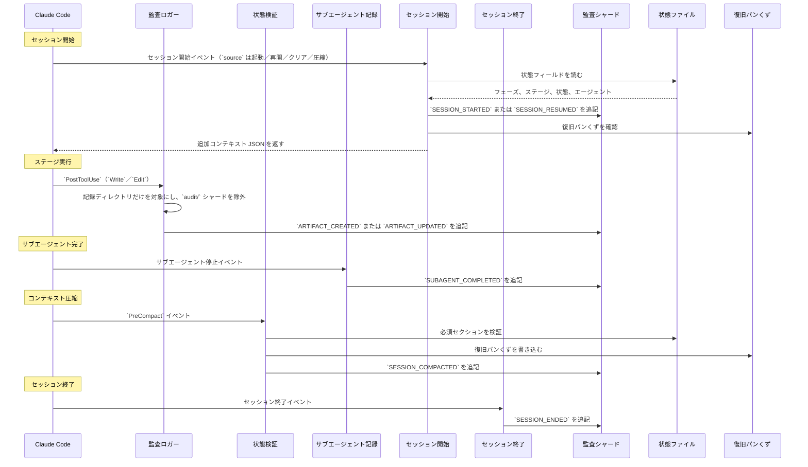

> 対象読者: ティア 2/3（チーム導入者、フレームワークコントリビューター）。

この章では、フックシステムアーキテクチャ、13 本すべてのフックスクリプト、監査イベントの分類、CLI ツール設定、そして決定論的ユーティリティツールを説明します。

> **パス規約。** 状態、監査、成果物はすべて、アクティブなインテントの**記録ディレクトリ**、すなわち `aidlc/spaces/<space>/intents/<YYMMDD>-<label>/` の下に置かれます。以下ではこれを `<record>/` と表記します（UTC 日付の短い接頭辞と短いケバブケースのラベルにより、記録ディレクトリが時系列順に並ぶようにするためです。正準 ID は `intents.json` のレジストリ行にある UUIDv7 です）。監査証跡は `<record>/audit/` 配下にあるクローンごとのシャードディレクトリであり、単一ファイルではありません。

---

<a id="hook-system-architecture"></a>
## フックシステムアーキテクチャ

この実装は `.claude/hooks/` 配下の 13 本のフックスクリプトを使います。13 本すべてが TypeScript（`bun` 経由で実行）です。13 本すべてが**プロジェクト全体**に対して登録されます。`settings.json` に登録されており（ステータスラインはトップレベルの `statusLine` キー、残り 12 本は `hooks` ブロック）、どのスキルが有効かに関係なく発火します。以前は分割されており（6 本は `aidlc/SKILL.md` のフロントマターにスキルスコープとして宣言され、残りがプロジェクト全体でした）、バージョン 0.6.0 でその 6 本も `settings.json` へ移されました。これにより、オーケストレーター、各パッケージ済みのスコープ／ステージランナー、そして手書きの顧客ランナーなど、どのエントリポイントもランナーごとの `hooks:` ブロックなしで決定論的な基幹機構を継承できます。

13 本のうち 10 本は**非ブロッキング**です。3 本は**フロー変更型**です。`Stop` フックは転送ループを回し続け、レビュースコープフックは兄弟ユニットへのレビュアーアクセスを拒否し、状態遷移ガードは `aidlc-orchestrate.ts report` を迂回する直接のライフサイクル呼び出しを拒否します。

```
.claude/hooks/
+-- mint-presence.ts     # UserPromptSubmit + PostToolUse AskUserQuestion (project-wide, settings.json, TypeScript)
+-- state-transition-guard.ts # PreToolUse Bash (project-wide, settings.json, TypeScript, flow-altering)
+-- reviewer-scope.ts    # PreToolUse file/search/shell tools (project-wide, settings.json, TypeScript, flow-altering)
+-- audit-logger.ts      # PostToolUse Write|Edit (project-wide, settings.json, TypeScript)
+-- sensor-fire.ts       # PostToolUse Write|Edit (project-wide, settings.json, TypeScript)
+-- sync-statusline.ts   # PostToolUse TaskUpdate (project-wide, settings.json, TypeScript)
+-- runtime-compile.ts   # PostToolUse Bash (project-wide, settings.json, TypeScript)
+-- validate-state.ts    # PreCompact (project-wide, settings.json, TypeScript)
+-- log-subagent.ts      # SubagentStop (project-wide, settings.json, TypeScript)
+-- aidlc-stop.ts        # Stop (project-wide, settings.json, TypeScript, flow-altering)
+-- session-start.ts     # SessionStart (project-wide, settings.json, TypeScript)
+-- session-end.ts       # SessionEnd (project-wide, settings.json, TypeScript)
+-- aidlc-statusline.ts  # statusLine (project-wide, settings.json, TypeScript)
```

<a id="hook-summary"></a>
### フックの概要

| フック | イベント | 適用範囲 | マッチャー | 目的 |
|------|-------|---------|---------|---------|
| `mint-presence.ts` | ユーザープロンプト送信 + `PostToolUse` | プロジェクト全体（`settings.json`） | （空）／`AskUserQuestion` | 実際の人間の各プロンプトと、回答済み `AskUserQuestion` ウィジェットごとに `HUMAN_TURN` イベントを記録します（承認やインタビューのゲートは入力したプロンプトではなくウィジェットのクリックです）。承認／インタビューのゲート確認は台帳を読み、最後のゲート解決以後に 1 件あることを要求するため、自動操縦中のモデルが人間の操作なしに承認を捏造できません |
| `state-transition-guard.ts` | `PreToolUse` | プロジェクト全体（`settings.json`） | `Bash` | **フロー変更型。**直接の `aidlc-state.ts` ライフサイクル動詞を拒否し、コンダクターを `aidlc-orchestrate.ts report` へ誘導します。読み取り専用および特殊な復旧／設定動詞は引き続き利用できます |
| `reviewer-scope.ts` | `PreToolUse` | プロジェクト全体（`settings.json`） | `Read\|Edit\|Write\|Glob\|Grep\|Bash` | **フロー変更型。**ユニット単位レビュアーの読み取り範囲境界（ステージプロトコル §12a）を決定論的に強制します。コンダクターのレビュアーディスパッチ記録（`<record>/.aidlc-reviewer-dispatch.json`）が新しい間、ディスパッチ済みレビュアーが兄弟ユニットの `construction/` パスへ届くツール呼び出し、つまり兄弟をまたぐファイルの読み書きや検索／グロブ／シェルのパターンを、記録の除外リストにない限り拒否します（終了コード 2 + リダイレクトされた標準エラー出力の理由）。各拒否は `REVIEWER_SCOPE_BLOCKED` を出します。曖昧さがある場合はすべてフェイルオープンです。`AIDLC_DISABLE_REVIEWER_SCOPE_HOOK=1` で強制を無効化できます |
| `audit-logger.ts` | `PostToolUse` | プロジェクト全体（`settings.json`） | `Write\|Edit` | 成果物書き込みを `audit/` シャードへ自動記録します |
| `sensor-fire.ts` | `PostToolUse` | プロジェクト全体（`settings.json`） | `Write\|Edit` | アクティブステージで解決済みのセンサーを、一致する書き込みで発火させます（助言的であり、決してブロックしません） |
| `sync-statusline.ts` | `PostToolUse` | プロジェクト全体（`settings.json`） | `TaskUpdate` | ステージタスクが有効化されたときに状態ファイルを自動同期します |
| `runtime-compile.ts` | `PostToolUse` | プロジェクト全体（`settings.json`） | `Bash` | 遷移クラスの監査イベント出力後に `runtime-graph.json` を再コンパイルします |
| `validate-state.ts` | `PreCompact` | プロジェクト全体（`settings.json`） | （空） | 状態ファイルを検証し、復旧のパンくずを記録します |
| `log-subagent.ts` | サブエージェント停止 | プロジェクト全体（`settings.json`） | （空） | サブエージェント完了イベントを記録します |
| `aidlc-stop.ts` | `Stop` | プロジェクト全体（`settings.json`） | （空） | **フロー変更型。**ターン終了時に転送ループを強制します。`aidlc-orchestrate next` を実行し、`done` または `parked` なら停止を許可し、保留中のディレクティブがあれば停止をブロックして `reason` 経由で次の一手を再注入します。現在のステージが承認待ち（`[?]`）、改訂中（`[R]`）、あるいは `[-]` 進行中で正準またはアクティブなユニット単位の `<slug>-questions.md` に未回答の質問がある場合、または終了ターンが会話だった場合は停止を許可します（最後の 2 件は自律構築では無効）。再帰は有界であり（進捗なしカウンタ + `stop_hook_active`。`CLAUDE_CODE_STOP_HOOK_BLOCK_CAP` の下で動作し、既定値は対話実行では 2、自律構築では 8）、AI-DLC ワークフロー外では何もしません |
| `session-start.ts` | セッション開始 | プロジェクト全体（`settings.json`） | （空） | セッション再開時にワークフロー文脈を注入します |
| `session-end.ts` | セッション終了 | プロジェクト全体（`settings.json`） | （空） | 正常終了時に `SESSION_ENDED` 監査イベントを発行します |
| `aidlc-statusline.ts` | `statusLine` | プロジェクト全体（`settings.json`） | -- | 端末にリアルタイム進捗を表示します |

<a id="shared-characteristics"></a>
### 共通の特性

13 本すべての TypeScript フックには、次の共通性があります。

- TypeScript で書かれ、`bun` 経由で実行される
- 実行権限を必要とせず、マック OS、リナックス、ネイティブ Windows PowerShell で同一に動作する
- Claude Code から標準入力経由で JSON を受け取る
- ネイティブの JSON 解析を使用する（`jq` 依存なし）
- 成功時またはスキップ時には終了コード 0 を返す（`Stop` フックもブロック時は終了コード 0 です。ブロックは標準出力上の `{"decision":"block"}` JSON オブジェクトで示されます。2 本の `PreToolUse` ガードは、終了コード 2 + 標準エラー出力上の理由で拒否を通知します）
- 複数のフォールバック方法で `$CLAUDE_PROJECT_DIR` を解決する
- `lib.ts` からロックとユーティリティ関数を共有する

<a id="audit-event-flow"></a>
### 監査イベントの流れ



---

<a id="workflow-spine-hooks"></a>
## ワークフロー基幹フック

この 6 本のフック（監査／センサー／ステータスライン／ランタイムコンパイル／状態検証／サブエージェントの基幹）は `settings.json` にプロジェクト全体で登録されています。常に有効ですが、それぞれが**自己ゲート**します。アクティブなワークフロー（`aidlc-state.md` またはアクティブなインテントの `audit/` シャード）が存在しないと早期終了するため、監査ログや状態同期が AI-DLC でないセッションを汚すことはありません。バージョン 0.6.0 より前は `aidlc/SKILL.md` フロントマターにスキルスコープとして宣言されていました。`settings.json` へ移したことで、オーケストレーターとすべてのパッケージ済み／手書きランナーが `hooks:` ブロックを複製せずにこの基幹を継承できます。

<a id="posttooluse-audit-loggerts"></a>
### `PostToolUse`: `audit-logger.ts`

**ソース:** `.claude/hooks/aidlc-audit-logger.ts`  
**トリガー:** 各 `Write` または `Edit` の Claude Code ツール呼び出しの後（マッチャー: `"Write|Edit"`）  
**目的:** インテントの `audit/` シャードへ成果物書き込みを自動記録する

**処理手順:**

1. **プロジェクトディレクトリ解決:** `$CLAUDE_PROJECT_DIR` を解決し、スクリプトパス由来の導出とカレントディレクトリ検出へフォールバックします。
2. **健全性ハートビート:** UTC タイムスタンプを `.aidlc-hooks-health/audit-logger.last` に書き込みます。
3. **JSON 解析:** 標準入力を読み、`tool_name` と `tool_input.file_path` を取り出します。
4. **パス絞り込み:** インテントの記録ディレクトリ配下でないファイルはスキップします。`audit/` シャード自身もスキップします（再帰回避）。
5. **監査ファイルガード:** アクティブなインテントの `audit/` シャードが存在しなければ無言で終了します（作成するのはフレームワークです）。
6. **文脈抽出:** 記録ディレクトリまでのパス接頭辞を剥がし、`/` を ` > ` に置き換えてパンくずを作ります（例: `inception > requirements-analysis > requirements.md`）。
7. **原子的ロック:** システムの一時ディレクトリ（`os.tmpdir()`）に `mkdir` ベースのロックを作り、3 回再試行（100 ミリ秒遅延）します。ハッシュによりロックはプロジェクトごとに分離されます。
8. **ログエントリ:** `appendAuditEntry` を通じて、正準な `ARTIFACT_CREATED`（`Write` で新規パスの場合）または `ARTIFACT_UPDATED`（`Edit`、または既存への `Write` 上書きの場合）イベントを追記します。フィールドはタイムスタンプ、イベント、ツール、ファイル、文脈です。

<a id="posttooluse-sync-statuslinets"></a>
### `PostToolUse`: `sync-statusline.ts`

**ソース:** `.claude/hooks/aidlc-sync-statusline.ts`  
**トリガー:** 各 `TaskUpdate` 呼び出しの後（マッチャー: `"TaskUpdate"`）  
**目的:** ステージタスクが `in_progress` になったとき `aidlc-state.md` を自動同期する

**処理手順:**

1. **プロジェクトディレクトリ解決:** `audit-logger.ts` と同じ複数フォールバックパターンです。
2. **状態フィルタ:** `status` が `in_progress` のときだけ発火します。`completed`、`pending` などでは無言で終了します。
3. **`activeForm` フィルタ:** `activeForm` フィールドがない、または `[slug]` 接尾辞パターンがない場合は無言で終了します。
4. **状態ファイルガード:** `aidlc-state.md` が存在しなければ無言で終了します（初期化前）。
5. **健全性ハートビート:** `.aidlc-hooks-health/sync-statusline.last` に書き込みます。
6. **状態同期:** `bun aidlc-utility.ts set-status --stage <slug>` を呼びます（フェーズ、ステージ、エージェント、チェックボックスを更新）。

**設計メモ:**

- ステージジャンプタスク（`[slug]` を持たないもの）や依存関係配線の `TaskUpdate`（`activeForm` を持たないもの）は自然に除外されます。
- このフックは既存の `set-status` サブコマンドを呼びます。新しいコードパスは不要です。

<a id="posttooluse-sensor-firets"></a>
### `PostToolUse`: `sensor-fire.ts`

**ソース:** `.claude/hooks/aidlc-sensor-fire.ts`  
**トリガー:** 各 `Write` または `Edit` の Claude Code ツール呼び出しの後（マッチャー: `"Write|Edit"`）  
**目的:** アクティブステージのコンパイル解決済みセンサーを、一致する書き込みに対して発火させる（助言的。決してブロックしない）

**処理手順:**

1. **プロジェクトディレクトリ解決:** `audit-logger.ts` と同じ複数フォールバックパターンです。
2. **監査 + 状態ガード:** `audit/` シャードまたは `aidlc-state.md` が存在しなければ無言で終了します（初期化前）。
3. **アクティブステージ読み取り:** `stage-graph.json` から、アクティブステージの `sensors_applicable` 配列を読みます。これはそのステージノードに対するコンパイル解決済みセンサー一覧です（ワークスペーススキャフォールドのようなステージでは空です）。
4. **ディスパッチ:** 適用可能な各センサーに対して `aidlc-sensor.ts fire <id> --stage <slug> --output-path <path>` を起動します。ディスパッチャ側で各センサーの `matches` グロブをフック側から適用します。一致しない書き込みはスキップされます。結果は助言的であり、フックが書き込みをブロックすることはありません。
5. **健全性ハートビート:** 実際に発火したとき `.aidlc-hooks-health/sensor-fire.last` を書き込みます。これにより診断は、フックが健全に待機しているのか無言失敗しているのかを区別できます。

マニフェストスキーマと発火ライフサイクルについては [センサーシステム](/reference/sensor-system) を参照してください。

<a id="posttooluse-runtime-compilets"></a>
### `PostToolUse`: `runtime-compile.ts`

**ソース:** `.claude/hooks/aidlc-runtime-compile.ts`  
**トリガー:** 各 `Bash` の Claude Code ツール呼び出しの後（マッチャー: `"Bash"`）  
**目的:** 遷移クラスの監査イベントが着地した直後に `runtime-graph.json` を再コンパイルする

**処理手順:**

1. **コマンドフィルタ:** `bun .claude/tools/aidlc-(state|jump|bolt|utility).ts` 呼び出しだけが早期終了を通過します。`aidlc-runtime.ts` は再帰防止のため明示的に拒否されます。
2. **監査存在ガード:** 初期化前、つまり `audit/` シャードがまだない段階ではきれいに終了します。
3. **健全性ハートビート:** `.aidlc-hooks-health/runtime-compile.last` に書き込みます。
4. **末尾読み取り:** 結合済み `audit/` シャードを `\n---\n` で分割し、最後の 3 ブロックを取ります（単一の `approve` 呼び出しが追記し得る上限）。
5. **イベントクラスフィルタ:** 最後の 3 ブロックのいずれかに `GATE_APPROVED`、`STAGE_STARTED`、`STAGE_AWAITING_APPROVAL`、`AUDIT_MERGED`、`WORKFLOW_COMPLETED` が含まれる場合だけ再コンパイルします。一致しなければ終了します。
6. **ディスパッチ:** `bun aidlc-runtime.ts compile` を起動します。非ゼロ終了の場合は `--doctor` 向けのフック脱落を記録しますが、親の `Bash` 呼び出しはブロックしません。

コンパイルライフサイクルと固定スキーマについては [ランタイムグラフ](/reference/runtime-graph) を参照してください。

<a id="precompact-validate-statets"></a>
### `PreCompact`: `validate-state.ts`

**ソース:** `.claude/hooks/aidlc-validate-state.ts`  
**トリガー:** Claude Code が会話コンテキストを圧縮する前（マッチャー: 空 = 常時）  
**目的:** セクション存在チェック（情報提供のみ。圧縮はブロックしない）と復旧パンくずの書き込み

**処理手順:**

1. **状態ファイルガード:** `aidlc-state.md` が存在しなければきれいに終了します。
2. **セクション検証:** `grep -q` を使って 2 つの必須セクションを確認します。
   - `## Stage Progress` -- すべてのステージの完了状態を持つチェックリスト
   - `## Current Status` -- 現在のフェーズ、ステージ、スコープ
   どちらかのセクションが欠けている場合は警告を出します（情報提供のみであり、圧縮はブロックできません）。
3. **復旧パンくず:** `.aidlc-recovery.md` を書き込みます。内容は現在のステージと検証タイムスタンプです。セッション再開時にフレームワークがこれと `aidlc-state.md` を比較し、圧縮起因の状態破損を検出します。

**なぜ重要か:**

コンテキスト圧縮は会話履歴を破棄します。ステージ途中で圧縮が起きると、モデルは自分が何をしていたかを見失います。復旧パンくずは、圧縮をまたいで残る外部チェックポイントを提供します。

<a id="subagentstop-log-subagentts"></a>
### サブエージェント停止: `log-subagent.ts`

**ソース:** `.claude/hooks/aidlc-log-subagent.ts`  
**トリガー:** 任意のサブエージェント（Claude Code の `Task` ツール呼び出し）が完了したとき（マッチャー: 空 = 常時）  
**目的:** サブエージェント完了イベントを監査証跡へ記録する

**処理手順:**

1. **プロジェクトディレクトリ解決:** `audit-logger.ts` と同じ複数フォールバックパターンです。
2. **健全性ハートビート:** `.aidlc-hooks-health/log-subagent.last` に書き込みます。
3. **JSON 解析:** `agent_type`（既定は `"unknown"`）、`agent_id`、`last_assistant_message`（200 文字で切り詰め）を取り出します。
4. **監査ファイルガード:** `audit/` シャードが存在しなければ無言で終了します。
5. **エントリ組み立て:** `appendAuditEntry` を通じて正準な `SUBAGENT_COMPLETED` イベントを発行します。フィールドはタイムスタンプ、イベント、エージェント種別、必要に応じてエージェント ID と切り詰め済みメッセージです。
6. **原子的ロック:** `audit-logger.ts` と同じ `mkdir` ベースパターンを使います（`lib.ts` に統一済み）が、競合を避けるため別のロック名を使います。

**ディスパッチされたすべてのエージェントで発火:**

- ステージ 2.1（リバースエンジニアリング、`mode: pipeline`）-- リポジトリごとに 2 回発火します（`aidlc-developer-agent` のコード走査、その後 `aidlc-architect-agent` の合成）
- ステージ 3.5（コード生成、`mode: subagent`）-- `aidlc-developer-agent` です（作業ユニットごとに 1 回）
- アンサンブルステージ（`mode: mob`、またはサポートエージェント付き `subagent`）-- ディスパッチされたコラボレーターごと、およびリードのディスパッチごとに 1 回発火します（例: user-stories は 3 体のコラボレーターそれぞれで発火）

ワークスペース検出（0.2）は以前はサブエージェントでしたが、現在は `aidlc-utility init` の中で決定論的に動くため、このフックは初期化中にはもう発火しません。

---

<a id="stop-aidlc-stopts"></a>
### `Stop`: `aidlc-stop.ts`

**ソース:** `.claude/hooks/aidlc-stop.ts`  
**トリガー:** コンダクターが自分のターンを終えようとしたとき（マッチャー: 空 = 常時。ただし `/aidlc` がアクティブな間）  
**目的:** 対話型の転送ループを強制する。エンジンがワークフローを `done` と報告するまで回し続ける

これはフレームワークに 3 本あるフロー変更型フックの 1 つで、下の 2 本の `PreToolUse` ガードと並びます。このフックはターンの終了を止めるために `{"decision":"block"}` を返すことがあります。他の 10 本のフックは観測して終了コード 0 を返します。ゲート付きかつ会話的な経路では、ループを保持しているのはコンダクター（LLM）です。なぜなら人間に質問できるのはコンダクターだけだからです。そのため、もしコンダクターがエンジンへ確認することを忘れるとワークフローがドリフトします。このフックは、その依存を LLM の注意深さから切り離します。ループはハーネスによって強制されます。

**処理手順:**

1. **標準入力イディオム:** `log-subagent.ts` を踏襲します。TTY であれば Claude Code 由来の JSON は来ていない（テスト／デバッグ）ので停止を許可します。それ以外では `Stop` フック JSON を読み、そこから必要なのは `stop_hook_active` だけです。
2. **AI-DLC 外では何もしない:** プロジェクトディレクトリ配下にアクティブなインテントの `aidlc-state.md` がなければ、強制すべきものがないので停止を許可します。フロントマターの `Stop` マッチャーですでに `/aidlc` にスコープされていますが、非 AI-DLC セッションがブロックされないようにこれは防御の多層化です。
3. **エンジンを構成する:** `bun .claude/tools/aidlc-orchestrate.ts next --project-dir <dir>` を実行し、ディレクティブの `kind` を解析します。状態を再導出するのではなく、エンジンを構成します。
4. **`done` → 許可:** ディレクティブが `done` ならワークフローは完了しています。このフックは何も発行せず終了コード 0 し（先例となる非ブロッキングパターン）、再帰カウンタをクリアします。
5. **`parked` → 許可:** ディレクティブが `parked` ならワークフローは後続セッション向けに途中のまま意図的に駐車されています（`aidlc-orchestrate park`）。フックは `done` とまったく同様に停止を許可し、カウンタをクリアします。これがサポートされた複数セッション終了です。これがないときれいな停止は `done` しかなく、長いワークフロー上のエージェントは残りステージを形だけ承認することでしか到達できません（#367）。**自律ガード（#365）:** `parked` 許可は自律構築（`Construction Autonomy Mode: autonomous`）では無効であり、その場合 `parked` ディレクティブは下の上限有界ブロックへ流れてループを継続させます。
6. **人間待ち → 許可:** ディレクティブが保留中でも、コンダクターが正しく人間待ちしている（あるいは単に会話している）ならフックは停止を許可し、促しを連打せずに脱落を記録します。該当するのは 4 ケースです。現在のステージのチェックボックスが明示的に `[?]`（承認待ち）、`[R]`（改訂中）、未回答の `[Answer]:` タグを持つ `<slug>-questions.md` が存在する `[-]` 進行中（ステージ途中の確認質問が保留中）、あるいは終了ターン自体が会話だった場合です（ハーネストランスクリプトを読んで、「人間の直近プロンプトへワークフローエンジン呼び出しなしで答えた」ことを確認します）。最後の 2 ケースは自律構築では無効です。これは肯定確認のみです。その他の状態、チェックボックス行不在、未解決質問不在、トランスクリプトなし／人間プロンプトなし／応答ターン中にエンジン呼び出しがある場合、あるいは解析エラーの場合は、すべて下のブロックに流れます。詳しくは後述の「人間待ちの例外」を参照してください。
7. **保留 → ブロックして注入:** それ以外の保留ディレクティブ、つまり `run-stage`、`dispatch-subagent`、`invoke-swarm`、`present-gate`、`ask`、`print`、`error` では、`{"decision":"block","reason":<on-task continuation>}` を出力し、同じセッションが次の一手を注入された状態で再開します。この注入される `reason` は、きれいな一時停止の代替として `aidlc-orchestrate park` も明示するため、長いワークフローを止めたいコンダクターは前進するのではなく駐車します。
8. **フェイルオープン:** 予期しない失敗（状態が読めない、エンジンが非ゼロ終了または解析不能なディレクティブを返す、標準入力が壊れているなど）が起きた場合は停止を許可し、脱落を記録します。ブロック可能なフックがターンを閉じ込めることのないよう、フェイルオープンだけが安全な失敗モードです。

**保安特性 — `reason` は作業継続であり、上書きではない。**

注入される `reason` は、コンダクターがまだ負っている作業、すなわち「転送ループを回し、ディレクティブに従って行動し、その後報告する」という作業継続だけを述べます。新しいことや範囲外のことをさせる上書きにはなりません。上書き形状のディレクティブは、コンダクター自身の安全訓練によって拒否されます。その拒否こそがこの保安特性です。したがって、欠陥のある、あるいは侵害されたエンジンであっても、実行できるのは許可済み作業の*継続*だけであり、ユーザーに反してセッションを乗っ取ることはできません。

**再帰ガード — 固着したブロックがセッションを閉じ込めない。**

永遠に再発火するブロックは、フックがターンを閉じ込めうる唯一の経路です。そのため再帰は 2 つのネイティブな手段で有界にされています。

- **`stop_hook_active`** — Claude Code は、現在の停止が過去の `Stop` フックブロックの結果であるときこれを真に設定します。フックはこれを、自分がすでにブロック列の中にいることを示す信号として読みます。
- **進捗なしカウンタ** — フックは `<record>/.aidlc-stop-hook/block-count.json`（インテントの記録ディレクトリ内）に小さな記録を永続化します。キーはワークフローの*進捗署名*（現在ステージのスラッグ + 監査末尾の長さ）です。ワークフローを前進させる `report` が走るとこの署名は変わるため、カウンタはリセットされます。健全なループが絞られることはありません。署名が連続ブロック間で変わらなければ（`report` が走っていない）、カウンタは増加します。進捗なしの連続が上限に達すると、すなわち `CLAUDE_CODE_STOP_HOOK_BLOCK_CAP`（既定値は**実行モード依存**で、対話実行では 2、自律構築では 8。対話では、会話中または一時停止中の人間を 1 回の促し後に解放するため 2、自律では無人ループを完了まで進めるため 8）に達すると、フックはターンを**解放**し（停止を許可し）、したがって固着ループは必ず手を放します。明示的な `CLAUDE_CODE_STOP_HOOK_BLOCK_CAP` は両既定値を上書きします。

**人間待ちの例外 — 対話ゲートは罰しない。**

コンダクターが人間待ちのためにターンを終える、または単に会話しているという 4 つのケースでは、フックが促しを連打しないよう扱われます。

- **エスケープは自由。** ユーザー割り込み（エスケープキー）では `Stop` フック自体が発火しないため、手動割り込みが閉じ込められることはありません。このケースにコードは不要です。
- **承認ゲートは自由ではない。** コンダクターが `AskUserQuestion` の回答待ちでターンを終えるとき、`Stop` フックは**発火します**。承認ゲート（現在ステージが `[?]` 承認待ち）または変更依頼ループ（`[R]` 改訂中）では、エンジンは依然として進行中ステージに対する保留の `run-stage` を再発行するため、例外がなければフックはブロックして転送ループの促しを上限まで再注入し続けます。これは対話ゲートでは混乱を招きます。そこで現在ステージのチェックボックスが明示的に `[?]`／`[R]` であれば停止を許可します。これは**肯定確認のみかつフェイルオープン**です。解放を速めるだけで、より多くブロックすることはありません。チェックボックス行不在や解析エラーは上限有界ブロックへ流れるため、本当のステージ途中離脱は依然として促されます。
- **ステージ途中の確認質問も自由ではない。** その種の質問はステージを `[-]` 進行中に置いたまま待機させます。これは怠惰な離脱と同じチェックボックス状態なので、`[-]` だけでは例外にできません。しかしコンダクターは質問する前に空の `[Answer]:` タグを持つ `<slug>-questions.md` を作らねばならないため（ステージプロトコル §3）、未回答タグは質問保留中の正の信号です。フックは正準の `<record>/<phase>/<slug>/` ディレクトリを確認します。ユニット単位の構築ディレクティブの場合は、`next` が指名する正確な `<record>/construction/<unit>/<slug>/` を確認し、別ユニットの古い質問は受け付けません。現在の `[-]` ステージの質問ファイルに未回答タグがあるとき、フックは停止を許可します。これは**厳格にゲート**されており、自律構築（`Construction Autonomy Mode: autonomous`）では決して発火しません。ファイル不在、全回答済み、自律モード、読み取りエラーのいずれでも上限有界ブロックへ流れるため、本当のステージ途中離脱は依然として促されます。（残留ケースへの即時緩和は `CLAUDE_CODE_STOP_HOOK_BLOCK_CAP=1` です。）
- **会話ターンも自由ではない。** アクティブなワークフロー中でも、人間がただ会話したいだけ（質問、意思決定の相談）ならループへ引き戻されるべきではありません。フックはハーネストランスクリプトを読み、直近の真正な人間プロンプトに対して**ワークフローエンジン関与なし**で回答したとき停止を許可します。つまりそのプロンプト以降、コンダクターが `aidlc-orchestrate` も `aidlc-state` も実行していないことが条件です。読み取り専用照会（`--status`、`--doctor`、`--help`、`--version`）は関与と見なされないため、「今どのステージ?」に `--status` で答えた会話もチャットとして扱われます。Claude と Codex は `Stop` ペイロードに `transcript_path` を渡しますが、**Kiro は渡しません**。そのため Kiro ではこの例外は無効であり、実行モード依存の対話上限（2）が解放経路となって、会話中の人間を 8 回ではなく 1 回の促し後に解放します。これは**厳格にゲートされフェイルクローズ**です。自律構築では決して発火せず、トランスクリプトがない／読めない、人間プロンプトが見つからない、応答ターンにエンジン呼び出しがある、のいずれでも上限有界ブロックへ流れるため、ワークフローに触れておきながらループ途中で離脱したコンダクターは依然として促されます。これは許可しかしません。ブロックを増やすことは決してありません。

> **センサー発火フックの助言契約との対比。** `aidlc-sensor-fire.ts` には明示的な `never-block` 契約があります（`{decision: block}` を返さないことを `t95` ケース 7 が検証）。これは*そのフック自身*の助言契約であり、フレームワーク全体としてブロックを禁じるものではありません。ループ強制に `block` を使う `Stop` フックは、別の認可済み契約です。

---

<a id="pretooluse-aidlc-state-transition-guardts"></a>
### `PreToolUse`: `aidlc-state-transition-guard.ts`

**ソース:** `.claude/hooks/aidlc-state-transition-guard.ts`  
**トリガー:** `Bash` ツール呼び出しの前  
**目的:** ワークフローのライフサイクル変更をオーケストレーションエンジンの管理下に保つ

このガードは、直接の `aidlc-state.ts` ライフサイクル動詞を、終了コード 2 とリダイレクトされた標準エラー出力の理由で拒否します。コンダクターは、ゲートと完了の結果には `aidlc-orchestrate.ts report` を、駐車には `aidlc-orchestrate.ts park` を、ルーティングには `next`／ジャンプフローを使います。読み取り専用の状態照会と特殊な復旧／設定動詞は引き続き利用できます。状態 CLI は同じ所有権マーカーを独立に確認するため、ツール前ペイロードがシェルコマンドを公開できないハーネスもカバーされます。

---

<a id="pretooluse-aidlc-reviewer-scopets"></a>
### `PreToolUse`: `aidlc-reviewer-scope.ts`

**ソース:** `.claude/hooks/aidlc-reviewer-scope.ts`  
**トリガー:** ファイル／検索／シェルのツール呼び出しの前（`Read`、`NotebookRead`、`Edit`、`MultiEdit`、`Write`、`NotebookEdit`、`LS`、`Glob`、`Grep`、`Bash`。マッチャー: `"Read|NotebookRead|Edit|MultiEdit|Write|NotebookEdit|LS|Glob|Grep|Bash"`）  
**目的:** ユニット単位レビュアーの読み取り範囲境界（ステージプロトコル §12a）を決定論的に強制する

これはフレームワークに 3 本あるフロー変更型フックの 1 つであり、2 本の `PreToolUse` ガードの 1 つです。§12a の散文境界は、1 つのユニットのためにディスパッチされたレビュアーは兄弟ユニットの `construction/<other-unit>/` 内容をどのツールからも読んではならない、と定めています。現場トランスクリプトでは、勤勉なレビュアーがユニット横断グロブ付きの再帰検索（`construction/*/*/*.md`）でこの散文制約を回避し、ユニット単位のレビューコストがユニット数に対して超線形に膨らむことが観測されました。フレームワークの層分け（決定論はツールとフックに置く）に従い、このフックがその境界を自己強制にします。

**ディスパッチの学習方法。** コンダクターは §12a 手順 1 で `<record>/.aidlc-reviewer-dispatch.json` を書きます（ユニット単位ステージのみ）。内容は `{reviewer, stage, unit, exempt[]}` です。`exempt` には、解決済み `consumes` 契約パス、ステージファイル、質疑ファイル、そして（現在ユニットの設計が統合点を明示している場合）その 1 本の所有兄弟ファイルが入ります。記録が強制ウィンドウです。6 時間より古い記録は墜落したレビューの孤児と見なされ、無視されて掃除対象になります（構成マーカーの鮮度規律）。

**身元。** Claude Code と Codex は、フックペイロード上の `agent_type` としてアクティブなサブエージェント名を渡します（メインセッション呼び出しにはありません）。そのためフックは `agent_type` が記録の `reviewer` と一致するときだけ強制します。Kiro CLI では、このフックを 2 つのレビュアーエージェント自身の JSON 設定に登録するため、その登録自体が身元になります（アダプタは `scoped_registration` を断言します）。Kiro IDE では登録を出荷しません。フック文脈の `USER_PROMPT` にはツール入力がなく（`toolArgs` は常に空。`kiro-ide-hook-payload.md` を参照）、ツール前マッチャーが検査するものがないため、そのハーネスでは §12a の散文境界が支配します。

**判定。** マッチャー（`evaluateReviewerScope`。エクスポートされた純粋関数で、`t220` により固定されています）は、パスフィールドとコマンド／パターン文言を走査して `construction/<seg>` トークンを探します。ディスパッチ済みユニットは許可され、ワイルドカードまたは裸の一掃ルートはブロックされ、具体的な兄弟は、その完全トークンが除外エントリの `construction/` 接尾辞と正確一致する場合に限って許可されます。現在ユニットの検索、共有インセプション契約、検証ツール実行は決して触りません。ブロック時は `REVIEWER_SCOPE_BLOCKED` 監査行（ツール、対象、ステージ、ユニット）を発行し、**終了コード 2 + リダイレクトされた標準エラー出力の理由**で信号を出します。これはハーネスの `PreToolUse` 拒否契約であり、レビュアーを渡された契約へ戻す文言になっています。

**どこでもフェイルオープン。** 記録不在、古いまたは壊れた記録、非レビュアーエージェント、未知のツール、壊れた標準入力、内部エラーのいずれでも呼び出しは許可されます。レビュアーエージェントが見えているのにディスパッチ記録がない場合は、`--doctor` 向けに助言的脱落を記録します（コンダクターが手順 1 の書き込みを忘れたということです）。決定論的な切替スイッチとして `AIDLC_DISABLE_REVIEWER_SCOPE_HOOK=1` が強制を全面無効化します。

---

<a id="project-wide-hooks"></a>
## プロジェクト全体フック

この 3 本のフックは、`/aidlc` スキルがアクティブかどうかに関係なく発火します。

<a id="sessionstart-session-startts"></a>
### セッション開始: `session-start.ts`

**ソース:** `.claude/hooks/aidlc-session-start.ts`  
**登録:** `settings.json` の `hooks.SessionStart` 配下  
**目的:** セッション再開時にワークフロー文脈を `additionalContext` JSON として注入する

Claude Code がセッションを開始したとき（または圧縮後に再開したとき）、このフックはアクティブなワークフローがあるか確認し、主要な状態フィールドを会話へ注入します。

**処理手順:**

1. **プロジェクトディレクトリ解決:** 複数フォールバック方式（`$CLAUDE_PROJECT_DIR`、スクリプトパス、カレントディレクトリ）。
2. **状態ファイルガード:** `aidlc-state.md` が存在しなければ終了。
3. **健全性ハートビート:** `.aidlc-hooks-health/session-start.last` に書き込みます。
4. **状態抽出:** 状態ファイルを読み、7 つのフィールド、フェーズ、ステージ、状態、最終完了、次アクション、エージェント、スコープを抽出します。
5. **復旧確認:** `.aidlc-recovery.md` が存在する場合は、圧縮警告注記を含めます。
6. **JSON 出力:** ネイティブ JSON 直列化で `{"additionalContext": "..."}` を出力します。

**出力形式:**

```
AIDLC WORKFLOW ACTIVE
Scope: feature
Lifecycle Phase: Inception
Current Stage: 2.4 User Stories
Status: in_progress
Active Agent: aidlc-product-agent
Last Completed: 2.3 Requirements Analysis
Next Action: resume current stage
```

<a id="sessionend-session-endts"></a>
### セッション終了: `session-end.ts`

**ソース:** `.claude/hooks/aidlc-session-end.ts`  
**登録:** `settings.json` の `hooks.SessionEnd` 配下  
**目的:** アクティブな AI-DLC ワークフローが存在するとき、正常な Claude Code 終了ごとに `SESSION_ENDED` 監査イベントを発行する

**ライフサイクル:**

1. **ワークフローガード:** アクティブなインテントの `aidlc-state.md` が存在しない場合は無言で終了します（正準な「アクティブワークフロー」マーカー。`session-start.ts` と同じガード）。誕生済みインテントを持たないワークスペース殻は何も発行しません。
2. **監査発行:** `aidlc-audit.ts` を通じて `SESSION_ENDED` を `audit/` シャードへ追記します。これは `session-start.ts` の `SESSION_STARTED` と対になり、セッションライフサイクルの観測性を提供します。

<a id="status-line-aidlc-statuslinets"></a>
### ステータスライン: `aidlc-statusline.ts`

**ソース:** `.claude/hooks/aidlc-statusline.ts`  
**登録:** `settings.json` の `statusLine` 配下で `bun` 経由起動  
**目的:** 端末ステータスバーにリアルタイムのワークフロー進捗を表示する

**出力形式:** `[AIDLC] PHASE [▓▓▓▓▓░░░░░] n/m > Display Name -- Agent`

特別な状態: `[AIDLC] ready`（ワークフローなし）、`[AIDLC] COMPLETE [▓▓▓▓▓▓▓▓▓▓]`（完了）。

**処理手順:**

1. **プロジェクトディレクトリ解決:** 4 つのフォールバック方式（標準入力 JSON の `workspace.project_dir`、`$CLAUDE_PROJECT_DIR`、`fileURLToPath` を使ったスクリプトパス、カレントディレクトリ）。
2. **準備済みフォールバック:** 状態ファイルがない、またはフェーズが空なら `[AIDLC] ready` を出力します。
3. **状態抽出:** 単一ファイル正規表現で状態ファイルからフェーズ、ステージ、エージェントを読みます。ステージスラッグを表示名へ対応付け、`-agent` 接尾辞を除去します。
4. **フェーズ範囲の進捗:** 現在フェーズ見出し（`### <Lifecycle Phase> PHASE`）配下の `[x]` チェックボックスを数えます。SKIP および `[S]`（ジャンプでスキップ）ステージは除外します。結果は `{done, total}` で、これが 10 文字のユニコードバー（`▓`／`░`。`floor(done·10/total)`）と `done/total` 比率（例: `4/7`）の両方へ渡されます。バーと比率は同じ範囲を共有するため、一緒に進みます。
5. **モデル + 文脈:** 標準入力 JSON からモデル ID と文脈割合を抽出します。Bedrock 接頭辞は `BR:` に短縮し、文脈は緑／黄／赤に色付けします。
6. **完了検出:** 状態が `Completed` なら `[AIDLC] COMPLETE [bar]` を出力します。
7. **優雅な劣化:** 各区分は値があるときだけ追記されます。

---

<a id="audit-event-taxonomy"></a>
## 監査イベント分類

監査証跡（インテントの `audit/` シャード）は、`.claude/knowledge/aidlc-shared/audit-format.md` で定義されたイベント分類を使います。すべてのイベントはツール所有またはフック所有であり、コンダクターが散文からイベントを発行することはもうありません。正準な発行者レジストリと監査優先の原子性規則については [状態機械](/reference/state-machine) を参照してください。以下の要約は真実の源泉ではなく相互参照です。

<a id="event-categories"></a>
### イベントカテゴリ

| カテゴリ | 件数 | イベント | 記録者 |
|----------|-------|--------|-----------|
| **セッションライフサイクル** | 4 | `SESSION_STARTED`, `SESSION_RESUMED`, `SESSION_COMPACTED`, `SESSION_ENDED` | フック（`session-start.ts`、`validate-state.ts` の `PreCompact`、`session-end.ts`） |
| **ワークフローライフサイクル** | 4 | `WORKFLOW_STARTED`, `WORKFLOW_COMPLETED`, `WORKFLOW_PARKED`, `WORKFLOW_UNPARKED` | `aidlc-utility.ts intent-birth`。`aidlc-orchestrate.ts report`/`park` が内部状態発行者を通じて発行 |
| **フェーズ** | 4 | `PHASE_STARTED`, `PHASE_COMPLETED`, `PHASE_VERIFIED`, `PHASE_SKIPPED` | `aidlc-utility.ts intent-birth`。ライフサイクル結果は `aidlc-orchestrate.ts` を通じて報告 |
| **ステージ** | 6 | `STAGE_STARTED`, `STAGE_AWAITING_APPROVAL`, `STAGE_REVISING`, `STAGE_COMPLETED`, `STAGE_SKIPPED`, `STAGE_JUMPED` | `aidlc-orchestrate.ts report`（内部状態発行者）、`aidlc-jump.ts` |
| **初期化** | 3 | `WORKSPACE_SCAFFOLDED`, `WORKSPACE_SCANNED`, `WORKSPACE_INITIALISED` | `aidlc-utility.ts init` |
| **ナビゲーション** | 4 | `SCOPE_CHANGED`, `SCOPE_DETECTED`, `DEPTH_CHANGED`, `TEST_STRATEGY_CHANGED` | `aidlc-utility.ts` |
| **対話** | 6 | `DECISION_RECORDED`, `GATE_APPROVED`, `GATE_REJECTED`, `QUESTION_ANSWERED`, `REVIEW_REQUESTED`, `REVIEW_COMPLETED` | `aidlc-log.ts`, `aidlc-state.ts` |
| **成果物** | 3 | `ARTIFACT_CREATED`, `ARTIFACT_UPDATED`, `ARTIFACT_REUSED` | 監査ロガーフック、`aidlc-state.ts reuse-artifact` |
| **サブエージェント** | 1 | `SUBAGENT_COMPLETED` | サブエージェント記録フック |
| **レビュースコープ** | 1 | `REVIEWER_SCOPE_BLOCKED` | レビュースコープフック |
| **ユーティリティ** | 1 | `HEALTH_CHECKED` | `aidlc-utility.ts doctor` |
| **エラー／復旧** | 2 | `ERROR_LOGGED`, `RECOVERY_COMPLETED` | `lib.ts emitError`, `aidlc-state.ts acknowledge-compaction` |
| **構築ボルト** | 4 | `BOLT_STARTED`, `BOLT_COMPLETED`, `BOLT_FAILED`, `AUTONOMY_MODE_SET` | `aidlc-bolt.ts` |
| **ワークツリー／分岐統合** | 7 | `WORKTREE_CREATED`, `WORKTREE_MERGED`, `WORKTREE_DISCARDED`, `STATE_FORKED`, `STATE_MERGED`, `AUDIT_FORKED`, `AUDIT_MERGED` | `aidlc-worktree.ts`, `aidlc-state.ts`（分岐／統合）、`aidlc-audit.ts`（監査分岐／統合） |
| **慣行** | 4 | `PRACTICES_DISCOVERED`, `PRACTICES_AFFIRMED`, `PRACTICES_OVERRIDE`, `PRACTICES_SECTION_EMPTY` | `aidlc-state.ts`（`practices-promote` は `PRACTICES_AFFIRMED` のみを発行し、`practices-event` が残り 3 つを発行） |
| **統合ディスパッチ** | 3 | `MERGE_DISPATCH_INVOKED`, `MERGE_DISPATCH_RETURNED`, `MERGE_DISPATCH_FALLBACK` | `aidlc-bolt.ts dispatch-event` |
| **センサー** | 5 | `SENSOR_FIRED`, `SENSOR_PASSED`, `SENSOR_FAILED`, `SENSOR_BUDGET_OVERRIDE`, `GUARDRAIL_LOADED` | `aidlc-sensor.ts fire`, `aidlc-utility.ts doctor`（`GUARDRAIL_LOADED`） |
| **学習ループ** | 3 | `MEMORY_EMPTY`, `RULE_LEARNED`, `SENSOR_PROPOSED` | `aidlc-runtime.ts compile`, `aidlc-learnings.ts persist` |
| **スウォーム** | 6 | `SWARM_STARTED`, `SWARM_UNIT_CONVERGED`, `SWARM_UNIT_FAILED`, `SWARM_BATON_RETURNED`, `SWARM_COMPLETED`, `SWARM_DEGRADED` | `aidlc-swarm.ts` 審判 — `SWARM_STARTED` + `SWARM_DEGRADED` は `prepare` から、ユニット単位の対、バトン行、バッチ集計は `finalize` から |

<a id="entry-format"></a>
### エントリ形式

すべての監査イベントは `audit-format.md` で定義された形式に従います。

```markdown
## EVENT_NAME
**Timestamp**: 2026-01-15T10:30:00Z
**Event**: EVENT_NAME
**Details**: [event-specific content]

---
```

すべてのイベント、つまりフック生成とツール記録の両方が、同じ正準発行者 `appendAuditEntry` を使うため、`**Event**:` フィールドを持つ同一の構造化 Markdown を生成します。見出しは `aidlc-audit.ts` の `EVENT_HEADINGS` によりイベント名から導出されます。

<a id="mandatory-events"></a>
### 必須イベント

完了まで実行された各ステージは、次のイベントを生成します。
- `STAGE_STARTED` -- エンジンがステージを有効化したときに記録
- `STAGE_COMPLETED` -- コンダクターが完了または承認を報告したときに原子的に記録

スキップとして報告されたステージは `STAGE_COMPLETED` の代わりに `STAGE_SKIPPED` を発行します。両方として表現されることは決してありません。

<a id="hook-generated-vs-tool-logged"></a>
### フック生成とツール記録

| 発生源 | イベント | タイミング |
|--------|--------|------|
| `audit-logger.ts` | `ARTIFACT_CREATED`／`ARTIFACT_UPDATED` | インテントの記録ディレクトリへの各 `Write`／`Edit`（`audit/` シャード自体を除く） |
| `log-subagent.ts` | `SUBAGENT_COMPLETED` | 任意のサブエージェント停止時 |
| `reviewer-scope.ts` | `REVIEWER_SCOPE_BLOCKED` | ユニット単位レビュアーのツール呼び出しが兄弟ユニットアクセスのため拒否されたとき（`PreToolUse`） |
| `session-start.ts` | `SESSION_STARTED`／`SESSION_RESUMED` | Claude Code のセッション開始フック入力の `source` フィールドごと |
| `session-end.ts` | `SESSION_ENDED` | Claude Code のセッション終了フック |
| `validate-state.ts` | `SESSION_COMPACTED` | Claude Code の `PreCompact` フック |
| CLI ツール | その他すべてのイベント（ステージ／フェーズ／ワークフローのライフサイクル、ゲート、決定、ボルト、センサー、学習、復旧、…） | ライフサイクルとゲートの行は、コンダクターの報告後にオーケストレーションエンジンの内部状態発行者から発行されます。その他の行はそれぞれの所有ツール（`aidlc-log.ts`、`aidlc-bolt.ts`、`aidlc-learnings.ts`、`aidlc-utility.ts`）から発行されます。散文から手で追記してはいけません（`SKILL.md` の「散文から監査イベントを発行してはならない」を参照）。 |

---

<a id="claude-code-tool-configuration"></a>
## Claude Code ツール設定

<a id="permissions-settingsjson"></a>
### 権限（`settings.json`）

`.claude/settings.json` の `permissions.allow` 配列は、Claude Code ツールを事前承認し、呼び出しごとの権限プロンプトを避けます。

| Claude Code ツール | AI-DLC での用途 |
|------------------|-------------|
| `Read` | ステージファイル、ナレッジファイル、状態ファイル、プロジェクトのソースコードを読む |
| `Edit` | 既存成果物の修正、状態ファイルの更新 |
| `Write` | 新規成果物、監査ログエントリ、スキャフォールドディレクトリの作成 |
| `Bash` | ビルドツール、テストコマンド、タイムスタンプ、パッケージマネージャの実行 |
| `Glob` | ワークスペース検出とリバースエンジニアリングでパターンによるファイル発見 |
| `Grep` | パターン、依存関係、API エンドポイントの検索 |
| `Task` | リバースエンジニアリングとコード生成のためのサブエージェント委譲 |
| `WebSearch` | 市場調査、設計参照の照会、コンプライアンス枠組みの調査 |

`AskUserQuestion` は常に既定で許可されており、明示的承認を必要としません。

<a id="agent-tool-restrictions"></a>
### エージェントのツール制限

すべてのエージェントは既定で完全なセッションツールセットを継承します。出荷時点で唯一の制限は `disallowedTools: Task` です。フロントマターに任意の `tools:` 許可リストを追加すればペルソナを絞り込めます（その場合、`mcp__<server>__<tool>` 識別子も並べない限り継承済み MCP ツールは落ちます）が、11 体の出荷済みエージェントのいずれもそうしていません。以下の表は、各エージェントが `Bash` と `WebSearch` を**持っている**というより、そのステージ作業の中で方法論上それらを*使うことが想定されている*かを記録したものです。

| Claude Code ツール | それを使うエージェント |
|------------------|---------------------|
| `Bash` | `aidlc-aws-platform-agent`、開発セキュリティ運用、`aidlc-developer-agent`、品質、パイプライン配備、運用 |
| `WebSearch` | プロダクト、設計、`aidlc-compliance-agent` |
| `Read`／`Edit`／`Write`／`Glob`／`Grep`／`AskUserQuestion` | 全 11 エージェント |

**パターン:** `Bash` アクセスは CLI 対話（ビルドツール、テストコマンド、基盤）が必要なエージェントに与えられます。`WebSearch` は調査志向のエージェント（市場調査、設計参照、規制枠組み）に与えられます。

---

<a id="deterministic-utility-tool"></a>
## 決定論的ユーティリティツール

`.claude/tools/aidlc-utility.ts` は Bun／TypeScript 製の CLI ツールであり、ユーティリティコマンドを決定論的に処理します（LLM 推論は不要です）。コンダクターはこれを単一の `Bash` 呼び出しでディスパッチします。

```bash
bun .claude/tools/aidlc-utility.ts <subcommand>
```

<a id="implemented-subcommands"></a>
### 実装済みサブコマンド

| サブコマンド | 目的 | 発行 |
|------------|---------|-------|
| `help` | 使い方情報と利用可能コマンドを表示する | — |
| `status` | `aidlc-state.md` からの読み取り専用状態確認。ステータスラインに `[?]`／`[R]` ゲート認識を出します。 | — |
| `doctor` | 健全性確認。フック、前提条件、ファイル構造を検証する | `HEALTH_CHECKED` |
| `init` | 初期化フェーズを実行する（ディレクトリをスキャフォールドし、ワークスペースを検出し、状態を初期化）。`--scope <scope>`（既定値は `poc`）、`--depth`、`--test-strategy`、`--force` を受け付けます。 | `WORKFLOW_STARTED`, `PHASE_STARTED`, `PHASE_SKIPPED`, `STAGE_STARTED`, `STAGE_COMPLETED`, `WORKSPACE_*`、および初期化→初期化直後フェーズへの引き継ぎイベント |
| `scope-change` | ワークフロー途中での原子的なスコープ更新（ステージ包含を再計算）。どのステージを実行／スキップするかを再計画します。 | `SCOPE_CHANGED` |
| `config-change` | アクティブなワークフローに対する `--depth`／`--test-strategy` 更新 | `DEPTH_CHANGED`, `TEST_STRATEGY_CHANGED` |
| `set-status` | 低水準の状態フィールド同期（`sync-statusline.ts` フックが `TaskUpdate` で呼ぶ） | — |
| `detect-scope` | 自由文処理中にスコープ検出イベントを記録する。2 モードあります。`--scope <s> --input <text> [--source freeform\|keyword\|env\|cli]`（明示指定）または `--from-text --input <text>`（`inferScopeFromText` による推論。各スコープの `.claude/scopes/*.md` フロントマターから `keywords` を読み、語境界一致、アルファベット順タイブレーク、5 語超フォールバックを `feature` に適用）。モードは相互排他です。キーワードが発火した場合、監査イベントには任意の `Matched keywords` フィールドが含まれます。 | `SCOPE_DETECTED` |
| `detect` | 読み取り専用のコンポーザ走査（ディスパッチされたコンポーザの最初の呼び出し）。在庫スコープレジストリ、コンパイル済みステージグラフ要約、構成スコープの 2 つのファイルが着地すべきパスを JSON（`--json`）として表示します。何も変更しません。 | — |
| `recompose` | 進行中計画の再整形。`--skip <slug,...>`／`--add <slug,...>` で、カーソルより先にある保留ステージの計画接尾辞をライブ状態ファイル上で反転し、監査ロック下で更新します。検証は厳格で、飢餓した必須入力、凍結／カーソル後方ステージ、ウォーキングスケルトン錨の移動、非実行中ワークフロー、自律構築のいずれでも拒否され、導出状態フィールドを再構築します。 | `RECOMPOSED` |
| `resolve-env-scope` | `AWS_AIDLC_DEFAULT_SCOPE` 環境変数を検証し、その値を標準出力へ出力する | — |

<a id="design-rationale"></a>
### 設計根拠

決定論的ハンドラは、純粋計算で済む操作、すなわちテキストの表示、ファイルの読み取り／整形、前提条件の確認、ディレクトリ作成に対して LLM のオーバーヘッドを避けます。これらは 1 秒未満で動作し、タスク追跡を必要とせず、`lib.ts` の共有ヘルパーを通じて自分で監査ログも処理します。

---

<a id="sensor-learning-and-runtime-tools"></a>
## センサー、学習、ランタイムツール

さらに 3 本の `aidlc-*.ts` ツールが、バージョン 0.5.0 のデータプレーンを支えます。どれも薄い決定論的ディスパッチャです。フックが自動的に呼び出し、人間がデバッグ用に直接呼ぶこともできます。`aidlc-utility.ts` と同じ 3 関心分割に従い、決定論はツールにあり、衝突／矛盾の評決はオーケストレーター LLM にあり、保持／スキップの判断はゲート上のユーザーにあります。

<a id="aidlc-sensorts--sensor-dispatcher"></a>
### `aidlc-sensor.ts` — センサーディスパッチャ

センサー呼び出しをルーティングします。入力を検証し、マニフェストとステージをグラフから解決し、監査ロック下で `SENSOR_FIRED` を発行し、その後センサーごとのスクリプトを起動し（この間ロックは保持しません）、最後に対応する終端行を発行します。マニフェストスキーマ、発火ライフサイクル、結果真偽表は [センサーシステム](/reference/sensor-system) を参照してください。

| サブコマンド | 目的 | 発行 |
|------------|---------|-------|
| `list` | フレームワークセンサー（`id`、`kind`、`description`）をアルファベット順に列挙 | — |
| `describe <id>` | 1 つのセンサーのマニフェストフィールド（コマンド、既定重大度、`matches` グロブ、任意タイムアウト、マニフェストパス）を表示 | — |
| `fire <id> --stage <slug> --output-path <path>` | 出力ファイルに対してセンサーを発火 | `SENSOR_FIRED`、続けて `SENSOR_PASSED`／`SENSOR_FAILED`／`SENSOR_BUDGET_OVERRIDE` のいずれか |

ディスパッチャが非ゼロ終了するのは、自身の呼び出しエラー、すなわち未知の識別子、欠落フラグ、`matches` 不一致の場合だけです。センサーの*結果*、つまり合格、失敗、タイムアウト、スクリプトエラーはすべて助言的です。CLI はなお終了コード 0 し、常に `SENSOR_FIRED` 行を対応する終端行で閉じます。失敗は `<record>/.aidlc-sensors/<stage>/<id>-<fire-id>.md`（インテントの記録ディレクトリ内）に詳細ファイルを競合なし（`wx` フラグ書き込み + 改名）で書きます。同じディスパッチャが、各一致する `Write`／`Edit` に対して `aidlc-sensor-fire.ts` の `PostToolUse` フックからも駆動されます。

<a id="aidlc-learningsts--learning-gate-tool"></a>
### `aidlc-learnings.ts` — 学習ゲートツール

ステージプロトコル §13 にある学習儀式のツール＝行為者側です。`surface` は、承認されたばかりのステージの `memory.md` を読みます。`persist` は確認済み選択を書き込みます。検出、提示、振り分け、書き込みは決定論的（このツールが担う）であり、受理の衝突確認はオーケストレーター LLM が担い、保持／スキップ／エスカレートは `AskUserQuestion` ゲート上のユーザーが決めます。LLM 呼び出しはツール内に存在しません。[ルールシステム](/reference/rule-system) に学習ループと厳密加算ルールモデルの説明があります。

| サブコマンド | 目的 | 発行 |
|------------|---------|-------|
| `surface --slug <stage-slug>` | 読み取り専用。`memory.md` エントリを保持候補（解釈／逸脱／トレードオフ）と駐車済み未解決質問に分割し、構造化 JSON 候補集合を表示 | — |
| `persist --slug <stage-slug> --selections-json <path>` | 各確認済み学習を慣行として（既定スコープはプロジェクト）`aidlc/spaces/<active-space>/memory/project.md`／`memory/team.md` に日付付きエントリとして書き込みます。センサー束縛の学習では、プロジェクト階層マニフェストをスキャフォールドし、その識別子を発生元ステージの `sensors:` フロントマターへ追記します。両方の書き込みは 1 つの `withAuditLock` の中で行います | `RULE_LEARNED`, `SENSOR_PROPOSED` |

両サブコマンドは `--project-dir <path>` を受け付けます。`persist` は判断を行いません。受け取るのは衝突解消済みまたはユーザーがエスカレートした選択だけであり、監査を新たにロック内で読んで `(Stage, Candidate-ID)` ごとに重複排除するため、同日再実行しても二重追記ではなく何もしません。

<a id="aidlc-runtimets--runtime-graph-compiler--reader"></a>
### `aidlc-runtime.ts` — ランタイムグラフのコンパイラ + 読み取り

インテントの `runtime-graph.json`、すなわち `stage-graph.json` のデータプレーン鏡像を具体化します。`compile` は `audit/` シャードと各ステージの `memory.md` ファイルを走査し、`read` は 1 つのステージ行を表示します。コンパイラは純粋な観測者であり、`aidlc-state.md` を変更せず、プロンプトも出しません。固定スキーマについては [ランタイムグラフ](/reference/runtime-graph) を参照してください。

| サブコマンド | 目的 | 発行 |
|------------|---------|-------|
| `compile` | 監査 + 記憶を走査して `runtime-graph.json` を書き直し、日記が空の承認済みステージごとに `MEMORY_EMPTY` 行を発行 | `MEMORY_EMPTY` |
| `read <stage-slug>` | `runtime-graph.json` から 1 つのステージ行を表示 | — |
| `fragment-fork --slug <slug>` | 本線の `runtime-graph.json` をボルトワークツリーへバイトコピーする（一回限り）。`aidlc-bolt.ts start --worktree` が呼ぶ | — |
| `fragment-merge --slug <slug>` | ワークツリー断片を削除する（冪等）。`aidlc-bolt.ts complete --merge` が呼ぶ | — |

同じ監査に対して `compile` を再実行すると、バイト同等のグラフが得られます。これは遷移クラスの監査発行（`GATE_APPROVED`、`STAGE_STARTED`、`STAGE_AWAITING_APPROVAL`、`AUDIT_MERGED`、`WORKFLOW_COMPLETED`）ごとに、`aidlc-runtime-compile.ts` の `PostToolUse` `Bash` フックにより自動で呼ばれます。手動呼び出しはデバッグ面です。`fragment-fork`／`fragment-merge` 原語は、既存の分岐／統合監査境界（`STATE_FORKED` + `AUDIT_FORKED`、`STATE_MERGED` + `AUDIT_MERGED`）に乗るだけで、自身ではイベントを発行しません。すべてのサブコマンドが `--project-dir <path>` を受け付けます。

---

<a id="prerequisites"></a>
## 前提条件

1. **`bun`** -- 13 本すべてのフックと、すべての CLI ツール（`aidlc-utility.ts`、`aidlc-state.ts`、`aidlc-jump.ts`、`aidlc-orchestrate.ts`、`aidlc-audit.ts`、`aidlc-validate.ts`、`aidlc-graph.ts`、`aidlc-sensor.ts`、`aidlc-learnings.ts`、`aidlc-runtime.ts`）に必須です。`curl -fsSL https://bun.sh/install | bash` でインストールします。Windows では `npm install -g bun` または `powershell -c "irm bun.sh/install.ps1 | iex"`。対話なしシェルから使えるよう `PATH` 上になければなりません。
2. **`$CLAUDE_PROJECT_DIR`** -- Claude Code がプロジェクトルートに設定します。すべてのフックはこれを使って `aidlc/` ワークスペース（およびその中のアクティブなインテントの記録ディレクトリ）を見つけます。

他の前提条件はありません。フックもツールもすべて `bun` で動く TypeScript なので、どの基盤でも `jq`、`sed`、`awk`、ギットバッシュ、WSL は不要です。

---

<a id="cross-references"></a>
## 相互参照

- [アーキテクチャ](/reference/architecture) -- 5 層モデルにおけるフック層
- [ステージプロトコル](/reference/stage-protocol) -- ステージごとの監査ログ規則
- [ナレッジシステム](/reference/knowledge-system) -- `audit-format.md` 分類（共有ナレッジとして出荷）
- [コントリビュート](/reference/contributing) -- ユーティリティハンドラの追加
- [ハーネス原語対応](/reference/claude-features) -- `settings.json` 設定（Claude 固有セクション）
- [状態機械](/reference/state-machine) -- 正準イベント発行者レジストリと監査優先の原子性規則
