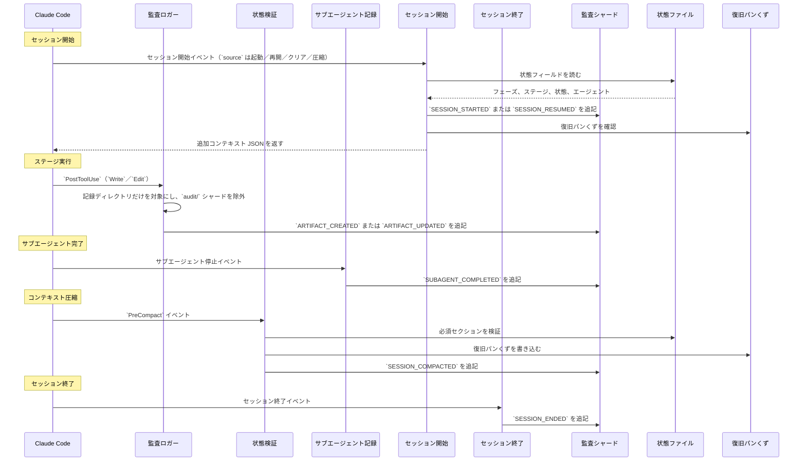

> 対象読者: ティア 2/3（チーム導入者、フレームワークコントリビューター）。

この章では、フックシステムアーキテクチャ、17 本すべてのフックスクリプト、監査イベントの分類、CLI ツール設定、そして決定論的ユーティリティツールを説明します。

> **パス規約。** 状態、監査、成果物はすべて、アクティブなインテントの**記録ディレクトリ**、すなわち `aidlc/spaces/<space>/intents/<YYMMDD>-<label>/` の下に置かれます。以下ではこれを `<record>/` と表記します（UTC 日付の短い接頭辞と短いケバブケースのラベルにより、記録ディレクトリが時系列順に並ぶようにするためです。正準 ID は `intents.json` のレジストリ行にある UUIDv7 です）。監査証跡は `<record>/audit/` 配下にあるクローンごとのシャードディレクトリであり、単一ファイルではありません。

---

<a id="hook-system-architecture"></a>
## フックシステムアーキテクチャ

この実装は `.claude/hooks/` 配下の 17 本のフックスクリプトを使います。17 本すべてが TypeScript（`bun` 経由で実行）です。17 本すべてが**プロジェクト全体**に対して登録されます。`settings.json` に登録されており（ステータスラインはトップレベルの `statusLine` キー、残り 16 本は `hooks` ブロック）、どのスキルが有効かに関係なく発火します。以前は分割されており（6 本は `aidlc/SKILL.md` のフロントマターにスキルスコープとして宣言され、残りがプロジェクト全体でした）、バージョン 0.6.0 でその 6 本も `settings.json` へ移されました。これにより、オーケストレーター、各パッケージ済みのスコープ／ステージランナー、そして手書きの顧客ランナーなど、どのエントリポイントもランナーごとの `hooks:` ブロックなしで決定論的な基幹機構を継承できます。

17 本のうち 11 本は**非ブロッキング**です。6 本は**フロー変更型**です。`Stop` フックは転送ループを回し続け、ディスパッチルールフックは入力の書き換えをサポートするハーネスで正確なアクティブステージルールをサブエージェントブリーフへ付加し、プラン承認ガードは時期尚早なコード生成ディスパッチを拒否し、レビュースコープフックは兄弟ユニットへのレビュアーアクセスを拒否し、レビューフリーズフックは新鮮な終端レビュー受領記録をゲート前に無効化してしまう `produces[]` への書き込みを拒否し、状態遷移ガードは `aidlc-orchestrate.ts report` を迂回する直接のライフサイクル呼び出しを拒否します。

```
.claude/hooks/
+-- record-human-turn.ts     # UserPromptSubmit + PostToolUse AskUserQuestion (project-wide, settings.json, TypeScript)
+-- deliver-stage-rules.ts    # PreToolUse Task|Agent (project-wide, settings.json, TypeScript, flow-altering)
+-- plan-approval-guard.ts # PreToolUse Task (project-wide, settings.json, TypeScript, flow-altering)
+-- state-transition-guard.ts # PreToolUse Bash (project-wide, settings.json, TypeScript, flow-altering)
+-- reviewer-scope.ts    # PreToolUse file/search/shell tools (project-wide, settings.json, TypeScript, flow-altering)
+-- review-freeze.ts     # PreToolUse file-write tools (project-wide, settings.json, TypeScript, flow-altering)
+-- write-audit-log.ts      # PostToolUse Write|Edit (project-wide, settings.json, TypeScript)
+-- run-sensors.ts       # PostToolUse Write|Edit (project-wide, settings.json, TypeScript)
+-- sync-workflow-state.ts   # PostToolUse TaskUpdate (project-wide, settings.json, TypeScript)
+-- rebuild-stage-graph.ts   # PostToolUse Bash (project-wide, settings.json, TypeScript)
+-- fold-usage.ts        # PreToolUse + PostToolUse (project-wide, settings.json, TypeScript, Claude-only producer)
+-- validate-state.ts    # PreCompact (project-wide, settings.json, TypeScript)
+-- log-subagent.ts      # SubagentStop (project-wide, settings.json, TypeScript)
+-- aidlc-continue-workflow.ts        # Stop (project-wide, settings.json, TypeScript, flow-altering)
+-- session-start.ts     # SessionStart (project-wide, settings.json, TypeScript)
+-- session-end.ts       # SessionEnd (project-wide, settings.json, TypeScript)
+-- aidlc-statusline.ts  # statusLine (project-wide, settings.json, TypeScript)
```

<a id="hook-summary"></a>
### フックの概要

| フック | イベント | 適用範囲 | マッチャー | 目的 |
|------|-------|---------|---------|---------|
| `record-human-turn.ts` | ユーザープロンプト送信 + `PostToolUse` | プロジェクト全体（`settings.json`） | （空）／`AskUserQuestion` | 実際の人間の各プロンプトと、回答済み `AskUserQuestion` ウィジェットごとに `HUMAN_TURN` イベントを記録します（承認やインタビューのゲートは入力したプロンプトではなくウィジェットのクリックです）。承認／インタビューのゲート確認は台帳を読み、最後のゲート解決以後に 1 件あることを要求するため、自動操縦中のモデルが人間の操作なしに承認を捏造できません |
| `deliver-stage-rules.ts` | `PreToolUse` | プロジェクト全体（`settings.json`） | `Task\|Agent` | **フロー変更型。**ディスパッチされるステージの実質的なアクティブスペースルールを解決し、その正確なバイト列をすべての AI-DLC サブエージェントブリーフへ付加します。Claude・Codex・opencode・Copilot の入力を書き換えます。Kiro CLI はツール引数を書き換えられないため、不完全なブリーフは助言的警告付きで進行します（Kiro CLI のエージェントは `resources` でアクティブメモリツリーをネイティブにプリロードします。読み込み不能な必須ルールは修復ガイダンス付きで引き続きブロック）。Kiro IDE はライブなメモリファイル参照付きの常時取り込みワークスペースステアリングを使います。正確なバンドルが既に存在する場合は冪等です |
| `plan-approval-guard.ts` | `PreToolUse` | プロジェクト全体（`settings.json`） | `Task` | **フロー変更型。**コード生成の「計画してから生成する」順序（ステージ手順 2〜4）を決定論的に強制します。アクティブディレクティブ（有効なマーカーが無ければ `Current Stage` へフォールバック）が code-generation の間、`aidlc-developer-agent` を対象とする `Task` ディスパッチは、唯一の明示マーカー `AIDLC-UNIT: <unit>` が、ディスクに空でない `code-generation-plan.md` を持ち、かつ Plan Approval 質問に明示的な「Approve Plan」応答が記録済みの既知ユニットを指していない限り拒否されます（終了コード 2 + リダイレクトされた標準エラー出力の理由）。各拒否は `PLAN_APPROVAL_BLOCKED` を出します。マーカーが欠落・矛盾・未知の場合は、プロンプト本文から推測せずブロックします。`AIDLC_DISABLE_PLAN_APPROVAL_GUARD=1` で強制を無効化できます |
| `state-transition-guard.ts` | `PreToolUse` | プロジェクト全体（`settings.json`） | `Bash` | **フロー変更型。**直接の `aidlc-state.ts` ライフサイクル動詞を拒否し、コンダクターを `aidlc-orchestrate.ts report` へ誘導します。ハーネスが委譲エージェントの識別情報を提供する場合は、レビュアーおよびサポートエージェントからのライフサイクル／ルーティングコマンドも拒否します。読み取り専用の状態照会と通常のビルド／検証コマンドは引き続き利用できます |
| `reviewer-scope.ts` | `PreToolUse` | プロジェクト全体（`settings.json`） | `Read\|Edit\|Write\|Glob\|Grep\|Bash` | **フロー変更型。**ユニット単位レビュアーの読み取り範囲境界（ステージプロトコル §12a）を決定論的に強制します。コンダクターのレビュアーディスパッチ記録（`<record>/.aidlc-reviewer-dispatch.json`）が新しい間、ディスパッチ済みレビュアーが兄弟ユニットの `construction/` パスへ届くツール呼び出し、つまり兄弟をまたぐファイルの読み書きや検索／グロブ／シェルのパターンを、記録の除外リストにない限り拒否します（終了コード 2 + リダイレクトされた標準エラー出力の理由）。各拒否は `REVIEWER_SCOPE_BLOCKED` を出します。曖昧さがある場合はすべてフェイルオープンです。`AIDLC_DISABLE_REVIEWER_SCOPE_HOOK=1` で強制を無効化できます |
| `review-freeze.ts` | `PreToolUse` | プロジェクト全体（`settings.json`） | `Read\|Edit\|Write\|Glob\|Grep\|Bash`（変更を伴う呼び出しに自己フィルタ） | **フロー変更型。**§12a の終端受領記録の順序を決定論的に強制します。レビュアーを持ち、まだ完了していないステージが宣言する `produces[]` 成果物に対する `Write`/`Edit` またはシェルによる変更は、新鮮な終端レビュー受領記録がその成果物を覆っている間は拒否されます（終了コード 2 + リダイレクトされた標準エラー出力の理由）。シェル経由の書き込みは `Write`/`Edit` の監査フィードを通らず、そのままでは変更後のバイト列に対して古い受領記録を残してしまうため、実行前に検査します。エンジンと同一の受領記録スキャン（`aidlc-lib.ts` の `freshReviewReceipts`）を共有するため、ゲートでの却下・ジャンプ・ワークフロー再開始が記録されると凍結は自動的に解除されます。上限未満の敵対的 NOT-READY は非終端のままで修復のために編集可能ですが、実効レビュークラスにおける終端 NOT-READY は READY と同様に凍結します。各拒否は `REVIEW_FREEZE_BLOCKED` を出します。曖昧さがある場合はすべてフェイルオープンです。`AIDLC_DISABLE_REVIEW_FREEZE_HOOK=1` で強制を無効化できます |
| `write-audit-log.ts` | `PostToolUse` | プロジェクト全体（`settings.json`） | `Write\|Edit` | 成果物書き込みを `audit/` シャードへ自動記録します |
| `run-sensors.ts` | `PostToolUse` | プロジェクト全体（`settings.json`） | `Write\|Edit` | アクティブディレクティブのステージで解決済みのセンサーを、一致する書き込みで発火させます（助言的であり、決してブロックしません）。ユニット主導の実行が `Current Stage` を追い越しても、状態に束縛されたインテント単位のマーカーが帰属を保ちます |
| `sync-workflow-state.ts` | `PostToolUse` | プロジェクト全体（`settings.json`） | `TaskUpdate` | ステージタスクが有効化されたときに状態ファイルを自動同期します |
| `rebuild-stage-graph.ts` | `PostToolUse` | プロジェクト全体（`settings.json`） | `Bash` | 成功した `intent-create` を、そのツールイベントの正確なホストセッション ID に束縛します。セッションが既に別のインテントを所有している場合は、一度限りのフレッシュセッション引き継ぎ受領記録を書き込みます。その後、遷移クラスの監査イベント出力時に `runtime-graph.json` を再コンパイルします |
| `fold-usage.ts` | `PreToolUse` + `PostToolUse` | プロジェクト全体（`settings.json`） | （空） | **Claude 専用。**LLM 呼び出しごとに、トランスクリプトの新しいトークン使用量を永続的な使用量台帳へ集約します。`PreToolUse` は完了しつつあるメイン呼び出しを確定し、エンジン境界の前には完了済みのサブエージェント呼び出しをすべて確定してライフサイクル集計を最新に保ちます。`PostToolUse` は通常の保留分のフォールバックを担います。観測専用で決してブロックしません。Claude Code のトランスクリプトリーダーは Claude ハーネスにのみ配線されているため、Kiro / Codex / opencode では生成側が動かず台帳は空のままです（使用量の消費側はすべてデータなしへ degrade します）。`AIDLC_DISABLE_USAGE_TRACKING=1` で無効化できます。後述の「トークン使用量とコストのトラッキング」を参照 |
| `validate-state.ts` | `PreCompact` | プロジェクト全体（`settings.json`） | （空） | 状態ファイルを検証し、復旧のパンくずを記録します |
| `log-subagent.ts` | サブエージェント停止 | プロジェクト全体（`settings.json`） | （空） | サブエージェント完了イベントを記録します |
| `aidlc-continue-workflow.ts` | `Stop` | プロジェクト全体（`settings.json`） | （空） | **フロー変更型。**ターン終了時に転送ループを強制します。`aidlc-orchestrate next` を実行し、`done` または `parked` なら停止を許可し、保留中のディレクティブがあれば停止をブロックして `reason` 経由で次の一手を再注入します。セッションの元の UUID と新たにアクティブになった UUID が `PostToolUse` の受領記録と一致する場合は、`intent-create` 後の一度限りのフレッシュセッション引き継ぎも許可します。現在のステージが承認待ち（`[?]`）、改訂中（`[R]`）、あるいは `[-]` 進行中でアクティブディレクティブの正準またはユニット単位の `<slug>-questions.md` に未回答の質問がある、または未解決の `DECISION_RECORDED` が記録されている場合、あるいは終了ターンが会話だった場合は停止を許可します。記録済み判断と会話の除外規定は自律構築では抑制されます。質問保留の除外規定も同様に抑制されますが、ユニット主導のコード生成における必須の Plan Approval だけは例外です。再帰は有界であり（進捗なしカウンタ + `stop_hook_active`。`CLAUDE_CODE_STOP_HOOK_BLOCK_CAP` の下で動作し、既定値は対話実行では 2、自律構築では 8）、AI-DLC ワークフロー外では何もしません |
| `session-start.ts` | セッション開始 | プロジェクト全体（`settings.json`） | （空） | セッション再開時にワークフロー文脈を注入します |
| `session-end.ts` | セッション終了 | プロジェクト全体（`settings.json`） | （空） | 正常終了時に、そのセッションに紐づくインテントへ `SESSION_ENDED` を発行します。UUID 束縛のワークフローにセッション紐付けが無い場合は、共有のアクティブカーソルにフォールバックせずフェイルクローズします |
| `aidlc-statusline.ts` | `statusLine` | プロジェクト全体（`settings.json`） | -- | 端末にリアルタイム進捗を表示します |

<a id="shared-characteristics"></a>
### 共通の特性

17 本すべての TypeScript フックには、次の共通性があります。

- TypeScript で書かれ、`bun` 経由で実行される
- 実行権限を必要とせず、マック OS、リナックス、ネイティブ Windows PowerShell で同一に動作する
- Claude Code から標準入力経由で JSON を受け取る
- ネイティブの JSON 解析を使用する（`jq` 依存なし）
- 成功時またはスキップ時には終了コード 0 を返す（`Stop` フックもブロック時は終了コード 0 です。ブロックは標準出力上の `{"decision":"block"}` JSON オブジェクトで示されます。4 本の `PreToolUse` 制御フックは、回復不能または再試行可能な拒否を、終了コード 2 + 標準エラー出力上の理由で通知します）
- 複数のフォールバック方法で `$CLAUDE_PROJECT_DIR` を解決する
- `lib.ts` からロックとユーティリティ関数を共有する

<a id="audit-event-flow"></a>
### 監査イベントの流れ


```mermaid
sequenceDiagram
    participant CC as Claude Code
    participant AL as 監査ロガー
    participant VS as 状態検証
    participant LS as サブエージェント記録
    participant SS as セッション開始
    participant SE as セッション終了
    participant AF as 監査シャード
    participant SF as 状態ファイル
    participant RF as 復旧パンくず

    Note over CC: セッション開始
    CC->>SS: セッション開始イベント（`source` は起動／再開／クリア／圧縮）
    SS->>SF: 状態フィールドを読む
    SF-->>SS: フェーズ、ステージ、状態、エージェント
    SS->>AF: `SESSION_STARTED` または `SESSION_RESUMED` を追記
    SS->>RF: 復旧パンくずを確認
    SS-->>CC: 追加コンテキスト JSON を返す

    Note over CC: ステージ実行
    CC->>AL: `PostToolUse`（`Write`／`Edit`）
    AL->>AL: 記録ディレクトリだけを対象にし、`audit/` シャードを除外
    AL->>AF: `ARTIFACT_CREATED` または `ARTIFACT_UPDATED` を追記

    Note over CC: サブエージェント完了
    CC->>LS: サブエージェント停止イベント
    LS->>AF: `SUBAGENT_COMPLETED` を追記

    Note over CC: コンテキスト圧縮
    CC->>VS: `PreCompact` イベント
    VS->>SF: 必須セクションを検証
    VS->>RF: 復旧パンくずを書き込む
    VS->>AF: `SESSION_COMPACTED` を追記

    Note over CC: セッション終了
    CC->>SE: セッション終了イベント
    SE->>AF: `SESSION_ENDED` を追記
```

---

<a id="workflow-spine-hooks"></a>
## ワークフロー基幹フック

この 6 本のフック（監査／センサー／ステータスライン／ランタイムコンパイル／状態検証／サブエージェントの基幹）は `settings.json` にプロジェクト全体で登録されています。常に有効ですが、それぞれが**自己ゲート**します。アクティブなワークフロー（`aidlc-state.md` またはアクティブなインテントの `audit/` シャード）が存在しないと早期終了するため、監査ログや状態同期が AI-DLC でないセッションを汚すことはありません。バージョン 0.6.0 より前は `aidlc/SKILL.md` フロントマターにスキルスコープとして宣言されていました。`settings.json` へ移したことで、オーケストレーターとすべてのパッケージ済み／手書きランナーが `hooks:` ブロックを複製せずにこの基幹を継承できます。

<a id="posttooluse-write-audit-logts"></a>
### `PostToolUse`: `write-audit-log.ts`

**ソース:** `.claude/hooks/aidlc-write-audit-log.ts`  
**トリガー:** 各 `Write` または `Edit` の Claude Code ツール呼び出しの後（マッチャー: `"Write|Edit"`）  
**目的:** インテントの `audit/` シャードへ成果物書き込みを自動記録する

**処理手順:**

1. **プロジェクトディレクトリ解決:** `$CLAUDE_PROJECT_DIR` を解決し、スクリプトパス由来の導出とカレントディレクトリ検出へフォールバックします。
2. **健全性ハートビート:** UTC タイムスタンプを `.aidlc-hooks-health/write-audit-log.last` に書き込みます。
3. **JSON 解析:** 標準入力を読み、`tool_name` と `tool_input.file_path` を取り出します。
4. **パス絞り込み:** インテントの記録ディレクトリ配下でないファイルはスキップします。`audit/` シャード自身もスキップします（再帰回避）。
5. **監査ファイルガード:** アクティブなインテントの `audit/` シャードが存在しなければ無言で終了します（作成するのはフレームワークです）。
6. **文脈抽出:** 記録ディレクトリまでのパス接頭辞を剥がし、`/` を ` > ` に置き換えてパンくずを作ります（例: `inception > requirements-analysis > requirements.md`）。
7. **原子的ロック:** システムの一時ディレクトリ（`os.tmpdir()`）に `mkdir` ベースのロックを作り、3 回再試行（100 ミリ秒遅延）します。ハッシュによりロックはプロジェクトごとに分離されます。
8. **ログエントリ:** `appendAuditEntry` を通じて、正準な `ARTIFACT_CREATED`（`Write` で新規パスの場合）または `ARTIFACT_UPDATED`（`Edit`、または既存への `Write` 上書きの場合）イベントを追記します。フィールドはタイムスタンプ、イベント、ツール、ファイル、文脈です。

<a id="posttooluse-sync-workflow-statets"></a>
### `PostToolUse`: `sync-workflow-state.ts`

**ソース:** `.claude/hooks/aidlc-sync-workflow-state.ts`  
**トリガー:** 各 `TaskUpdate` 呼び出しの後（マッチャー: `"TaskUpdate"`）  
**目的:** ステージタスクが `in_progress` になったとき `aidlc-state.md` を自動同期する

**処理手順:**

1. **プロジェクトディレクトリ解決:** `write-audit-log.ts` と同じ複数フォールバックパターンです。
2. **状態フィルタ:** `status` が `in_progress` のときだけ発火します。`completed`、`pending` などでは無言で終了します。
3. **`activeForm` フィルタ:** `activeForm` フィールドがない、または `[slug]` 接尾辞パターンがない場合は無言で終了します。
4. **状態ファイルガード:** `aidlc-state.md` が存在しなければ無言で終了します（初期化前）。
5. **健全性ハートビート:** `.aidlc-hooks-health/sync-workflow-state.last` に書き込みます。
6. **状態同期:** `bun aidlc-utility.ts set-status --stage <slug>` を呼びます（通常はフェーズ、ステージ、エージェント、チェックボックスを更新）。ユニット主導の有効な差し込みディレクティブの場合は、一時的な状態フィールドとマーカーのダイジェストだけを更新し、恒久的な先頭ステージのカーソル・`In Progress`・チェックボックスは保持します。

**設計メモ:**

- ステージジャンプタスク（`[slug]` を持たないもの）や依存関係配線の `TaskUpdate`（`activeForm` を持たないもの）は自然に除外されます。
- 有効化されたスラッグが、状態に束縛されたアクティブディレクティブのマーカーと一致する場合、`set-status` はそのマーカーの状態ダイジェストを更新しつつユニットは保持します。ユニット主導の差し込みディレクティブでは、`Current Stage`・`In Progress`・恒久カーソルのチェックボックスも据え置くため、グリッド完了後のゲートカスケードはブロックの先頭ステージから始まります。
- このフックは既存の `set-status` サブコマンドを呼びます。新しいコードパスは不要です。

<a id="posttooluse-run-sensorsts"></a>
### `PostToolUse`: `run-sensors.ts`

**ソース:** `.claude/hooks/aidlc-run-sensors.ts`  
**トリガー:** 各 `Write` または `Edit` の Claude Code ツール呼び出しの後（マッチャー: `"Write|Edit"`）  
**目的:** アクティブディレクティブのステージのコンパイル解決済みセンサーを、一致する書き込みに対して発火させる（助言的。決してブロックしない）

**処理手順:**

1. **プロジェクトディレクトリ解決:** `write-audit-log.ts` と同じ複数フォールバックパターンです。
2. **監査 + 状態ガード:** `audit/` シャードまたは `aidlc-state.md` が存在しなければ無言で終了します（初期化前）。
3. **アクティブステージ読み取り:** エンジンは、検証を通った最終の `run-stage` を、アクティブなインテントの gitignore 済み `.aidlc-active-directive.json` に、`aidlc-state.md` の SHA-256 と正確に束ねて原子的に記録します。タスク有効化はスラッグがマーカーと一致するときだけダイジェストを更新するため、ユニット単位ディレクティブのユニットは保持されつつ、無関係な状態変更は棄却されます。フックはダイジェストが一致する間そのステージを使い、`stage-graph.json` からその `sensors_applicable` 配列を読みます。これにより、恒久カーソルが手前の設計ステージに留まっていても、ユニット主導のコード生成の診断は `code-generation` の下に収まります。隔離された `--single` ディレクティブはメインワークフローのマーカーを置き換え、`report --single` の成功でクリアされます。マーカーが欠落・不正・陳腐化・グラフ未知の場合は `Current Stage` にフォールバックします。
4. **ディスパッチ:** 適用可能な各センサーに対して `aidlc-sensor.ts fire <id> --stage <slug> --output-path <path>` を起動します。ディスパッチャ側で各センサーの `matches` グロブをフック側から適用します。一致しない書き込みはスキップされます。結果は助言的であり、フックが書き込みをブロックすることはありません。
5. **健全性ハートビート:** 実際に発火したとき `.aidlc-hooks-health/run-sensors.last` を書き込みます。これにより診断は、フックが健全に待機しているのか無言失敗しているのかを区別できます。

マニフェストスキーマと発火ライフサイクルについては [センサーシステム](/reference/sensor-system) を参照してください。

<a id="posttooluse-rebuild-stage-graphts"></a>
### `PostToolUse`: `rebuild-stage-graph.ts`

**ソース:** `.claude/hooks/aidlc-rebuild-stage-graph.ts`  
**トリガー:** 各 `Bash` の Claude Code ツール呼び出しの後（マッチャー: `"Bash"`）  
**目的:** ワークフロー開始前のセッションを、そのシェル呼び出しにより誕生したインテントへ束縛し、遷移クラスの監査イベントが着地した直後に `runtime-graph.json` を再コンパイルする

**処理手順:**

1. **セッション束縛:** グラフフィルタの前に、`PostToolUse` イベントの正確な `session_id` を、成功した `intent-create` の結果レコードとスペースに対応付けます。`intents.json` を通じてそのレコードを解決し、未束縛のセッションにはスタンプを付け、既存の所有権がある場合はそれを保持したまま、元のインテント UUID と新たにアクティブなインテント UUID を名指しする短命の引き継ぎ受領記録を書き込みます。
2. **コマンドフィルタ:** `bun .claude/tools/aidlc-(state|jump|bolt|utility).ts` 呼び出しだけがグラフの早期終了を通過します。`aidlc-runtime.ts` は再帰防止のため明示的に拒否されます。
3. **監査存在ガード:** 初期化前、つまり `audit/` シャードがまだない段階ではきれいに終了します。
4. **健全性ハートビート:** `.aidlc-hooks-health/rebuild-stage-graph.last` に書き込みます。
5. **末尾読み取り:** 結合済み `audit/` シャードを `\n---\n` で分割し、最後の 3 ブロックを取ります（単一の `approve` 呼び出しが追記し得る上限）。
6. **イベントクラスフィルタ:** 最後の 3 ブロックのいずれかに `GATE_APPROVED`、`STAGE_STARTED`、`STAGE_AWAITING_APPROVAL`、`AUDIT_MERGED`、`WORKFLOW_COMPLETED` が含まれる場合だけ再コンパイルします。一致しなければ終了します。
7. **ディスパッチ:** `bun aidlc-runtime.ts compile` を起動します。非ゼロ終了の場合は `--doctor` 向けのフック脱落を記録しますが、親の `Bash` 呼び出しはブロックしません。

コンパイルライフサイクルと固定スキーマについては [ランタイムグラフ](/reference/runtime-graph) を参照してください。

<a id="precompact-validate-statets"></a>
### `PreCompact`: `validate-state.ts`

**ソース:** `.claude/hooks/aidlc-validate-state.ts`  
**トリガー:** Claude Code が会話コンテキストを圧縮する前（マッチャー: 空 = 常時）  
**目的:** セクション存在チェック（情報提供のみ。圧縮はブロックしない）と復旧パンくずの書き込み

**処理手順:**

1. **状態ファイルガード:** `aidlc-state.md` が存在しなければきれいに終了します。
2. **セクション検証:** `grep -q` を使って 2 つの必須セクションを確認します。
   - `## Stage Progress` -- すべてのステージの完了状態を持つチェックリスト
   - `## Current Status` -- 現在のフェーズ、ステージ、スコープ
   どちらかのセクションが欠けている場合は警告を出します（情報提供のみであり、圧縮はブロックできません）。
3. **復旧パンくず:** `.aidlc-recovery.md` を書き込みます。内容は現在のステージと検証タイムスタンプです。セッション再開時にフレームワークがこれと `aidlc-state.md` を比較し、圧縮起因の状態破損を検出します。

**なぜ重要か:**

コンテキスト圧縮は会話履歴を破棄します。ステージ途中で圧縮が起きると、モデルは自分が何をしていたかを見失います。復旧パンくずは、圧縮をまたいで残る外部チェックポイントを提供します。

<a id="subagentstop-log-subagentts"></a>
### サブエージェント停止: `log-subagent.ts`

**ソース:** `.claude/hooks/aidlc-log-subagent.ts`  
**トリガー:** 任意のサブエージェント（Claude Code の `Task` ツール呼び出し）が完了したとき（マッチャー: 空 = 常時）  
**目的:** サブエージェント完了イベントを監査証跡へ記録する

**処理手順:**

1. **プロジェクトディレクトリ解決:** `write-audit-log.ts` と同じ複数フォールバックパターンです。
2. **健全性ハートビート:** `.aidlc-hooks-health/log-subagent.last` に書き込みます。
3. **JSON 解析:** `agent_type`（既定は `"unknown"`）、`agent_id`、`last_assistant_message`（200 文字で切り詰め）を取り出します。
4. **監査ファイルガード:** `audit/` シャードが存在しなければ無言で終了します。
5. **エントリ組み立て:** `appendAuditEntry` を通じて正準な `SUBAGENT_COMPLETED` イベントを発行します。フィールドはタイムスタンプ、イベント、エージェント種別、必要に応じてエージェント ID と切り詰め済みメッセージです。
6. **原子的ロック:** `write-audit-log.ts` と同じ `mkdir` ベースパターンを使います（`lib.ts` に統一済み）が、競合を避けるため別のロック名を使います。

**ディスパッチされたすべてのエージェントで発火:**

- ステージ 2.1（リバースエンジニアリング、`mode: pipeline`）-- リポジトリごとに 2 回発火します（`aidlc-developer-agent` のコード走査、その後 `aidlc-architect-agent` の合成）
- ステージ 3.5（コード生成、`mode: subagent`）-- `aidlc-developer-agent` です（作業ユニットごとに 1 回）
- アンサンブルステージ（`mode: mob`、またはサポートエージェント付き `subagent`）-- ディスパッチされたコラボレーターごと、およびリードのディスパッチごとに 1 回発火します（例: user-stories は 3 体のコラボレーターそれぞれで発火）

ワークスペース検出（0.2）は以前はサブエージェントでしたが、現在は `aidlc-utility intent-create` の中で決定論的に動くため、このフックは初期化中にはもう発火しません。

---

<a id="stop-aidlc-continue-workflowts"></a>
### `Stop`: `aidlc-continue-workflow.ts`

**ソース:** `.claude/hooks/aidlc-continue-workflow.ts`  
**トリガー:** コンダクターが自分のターンを終えようとしたとき（マッチャー: 空 = 常時。ただし `/aidlc` がアクティブな間）  
**目的:** 対話型の転送ループを強制する。エンジンがワークフローを `done` と報告するまで回し続ける

これはフレームワークに 5 本あるフロー変更型フックの 1 つで、下の 4 本の `PreToolUse` 制御フックと並びます。このフックはターンの終了を止めるために `{"decision":"block"}` を返すことがあります。他の 11 本のフックは観測して終了コード 0 を返します。ゲート付きかつ会話的な経路では、ループを保持しているのはコンダクター（LLM）です。なぜなら人間に質問できるのはコンダクターだけだからです。そのため、もしコンダクターがエンジンへ確認することを忘れるとワークフローがドリフトします。このフックは、その依存を LLM の注意深さから切り離します。ループはハーネスによって強制されます。

**処理手順:**

1. **標準入力イディオム:** `log-subagent.ts` を踏襲します。TTY であれば Claude Code 由来の JSON は来ていない（テスト／デバッグ）ので停止を許可します。それ以外では `Stop` フック JSON を読み、そこから必要なのは `stop_hook_active` だけです。
2. **AI-DLC 外では何もしない:** プロジェクトディレクトリ配下にアクティブなインテントの `aidlc-state.md` がなければ、強制すべきものがないので停止を許可します。フロントマターの `Stop` マッチャーですでに `/aidlc` にスコープされていますが、非 AI-DLC セッションがブロックされないようにこれは防御の多層化です。
3. **エンジンを構成する:** `bun .claude/tools/aidlc-orchestrate.ts next --project-dir <dir>` を実行し、ディレクティブの `kind` を解析します。状態を再導出するのではなく、エンジンを構成します。
4. **`done` → 許可:** ディレクティブが `done` ならワークフローは完了しています。このフックは何も発行せず終了コード 0 し（先例となる非ブロッキングパターン）、再帰カウンタをクリアします。
5. **`parked` → 許可:** ディレクティブが `parked` ならワークフローは後続セッション向けに途中のまま意図的に駐車されています（`aidlc-orchestrate park`）。フックは `done` とまったく同様に停止を許可し、カウンタをクリアします。これがサポートされた複数セッション終了です。これがないときれいな停止は `done` しかなく、長いワークフロー上のエージェントは残りステージを形だけ承認することでしか到達できません（#367）。**自律ガード（#365）:** `parked` 許可は自律構築（`Construction Autonomy Mode: autonomous`）では無効であり、その場合 `parked` ディレクティブは下の上限有界ブロックへ流れてループを継続させます。
6. **人間待ち → 許可:** ディレクティブが保留中でも、コンダクターが正しく人間待ちしている（あるいは単に会話している）ならフックは停止を許可し、促しを連打せずに脱落を記録します。該当するのは 5 ケースです。現在のステージのチェックボックスが明示的に `[?]`（承認待ち）、`[R]`（改訂中）、未回答の `[Answer]:` タグを持つ `<slug>-questions.md` が存在する `[-]` 進行中、後続の `QUESTION_ANSWERED` を持たない現在ステージの `DECISION_RECORDED` がある `[-]` 進行中、あるいは終了ターン自体が会話だった場合です。記録済み判断と会話ターンは自律構築では抑制されます。ファイル裏付けの質問も同様に抑制されますが、ユニット主導のコード生成における必須の Plan Approval 質問だけは例外です。これは肯定確認のみです。その他の状態、チェックボックス行不在、未解決のファイル／記録済み質問の不在、トランスクリプトなし／人間プロンプトなし／応答ターン中にエンジン呼び出しがある場合、あるいは解析エラーの場合は、すべて下のブロックに流れます。詳しくは後述の「人間待ちの例外」を参照してください。
7. **保留 → ブロックして注入:** それ以外の保留ディレクティブ、つまり `run-stage`、`dispatch-subagent`、`invoke-swarm`、`present-gate`、`ask`、`print`、`error` では、`{"decision":"block","reason":<on-task continuation>}` を出力し、同じセッションが次の一手を注入された状態で再開します。この注入される `reason` は、きれいな一時停止の代替として `aidlc-orchestrate park` も明示するため、長いワークフローを止めたいコンダクターは前進するのではなく駐車します。
8. **フェイルオープン:** 予期しない失敗（状態が読めない、エンジンが非ゼロ終了または解析不能なディレクティブを返す、標準入力が壊れているなど）が起きた場合は停止を許可し、脱落を記録します。ブロック可能なフックがターンを閉じ込めることのないよう、フェイルオープンだけが安全な失敗モードです。

**保安特性 — `reason` は作業継続であり、上書きではない。**

注入される `reason` は、コンダクターがまだ負っている作業、すなわち「転送ループを回し、ディレクティブに従って行動し、その後報告する」という作業継続だけを述べます。新しいことや範囲外のことをさせる上書きにはなりません。上書き形状のディレクティブは、コンダクター自身の安全訓練によって拒否されます。その拒否こそがこの保安特性です。したがって、欠陥のある、あるいは侵害されたエンジンであっても、実行できるのは許可済み作業の*継続*だけであり、ユーザーに反してセッションを乗っ取ることはできません。

**再帰ガード — 固着したブロックがセッションを閉じ込めない。**

永遠に再発火するブロックは、フックがターンを閉じ込めうる唯一の経路です。そのため再帰は 2 つのネイティブな手段で有界にされています。

- **`stop_hook_active`** — Claude Code は、現在の停止が過去の `Stop` フックブロックの結果であるときこれを真に設定します。フックはこれを、自分がすでにブロック列の中にいることを示す信号として読みます。
- **進捗なしカウンタ** — フックは `<record>/.aidlc-stop-hook/block-count.json`（インテントの記録ディレクトリ内）に小さな記録を永続化します。キーはワークフローの*進捗署名*（現在ステージのスラッグ + 監査末尾の長さ）です。ワークフローを前進させる `report` が走るとこの署名は変わるため、カウンタはリセットされます。健全なループが絞られることはありません。署名が連続ブロック間で変わらなければ（`report` が走っていない）、カウンタは増加します。進捗なしの連続が上限に達すると、すなわち `CLAUDE_CODE_STOP_HOOK_BLOCK_CAP`（既定値は**実行モード依存**で、対話実行では 2、自律構築では 8。対話では、会話中または一時停止中の人間を 1 回の促し後に解放するため 2、自律では無人ループを完了まで進めるため 8）に達すると、フックはターンを**解放**し（停止を許可し）、したがって固着ループは必ず手を放します。明示的な `CLAUDE_CODE_STOP_HOOK_BLOCK_CAP` は両既定値を上書きします。

**人間待ちの例外 — 対話ゲートは罰しない。**

コンダクターが人間待ちのためにターンを終える、または単に会話しているという 5 つのケースでは、フックが促しを連打しないよう扱われます。

- **エスケープは自由。** ユーザー割り込み（エスケープキー）では `Stop` フック自体が発火しないため、手動割り込みが閉じ込められることはありません。このケースにコードは不要です。
- **承認ゲートは自由ではない。** コンダクターが `AskUserQuestion` の回答待ちでターンを終えるとき、`Stop` フックは**発火します**。承認ゲート（現在ステージが `[?]` 承認待ち）または変更依頼ループ（`[R]` 改訂中）では、エンジンは依然として進行中ステージに対する保留の `run-stage` を再発行するため、例外がなければフックはブロックして転送ループの促しを上限まで再注入し続けます。これは対話ゲートでは混乱を招きます。そこで現在ステージのチェックボックスが明示的に `[?]`／`[R]` であれば停止を許可します。これは**肯定確認のみかつフェイルオープン**です。解放を速めるだけで、より多くブロックすることはありません。チェックボックス行不在や解析エラーは上限有界ブロックへ流れるため、本当のステージ途中離脱は依然として促されます。
- **ステージ途中の確認質問も自由ではない。** その種の質問はステージを `[-]` 進行中に置いたまま待機させます。これは怠惰な離脱と同じチェックボックス状態なので、`[-]` だけでは例外にできません。しかしコンダクターは質問する前に空の `[Answer]:` タグを持つ `<slug>-questions.md` を作らねばならないため（ステージプロトコル §3）、未回答タグは質問保留中の正の信号です。フックは正準の `<record>/<phase>/<slug>/` ディレクトリを確認します。ユニット単位の構築ディレクティブの場合は、`next` が指名する正確な `<record>/construction/<unit>/<slug>/` を確認し、別ユニットの古い質問は受け付けません。現在の `[-]` ステージの質問ファイルに未回答タグがあるとき、フックは停止を許可します。これは**厳格にゲート**されており、自律構築（`Construction Autonomy Mode: autonomous`）では決して発火しません。ファイル不在、全回答済み、自律モード、読み取りエラーのいずれでも上限有界ブロックへ流れるため、本当のステージ途中離脱は依然として促されます。（残留ケースへの即時緩和は `CLAUDE_CODE_STOP_HOOK_BLOCK_CAP=1` です。）
- **記録された構造化質問も人間待ちの一種です。** ゲート以外の一部のプロンプト、特に §13 の学び（learnings）に関する質問は、ステージの質問ファイルに空欄タグを追加しません。その代わり、必須の監査ハンドシェイクが同等の正の信号を与えます。`DECISION_RECORDED` が現在ステージの質問を開き、`QUESTION_ANSWERED` がそれを閉じます。その判断が未解決のまま現在ステージが `[-]` である間、フックは停止を許可し、散文レンダリングのハーネスが次の人間メッセージを待てるようにします。解決済み、または別ステージの判断はこれに該当せず、自律構築ではこの例外規定は抑制されます。
- **会話ターンも自由ではない。** アクティブなワークフロー中でも、人間がただ会話したいだけ（質問、意思決定の相談）ならループへ引き戻されるべきではありません。フックは、直近の真正な人間プロンプトに対して**ワークフローエンジン関与なし**で回答したとき停止を許可します。つまりそのプロンプト以降、コンダクターが `aidlc-orchestrate` も `aidlc-state` も実行していないことが条件です。読み取り専用照会（`--status`、`--doctor`、`--help`、`--version`）は関与と見なされないため、「今どのステージ?」に `--status` で答えた会話もチャットとして扱われます。これは**厳格にゲートされフェイルクローズ**です。自律構築では決して発火せず、証拠の不在／読み取り不能、人間プロンプトが見つからない、応答ターンにエンジン呼び出しがある、のいずれでも上限有界ブロックへ流れるため、ワークフローに触れておきながらループ途中で離脱したコンダクターは依然として促されます。これは許可しかしません。ブロックを増やすことは決してありません。

  **1 つの述語、2 つの証拠源。** 質問はどのハーネスでも同一です。異なるのは証拠だけです。

  | 証拠 | ハーネス | 「直近の人間プロンプト以降エンジン呼び出しがゼロか」への回答方法 |
  |---|---|---|
  | `Stop` ペイロード上の `transcript_path` | Claude Code、Codex | ターン履歴を解析し、`isEngineToolCall` で各ツール呼び出しを分類します。最も忠実度が高く、配信される場合はこちらを優先します。 |
  | マーカーの mtime | Kiro IDE、Kiro CLI、opencode | `<record>/.aidlc-human-turn` と `<record>/.aidlc-engine-touch` を比較します。人間ターンが直近のエンジン前進より**新しい**ことは、同じ質問をマーカーで綴ったものですが、その答えは**より粗い粒度**になります。詳しくは後述のカバレッジギャップを参照してください。 |

  これらのハーネスは、フックにターン履歴をまったく公開しません。opencode の `session.idle` にはトランスクリプトが含まれず、Kiro の `Stop` ペイロードには `{session_id, hook_event_name, cwd}` しか含まれません — これは IDE 1.x で実測したものです。トランスクリプトもターン ID もありません。（より豊富な `{tool_name, tool_input, tool_response}` の形は `Stop` ではなく*ツール*トリガーに属します。また「v1」「v2」はペイロードではなくフックの**登録スキーマ**を指す名前です — [kiro-ide-hook-payload.md](/reference/kiro-ide-hook-payload) を参照してください。）そこでフレームワークは、既存の継ぎ目でこの 2 つの事実を自ら書き込みます。`UserPromptSubmit` の発行処理は、`HUMAN_TURN` 台帳イベントと共に `.aidlc-human-turn` へタッチし、`aidlc-orchestrate` は前進する `next` / `report` / `park` のたびに `.aidlc-engine-touch` へタッチします。監査台帳を読む方式ではなくマーカー方式を選んだのは、**`next` が読み取り専用で監査イベントを発行しないため**です — 台帳だけに頼る述語では、エンジンに確認しておきながらループ途中で離脱したコンダクターを見逃してしまいますが、それはまさに転送ループが捕まえるために存在する失敗そのものです。

  **カバレッジギャップ — マーカー方式はトランスクリプト方式より寛容です。** 2 つの述語は読み取り専用の除外については一致していますが、すべてで一致するわけではありません。`isEngineToolCall` は、読み取り専用でない `aidlc-jump` / `aidlc-bolt` / `aidlc-swarm` の呼び出しと、変更を伴う `aidlc-state` の動詞（`approve`、`advance`、`skip`、`set` など）をすべて関与としてカウントします。**これらのツールはいずれもエンジンマーカーに触れません** — その書き手は `aidlc-orchestrate` の 3 つのサブコマンドだけです。そのため、トランスクリプトを持たないハーネスでは、`aidlc-jump`（ステージポインタを変更し、監査を発行する）を実行してからエンジンに確認せずターンを終えたコンダクターは*会話的*と読み取られて解放されますが、同じターンは Claude Code と Codex ではブロックされます。これらのターンはマーカー方式が存在する前は促されていたため、これは単なる未実装ではなく、Kiro と opencode における本物の — ただし狭い — 緩和です。これを塞ぐには、4 つのツールすべてが通過する継ぎ目（監査発行経路、または `writeStateFile`）からマーカーへ触れる必要があり、その影響範囲はこの例外規定をはるかに超えて広がるため、塞ぐのではなく文書化するにとどめています。

  **セッションスコープ。** どちらのマーカーもインテント単位であり、セッションキーを持ちません。一方でトランスクリプトによる述語は本来セッション単位でした。1 つのインテントに対する 2 つの同時セッション（たとえば IDE ウィンドウと CLI 実行）はクロストークし得ます。セッション B のプロンプト発行が、セッション A の関与済みの停止を会話的と読ませてしまうことがあります。この窓は狭く、失敗モードは誤った遷移ではなく停止の解放であるため、現時点では許容しています。塞ぐ価値が出た場合に備えて、Kiro のペイロードには `session_id` が含まれています。

  **要となる細部:** `Stop` フック自体がエンジンに確認を取ります（保留中の作業があるかを知るために `aidlc-orchestrate next` を実行します）。もしこのプローブがエンジンマーカーに触れてしまうと、エンジンの mtime は常に人間の mtime より新しくなり、述語は永遠に偽になってしまいます — 例外規定は実装されているように見えて何もしないことになります。そのためフックは起動時に `AIDLC_STOP_HOOK_PROBE=1` を設定し、エンジンはこれを検知するとタッチをスキップします。

  どちらのマーカーも、インテントの記録ルート配下に `.aidlc-stop-hook/block-count.json` と並んで置かれ、同梱の `aidlc/spaces/*/intents/*/.aidlc-*` の gitignore ルールでカバーされるため、コミットされることはありません。どちらの読み取りも**フェイルクローズ**です。マーカーが存在しない場合（アップグレード前のワークスペース、またはマーカー出荷後に一度もワークフローが前進していない場合）は「証拠なし」と読み取られ、「エンジンに一度も触れられていない」とは解釈されません。したがって例外規定は推測に走らず不活性のままです。書き込みに失敗したマーカーは、古いまま残さず削除されます — 古い*エンジン*マーカーは、人間マーカーがそれを追い越して前進し続けるため、持続的でサイレントな fail-open になってしまうからです。

  **この例外規定が何を変えるかは、ホストがブロックに反応するかどうかで決まります。** `{decision: block}` という契約は Claude Code のものであり、他の各ホストはそれぞれの流儀でこれを消費する、あるいは消費しません。

  | ホスト | ブロックに反応するか | 例外規定の効果 |
  |---|---|---|
  | Claude Code、Codex | はい — ネイティブ契約 | 促しは抑制され、ターンはきれいに終了します |
  | opencode | はい — プラグイン自身がブロックを解析し、`reason` を添えてセッションに再度プロンプトします | 促しは抑制されます |
  | Kiro IDE | **いいえ。** IDE 1.x でプローブフックを使って実測しました。コマンドは実行されましたが、標準出力も標準エラー出力もエージェントへ届きませんでした。Kiro は `Stop` をブロック可能な集合の外として文書化しており、標準出力を転送するのは `SessionStart` / `UserPromptSubmit` だけです | ユーザーから見える変化はありません。補正されるのは `continue-workflow.drops` と進捗なしカウンタだけです — そもそも促しはここには届いていませんでした |
  | Kiro CLI 2.16.0 legacy/V2 | **はい — このハーネスのアダプター経由で実測しました。** ホストは `{"decision":"block","reason":"..."}` を消費して `reason` を再注入し、誘発された継続の後に再び `Stop` を発火します（合計 2 回の `Stop` 呼び出し） | 促しは抑制されます |
  | Kiro CLI 2.16.0 `--v3`/KAS | **はい — 単独の `.kiro/hooks` 登録経由で実測しました。** ホストは同じブロック形式を消費して `reason` を再注入します。`Stop` は 1 回発火し、誘発された継続の後には再発火しませんでした | 促しは抑制されます |

  つまり Kiro IDE では、この節で説明した強制はフックにではなくコンダクター自身の `Stop` プロトコルに依存しています — これは `aidlc-continue-workflow.json` がこれまでずっと宣言してきたことです。そこでのフックは、転送ループに対するゲートではなく、その監査だと捉えてください。

> **センサー発火フックの助言契約との対比。** `aidlc-run-sensors.ts` には明示的な `never-block` 契約があります（`{decision: block}` を返さないことを `t95` ケース 7 が検証）。これは*そのフック自身*の助言契約であり、フレームワーク全体としてブロックを禁じるものではありません。ループ強制に `block` を使う `Stop` フックは、別の認可済み契約です。

---

<a id="pretooluse-aidlc-deliver-stage-rulests"></a>
### `PreToolUse`: `aidlc-deliver-stage-rules.ts`

**ソース:** `.claude/hooks/aidlc-deliver-stage-rules.ts`  
**トリガー:** AI-DLC サブエージェント呼び出しの前（Claude では `Task` または `Agent`。他ハーネスではアダプタ相当）  
**目的:** コンダクターからワーカーへの境界をまたいで、正確なアクティブステージルールを保持する

オーケストレーションエンジンは、実質的なルールを有界の `load-steering` チャンクでコンダクターへ既に配信しています。このフックは次の境界を閉じます。ディスパッチ対象ステージを、まず有効な明示的ステージファイルパスから、次に状態ファイルの `Current Stage` から、ライブなステージが無い場合は最後に一意なスラグ言及から解決します。未知のパス形の参照はライブステージへのフォールバックを抑制しません。エンジンと同じアクティブスペースのルール一覧を読み、正確なファイル内容をダイジェストマーカー付きバンドルとして付加します。生成された完全なブロックだけが「配信済み」と見なされるため、マーカーなしのコピーやルールを言い換えた散文では注入を回避できず、再試行は冪等のままです。コンポーザーを除くインストール済みエージェント一覧の全員（プラグイン所有のエージェントを含む）が対象で、一覧外のターゲットは変更されずに通過します。

Claude と Codex は `hookSpecificOutput.updatedInput` を消費し、opencode アダプタはその書き換えを `output.args` に適用します。フックは書き込み前に完全な応答を直列化し、過大な応答は修復ガイダンス付きで拒否するため、転送上限が切り詰められた JSON を生むことはありません。Kiro CLI はサブエージェント引数を公開しますが書き換えチャネルが無いため、アダプタは提案された書き換えを観測して助言的警告を出しつつディスパッチを許可します。そのエージェントの agent-v1 `resources` がメモリツリーをプリロードします。書き換え上限を超える有効なバンドルも、そのネイティブプリロード経由で進行します。一方、欠落・読取不能・不正 UTF-8 の必須ルールは修復ガイダンス付きで引き続きブロックします。Kiro IDE はフックにツール引数を公開せず、このフックを登録しません。`.kiro/steering/aidlc-active-memory.md` が常時取り込みで、ライブファイル参照によりコンダクターと委譲エージェントのアクティブメモリツリーをプリロードします。

---

<a id="pretooluse-aidlc-state-transition-guardts"></a>
### `PreToolUse`: `aidlc-state-transition-guard.ts`

**ソース:** `.claude/hooks/aidlc-state-transition-guard.ts`  
**トリガー:** `Bash` ツール呼び出しの前  
**目的:** ワークフローのライフサイクル変更をオーケストレーションエンジンの管理下に保つ

このガードは、直接の `aidlc-state.ts` ライフサイクル動詞を、終了コード 2 とリダイレクトされた標準エラー出力の理由で拒否します。コンダクターは、ゲートと完了の結果には `aidlc-orchestrate.ts report` を、駐車には `aidlc-orchestrate.ts park` を、ルーティングには `next`／ジャンプフローを使います。読み取り専用の状態照会と特殊な復旧／設定動詞は引き続き利用できます。状態 CLI は同じ所有権マーカーを独立に確認するため、ツール前ペイロードがシェルコマンドを公開できないハーネスもカバーされます。

ハーネスが相関づけられた委譲エージェントの識別情報を提供する場合、同じガードはレビュアー、リード、サポートエージェントによるコンダクター専用のエントリポイントも拒否します。具体的には、オーケストレーターの `next`／`report`／`park`、`unpark` を含む状態変更動詞、ジャンプの実行、ワークフローのルーティング／設定変更です。委譲されたエージェントは、成果物作業、ビルド、検証、読み取り専用の状態確認については通常どおりシェルアクセスを保持します。それらは結果をメインのコンダクターへ返し、ワークフローのライフサイクルとゲートはコンダクターだけが所有します。

コマンド位置のパーサーは、その境界を適用する前に、既知の実行ラッパー（`command`、`exec`、`time`、`env`、`nice`、`nohup`）を、入れ子のラッパーも含めて再帰的に正規化します。リテラルの `eval` ペイロードは再帰的に検査され、単純で無害なコマンドは引き続き利用できますが、シェル展開やエスケープ構文を含む `eval` ペイロードは、フックが実行前に結果のコマンドを判定できないため拒否されます。サポート対象外のプラットフォーム固有ラッパーオプションや `env -S` の展開構文も、同じ理由でフェイルクローズします。

---

<a id="pretooluse-aidlc-reviewer-scopets"></a>
### `PreToolUse`: `aidlc-reviewer-scope.ts`

**ソース:** `.claude/hooks/aidlc-reviewer-scope.ts`  
**トリガー:** ファイル／検索／シェルのツール呼び出しの前（`Read`、`NotebookRead`、`Edit`、`MultiEdit`、`Write`、`NotebookEdit`、`LS`、`Glob`、`Grep`、`Bash`。マッチャー: `"Read|NotebookRead|Edit|MultiEdit|Write|NotebookEdit|LS|Glob|Grep|Bash"`）  
**目的:** ユニット単位レビュアーの読み取り範囲境界（ステージプロトコル §12a）を決定論的に強制する

これはフレームワークに 5 本あるフロー変更型フックの 1 つであり、4 本の `PreToolUse` 制御フックの 1 つです。§12a の散文境界は、1 つのユニットのためにディスパッチされたレビュアーは兄弟ユニットの `construction/<other-unit>/` 内容をどのツールからも読んではならない、と定めています。現場トランスクリプトでは、勤勉なレビュアーがユニット横断グロブ付きの再帰検索（`construction/*/*/*.md`）でこの散文制約を回避し、ユニット単位のレビューコストがユニット数に対して超線形に膨らむことが観測されました。フレームワークの層分け（決定論はツールとフックに置く）に従い、このフックがその境界を自己強制にします。

**ディスパッチの学習方法。** コンダクターは §12a 手順 1 で `<record>/.aidlc-reviewer-dispatch.json` を書きます（ユニット単位ステージのみ）。内容は `{reviewer, stage, unit, exempt[]}` です。`exempt` には、解決済み `consumes` 契約パス、ステージファイル、質疑ファイル、そして（現在ユニットの設計が統合点を明示している場合）その 1 本の所有兄弟ファイルが入ります。記録が強制ウィンドウです。6 時間より古い記録は墜落したレビューの孤児と見なされ、無視されて掃除対象になります（構成マーカーの鮮度規律）。

**身元。** Claude Code と Codex は、フックペイロード上の `agent_type` としてアクティブなサブエージェント名を渡します（メインセッション呼び出しにはありません）。そのためフックは `agent_type` が記録の `reviewer` と一致するときだけ強制します。Kiro CLI では、このフックを 2 つのレビュアーエージェント自身の JSON 設定に登録するため、その登録自体が身元になります（アダプタは `scoped_registration` を断言します）。Kiro IDE では登録を出荷しません。サポート対象の世代間でツール入力が一様には得られない（捕捉された PostToolUse の書き込み／シェル入力は空で、後期の 1.x ビルドは一部の PreToolUse と委譲入力を埋める。`kiro-ide-hook-payload.md` を参照）ため、フレームワークは安定したツール前の身元／対象契約に依存できず、そのハーネスでは §12a の散文境界が支配します。

**判定。** マッチャー（`evaluateReviewerScope`。エクスポートされた純粋関数で、`t220` により固定されています）は、パスフィールドとコマンド／パターン文言を走査して `construction/<seg>` トークンを探します。ディスパッチ済みユニットは許可され、ワイルドカードまたは裸の一掃ルートはブロックされ、具体的な兄弟は、その完全トークンが除外エントリの `construction/` 接尾辞と正確一致する場合に限って許可されます。現在ユニットの検索、共有インセプション契約、検証ツール実行は決して触りません。ブロック時は `REVIEWER_SCOPE_BLOCKED` 監査行（ツール、対象、ステージ、ユニット）を発行し、**終了コード 2 + リダイレクトされた標準エラー出力の理由**で信号を出します。これはハーネスの `PreToolUse` 拒否契約であり、レビュアーを渡された契約へ戻す文言になっています。

**どこでもフェイルオープン。** 記録不在、古いまたは壊れた記録、非レビュアーエージェント、未知のツール、壊れた標準入力、内部エラーのいずれでも呼び出しは許可されます。レビュアーエージェントが見えているのにディスパッチ記録がない場合は、`--doctor` 向けに助言的脱落を記録します（コンダクターが手順 1 の書き込みを忘れたということです）。決定論的な切替スイッチとして `AIDLC_DISABLE_REVIEWER_SCOPE_HOOK=1` が強制を全面無効化します。

---

<a id="plan-approval-guard-hook"></a>
### プラン承認ガードフック

**ソース:** `.claude/hooks/aidlc-plan-approval-guard.ts`  
**トリガー:** サブエージェントディスパッチの前（マッチャー: `"Task"`）  
**目的:** コード生成の「計画してから生成する」順序（ステージ手順 2〜4）を決定論的に強制する

これはフレームワークに 5 本あるフロー変更型フックの 1 つであり、4 本の `PreToolUse` 制御フックの 1 つです。ステージの散文は、人間が「Approve Plan」と答える前に生成を始めてはならないと定めています。ところが現場報告では、コンダクターが先にコードを生成し、`code-generation-plan.md` を `code-summary.md` の隣へ後から埋め戻して、計画を事後サマリーに変えてしまう事例が観測されました。ステージ完了時の成果物ガードはこの逆転を捕まえられません（完了時に発火する頃には、埋め戻された計画が既に存在するからです）。そこでこのフックがディスパッチそのものを拒否します。

**判定。** ガードが働くのは、状態に束縛されたアクティブディレクティブが code-generation であり（有効なマーカーが無ければ `Current Stage` にフォールバックします）、かつツール呼び出しが `subagent_type` を `aidlc-developer-agent` とする `Task` ディスパッチのときだけです。これにより、恒久カーソルが先頭の設計ステージに留まったままのユニット主導の差し込み中もガードが有効に働きます。手順 4 は、委譲プロンプトが `AIDLC-UNIT: <directive.unit>`（単一反復の場合は現在のユニット）で始まることを要求します。ガードはその正確なマーカーを、ワークフローの既知ユニット（コンパイル済み Bolt DAG とディスク上の `construction/<unit>/` ディレクトリ）に対して解決し、そのユニットが、空でない `code-generation-plan.md` をディスクに持ち、**かつ** `code-generation-questions.md` の Plan Approval 質問に明示的な「Approve Plan」回答を持つことの両方を要求します。兄弟ユニットへの文脈的な言及は影響しません。マーカーが欠落・矛盾・未知の場合はブロックします。Plan Approval の識別子は、質問番号と同じ見出しに置く形（`Q1: Plan Approval` や `Question 1 - Plan Approval`）でも、番号付き見出しの下の最初の質問文の行として置く形（`## Q1` に続く `Plan Approval`）でも構いません。空欄のタグ、「Request Changes」、無関係な回答済み質問、HTML コメントやコードフェンス内の例では生成は認可されません。同じ証跡は自律構築でも必須であり、ステージのあらゆる実行モードでのハードストップと一致します。判定（`evaluatePlanApprovalDispatch`。エクスポートされた純粋関数で、`t265` により固定）は、欠けている証跡とそれを生む手順を名指しする**終了コード 2 + リダイレクトされた標準エラー出力の理由**でブロックし、`PLAN_APPROVAL_BLOCKED` 監査行（ツール、対象、ステージ、ユニット）を発行します。

**ガード対象外ではフェイルオープン。** 状態ファイル不在、別のステージ、別のエージェントやツール、壊れた標準入力、内部エラーのいずれでも呼び出しは許可されます。いったん code-generation の開発者ディスパッチと特定された後は、対象の証跡が欠けている、あるいは曖昧であればブロックします。決定論的な切替スイッチとして `AIDLC_DISABLE_PLAN_APPROVAL_GUARD=1` が強制を全面無効化します。Kiro CLI ではコンダクターエージェントが自身の `subagent` マッチャーにガードを登録し（アダプターがクルースキーマを翻訳）、Codex では `spawn_agent` の PreToolUse シームに乗り、opencode ではプラグインが `task` ディスパッチの前に参照します。Kiro IDE では他のガードと同様、散文のみの制約として文書化されています。

---

<a id="pretooluse-aidlc-review-freezets"></a>
### PreToolUse: `aidlc-review-freeze.ts`

**ソース:** `.claude/hooks/aidlc-review-freeze.ts`  
**トリガー:** ファイル書き込みおよびシェルのツール呼び出しの前（`Write`、`Edit`、`MultiEdit`、`NotebookEdit`、`Bash`。共有の PreToolUse マッチャーグループに登録され、変更を伴う呼び出しへ自己フィルタします）  
**目的:** §12a の終端受領記録の順序、つまり終端レビュー受領記録からゲートまでの書き込み凍結を決定論的に強制する

これはフレームワークに 5 本あるフロー変更型フックの 1 つであり、4 本の `PreToolUse` 制御フックの 1 つです。`REVIEW_COMPLETED` の各行は、宣言された成果物のパスとバイト列に対する SHA-256 フィンガープリントを記録します。完了の前提条件は、どのハーネスやツールがファイルを変更したかに関係なく、そのフィンガープリントが一致し続けている間に限り受領記録を受け入れます（既存の監査イベントの下限は、早期の無効化シグナルとして引き続き機能します）。自律スウォームの確定処理はさらに、該当する必須成果物のすべてが Bolt ワークツリー内にファイルとして存在することを要求します（存在しない任意出力は有効なフィンガープリントエントリのままです）。現場のトレースでは、コンダクターが終端受領記録を記録した**後**にレビュアーの提案を適用し、自分の受領記録を無効化し、再レビューし、再編集し、ライブセッションがゲートで行き詰まるまで振動する様子が観測されました。このフックは認識できる書き込みを実行前に拒否し、内容フィンガープリントがハーネス非依存の正しさの下限として働きます。

**判定。** 各書き込み対象について、状態ファイル上でまだ完了もスキップもされていないレビュアー付きステージすべてに対し、フックは次を確認します。パスが宣言された `produces[]` / `optional_produces[]` 成果物に一致するか（エンジン自身の接尾辞マッチャー `producesArtifactUnit`）、そして新鮮な終端受領記録が現在それを覆っているか（`freshReviewReceipts` — エンジンの完了前提条件が読むのと**同じ**スキャンで、凍結ウィンドウと拒否ウィンドウが乖離しないよう `aidlc-lib.ts` で共有されています）。鮮度は監査上の時系列と、現在の成果物フィンガープリントの正確な一致の両方を要求します。ユニット単位ステージはレビュー済みユニットの成果物だけを凍結し、曖昧なユニット単位パスはいずれかのユニットが終端受領記録を持つ場合に凍結します。上限未満の敵対的 NOT-READY は非終端のままなので修復ループが編集できます。実効レビュークラスにおける終端 NOT-READY は、その後にレビューパスが続かないため READY と同様に凍結します。ゲートでの却下、ジャンプ、ワークフロー再開始、監査済みの書き込み、内容の不一致はいずれも受領記録を無効化します。ブロック時は `REVIEW_FREEZE_BLOCKED` 監査行（ツール、対象、ステージ、任意でユニット）を発行し、**終了コード 2 + リダイレクトされた標準エラー出力の理由**で、認められた経路（ゲートを提示してそこで提案を引用する、あるいはゲートで却下して成果物を再オープンする）を名指しします。

**シェル経由の書き込み。** エンジンの無効化スキャンへデータを供給する write-audit-log フックは `Write`/`Edit` の PostToolUse フックなので、シェルコマンドとして届くファイル変更はそのままでは不可視になり、変更後のバイト列に対して古い終端受領記録を残してしまいます。そのため凍結処理は、`Bash` の実行前に出力リダイレクト先と一般的な変更コマンドのオペランドを抽出します。読み取り専用のシェル呼び出しは対象を生まないため通過します。

**身元判定なし。** レビュアースコープと違い、エージェントによるゲートはありません。`produces[]` への書き込みは、誰が行ったか（提案を適用するコンダクター、再ディスパッチされたリード、はぐれサブエージェント）に関係なく、新鮮な終端受領記録を無効化します。

**どこでもフェイルオープン。** 監査台帳がない（AI-DLC 以外の一般的なケース。状態を読む前に判定されます）、状態やステージグラフが読めない、未知のツール、壊れた標準入力、内部エラーのいずれでも呼び出しは許可されます。決定論的な切替スイッチとして `AIDLC_DISABLE_REVIEW_FREEZE_HOOK=1` が強制を全面無効化します。

**ハーネス別。** Claude Code: `settings.json` の共有 PreToolUse マッチャーグループの 3 番目のエントリ。Codex: アダプター対象 `review-freeze`。`Bash` を転送し、`apply_patch` は触れたファイルごとにファンアウトします（Delete File / Move も対象）。Kiro CLI: コンダクターと書き込み可能なすべての委譲先について `fs_write` と `execute_bash` に登録。委譲された `fs_write` はその後 `audit-and-sensors` も実行するため、通常の無効化が漏れません。opencode: プラグインの `tool.execute.before` を `bash`/`write`/`edit`/`apply_patch` に対して使用。Kiro IDE: 登録なし（PreToolUse のツール入力が一様には得られないため）。§12a の散文上の順序が支配します。

---

<a id="project-wide-hooks"></a>
## プロジェクト全体フック

この 3 本のフックは、`/aidlc` スキルがアクティブかどうかに関係なく発火します。

<a id="sessionstart-session-startts"></a>
### セッション開始: `session-start.ts`

**ソース:** `.claude/hooks/aidlc-session-start.ts`  
**登録:** `settings.json` の `hooks.SessionStart` 配下  
**目的:** セッション再開時にワークフロー文脈を `additionalContext` JSON として注入する

Claude Code がセッションを開始したとき（または圧縮後に再開したとき）、このフックはアクティブなワークフローがあるか確認し、主要な状態フィールドを会話へ注入します。

**処理手順:**

1. **プロジェクトディレクトリ解決:** 複数フォールバック方式（`$CLAUDE_PROJECT_DIR`、スクリプトパス、カレントディレクトリ）。
2. **状態ファイルガード:** `aidlc-state.md` が存在しなければ終了。
3. **健全性ハートビート:** `.aidlc-hooks-health/session-start.last` に書き込みます。
4. **状態抽出:** 状態ファイルを読み、7 つのフィールド、フェーズ、ステージ、状態、最終完了、次アクション、エージェント、スコープを抽出します。
5. **復旧確認:** `.aidlc-recovery.md` が存在する場合は、圧縮警告注記を含めます。
6. **JSON 出力:** ネイティブ JSON 直列化で `{"additionalContext": "..."}` を出力します。

**出力形式:**

```
AIDLC WORKFLOW ACTIVE
Scope: feature
Lifecycle Phase: Inception
Current Stage: 2.4 User Stories
Status: in_progress
Active Agent: aidlc-product-agent
Last Completed: 2.3 Requirements Analysis
Next Action: resume current stage
```

<a id="sessionend-session-endts"></a>
### セッション終了: `session-end.ts`

**ソース:** `.claude/hooks/aidlc-session-end.ts`  
**登録:** `settings.json` の `hooks.SessionEnd` 配下  
**目的:** アクティブな AI-DLC ワークフローが存在するとき、正常な Claude Code 終了ごとに `SESSION_ENDED` 監査イベントを発行する

**ライフサイクル:**

1. **セッションの所有権解決:** 終了するセッションの UUID スタンプを、そのインテントとスペースへ解決します。UUID 束縛のワークフローが存在するのにこのセッションにスタンプが無い場合は、何も発行せず終了します。共有のアクティブカーソルへフォールバックすると、別の並行会話のインテントに誤帰属してしまう可能性があるためです。
2. **ワークフローガード:** 解決されたインテントに `aidlc-state.md` が存在しない場合は無言で終了します（正準な「アクティブワークフロー」マーカー）。誕生済みインテントを持たないワークスペース殻は何も発行しません。
3. **監査発行:** `aidlc-audit.ts` を通じて、解決されたインテントへ `SESSION_ENDED` とその健全性ハートビートを追記します。これは `session-start.ts` の `SESSION_STARTED` と対になり、セッションライフサイクルの観測性を提供します。

<a id="status-line-aidlc-statuslinets"></a>
### ステータスライン: `aidlc-statusline.ts`

**ソース:** `.claude/hooks/aidlc-statusline.ts`  
**登録:** `settings.json` の `statusLine` 配下で `bun` 経由起動  
**目的:** 端末ステータスバーにリアルタイムのワークフロー進捗を表示する

**出力形式:** `[AIDLC] PHASE [▓▓▓▓▓░░░░░] n/m > Display Name -- Agent`

特別な状態: `[AIDLC] ready`（ワークフローなし）、`[AIDLC] COMPLETE [▓▓▓▓▓▓▓▓▓▓]`（完了）。

**処理手順:**

1. **プロジェクトディレクトリ解決:** 4 つのフォールバック方式（標準入力 JSON の `workspace.project_dir`、`$CLAUDE_PROJECT_DIR`、`fileURLToPath` を使ったスクリプトパス、カレントディレクトリ）。
2. **準備済みフォールバック:** 状態ファイルがない、またはフェーズが空なら `[AIDLC] ready` を出力します。
3. **状態抽出:** 単一ファイル正規表現で状態ファイルからフェーズ、ステージ、エージェントを読みます。ステージスラッグを表示名へ対応付け、`-agent` 接尾辞を除去します。
4. **フェーズ範囲の進捗:** 現在フェーズ見出し（`### <Lifecycle Phase> PHASE`）配下の `[x]` チェックボックスを数えます。SKIP および `[S]`（ジャンプでスキップ）ステージは除外します。結果は `{done, total}` で、これが 10 文字のユニコードバー（`▓`／`░`。`floor(done·10/total)`）と `done/total` 比率（例: `4/7`）の両方へ渡されます。バーと比率は同じ範囲を共有するため、一緒に進みます。
5. **モデル + 文脈 + 使用量:** 標準入力 JSON からモデル ID、文脈割合、トランスクリプトパスを抽出します。Bedrock 接頭辞は `BR:` に短縮し、文脈は緑／黄／赤に色付けします。任意の `↑<in> ↓<out> $<usd>` セグメントは台帳のアクティブワークフロー／現在セッションの集計を読みます。ワークスペース累計の診断用合計を表示することはありません。
6. **完了検出:** 状態が `Completed` なら `[AIDLC] COMPLETE [bar]` を出力します。
7. **優雅な劣化:** 各区分は値があるときだけ追記されます。

---

<a id="audit-event-taxonomy"></a>
## 監査イベント分類

監査証跡（インテントの `audit/` シャード）は、`.claude/knowledge/aidlc-shared/audit-format.md` で定義されたイベント分類を使います。すべてのイベントはツール所有またはフック所有であり、コンダクターが散文からイベントを発行することはもうありません。正準な発行者レジストリと監査優先の原子性規則については [状態機械](/reference/state-machine) を参照してください。以下の要約は真実の源泉ではなく相互参照です。

<a id="event-categories"></a>
### イベントカテゴリ

| カテゴリ | 件数 | イベント | 記録者 |
|----------|-------|--------|-----------|
| **セッションライフサイクル** | 4 | `SESSION_STARTED`, `SESSION_RESUMED`, `SESSION_COMPACTED`, `SESSION_ENDED` | フック（`session-start.ts`、`validate-state.ts` の `PreCompact`、`session-end.ts`） |
| **ワークフローライフサイクル** | 4 | `WORKFLOW_STARTED`, `WORKFLOW_COMPLETED`, `WORKFLOW_PARKED`, `WORKFLOW_UNPARKED` | `aidlc-utility.ts intent-create`。`aidlc-orchestrate.ts report`/`park` が内部状態発行者を通じて発行 |
| **フェーズ** | 4 | `PHASE_STARTED`, `PHASE_COMPLETED`, `PHASE_VERIFIED`, `PHASE_SKIPPED` | `aidlc-utility.ts intent-create`。ライフサイクル結果は `aidlc-orchestrate.ts` を通じて報告 |
| **ステージ** | 6 | `STAGE_STARTED`, `STAGE_AWAITING_APPROVAL`, `STAGE_REVISING`, `STAGE_COMPLETED`, `STAGE_SKIPPED`, `STAGE_JUMPED` | `aidlc-orchestrate.ts report`（内部状態発行者）、`aidlc-jump.ts` |
| **初期化** | 3 | `WORKSPACE_SCAFFOLDED`, `WORKSPACE_SCANNED`, `WORKSPACE_INITIALISED` | `aidlc-utility.ts intent-create` |
| **ナビゲーション** | 4 | `SCOPE_CHANGED`, `SCOPE_DETECTED`, `DEPTH_CHANGED`, `TEST_STRATEGY_CHANGED` | `aidlc-utility.ts` |
| **対話** | 7 | `DECISION_RECORDED`, `GATE_APPROVED`, `GATE_REJECTED`, `QUESTION_ANSWERED`, `SUMMARY_CONFIRMATION_RECORDED`, `REVIEW_REQUESTED`, `REVIEW_COMPLETED` | `aidlc-log.ts`, `aidlc-state.ts` |
| **成果物** | 3 | `ARTIFACT_CREATED`, `ARTIFACT_UPDATED`, `ARTIFACT_REUSED` | 監査ロガーフック、`aidlc-state.ts reuse-artifact` |
| **サブエージェント** | 1 | `SUBAGENT_COMPLETED` | サブエージェント記録フック |
| **レビュアーの強制** | 2 | `REVIEWER_SCOPE_BLOCKED`, `REVIEW_FREEZE_BLOCKED` | レビュースコープフック、レビューフリーズフック |
| **プラン承認** | 1 | `PLAN_APPROVAL_BLOCKED` | プラン承認ガードフック |
| **ユーティリティ** | 1 | `HEALTH_CHECKED` | `aidlc-utility.ts doctor` |
| **エラー／復旧** | 2 | `ERROR_LOGGED`, `RECOVERY_COMPLETED` | `lib.ts emitError`, `aidlc-state.ts acknowledge-compaction` |
| **構築ボルト** | 4 | `BOLT_STARTED`, `BOLT_COMPLETED`, `BOLT_FAILED`, `AUTONOMY_MODE_SET` | `aidlc-bolt.ts` |
| **ワークツリー／分岐統合** | 7 | `WORKTREE_CREATED`, `WORKTREE_MERGED`, `WORKTREE_DISCARDED`, `STATE_FORKED`, `STATE_MERGED`, `AUDIT_FORKED`, `AUDIT_MERGED` | `aidlc-worktree.ts`, `aidlc-state.ts`（分岐／統合）、`aidlc-audit.ts`（監査分岐／統合） |
| **慣行** | 4 | `PRACTICES_DISCOVERED`, `PRACTICES_AFFIRMED`, `PRACTICES_OVERRIDE`, `PRACTICES_SECTION_EMPTY` | `aidlc-state.ts`（`practices-promote` は `PRACTICES_AFFIRMED` のみを発行し、`practices-event` が残り 3 つを発行） |
| **統合ディスパッチ** | 3 | `MERGE_DISPATCH_INVOKED`, `MERGE_DISPATCH_RETURNED`, `MERGE_DISPATCH_FALLBACK` | `aidlc-bolt.ts dispatch-event` |
| **センサー** | 5 | `SENSOR_FIRED`, `SENSOR_PASSED`, `SENSOR_FAILED`, `SENSOR_BUDGET_OVERRIDE`, `GUARDRAIL_LOADED` | `aidlc-sensor.ts fire`, `aidlc-utility.ts doctor`（`GUARDRAIL_LOADED`） |
| **学習ループ** | 3 | `MEMORY_EMPTY`, `RULE_LEARNED`, `SENSOR_PROPOSED` | `aidlc-runtime.ts compile`, `aidlc-learnings.ts persist` |
| **スウォーム** | 6 | `SWARM_STARTED`, `SWARM_UNIT_CONVERGED`, `SWARM_UNIT_FAILED`, `SWARM_BATON_RETURNED`, `SWARM_COMPLETED`, `SWARM_DEGRADED` | `aidlc-swarm.ts` 審判 — `SWARM_STARTED` + `SWARM_DEGRADED` は `prepare` から、ユニット単位の対、バトン行、バッチ集計は `finalize` から |

<a id="entry-format"></a>
### エントリ形式

すべての監査イベントは `audit-format.md` で定義された形式に従います。

```markdown
## EVENT_NAME
**Timestamp**: 2026-01-15T10:30:00Z
**Event**: EVENT_NAME
**Details**: [event-specific content]

---
```

すべてのイベント、つまりフック生成とツール記録の両方が、同じ正準発行者 `appendAuditEntry` を使うため、`**Event**:` フィールドを持つ同一の構造化 Markdown を生成します。見出しは `aidlc-audit.ts` の `EVENT_HEADINGS` によりイベント名から導出されます。

<a id="mandatory-events"></a>
### 必須イベント

完了まで実行された各ステージは、次のイベントを生成します。
- `STAGE_STARTED` -- エンジンがステージを有効化したときに記録
- `STAGE_COMPLETED` -- コンダクターが完了または承認を報告したときに原子的に記録

スキップとして報告されたステージは `STAGE_COMPLETED` の代わりに `STAGE_SKIPPED` を発行します。両方として表現されることは決してありません。

<a id="hook-generated-vs-tool-logged"></a>
### フック生成とツール記録

| 発生源 | イベント | タイミング |
|--------|--------|------|
| `write-audit-log.ts` | `ARTIFACT_CREATED`／`ARTIFACT_UPDATED` | インテントの記録ディレクトリへの各 `Write`／`Edit`（`audit/` シャード自体を除く） |
| `log-subagent.ts` | `SUBAGENT_COMPLETED` | 任意のサブエージェント停止時 |
| `reviewer-scope.ts` | `REVIEWER_SCOPE_BLOCKED` | ユニット単位レビュアーのツール呼び出しが兄弟ユニットアクセスのため拒否されたとき（`PreToolUse`） |
| `review-freeze.ts` | `REVIEW_FREEZE_BLOCKED` | `produces[]` への書き込みが、ゲート前に新鮮な終端レビュー受領記録を無効化するとして拒否されたとき（`PreToolUse`） |
| `plan-approval-guard.ts` | `PLAN_APPROVAL_BLOCKED` | コード生成の開発者ディスパッチが、計画承認前として拒否されたとき（`PreToolUse`） |
| `session-start.ts` | `SESSION_STARTED`／`SESSION_RESUMED` | Claude Code のセッション開始フック入力の `source` フィールドごと |
| `session-end.ts` | `SESSION_ENDED` | Claude Code のセッション終了フック |
| `validate-state.ts` | `SESSION_COMPACTED` | Claude Code の `PreCompact` フック |
| CLI ツール | その他すべてのイベント（ステージ／フェーズ／ワークフローのライフサイクル、ゲート、決定、ボルト、センサー、学習、復旧、…） | ライフサイクルとゲートの行は、コンダクターの報告後にオーケストレーションエンジンの内部状態発行者から発行されます。その他の行はそれぞれの所有ツール（`aidlc-log.ts`、`aidlc-bolt.ts`、`aidlc-learnings.ts`、`aidlc-utility.ts`）から発行されます。散文から手で追記してはいけません（`SKILL.md` の「散文から監査イベントを発行してはならない」を参照）。 |

---

<a id="claude-code-tool-configuration"></a>
## Claude Code ツール設定

<a id="permissions-settingsjson"></a>
### 権限（`settings.json`）

`.claude/settings.json` の `permissions.allow` 配列は、Claude Code ツールを事前承認し、呼び出しごとの権限プロンプトを避けます。

| Claude Code ツール | AI-DLC での用途 |
|------------------|-------------|
| `Read` | ステージファイル、ナレッジファイル、状態ファイル、プロジェクトのソースコードを読む |
| `Edit` | 既存成果物の修正、状態ファイルの更新 |
| `Write` | 新規成果物、監査ログエントリ、スキャフォールドディレクトリの作成 |
| `Bash` | ビルドツール、テストコマンド、タイムスタンプ、パッケージマネージャの実行 |
| `Glob` | ワークスペース検出とリバースエンジニアリングでパターンによるファイル発見 |
| `Grep` | パターン、依存関係、API エンドポイントの検索 |
| `Task` | リバースエンジニアリングとコード生成のためのサブエージェント委譲 |
| `WebSearch` | 市場調査、設計参照の照会、コンプライアンス枠組みの調査 |

`AskUserQuestion` は常に既定で許可されており、明示的承認を必要としません。

<a id="agent-tool-restrictions"></a>
### エージェントのツール制限

すべてのエージェントは既定で完全なセッションツールセットを継承します。出荷時点で唯一の制限は `disallowedTools: Task` です。フロントマターに任意の `tools:` 許可リストを追加すればペルソナを絞り込めます（その場合、`mcp__<server>__<tool>` 識別子も並べない限り継承済み MCP ツールは落ちます）が、11 体の出荷済みエージェントのいずれもそうしていません。以下の表は、各エージェントが `Bash` と `WebSearch` を**持っている**というより、そのステージ作業の中で方法論上それらを*使うことが想定されている*かを記録したものです。

| Claude Code ツール | それを使うエージェント |
|------------------|---------------------|
| `Bash` | `aidlc-aws-platform-agent`、開発セキュリティ運用、`aidlc-developer-agent`、品質、パイプライン配備、運用 |
| `WebSearch` | プロダクト、設計、`aidlc-compliance-agent` |
| `Read`／`Edit`／`Write`／`Glob`／`Grep`／`AskUserQuestion` | 全 11 エージェント |

**パターン:** `Bash` アクセスは CLI 対話（ビルドツール、テストコマンド、基盤）が必要なエージェントに与えられます。`WebSearch` は調査志向のエージェント（市場調査、設計参照、規制枠組み）に与えられます。

---

<a id="deterministic-utility-tool"></a>
## 決定論的ユーティリティツール

`.claude/tools/aidlc-utility.ts` は Bun／TypeScript 製の CLI ツールであり、ユーティリティコマンドを決定論的に処理します（LLM 推論は不要です）。コンダクターはこれを単一の `Bash` 呼び出しでディスパッチします。

```bash
bun .claude/tools/aidlc-utility.ts <subcommand>
```

<a id="implemented-subcommands"></a>
### 実装済みサブコマンド

| サブコマンド | 目的 | 発行 |
|------------|---------|-------|
| `help` | 使い方情報と利用可能コマンドを表示する | — |
| `status` | `aidlc-state.md` からの読み取り専用状態確認。ステータスラインに `[?]`／`[R]` ゲート認識を出します。 | — |
| `doctor` | 健全性確認。フック、前提条件、ファイル構造を検証する | `HEALTH_CHECKED` |
| `intent-create` | 新しいインテントを作成し、決定論的な 3 つの初期化ステージを実行する。 | `WORKFLOW_STARTED`, `PHASE_STARTED`, `PHASE_SKIPPED`, `STAGE_STARTED`, `STAGE_COMPLETED`, `WORKSPACE_*`、および初期化→初期化直後フェーズへの引き継ぎイベント |
| `init` | 本リリースでは遷移エラーのみ。何を作るかを説明して作業を始めれば、エンジンが `intent-create` へルーティングします。 | なし |
| `scope-change` | ワークフロー途中での原子的なスコープ更新（ステージ包含を再計算）。どのステージを実行／スキップするかを再計画します。 | `SCOPE_CHANGED` |
| `config-get`, `config-list` | アクティブなワークフロー設定（`depth`、`test-strategy`、`review`）の読み取り。`config-list --json` は構造化された形を出力します。 | — |
| `config-change` | アクティブなワークフロー設定の書き込み。ディスパッチャー形式は `/aidlc config set depth <value>`、`/aidlc config set test-strategy <value>`、`/aidlc config set review <value>`。 | `DEPTH_CHANGED`, `TEST_STRATEGY_CHANGED`, `REVIEW_CLASS_CHANGED` |
| `set-status` | 低水準の状態フィールド同期（`sync-workflow-state.ts` フックが `TaskUpdate` で呼ぶ） | — |
| `detect-scope` | 自由文処理中にスコープ検出イベントを記録する。2 モードあります。`--scope <s> --input <text> [--source freeform\|keyword\|env\|cli]`（明示指定）または `--from-text --input <text>`（`inferScopeFromText` による推論。各スコープの `.claude/scopes/*.md` フロントマターから `keywords` を読み、語境界一致、アルファベット順タイブレーク、5 語超フォールバックを `feature` に適用）。モードは相互排他です。キーワードが発火した場合、監査イベントには任意の `Matched keywords` フィールドが含まれます。 | `SCOPE_DETECTED` |
| `detect` | 読み取り専用のコンポーザ走査（ディスパッチされたコンポーザの最初の呼び出し）。在庫スコープレジストリ、コンパイル済みステージグラフ要約、構成スコープの 2 つのファイルが着地すべきパスを JSON（`--json`）として表示します。何も変更しません。 | — |
| `recompose` | 進行中計画の再整形。`--skip <slug,...>`／`--add <slug,...>` で、カーソルより先にある保留ステージの計画接尾辞をライブ状態ファイル上で反転し、監査ロック下で更新します。検証は厳格で、飢餓した必須入力、凍結／カーソル後方ステージ、ウォーキングスケルトン錨の移動、非実行中ワークフロー、自律構築のいずれでも拒否され、導出状態フィールドを再構築します。 | `RECOMPOSED` |
| `resolve-env-scope` | `AWS_AIDLC_DEFAULT_SCOPE` 環境変数を検証し、その値を標準出力へ出力する | — |

<a id="design-rationale"></a>
### 設計根拠

決定論的ハンドラは、純粋計算で済む操作、すなわちテキストの表示、ファイルの読み取り／整形、前提条件の確認、ディレクトリ作成に対して LLM のオーバーヘッドを避けます。これらは 1 秒未満で動作し、タスク追跡を必要とせず、`lib.ts` の共有ヘルパーを通じて自分で監査ログも処理します。

---

<a id="sensor-learning-and-runtime-tools"></a>
## センサー、学習、ランタイムツール

さらに 3 本の `aidlc-*.ts` ツールが、バージョン 0.5.0 のデータプレーンを支えます。どれも薄い決定論的ディスパッチャです。フックが自動的に呼び出し、人間がデバッグ用に直接呼ぶこともできます。`aidlc-utility.ts` と同じ 3 関心分割に従い、決定論はツールにあり、衝突／矛盾の評決はオーケストレーター LLM にあり、保持／スキップの判断はゲート上のユーザーにあります。

<a id="aidlc-sensorts--sensor-dispatcher"></a>
### `aidlc-sensor.ts` — センサーディスパッチャ

センサー呼び出しをルーティングします。入力を検証し、マニフェストとステージをグラフから解決し、監査ロック下で `SENSOR_FIRED` を発行し、その後センサーごとのスクリプトを起動し（この間ロックは保持しません）、最後に対応する終端行を発行します。マニフェストスキーマ、発火ライフサイクル、結果真偽表は [センサーシステム](/reference/sensor-system) を参照してください。

| サブコマンド | 目的 | 発行 |
|------------|---------|-------|
| `list` | フレームワークセンサー（`id`、`kind`、`description`）をアルファベット順に列挙 | — |
| `describe <id>` | 1 つのセンサーのマニフェストフィールド（コマンド、既定重大度、`matches` グロブ、任意タイムアウト、マニフェストパス）を表示 | — |
| `fire <id> --stage <slug> --output-path <path>` | 出力ファイルに対してセンサーを発火 | `SENSOR_FIRED`、続けて `SENSOR_PASSED`／`SENSOR_FAILED`／`SENSOR_BUDGET_OVERRIDE` のいずれか |

ディスパッチャが非ゼロ終了するのは、自身の呼び出しエラー、すなわち未知の識別子、欠落フラグ、`matches` 不一致の場合だけです。センサーの*結果*、つまり合格、失敗、タイムアウト、スクリプトエラーはすべて助言的です。CLI はなお終了コード 0 し、常に `SENSOR_FIRED` 行を対応する終端行で閉じます。失敗は `<record>/.aidlc-sensors/<stage>/<id>-<fire-id>.md`（インテントの記録ディレクトリ内）に詳細ファイルを競合なし（`wx` フラグ書き込み + 改名）で書きます。同じディスパッチャが、各一致する `Write`／`Edit` に対して `aidlc-run-sensors.ts` の `PostToolUse` フックからも駆動されます。

<a id="aidlc-learningsts--learning-gate-tool"></a>
### `aidlc-learnings.ts` — 学習ゲートツール

ステージプロトコル §13 にある学習儀式のツール＝行為者側です。`surface` は、承認されたばかりのステージの `memory.md` を読みます。`persist` は確認済み選択を書き込みます。検出、提示、振り分け、書き込みは決定論的（このツールが担う）であり、受理の衝突確認はオーケストレーター LLM が担い、保持／スキップ／エスカレートは `AskUserQuestion` ゲート上のユーザーが決めます。LLM 呼び出しはツール内に存在しません。[ルールシステム](/reference/rule-system) に学習ループと厳密加算ルールモデルの説明があります。

| サブコマンド | 目的 | 発行 |
|------------|---------|-------|
| `surface --slug <stage-slug>` | 読み取り専用。`memory.md` エントリを保持候補（解釈／逸脱／トレードオフ）と駐車済み未解決質問に分割し、構造化 JSON 候補集合を表示 | — |
| `persist --slug <stage-slug> --selections-json <path>` | 各確認済み学習を慣行として（既定スコープはプロジェクト）`aidlc/spaces/<active-space>/memory/project.md`／`memory/team.md` に日付付きエントリとして書き込みます。センサー束縛の学習では、プロジェクト階層マニフェストをスキャフォールドし、その識別子を発生元ステージの `sensors:` フロントマターへ追記します。両方の書き込みは 1 つの `withAuditLock` の中で行います | `RULE_LEARNED`, `SENSOR_PROPOSED` |

両サブコマンドは `--project-dir <path>` を受け付けます。`persist` は判断を行いません。受け取るのは衝突解消済みまたはユーザーがエスカレートした選択だけであり、監査を新たにロック内で読んで `(Stage, Candidate-ID)` ごとに重複排除するため、同日再実行しても二重追記ではなく何もしません。

<a id="aidlc-runtimets--runtime-graph-compiler--reader"></a>
### `aidlc-runtime.ts` — ランタイムグラフのコンパイラ + 読み取り

インテントの `runtime-graph.json`、すなわち `stage-graph.json` のデータプレーン鏡像を具体化します。`compile` は `audit/` シャードと各ステージの `memory.md` ファイルを走査し、`read` は 1 つのステージ行を表示します。コンパイラは純粋な観測者であり、`aidlc-state.md` を変更せず、プロンプトも出しません。固定スキーマについては [ランタイムグラフ](/reference/runtime-graph) を参照してください。

| サブコマンド | 目的 | 発行 |
|------------|---------|-------|
| `compile` | 監査 + 記憶を走査して `runtime-graph.json` を書き直し、日記が空の承認済みステージごとに `MEMORY_EMPTY` 行を発行 | `MEMORY_EMPTY` |
| `read <stage-slug>` | `runtime-graph.json` から 1 つのステージ行を表示 | — |
| `fragment-fork --slug <slug>` | 本線の `runtime-graph.json` をボルトワークツリーへバイトコピーする（一回限り）。`aidlc-bolt.ts start --worktree` が呼ぶ | — |
| `fragment-merge --slug <slug>` | ワークツリー断片を削除する（冪等）。`aidlc-bolt.ts complete --merge` が呼ぶ | — |

同じ監査に対して `compile` を再実行すると、バイト同等のグラフが得られます。これは遷移クラスの監査発行（`GATE_APPROVED`、`STAGE_STARTED`、`STAGE_AWAITING_APPROVAL`、`AUDIT_MERGED`、`WORKFLOW_COMPLETED`）ごとに、`aidlc-rebuild-stage-graph.ts` の `PostToolUse` `Bash` フックにより自動で呼ばれます。手動呼び出しはデバッグ面です。`fragment-fork`／`fragment-merge` 原語は、既存の分岐／統合監査境界（`STATE_FORKED` + `AUDIT_FORKED`、`STATE_MERGED` + `AUDIT_MERGED`）に乗るだけで、自身ではイベントを発行しません。すべてのサブコマンドが `--project-dir <path>` を受け付けます。

---

<a id="token-usage-and-cost-tracking"></a>
## トークン使用量とコストのトラッキング

AI-DLC はステージ単位のトークン使用量と（価格が分かる場合は）コストを記録し、現在のワークフローとセッションをステータスラインに表示し、トークン／コストのメトリクスを外部コレクターへ送信できます。ここで説明するものはすべて**追加的かつ既定オフ**です。手を加えていないインストールはメトリクスを一切書き出さず、Claude Code 以外のハーネスでは台帳もステータスラインのコスト表示も生まれません。Claude Code ではローカルのトラッキング（台帳 + ステータスラインのセグメント + 監査の集計）が既定で有効です。`AIDLC_DISABLE_USAGE_TRACKING=1` を設定するとすべて無効になります。集約フックは何も書かず、ステータスラインはコストセグメントを描画せず、完了イベントに集計フィールドが載りません。記録済みの台帳はディスク上にそのまま残るため、フラグを外せば履歴は最初からではなく続きから再開します。（メトリクス送信は後述の `AIDLC_METRICS_ENDPOINT` による別のオプトインです。）

<a id="the-seam-aidlc-usagets"></a>
### シーム（`aidlc-usage.ts`）

1 つのモジュールが、レート表、Claude Code のトランスクリプトリーダー、純粋なコスト計算、そして永続台帳を所有します。消費側（監査の集計、ステータスラインのセグメント、メトリクスの量的な行）はすべてこのモジュールを読み、自分でトランスクリプトを再解析することはありません。

- **頑健性。** 不正または欠落した入力で例外を投げることはありません。書きかけのトランスクリプト行と、関連する可能性のある直前のグループは次回の集約まで保留され、台帳が無い／壊れている場合は新しい空の台帳が得られ、**未知のモデルはトークンだけを記録してコストは `null`** になります。捏造された数値は決して出しません。
- **分割行の重複排除 + ファイル単位のカーソル。** Claude Code は 1 回の LLM 呼び出しを、`message.id` を共有する連続した複数の JSONL 行として書きます。リーダーは各連なりを 1 行へまとめ、使用量が一度だけ数えられるようにします。サブエージェントは別の `subagents/agent-<id>.jsonl` ファイルへ書き、その `uuid` はメイントランスクリプトのものと衝突するため、台帳の増分カーソルはグローバルな uuid ではなく**ソースファイル単位**（`(file, byteOffset)`）で保持します。これが、並行するサブエージェントのターンが欠落したり二重計上されたりしない理由です。

<a id="the-durable-ledger"></a>
### 永続台帳

生成側のフックは、トランスクリプトの使用量を gitignore 対象の `aidlc/.aidlc-sessions/usage-ledger.json` へ集約します（スキーマにバージョンがあり、現行スキーマより古い台帳は加算せず破棄して作り直します）。トップレベルのワークスペース累計は診断用途のみです。実行時の消費側は、ステージ／ワークフロー全体の監査集計には権威ある `workflows[<intent>]` 集計を、ステータスラインの「現在のワークフロー／現在のセッション」表示にはその子の `sessions[<transcript>]` を使います。各集計は `totals`、ステージ単位の `byStage`、そして `byModel` / `byAgent` の内訳を持ち、ソースファイル単位のカーソルにより各集約は前回以降に追記されたバイトだけを読みます。

同じ Claude 専用の `aidlc-fold-usage.ts` スクリプトが、すべてのツール呼び出しの両側に登録されています。通常の `PreToolUse` は、完了しつつあるメイントランスクリプトのメッセージを現在のステージのもとで確定します。ワークフローエンジン呼び出しの前には、完了済みのサブエージェントグループもすべて閉じるため、ステージ／ワークフローの完了スナップショットに各委譲先の最終呼び出しが含まれます。`PostToolUse` は通常の遅延書き込みによる集約を行い、ソースファイルごとに最後の未完了メッセージ ID グループを保留します。`Stop` フックはターン終了時に、残ったメインとサブエージェントのグループをすべてフラッシュします。保留されたグループは境界の前に捕捉したステージ・ワークフロー・セッションの帰属を保持するため、後の集約が新しいライフサイクル位置へ誤って割り当てることはありません。

<a id="rate-table-and-overrides"></a>
### レート表と上書き

レートは 100 万トークンあたりの USD で、**モデル世代単位**（`opus-5`、`opus-4-8`、`sonnet-5`、`haiku-4-5`、`fable-5` など）にキー付けされます。新しい世代が古いファミリー行へ黙って誤って割り当てられることはありません。Bedrock / converse のモデル ID（`converse/us.anthropic.claude-opus-4-8`、リージョン接頭辞付きの形、`[1m]` の設定エイリアス）は参照前に正規化されます。表は 3 層で構成され、各層は前の層に**モデル単位で**重なります（一部だけを含むファイルは、そこに名前のあるモデルだけを変えます）。

1. `aidlc-usage.ts` 内のハードコードされた既定値 — Anthropic の**公開**定価。既定として出荷され、下限として使われます。
2. 出荷される `<harness>/tools/data/model-rates.json` — インストール側が編集できるフレームワーク既定値。
3. `$AIDLC_MODEL_RATES` — 利用者／プロジェクトが用意する同じ形のレートファイル。最上位に重なります。

公開定価は既定値であって、あなたに実際に請求される額の主張ではありません。異なる価格体系のゲートウェイやパートナープラットフォームは、第 2 層または第 3 層で上書きします。不正なレートファイルは何も寄与しません（下の層がそのまま有効です）。

<a id="statusline-segment"></a>
### ステータスラインのセグメント

ステータスラインは集計済みの台帳だけを読み（トランスクリプトは読みません）、アクティブなワークフローと現在のトランスクリプト／セッションの積集合を選び、その集計にデータがあるときだけ `↑<in> ↓<out> $<usd>` を付加します。台帳のワークスペース累計の診断用合計や、別のワークフロー／セッションを表示することはありません。コストが不明なとき（未知価格のモデルのみの場合）はトークンだけを表示し、偽の `$0` は決して出しません。一致する台帳集計が無いとき（Claude 以外のハーネス、または最初の集約前の Claude セッション）は何も描画しないため、行はこの機能導入前とバイト単位で同一です。

<a id="audit-rollup-fields"></a>
### 監査の集計フィールド

`STAGE_COMPLETED` と `WORKFLOW_COMPLETED` は、**監査ロックが開く前に**台帳から算出される任意フィールドを持ちます（台帳の読み取りのみでトランスクリプト I/O は行わず、try/catch されるため使用量の処理が完了イベントをブロックしたり遅らせたりすることはありません）。`STAGE_COMPLETED` はアクティブワークフロー内の完了ステージのバケットを読み、`WORKFLOW_COMPLETED` はそのワークフロー／インテント全体の集計をセッション横断で読みます（ワークスペース累計の診断用合計は使いません）。フィールドは `Tokens In`、`Tokens Out`、`Cache Read`、`Cache Write`、`Cost USD`（対象範囲が未知価格のモデルだけの場合はリテラルの `null`）、そして `By Model` / `By Agent` のコスト内訳と `Tokens By Model` / `Tokens By Agent` のトークン 4 値（`input/output/cacheRead/cacheWrite` のコンパクト形）です。これらは**既存イベントのフィールド**であり、新しいイベント種別ではないため、監査分類体系の件数は変わりません。

<a id="metrics-emission-opt-in-aidlc-metricsts"></a>
### メトリクス送信（オプトイン、`aidlc-metrics.ts`）

単発とバッチ両方の構造化監査追記経路が共有するタップが、StatsD 行を HTTP ボディに載せて、切り離された fire-and-forget の Bun ワーカー経由で POST します。ワーカーは同じ `aidlc-metrics.ts` モジュールを実行し、Bun ネイティブの `fetch()` を使うため、追加の HTTP 実行ファイルやパッケージは不要です。**`AIDLC_METRICS_ENDPOINT` が設定されない限り無効**であり、どのハーネスの設定にもエンドポイントは同梱されていません。この変数が未設定なら監査経路はバイト単位で無変更で、マシンから何も出て行きません。監査書き込みへ例外を投げることもありません。環境変数のシームは次のとおりです。

| 環境変数 | 効果 |
|---------|--------|
| `AIDLC_DISABLE_USAGE_TRACKING` | `1` を設定すると、ローカルの使用量トラッキングを**すべて**無効化します（台帳への書き込み、ステータスラインのコストセグメント、監査の集計フィールド）。未設定 = トラッキング有効（Claude Code での既定）。 |
| `AIDLC_METRICS_ENDPOINT` | HTTP コレクターの URL。**未設定 = メトリクス無効**（既定）。 |
| `AIDLC_METRICS_PREFIX` | StatsD のメトリクス名接頭辞（既定 `aidlc`。例: `aidlc.tokens.input`）。 |
| `AIDLC_METRICS_HEADERS` | 任意の追加 HTTP ヘッダー。1 行に `Header-Name: value` を 1 つ。エンドポイント、ヘッダー、ボディは 1 つの JSON エンベロープとして標準入力経由で切り離された Bun ワーカーへ渡されます。エンドポイントとヘッダーは子プロセスの環境から取り除かれ、機微な値がプロセス引数に載ることはありません。 |

すべての監査イベントが `<prefix>.<event_type>:1|c` のカウンターを出します。`STAGE_COMPLETED` / `WORKFLOW_COMPLETED` はさらにトークンのカウンターとコストのゲージ（全体、モデル単位、エージェント単位）を出します。これらは事前計算済みの集計フィールドだけから解析され、メトリクス経路ではトランスクリプト I/O も台帳の読み取りも行わないため、監査ロック下でも安価なままです。

<a id="harness-scoping"></a>
### ハーネスの適用範囲

トランスクリプトリーダーは **Claude Code のフォーマット固有**であり、生成側を配線しているのは Claude ハーネスだけです（`PreToolUse` と `PostToolUse` 両方の集約フック、および `Stop` フックでのフラッシュ）。Kiro、Codex、opencode は生成側を配線しません。台帳が書かれないため、ステータスラインにコストセグメントは出ず、監査の集計フィールドも増えず、メトリクス経路は（エンドポイントが設定されていれば）イベント単位のカウンターは出しますが、トークン／コストの量的な行は出しません。消費側はすべてエラーではなくデータなしへ静かに degrade します。

---

<a id="prerequisites"></a>
## 前提条件

1. **`bun`** -- 16 本すべてのフックと、すべての CLI ツール（`aidlc-utility.ts`、`aidlc-state.ts`、`aidlc-jump.ts`、`aidlc-orchestrate.ts`、`aidlc-audit.ts`、`aidlc-validate.ts`、`aidlc-graph.ts`、`aidlc-sensor.ts`、`aidlc-learnings.ts`、`aidlc-runtime.ts`）に必須です。`curl -fsSL https://bun.sh/install | bash` でインストールします。Windows では `npm install -g bun` または `powershell -c "irm bun.sh/install.ps1 | iex"`。対話なしシェルから使えるよう `PATH` 上になければなりません。
2. **`$CLAUDE_PROJECT_DIR`** -- Claude Code がプロジェクトルートに設定します。すべてのフックはこれを使って `aidlc/` ワークスペース（およびその中のアクティブなインテントの記録ディレクトリ）を見つけます。

他の前提条件はありません。フックもツールもすべて `bun` で動く TypeScript なので、どの基盤でも `jq`、`sed`、`awk`、ギットバッシュ、WSL は不要です。

---

<a id="cross-references"></a>
## 相互参照

- [アーキテクチャ](/reference/architecture) -- 5 層モデルにおけるフック層
- [ステージプロトコル](/reference/stage-protocol) -- ステージごとの監査ログ規則
- [ナレッジシステム](/reference/knowledge-system) -- `audit-format.md` 分類（共有ナレッジとして出荷）
- [コントリビュート](/reference/contributing) -- ユーティリティハンドラの追加
- [ハーネス原語対応](/reference/claude-features) -- `settings.json` 設定（Claude 固有セクション）
- [状態機械](/reference/state-machine) -- 正準イベント発行者レジストリと監査優先の原子性規則
