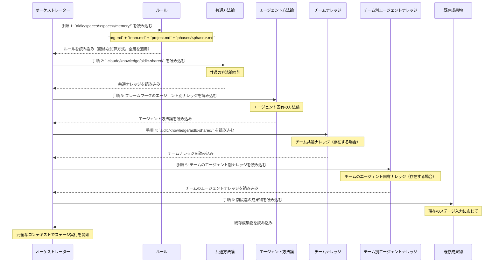

この章では、2 層のナレッジアーキテクチャについて説明します。方法論ナレッジをフレームワークとともに配布する方法、チームナレッジをプロジェクトごとに管理する方法、6 段階の読み込み順序、テンプレートシステム、ナレッジの拡張方法を扱います。

---

<a id="two-tier-architecture"></a>
## 2 層アーキテクチャ

AI-DLC は、フレームワークの方法論とチームによるカスタマイズを分離する 2 層のナレッジシステムを採用しています。

**第 1 層: 方法論ナレッジ**（`.claude/knowledge/`）-- フレームワークとともに配布されます。共通原則とエージェントごとの方法論リファレンスが含まれます。フレームワークのアップグレード時に更新され、ワークフロー実行中は読み取り専用です。

**第 2 層: チームナレッジ**（アクティブなスペースの `aidlc/knowledge/`、すなわち `aidlc/spaces/<space>/knowledge/` の短縮表記）-- ユーザーが管理します。企業固有の標準、ポリシー、規約を格納します。スペースの `memory/`、`codekb/`、`intents/` と同階層にあるため、そのスペース内のすべてのインテントをまたいで蓄積されます。ブートストラップ時は自由形式かつ空です。エンジンは最初の `/aidlc` で空の `aidlc/knowledge/` ディレクトリを作成しますが、内容は一切シードしません。固定のファイルセットはありません。

<a id="tier-1-structure"></a>
### 第 1 層の構成

```
.claude/knowledge/
+-- aidlc-shared/
|   +-- ai-dlc-principles.md       # Core methodology principles
|   +-- verification.md            # Phase boundary verification rules
|   +-- brownfield.md              # Brownfield safeguards
|   +-- audit-format.md            # 68-event audit taxonomy
|   +-- knowledge-readme-template.md  # Optional README template a team can copy into Tier 2
|   +-- state-template.md          # State file contract
+-- aidlc-product-agent/
|   +-- requirements-guide.md
|   +-- product-guide.md
|   +-- functional-design-guide.md
|   +-- requirements-elicitation.md
|   +-- prioritization-frameworks.md
|   +-- user-story-patterns.md
|   +-- market-research-methods.md
+-- aidlc-architect-agent/
|   +-- architecture-guide.md
|   +-- nfr-design-guide.md
|   +-- ddd-patterns.md
|   +-- architecture-patterns.md
|   +-- nfr-design-patterns.md
|   +-- adr-template.md
+-- aidlc-developer-agent/
|   +-- code-analysis-guide.md
|   +-- code-generation-guide.md
|   +-- code-generation-patterns.md
|   +-- api-design-guide.md
|   +-- data-modelling-patterns.md
|   +-- re-artifacts.md
+-- [... 8 more agent knowledge dirs]
```

<a id="tier-2-structure"></a>
### 第 2 層の構成

ブートストラップ時は空です。エンジンが作成するのは `aidlc/knowledge/` ディレクトリだけで、その内部には何も作成しません。README もエージェント別サブディレクトリもありません。以下の `aidlc-shared/` とエージェント別ディレクトリは、エージェントペルソナが参照する規約です。チームは内容があるものだけを作成します。

```
aidlc/knowledge/                    # empty at bootstrap; team-created subdirs
+-- aidlc-shared/                   # optional — loaded by every agent if present
|   +-- (user-added files)
+-- aidlc-product-agent/            # optional — loaded when that agent is active
|   +-- (user-added files)
+-- [... a directory per agent the team chooses to populate]
```

---

<a id="6-step-knowledge-loading-order"></a>
## 6 段階のナレッジ読み込み順序

各ステージは、厳格な 6 段階の順序でナレッジを読み込みます。最初に解決済みのルールセット、次に共通方法論、エージェント固有の方法論、チームによるカスタマイズ、最後に前段階の成果物を読み込みます。



| 手順 | ソース | 層 | 管理者 | 読み込み時点 |
|------|--------|------|-----------|--------|
| 1 | `aidlc/spaces/<space>/memory/` | -- | フレームワーク + 自己学習 | 最初 |
| 2 | `.claude/knowledge/aidlc-shared/` | 1 | フレームワーク | 初期 |
| 3 | `.claude/knowledge/[agent]/` | 1 | フレームワーク | 初期 |
| 4 | `aidlc/knowledge/aidlc-shared/` | 2 | チーム | 中盤 |
| 5 | `aidlc/knowledge/[agent]/` | 2 | チーム | 中盤 |
| 6 | 前段階の成果物 | -- | 動的 | 最後 |

> **注記:** 手順 1～5 はエージェントナレッジの読み込みです（各エージェントファイルで定義）。手順 6（前段階の成果物）はオーケストレーターが実行時に追加するコンテキストであり、ファイル読み込みの手順ではありません。

<a id="what-each-layer-contributes"></a>
### 各層が提供するもの

- ルール（手順 1）は最初に読み込まれ、厳格な加算方式の 5 層チェーン（組織 → チーム → プロジェクト → フェーズ → ステージ）で解決されます。適用可能なすべてのルールがコンテキストに含まれ、より広い層のルールは上書きされず追加されるだけです。[ルールシステム](/reference/rule-system)を参照してください。
- フレームワーク方法論（手順 2～3）は基準となる動作を提供します。
- チームナレッジ（手順 4～5）は組織固有のコンテキストを追加します。
- 既存成果物（手順 6）はワークフロー固有のコンテキストを提供します。

---

<a id="template-system"></a>
## テンプレートシステム

<a id="knowledge-readme-template"></a>
### ナレッジ README テンプレート

`.claude/knowledge/aidlc-shared/knowledge-readme-template.md` には、チームが第 2 層のディレクトリへコピーして文書化に使える任意の README テンプレートが含まれています。エンジンがこのテンプレートをスキャフォールドまたはシードすることはありません。スペースレベルの `aidlc/knowledge/` ディレクトリは空で作成され、チームが必要なものを追加します。テンプレートには次を説明しています。

- そのエージェント向けに追加するファイルの種類
- 一般的なカスタマイズファイルの例
- ファイルの読み込み方法（エージェントの有効化時に自動的に読み込まれる）
- 特別な命名規則は不要で、任意の `.md` ファイルが読み込まれること

<a id="state-template"></a>
### 状態テンプレート

エンジンは、`.claude/knowledge/aidlc-shared/state-template.md` の契約に従って `aidlc-state.md` を生成します。テンプレートは必須のセクションとフィールドを定義します。具体的なステージ進捗の行は、テンプレートに手書きで列挙されるのではなく、コンパイル済みのステージグラフとスコープグリッドから出力されます。

---

<a id="adding-team-knowledge"></a>
## チームナレッジを追加する

企業固有のファイルをチームナレッジディレクトリに追加します。

```bash
# Team-wide standards (loaded by all agents)
aidlc/knowledge/aidlc-shared/company-coding-standards.md
aidlc/knowledge/aidlc-shared/company-architecture-principles.md

# Agent-specific standards (loaded only when that agent is active)
aidlc/knowledge/aidlc-architect-agent/company-architecture-patterns.md
aidlc/knowledge/aidlc-devsecops-agent/company-security-policy.md
aidlc/knowledge/aidlc-developer-agent/company-coding-conventions.md
aidlc/knowledge/aidlc-quality-agent/company-testing-standards.md
```

ファイルはエージェントの有効化時に自動的に読み込まれます（読み込み順序の手順 4～5）。設定の変更は不要です。ディレクトリに配置した任意の `.md` ファイルが読み込まれます。

<a id="knowledge-by-agent"></a>
### エージェント別ナレッジ

> この表はスナップショットです。各エージェントの正とする `display_name` と `examples` は、`core/agents/<slug>-agent.md` のエージェントフロントマターにあり、`core/tools/aidlc-lib.ts` の `loadAgents()` を介してプログラムから公開されます。新しいエージェントはまずそこで追加し、この表も同じ PR で更新してください。

| ディレクトリ | 用途 | ファイル例 |
|-----------|---------|---------------|
| `aidlc-shared/` | チーム全体の標準 | `coding-standards.md`, `api-conventions.md` |
| `aidlc-product-agent/` | プロダクトのコンテキスト | `roadmap.md`, `personas.md` |
| `aidlc-design-agent/` | UX/UI ガイドライン | `design-system.md`, `accessibility.md` |
| `aidlc-delivery-agent/` | PM の規約 | `sprint-cadence.md`, `definition-of-done.md` |
| `aidlc-architect-agent/` | アーキテクチャ決定 | `tech-stack.md`, `infrastructure-preferences.md` |
| `aidlc-developer-agent/` | コーディングパターン | `db-conventions.md`, `error-handling.md` |
| `aidlc-quality-agent/` | テスト標準 | `test-strategy.md`, `coverage-requirements.md` |
| `aidlc-devsecops-agent/` | セキュリティポリシー | `security-baseline.md`, `compliance-rules.md` |
| `aidlc-aws-platform-agent/` | クラウドのコンテキスト | `account-structure.md`, `service-limits.md` |
| `aidlc-compliance-agent/` | コンプライアンスルール | `data-governance.md`, `audit-requirements.md` |
| `aidlc-pipeline-deploy-agent/` | CI/CD 標準 | `pipeline-standards.md`, `deployment-gates.md` |
| `aidlc-operations-agent/` | 運用ランブック | `monitoring.md`, `incident-response.md` |

---

<a id="cross-references"></a>
## 関連項目

- [アーキテクチャ](/reference/architecture) -- 5 層モデルにおけるナレッジ層
- [エージェントシステム](/reference/agent-system) -- エージェントのフロントマターと設定
- [ステージプロトコル](/reference/stage-protocol) -- エージェントペルソナの読み込みに関する節
- [フックとツール](/reference/hooks-and-tools) -- `audit-format.md` の分類体系（共通ナレッジとして配布）
