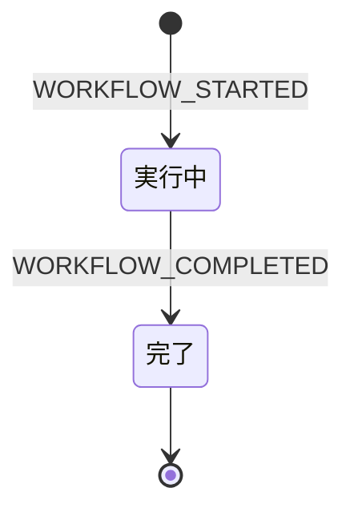
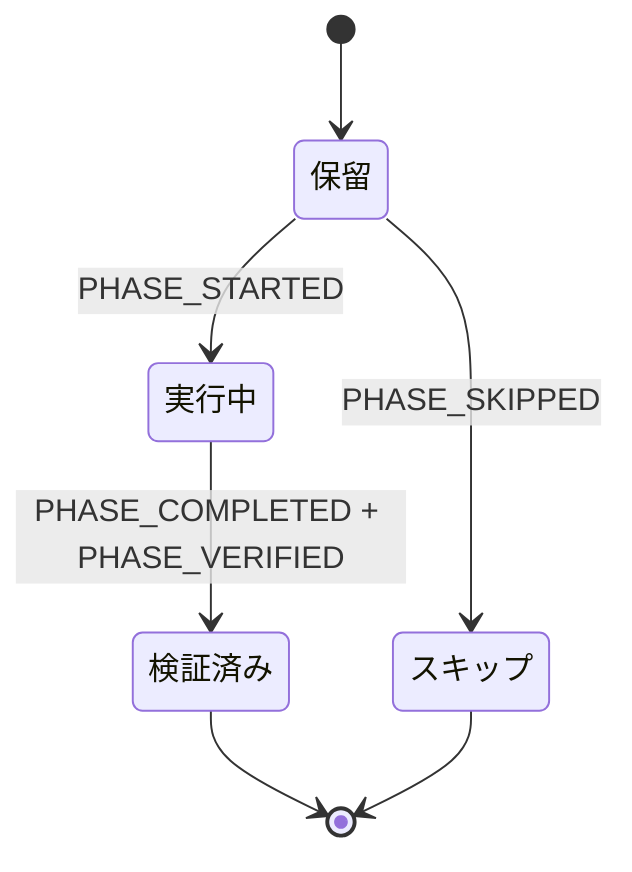
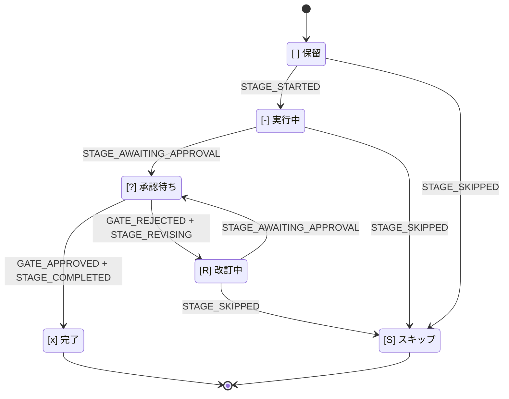

本章は、AI-DLC の状態機械、監査イベント分類、それらを結ぶ規則
――**各状態遷移にはツールが所有するエミッターがちょうど 1 つある**――の正規
リファレンスです。本章の表とコードの同期は、乖離テスト
`tests/integration/t48-audit-event-emitters.test.ts` により強制されます。文書と
コードが一致しなければ、`tests/integration/t48-audit-event-emitters.test.ts` は失敗します。

AI-DLC は、入れ子になった **ワークフロー**、**フェーズ**、**ステージ** の 3 つの状態機械で
動作します。4 つ目の独立したストリームは、Claude Code フックが出力する
**セッション**イベントを記録します。これら 4 ストリームはインテントの監査証跡
（レコードディレクトリの `audit/` シャードディレクトリ。
`<record>/` = `aidlc/spaces/<space>/intents/<YYMMDD>-<label>/`）を共有しますが、
別々のコードパスが所有します。別の関心事として読み、タイムラインが交差することを
覚えておくのが最も理解しやすい方法です。

> **北極星となる不変条件：** 決定的な記録処理は TypeScript、判断は LLM が担当します。
> すべての監査出力はツールまたはフックから始まるため、LLM の文章が出力経路に入りません。
> MD ファイルに `aidlc-audit.ts append <EVENT>` を文章上の指示として見つけた場合は、
> それはバグです。
>
> **監査先行の原子性：** ツールは状態を変更する*前に*監査エントリを出力します。
> 監査出力に失敗すれば、ツールは状態に触れる前に例外を送出します。そのため
> `audit.md` と状態ファイルが不一致になることはありません。失敗モードについては、
> 本章末尾近くの [「監査先行の原子性」節](#audit-first-atomicity) を参照してください。

---

<a id="why-three-state-machines"></a>
## 状態機械が 3 つある理由

ワークフローはフェーズを通過して完了し、フェーズは対象範囲に含まれるステージを
通過して完了し、ステージは承認ゲートが閉じると完了します。各層は異なる判断を
所有します。

- **ワークフロー** — ジョブ全体は実行中か、完了したか。
- **フェーズ** — このライフサイクルフェーズは進行中か、検証済みか、対象範囲外のため
  スキップされたか。
- **ステージ** — ステージを作業中か、ユーザーを待っているか、却下後に改訂中か、完了したか。

これらを 1 つの状態フィールドに平坦化すると、その判断が混同されます。分けておけば、
`/aidlc --status` は一度の読み取りで「このワークフローを阻害しているものは何か」に
答えられます。ワークフロー `Running`、フェーズ `Active`、ステージ `[?]` は
「対象ステージの承認待ち」を意味します。

---

<a id="workflow-machine"></a>
## ワークフロー状態機械



\{/* テキスト代替: 初期状態は WORKFLOW_STARTED で実行中に遷移し、実行中は WORKFLOW_COMPLETED で完了に遷移する。完了は終端状態。 */\}

**状態値：** `Running`、`Completed`。

ワークフローは最初のインテントが生成されたとき（最初の `/aidlc` で自動実行されるか、
`/aidlc-init` による `aidlc-utility intent-birth`）に始まり、対象範囲に含まれる最後の
ステージの承認ゲートが閉じると終わります。`Paused` や `Waiting for Approval` 状態は
ありません。承認はステージレベルの関心事であり、停止に UX はありません。

ワークフローの `Running` 状態は Claude Code セッションをまたいで維持されます。月曜日に
開始してセッションを終了し、火曜日に再開しても、ワークフローは `Running` のままです。
終了して新たに始まったのは *セッション* です。

| 遷移 | トリガー | エミッター |
|---|---|---|
| `[*] → Running` | `aidlc-utility init` | `tools/aidlc-utility.ts` |
| `Running → Completed` | `aidlc-state complete-workflow` | `tools/aidlc-state.ts` |

---

<a id="phase-machine"></a>
## フェーズ状態機械



フェーズ境界では、進行コマンドが `PHASE_COMPLETED` + `PHASE_VERIFIED` +
`PHASE_STARTED`（次のフェーズ）を 1 トランザクションで出力します。

\{/* テキスト代替: 初期状態は保留に遷移する。保留は PHASE_STARTED で実行中、PHASE_SKIPPED でスキップに遷移する。実行中は PHASE_COMPLETED + PHASE_VERIFIED で検証済みに遷移する。フェーズ境界では advance が PHASE_COMPLETED + PHASE_VERIFIED + PHASE_STARTED（次フェーズ）を原子的に出力し、検証済みから次フェーズの保留から実行中への遷移へ接続する。 */\}

**状態値：** `Pending`、`Active`、`Verified`、`Skipped`。

フェーズ状態は `aidlc-state.md` の `## Phase Progress` 節で追跡します。インテント生成時に
この節を初期設定します。`Initialization` は `Verified` になり（生成処理は引き継ぎ前に
すべての初期化ステージを完了させるため）、初期化直後の最初のステージが属するフェーズは
`Active` に、それ以降の各フェーズは、対象範囲が EXECUTE ステージを残さない場合は
`Skipped`（フェーズごとに `PHASE_SKIPPED` 監査行を 1 件出力）、それ以外は `Pending` に
なります。フェーズの完了時には境界で `PHASE_COMPLETED` と `PHASE_VERIFIED` の両方を
出力し、次のフェーズの `PHASE_STARTED` を出力します。行の書き換えは同じ状態書き込みの
中で行われます。この節は表示専用です。ルーティングは `Lifecycle Phase` と
Stage Progress のチェックボックスを読み、`/aidlc --status` はフェーズブロックを
その場で再計算します。

| 遷移 | トリガー | エミッター |
|---|---|---|
| 初期設定（`Verified`/`Active`/`Pending`/`Skipped`） | `aidlc-utility intent-birth` | `tools/aidlc-utility.ts` |
| `Active -> Verified` | フェーズ境界での `aidlc-state advance`、`finalize`、または `complete-workflow`。前方への `aidlc-jump execute` | `tools/aidlc-state.ts`、`tools/aidlc-jump.ts` |
| `Pending -> Active`（境界） | フェーズ境界での `aidlc-state advance` または `finalize`、あるいは `aidlc-jump execute` | `tools/aidlc-state.ts`、`tools/aidlc-jump.ts` |
| `Pending -> Skipped`（飛び越え） | フェーズ全体を飛び越える前方への `aidlc-jump execute` | `tools/aidlc-jump.ts` |
| `Verified/Active -> Pending` リセット | 後方への `aidlc-jump execute`（EXECUTE ステージを持つフェーズをリセット） | `tools/aidlc-jump.ts` |
| `Pending <-> Skipped` 再導出 | `aidlc-utility scope-change` / `recompose`（未到達の行のみ） | `tools/aidlc-utility.ts` |

初期化後への引き継ぎ時には、最終初期化ステージの後で
`aidlc-utility intent-birth` 自体が
`PHASE_COMPLETED + PHASE_VERIFIED + PHASE_STARTED + STAGE_STARTED` を出力します。
これにより、生成から最初の `advance` まで監査証跡が途切れず、遷移を記録できます。

---

<a id="stage-machine"></a>
## ステージ状態機械



\{/* テキスト代替: [ ] 保留は STAGE_STARTED で [-] 実行中に遷移する。[-] 実行中は STAGE_AWAITING_APPROVAL で [?] 承認待ちに遷移する。[?] 承認待ちは GATE_APPROVED + STAGE_COMPLETED で [x] 完了、GATE_REJECTED + STAGE_REVISING で [R] 改訂中に遷移する。[R] 改訂中は STAGE_AWAITING_APPROVAL（再入場）で [?] 承認待ちに戻る。保留 / 実行中 / 改訂中はいずれも STAGE_SKIPPED により [S] スキップに遷移できる。 */\}

**チェックボックスの凡例（`aidlc-state.md` 内）：**

| チェックボックス | 状態 | 意味 |
|---|---|---|
| `[ ]` | `Pending` | 未開始 |
| `[-]` | `Active` | 進行中 |
| `[?]` | `AwaitingApproval` | ステージ作業は完了、ゲートは開いたまま — ユーザーが阻害要因 |
| `[R]` | `Revising` | ユーザーがゲートを却下 — 再入場前にステージを改訂中 |
| `[x]` | `Completed` | 承認済みで完了 |
| `[S]` | `Skipped` | 対象範囲外、ジャンプによるスキップ、または途中で打ち切り |

`[?]` と `[R]` は、そうでなければどちらも `[-]` に見える 2 つの状況を区別します。
再開時、`[R]` はステージを最初から再実行するのでなく、ゲートへ再入場する前に以前の
アーティファクトとフィードバックを提示するようコンダクターに指示します。

| 遷移 | トリガー | エミッター |
|---|---|---|
| `Pending → Active` | `aidlc-state advance <slug>` | `tools/aidlc-state.ts` |
| `Active → AwaitingApproval` | `aidlc-state gate-start <slug>` | `tools/aidlc-state.ts` |
| `AwaitingApproval → Completed` | `aidlc-state approve <slug>` | `tools/aidlc-state.ts` |
| `AwaitingApproval → Revising` | `aidlc-state reject <slug> --feedback <text>` | `tools/aidlc-state.ts` |
| `Active → Revising` | `gate-start` を飛ばした場合の `aidlc-state reject <slug>` — 却下の対の前に、不足している `STAGE_AWAITING_APPROVAL`（`Recovered=true` 付き）を補完する | `tools/aidlc-state.ts` |
| `Revising → AwaitingApproval` | `aidlc-state revise <slug>`（ゲート再入場） | `tools/aidlc-state.ts` |
| `{Pending,Active,Revising} → Skipped` | `aidlc-state skip <slug> --reason <text>`、または `aidlc-jump execute` | `tools/aidlc-state.ts`、`tools/aidlc-jump.ts` |

`approve` コマンドは、ゲート後の遷移全体を所有します。`GATE_APPROVED + STAGE_COMPLETED`
を出力した後、次の対象内ステージへ自動で進め（`handleAdvance` に委譲）、`STAGE_STARTED`
とフェーズ境界の `PHASE_*` イベントを出力します。最後の対象内ステージでは代わりに
`complete-workflow` へ委譲し、`PHASE_COMPLETED + PHASE_VERIFIED + WORKFLOW_COMPLETED`
を出力してステータスを `Completed` にします。コンダクターは `approve` 後に `advance` を
呼びません。`approve` がゲート応答から次ステージの `[-]` までを所有するためです。
`advance` はゲートを持たない遷移（初期化ステージ、構築ボルト）に
残され、すでに `[x]` の `slug` に対して冪等です（重複する `STAGE_COMPLETED` を抑止）。

**アーティファクトガード（課題 #366）。** ステージを `[x]` にするすべての遷移
（`approve`、`advance`、`finalize`、`complete-workflow`）は、完了前に決定的な
アーティファクト検査を行います。そのため、ディスク上の作業証跡なしに `[x]` にする
ことはできず、未保護の完了用サブコマンドもありません。`produces[]` を宣言する
ステージでは、少なくとも 1 つのアーティファクトが存在する必要があります
（アクティブなインテントのレコードディレクトリ
`aidlc/spaces/<space>/intents/<slug>-<id8>/<phase>/<slug>/`、ユニット単位の
構築ステージでは当該レコードの `construction/<unit>/<slug>/`、`codekb/`
ステージでは `aidlc/spaces/<space>/codekb/<repo>/`）。`workspace_requires: true` の
ステージは、さらに `aidlc/` ワークスペースツリーとハーネスディレクトリの外にある
実際のソース作業の証跡を必要とします。Git ワークスペースでは、未コミットまたは
未追跡の非文書変更、もしくは直近コミットの非文書パスです。そうでない場合は、
シェルを使わないファイルシステム存在検査を行います。検査に失敗するとコマンドは
非ゼロで終了し、何も書き込みません。遷移は拒否されます
（`Refusing to complete "<slug>": ...`）。`produces[]` を宣言しないステージ
（初期化フェーズ）は自明に通過します。`optional_produces[]` に列挙する
条件付きのユニット単位出力（`15-stage-definition.md` 参照）は、このガードにも、
オーケストレーターが `for_each` の反復を進める前に行うユニット単位カバレッジ検査にも
関与しません。カバレッジは必須の `produces[]` のみを基準にするため、条件付き
アーティファクトを正当に省略したユニットもカバー済みになります。`produces_kinds`
マップを持つユニット単位の構築ステージでは、全ユニットで必須
アーティファクトがゼロに絞り込まれる場合に限り、追加の例外があります。例えば
`functional-design` に `packaging` ユニットしかないワークフローです。このときは
どのユニットもユニット用ディレクトリを書かないため、コンパイル済み `bolt_dag` の
ユニット種別により全必須セットが空ならガードは通過します。アーティファクトを
負うユニットが 1 つでもあれば、検査は同じく厳格です。`AIDLC_SKIP_ARTIFACT_GUARD=1`
でバイパスできます。

**ゲート改訂の安全網。** コンダクターが開いたゲートでアーティファクトを改訂しても
`reject` を実行し忘れると、ユーザーが実際に見た改訂なのに `Revision Count: 0` のまま
`GATE_REJECTED`/`STAGE_REVISING` の対が残りません。これを整合させるため、`approve`
はコミット前に決定的な述語 `unrecordedRevisionSinceGateOpen` を実行します。シャード
イベントを時系列に並べ、`slug` の `STAGE_AWAITING_APPROVAL` が開いたまま（その後に
`GATE_REJECTED` がない）で、そのゲート開始後に `HUMAN_TURN` があり、宣言済み
`produces[]` のアーティファクトが最初のゲート後の人間の手番より*後*に書かれた場合、
真になります。真の場合、`approve` は不足している
`GATE_REJECTED` + `STAGE_REVISING`（ともに `Recovered: true`）と再入場用
`STAGE_AWAITING_APPROVAL` を補い、`Revision Count` を増やして通常どおり承認を完了
します。これは人間がすでに行った承認を拒否するのではなく、記録を整合させます。
`HUMAN_TURN` を境界にすることで、ゲートで人間が応答する前に書かれるレビュアーの
正当な `## Review` 追記を除外します。codekb ステージは
`codekb/<repo>/<name>.md` というパス形状を通じて対象に含まれます。アクティブな
インテントが 1 つ以上のリポジトリを記録している場合、それらのリポジトリ配下への
書き込みのみが改訂の証拠として数えられます。リポジトリの記録がない場合、
マッチャーは互換性のため任意のリポジトリセグメントを受け入れます（所有情報が
レジストリに存在しないレガシー／プロジェクトルートのインテント向け）。
空の台帳、ゲート開始の欠落、
ゲート後の人間の手番の不在では失敗時開放です。
`AIDLC_SKIP_REVISION_BACKSTOP=1` でバイパスできます。

**駐車（課題 #365/#367）。** `aidlc-orchestrate park` は、ステージを進めずに
`Parked` / `Parked At Stage` 実行時マーカーを書き込みます
（`WORKFLOW_PARKED` を出力する `aidlc-state.ts park` 経由）。続く通常の `next` は
終端の `parked` ディレクティブを再出力し、停止フックがターンの終了を許可します。これに
より、長いワークフローは残りのステージを形式的に通過して `done` にするのでなく、
セッションをまたいで停止できます。`/aidlc --resume` は継続前にマーカーを消去します
（`unpark` は `WORKFLOW_UNPARKED` を出力）。人間の監督がない自律構築の実行
（`Construction Autonomy Mode: autonomous`）では `park` を拒否します。ツールと停止
フックの `parked` はともに自律モードで拒否できるため、人間の再開がなくてもループは
進行し続けます。

<a id="revision-loop"></a>
### 改訂ループ

```
gate-start  →  [?] AwaitingApproval
          ↘ reject  →  [R] Revising  (Revision Count += 1)
                   ↓ revise
                   [?] AwaitingApproval
                   ↘ approve  →  [x] Completed
```

`Revision Count` は状態ファイルにあり、`reject` ごとに増加します。コンダクターはこれを
使い、改訂ループの脱出口を検出します（既定では 3 サイクル後にスキップを提案）。

---

<a id="session-stream-hook-owned-independent"></a>
## セッションストリーム（フック所有、独立）

セッションイベントは AI-DLC ツールではなく Claude Code フックが出力します。セッションは
1 つの Claude Code 会話であり、ワークフローは長期的に維持されるディレクトリ状態です。
1 つのワークフローが複数のセッションにまたがり、1 つのセッションが複数のワークフローに
触れられる多対多の関係なので、ストリームは設計上独立しています。

| イベント | エミッター | トリガー |
|---|---|---|
| `SESSION_STARTED` | `hooks/aidlc-session-start.ts` | `source=startup` または `clear` の `SessionStart` |
| `SESSION_RESUMED` | `hooks/aidlc-session-start.ts` | `source=resume` の `SessionStart` |
| `SESSION_COMPACTED` | `hooks/aidlc-validate-state.ts` | `PreCompact` — コンパクション時点で発火し、確実に記録する |
| `SESSION_ENDED` | `hooks/aidlc-session-end.ts` | `SessionEnd` |

セッションフックは出力前に、アクティブなインテントの `aidlc-state.md`
（`aidlc/spaces/<space>/intents/<YYMMDD>-<label>/` 以下）を確認します。このファイルが
存在しない場合（カレント作業ディレクトリにアクティブな AI-DLC ワークフローがない場合）、フックは監査ログに
何も書かず静かに終了します。セッションイベントはアクティブなワークフローのタイムラインを
注釈するためのものであり、ワークフローのないディレクトリのセッションには注釈対象が
ありません。

<a id="compaction-awareness"></a>
### コンパクションの認識

`aidlc-state.ts resume` は監査末尾を走査して最新の `SESSION_COMPACTED` を探します。その後に
ステージ活動（`STAGE_STARTED`、`STAGE_COMPLETED`、`GATE_APPROVED`、`SESSION_RESUMED`、
`RECOVERY_COMPLETED`）がなければ、`aidlc-state.ts resume` は `compaction_pending: true` を返し、
コンダクターは継続前に 3 つの選択肢（継続 / 確認 / 再開）を提示します。ユーザーが
選択肢を選ぶと `acknowledge-compaction` が `RECOVERY_COMPLETED` を出力します。これにより
活動ゲートが満たされ、以後のコンパクションは新しい境界を検出できます。

---

<a id="audit-event-taxonomy"></a>
## 監査イベント分類

以下では **72 イベント**を 17 カテゴリに分類します（正規レジストリ
`audit-format.md` では同じ 72 イベントを 19 カテゴリに分けます。分類は表現上のもので、
イベント集合が不変条件です）。今後のリリース向けに事前登録されたイベントを除き、
各イベントにはツールまたはフックのエミッターがちょうど 1 つあります。エミッター欄が
`Reserved (v0.4.0 PR N)`、`Reserved (v0.5.0 PR N)`、`Reserved (v0.6.0 PR N)` の
イベントは、消費側 PR がエミッターを提供するまで乖離テストの順方向検査から除外されます。
乖離テスト `tests/integration/t48-audit-event-emitters.test.ts` は、本章の表とコードの
順方向・逆方向・第三・対・MD 間の整合性を強制します。

<a id="workflow-lifecycle"></a>
### ワークフローのライフサイクル

| イベント | エミッター | 注記 |
|---|---|---|
| `WORKFLOW_STARTED` | `tools/aidlc-utility.ts` | インテント生成ごとに必須の最初のイベント |
| `WORKFLOW_COMPLETED` | `tools/aidlc-state.ts` |  |
| `WORKFLOW_PARKED` | `tools/aidlc-state.ts` | `park` — 後のセッションのためフロー途中でワークフローを停止。ステージは進めない |
| `WORKFLOW_UNPARKED` | `tools/aidlc-state.ts` | `unpark` — 明示的な `--resume` 再入場時に駐車マーカーを消去 |

<a id="phase-lifecycle"></a>
### フェーズのライフサイクル

| イベント | エミッター | 注記 |
|---|---|---|
| `PHASE_STARTED` | `tools/aidlc-utility.ts`, `tools/aidlc-state.ts`, `tools/aidlc-jump.ts` | `init` で最初に出力し、以後はステージツールのフェーズ境界で出力 |
| `PHASE_COMPLETED` | `tools/aidlc-utility.ts`, `tools/aidlc-state.ts`, `tools/aidlc-jump.ts` | 各境界で `PHASE_VERIFIED` と対になる |
| `PHASE_VERIFIED` | `tools/aidlc-utility.ts`, `tools/aidlc-state.ts`, `tools/aidlc-jump.ts` | 常に `PHASE_COMPLETED` と対になる |
| `PHASE_SKIPPED` | `tools/aidlc-utility.ts` | スコープ外フェーズごとに 1 件、インテント生成時に出力 |

<a id="stage-lifecycle"></a>
### ステージのライフサイクル

| イベント | エミッター | 注記 |
|---|---|---|
| `STAGE_STARTED` | `tools/aidlc-state.ts`, `tools/aidlc-utility.ts`, `tools/aidlc-jump.ts` | `[ ]` → `[-]` を記録 |
| `STAGE_AWAITING_APPROVAL` | `tools/aidlc-state.ts` | `gate-start`（初回）、`revise`（却下後の再入場）、`reject`（`gate-start` を飛ばした場合の補完）。`gate-start --recovered`（レポートの明示的ステージ復旧）と `reject` の自己修復による補完行には `Recovered=true` を付け、通常の `gate-start` と `revise` 再入場には付けない |
| `STAGE_COMPLETED` | `tools/aidlc-state.ts`, `tools/aidlc-utility.ts` | `approve` が `GATE_APPROVED` と原子的に出力。`approve` が事前に `[x]` を付けなかった場合は `advance` も出力 |
| `STAGE_REVISING` | `tools/aidlc-state.ts` | `GATE_REJECTED` と対になる |
| `STAGE_SKIPPED` | `tools/aidlc-state.ts`, `tools/aidlc-jump.ts` | `[S]` 遷移ごとに 1 件 |
| `STAGE_JUMPED` | `tools/aidlc-jump.ts` | `--stage`/`--phase` ジャンプの到達先 `slug` を記録 |

<a id="gate-decisions"></a>
### ゲートの決定

| イベント | エミッター | 注記 |
|---|---|---|
| `GATE_APPROVED` | `tools/aidlc-state.ts` | `--user-input` で選択内容をそのまま記録 |
| `GATE_REJECTED` | `tools/aidlc-state.ts` | `--feedback` で却下理由を記録 |

<a id="user-interaction"></a>
### ユーザー操作

| イベント | エミッター | 注記 |
|---|---|---|
| `DECISION_RECORDED` | `tools/aidlc-log.ts` | 選択肢を記録するため `AskUserQuestion` の前に出力 |
| `QUESTION_ANSWERED` | `tools/aidlc-log.ts` | ユーザーの応答後に出力 |

<a id="scope-and-configuration"></a>
### スコープと構成

| イベント | エミッター | 注記 |
|---|---|---|
| `SCOPE_DETECTED` | `tools/aidlc-utility.ts` | `detect-scope` サブコマンド。`Source` フィールドに出所（自由記述 / キーワード / 環境変数 / コマンドライン）を記録 |
| `SCOPE_CHANGED` | `tools/aidlc-utility.ts` | アクティブなワークフローの `scope-change` サブコマンド |
| `PLUGIN_SELECTION_CHANGED` | `tools/aidlc-utility.ts` | `select-plugins` の設定モード。フィールド: `Previous Selection`、`New Selection` |
| `DEPTH_CHANGED` | `tools/aidlc-utility.ts` | `config-change --depth` |
| `TEST_STRATEGY_CHANGED` | `tools/aidlc-utility.ts` | `config-change --test-strategy` |
| `RECOMPOSED` | `tools/aidlc-utility.ts` | `recompose` サブコマンド — 適応型コンポーザーが進行中の計画を再形成（監査ロック下で保留ステージ接尾辞を切り替え） |

<a id="artifacts"></a>
### アーティファクト

| イベント | エミッター | 注記 |
|---|---|---|
| `ARTIFACT_CREATED` | `hooks/aidlc-audit-logger.ts` | 新規パスへの書き込み — `mtimeMs == birthtimeMs` の統計検査で `ARTIFACT_UPDATED` と区別 |
| `ARTIFACT_UPDATED` | `hooks/aidlc-audit-logger.ts` | 既存ファイルを上書きする `Edit` ツールまたは `Write` |
| `ARTIFACT_REUSED` | `tools/aidlc-state.ts` | `reuse-artifact` サブコマンド — 保持 / 変更 / やり直しの決定 |

<a id="construction-bolts"></a>
### 構築ボルト

| イベント | エミッター | 注記 |
|---|---|---|
| `BOLT_STARTED` | `tools/aidlc-bolt.ts` | 並列バッチ用に CSV のボルト名を受け付ける |
| `BOLT_COMPLETED` | `tools/aidlc-bolt.ts` | 先行する `BOLT_STARTED` と対になる |
| `BOLT_FAILED` | `tools/aidlc-bolt.ts`（`fail` + `abort`） | `--succeeded-siblings` が並列バッチの生存者を記録。`abort` は下位分類用に `Reason: aborted` フィールドを追加 |
| `AUTONOMY_MODE_SET` | `tools/aidlc-bolt.ts` | `Construction Autonomy Mode` フィールドを原子的に更新。先にフィールド存在を検証（監査先行） |

<a id="session"></a>
### セッション

| イベント | エミッター | 注記 |
|---|---|---|
| `SESSION_STARTED` | `hooks/aidlc-session-start.ts` | `source=startup` または `clear` |
| `SESSION_RESUMED` | `hooks/aidlc-session-start.ts` | `source=resume` |
| `SESSION_COMPACTED` | `hooks/aidlc-validate-state.ts` | 重複を避けるため `PreCompact` で出力（次の `SessionStart` ではない） |
| `SESSION_ENDED` | `hooks/aidlc-session-end.ts` | Claude Code からの `Reason` フィールドを含む |
| `HUMAN_TURN` | `hooks/aidlc-mint-presence.ts`（＋ハーネスごとのプロンプト送信アダプター） | 実際の人間プロンプトまたは回答済み質問ウィジェットごとに 1 件。承認 / インタビューゲートは、直前のゲート解決以降に 1 件を要求する |
| `SUBAGENT_COMPLETED` | `hooks/aidlc-log-subagent.ts` | サブエージェント停止フック経由でサブエージェント完了を記録 |
| `REVIEWER_SCOPE_BLOCKED` | `hooks/aidlc-reviewer-scope.ts` | ユニット単位レビュアーのツール呼び出しが、兄弟ユニットの `construction/` パスへ到達したため拒否された（§12a の読み取り範囲境界）。拒否ごとに 1 行 |

<a id="diagnostics-and-workspace"></a>
### 診断とワークスペース

| イベント | エミッター | 注記 |
|---|---|---|
| `HEALTH_CHECKED` | `tools/aidlc-utility.ts` | `--doctor` の実行 |
| `WORKSPACE_SCAFFOLDED` | `tools/aidlc-utility.ts` | `init` が新規ディレクトリツリーを作成 |
| `WORKSPACE_SCANNED` | `tools/aidlc-utility.ts` | ブラウンフィールドのワークスペース検出が完了 |
| `WORKSPACE_INITIALISED` | `tools/aidlc-utility.ts` | 状態ファイルが実体化 |

<a id="error-and-recovery"></a>
### エラーと復旧

| イベント | エミッター | トリガー |
|---|---|---|
| `ERROR_LOGGED` | `tools/aidlc-lib.ts`（各ツールの `error()` からの `emitError` 経由） | 非ゼロ終了のために `error(msg)` を呼ぶ任意のツール CLI。最善努力 — カレント作業ディレクトリにワークフローがなければ何もしない。再帰を防止 |
| `RECOVERY_COMPLETED` | `tools/aidlc-state.ts` | ユーザーがコンパクション認識の `AskUserQuestion` に答えた後、コンダクターが呼ぶ `acknowledge-compaction --choice <continue\|review\|restart>` |

<a id="worktree"></a>
### ワークツリー

バージョン 0.4.0 向けに事前登録。3 つの `WORKTREE_*` 行は `aidlc-worktree.ts`（マイルストーン 7）と
ともに出荷。`STATE_*` はマイルストーン 9（状態のフォーク / マージ）、`AUDIT_*` は
マイルストーン 10（監査のフォーク / マージ）で入ります。
`tests/integration/t48-audit-event-emitters.test.ts` の順方向検査は、エミッター欄がなお
`Reserved` の行をスキップします。

| イベント | エミッター | トリガー |
|---|---|---|
| `WORKTREE_CREATED` | `tools/aidlc-worktree.ts` | ボルト開始時に `main` からボルト単位の Git ワークツリーを作成（サブコマンド: `create`） |
| `WORKTREE_MERGED` | `tools/aidlc-worktree.ts` | ゲート承認時にボルトのワークツリーを `main` へマージ（サブコマンド: `merge`） |
| `WORKTREE_DISCARDED` | `tools/aidlc-worktree.ts` | 中止したボルトのワークツリーを明示的に削除（サブコマンド: `discard`） |
| `STATE_FORKED` | `tools/aidlc-state.ts` | ボルト開始時に状態ファイルをワークツリーへフォーク（サブコマンド: `fork`） |
| `STATE_MERGED` | `tools/aidlc-state.ts` | ゲート承認時にワークツリーの状態を `main` へマージ。防御のためのアルファベット順 `slug` タイブレーク（サブコマンド: `merge`） |
| `AUDIT_FORKED` | `tools/aidlc-audit.ts`（`audit-fork`） | ボルト開始時に監査ログをワークツリーへフォーク。意図の監査 — バイトコピーの前に出力 |
| `AUDIT_MERGED` | `tools/aidlc-audit.ts`（`audit-merge`） | ゲート承認時にワークツリーの監査エントリを `main` 監査へ追記。ボルト内の順序は保持し、ボルト間の順序はマージ完了順を反映 |

<a id="practices"></a>
### プラクティス

バージョン 0.4.0 向けに事前登録。エミッターはマイルストーン 8（ステージ 2.2 のプラクティス発見）と
マイルストーン 13（構築オーケストレーター実行時）で入ります。

| イベント | エミッター | トリガー |
|---|---|---|
| `PRACTICES_DISCOVERED` | `tools/aidlc-state.ts` `practices-event --type discovered` | ブラウンフィールド発見と下書き完了。チームプラクティス下書きがステージ 2.2 ゲートで確認待ち |
| `PRACTICES_AFFIRMED` | `tools/aidlc-state.ts` `practices-promote` | チームがプラクティスを承認。内容をインテントの `inception/practices-discovery/` からスペース記憶層（`aidlc/spaces/<space>/memory/team.md` と `memory/project.md`）へ昇格 |
| `PRACTICES_OVERRIDE` | `tools/aidlc-state.ts` `practices-promote`（マイルストーン 8 の書き込み失敗経路）と `tools/aidlc-state.ts` `practices-event --type override`（マイルストーン 13 のボルト計画マーカー衝突経路 — `Reason` フィールドによる識別子フィールドの曖昧さ解消。別イベントはない） | いずれか: ステージ 2.2 確認中の行横断昇格失敗（`Reason`: `write-failure-*`）。または `aidlc/spaces/<space>/memory/team.md` のウォーキングスケルトン方針が現在のボルトのボルト計画マーカーを上書き（`Reason`: `bolt-plan-marker-conflict`） |
| `PRACTICES_SECTION_EMPTY` | `tools/aidlc-state.ts` `practices-event --type empty` | コンダクターが空のプラクティス節を読んだ。助言のみで、組織既定へフォールバック |

<a id="merge-dispatch"></a>
### マージディスパッチ

バージョン 0.4.0 のマイルストーン 1 で事前登録。エミッターはマイルストーン 13 で新しい
`aidlc-bolt dispatch-event` サブコマンド経由で入ります。コンダクターは各
`aidlc-pipeline-deploy-agent/` ディスパッチを括ります — 呼び出し前は INVOKED、
YAML 解析成功後の呼び出し後は RETURNED、タイムアウト / 不正 YAML / 低信頼度では
FALLBACK。

| イベント | エミッター | トリガー |
|---|---|---|
| `MERGE_DISPATCH_INVOKED` | `tools/aidlc-bolt.ts` `dispatch-event --event MERGE_DISPATCH_INVOKED` | コンダクターがチームプラクティス文面からマージ戦略を決めるため、`Task` 経由で `aidlc-pipeline-deploy-agent/` をディスパッチ |
| `MERGE_DISPATCH_RETURNED` | `tools/aidlc-bolt.ts` `dispatch-event --event MERGE_DISPATCH_RETURNED` | エージェントが戦略、対象ブランチ、信頼度、注記付きの解析済み YAML を返却 |
| `MERGE_DISPATCH_FALLBACK` | `tools/aidlc-bolt.ts` `dispatch-event --event MERGE_DISPATCH_FALLBACK` | エージェントがタイムアウトまたは不正 YAML を返却。コンダクターは組織既定へフォールバック — 重要な可観測性フック |

<a id="sensors"></a>
### センサー

バージョン 0.5.0 のマイルストーン 1 で事前登録。4 つの `SENSOR_*` イベントのエミッターは
マイルストーン 9（センサーディスパッチャー）、`GUARDRAIL_LOADED` はマイルストーン 14
（対カバレッジの `doctor` 行）で入ります。カバレッジは環境的です — Markdown を書く
構想 / 構築 / 運用の各ステージは、レジストリ既定センサーから少なくとも 1 件の
`SENSOR_FIRED` 行を出力します。バージョン 0.5.0 では助言のみ。バージョン 0.8.0 のラルフドライバーが
構築フェーズのセンサーに遮断意味論を導入します。

| イベント | エミッター | トリガー |
|---|---|---|
| `SENSOR_FIRED` | `tools/aidlc-sensor.ts` `fire` | ディスパッチャーがステージ出力に対してセンサーを起動（センサーの `matches` フィルタに対するツール使用後の `Write`/`Edit` 一致ごと） |
| `SENSOR_PASSED` | `tools/aidlc-sensor.ts` `fire` | センサーが完了し、指摘なしと報告（ツール利用不可とスクリプトエラーのフォールスルーも含む。`Note` フィールドで識別） |
| `SENSOR_FAILED` | `tools/aidlc-sensor.ts` `fire` | センサーが完了し、指摘ありと報告。詳細ファイルを `<record>/.aidlc-sensors/<stage-slug>/<sensor-id>-<fire-id>.md`（インテントのレコードディレクトリ内）へ書き込み |
| `SENSOR_BUDGET_OVERRIDE` | `tools/aidlc-sensor.ts` `fire` | センサーが設定上限（レジストリ / バインディング / 深度由来の 3 層上限モデル）を超え、終了またはスキップされた |
| `GUARDRAIL_LOADED` | `tools/aidlc-utility.ts` | ガードレールローダーがアクティブなワークフロー向けのスコープ階層ガードレール集合を解決（組織 → プロジェクト → フェーズ → ステージ）。`doctor` の対カバレッジ検査がこのイベントを読む |

<a id="learning-loop"></a>
### 学習ループ

バージョン 0.5.0 のマイルストーン 4 で事前登録。`MEMORY_EMPTY` のエミッターはマイルストーン 8
（`aidlc-runtime.ts compile`）で入ります。§13 の学習儀式は実行中にステージ単位の
`memory.md` を書きます。ステージ承認時、ランタイムグラフのコンパイルが `memory.md` を
読み、標準の 4 見出しの下に空白以外のエントリがゼロのステージへ `MEMORY_EMPTY` を
出力します。マイルストーン 12 の学習ゲートツール（`aidlc-learnings.ts persist`）は、
保持した学習が `aidlc/spaces/<space>/memory/{project,team}.md` の日付付きプラクティス
エントリとして着地すると `RULE_LEARNED` を、学習がセンサーバインディング
（マニフェスト＋発生元ステージの `sensors:` フロントマター）を導入すると
`SENSOR_PROPOSED` を出力します。`doctor` は日誌規律の可観測性のためにこれらの行を読みます。

| イベント | エミッター | トリガー |
|---|---|---|
| `MEMORY_EMPTY` | `tools/aidlc-runtime.ts` | ステージ承認時のランタイムグラフコンパイルが、`memory.md` 欠落、または §13 の 4 見出し下に空白以外のエントリがゼロであることを検出 |
| `RULE_LEARNED` | `tools/aidlc-learnings.ts` | 学習ゲートが保持した学習を `aidlc/spaces/<space>/memory/{project,team}.md` の日付付きプラクティスエントリとして永続化 |
| `SENSOR_PROPOSED` | `tools/aidlc-learnings.ts` | 学習ゲートがプロジェクト層のセンサーマニフェストを足場にし、発生元ステージの `sensors:` フロントマターへバインド |

<a id="swarm"></a>
### スウォーム

バージョン 0.6.0 のマイルストーン 2 で事前登録。6 つのスウォームイベントはすべて、コンダクターが
参照する決定的な判定面であるスウォーム審判 `aidlc-swarm.ts` から出力されます。審判は
状態を持ちません。`prepare` はユニット単位のワークツリーをフォークして
`SWARM_STARTED` を出力し（コンダクターが明確なダウングレードを報告すると、ウェーブ 4
マイルストーン 16 で本番化した `SWARM_DEGRADED` も出力）、`finalize` はコンダクターが
収束を主張した集合を再検証し、ユニット単位の対、失敗ユニット単位のバトン行、バッチ集計を
出力します。`check` サブコマンドは助言のみで何も出力しません。エンジンは読み取り専用で、
コンダクターは監査イベントを出力しないため、決定的ツールがスウォーム分類全体を所有します。
これらの行は、依存関係で結ばれたユニットのバッチのライフサイクルを追跡します。バッチ開始時の
ファンアウト、ユニット単位の収束または再検証失敗、コンダクターへのバトン返却、バッチ完了です。
コンダクターは `invoke-swarm` をステージの `mode` 列挙とは直交するディレクティブ種別として
扱います。予約済みの `agent-team` モードは起動せず、予約のままです。
`tests/integration/t48-audit-event-emitters.test.ts` の順方向検査は、エミッター欄がなお
`Reserved` の行をスキップします。

| イベント | エミッター | トリガー |
|---|---|---|
| `SWARM_STARTED` | `tools/aidlc-swarm.ts` | スウォーム審判の `prepare` が依存関係で結ばれたユニットのバッチをフォーク |
| `SWARM_UNIT_CONVERGED` | `tools/aidlc-swarm.ts` | スウォームユニットが `finalize` ゲートで再検証に合格（かつ改ざんなし）し、マージバックされた（マージバックに失敗した収束ユニットは、再試行の `finalize` がマージするまで行なし） |
| `SWARM_UNIT_FAILED` | `tools/aidlc-swarm.ts` | スウォームユニットが `finalize` 再検証に失敗（未主張、主張したが不合格、または改ざん） |
| `SWARM_BATON_RETURNED` | `tools/aidlc-swarm.ts` | スウォームユニットがオーケストレーター仲介の調整のため、コンダクターへバトンを返却 |
| `SWARM_COMPLETED` | `tools/aidlc-swarm.ts` | バッチ内の全ユニットが終了（収束または失敗）。バッチ閉鎖 |
| `SWARM_DEGRADED` | `tools/aidlc-swarm.ts` | `AIDLC_USE_SWARM=1` が要求されたが `Workflow` ツールが利用不可。コンダクターがサブエージェント下限で実行 |

分類内の各イベントは、実エミッターに裏付けられるか、事前登録の今後の消費側向けに
`Reserved (v0.4.0 PR N)` / `Reserved (v0.5.0 PR N)` / `Reserved (v0.6.0 PR N)` と
印付けられます。乖離テストは両側を強制します — `Reserved` の早期スキップは、セルが文字どおり
`Reserved` を含む間だけ適用され、消費側 PR は出力呼び出しを出荷するのと同じコミットで、
実エミッターのファイルパスへ置き換えます。

---

<a id="audit-first-atomicity"></a>
## 監査先行の原子性

状態を変更するコマンドは、状態ファイルを変更する**前に**監査エントリを出力します。
結果は 2 つです。

1. 監査出力が失敗した場合（ロックタイムアウト、ディスクエラー、不正なイベント型）、
   ツールは状態に触れる前に例外を送出します。状態は直前の値のまま、`audit.md` もきれいなままです。
2. 監査出力の*後*に状態書き込みが失敗した場合、監査には「意図」のエントリがあるのに状態は
   動いていません。乖離は可視で診断可能であり、`--doctor` が表面化します。

`tests/unit/t17.test.ts` のケース `test("65: approve is audit-first ...")` が `approve` について
これを証明します。`audit.md` を読み取り専用に権限変更すると監査失敗を強制し、状態ファイルが
`[?]` のまま（`[x]` にならない）ことを断言します。同じ不変条件は `gate-start`、`reject`、
`revise`、`skip`、`advance`、`complete-workflow`、`reuse-artifact`、
`aidlc-bolt.ts set-autonomy`、および `aidlc-state.ts fork` / `aidlc-state.ts merge`
（バージョン 0.4.0 マイルストーン 9 の状態フォーク / マージサブコマンド — 同等のロックディレクトリへの
権限変更によるパート A と、出力後の対象への権限変更によるパート B の証明は
`tests/unit/t76.test.ts` を参照）にも当てはまります。

状態のフォーク / マージは、意図的に下記の意図監査の例外に入れません。状態ファイルの再読込と
再書き込みは冪等です（出力と Git の間で強制終了するとワークツリーが残る
`git worktree add` とは異なり）、厳密な不変条件をきれいに適用できます。成功した監査出力の後の
状態書き込み失敗は、幽霊の `STATE_FORKED` 行になり、`doctor`（バージョン 0.4.0 マイルストーン 15）が
ワークツリーのレコードディレクトリの `aidlc-state.md` 存在と突合します。

<a id="audit-of-intent-semantics-worktree_-audit_-and-merge-dispatch-merge_dispatch_invoked"></a>
### 意図監査の意味論（`WORKTREE_*`、`AUDIT_*`、およびマージディスパッチの `MERGE_DISPATCH_INVOKED`）

意図監査の意味論は、出力前に結果を検査できない副作用に適用します — ディスク操作
（ワークツリー作成 / 削除、監査のバイトコピー）と LLM の `Task` ディスパッチ
（`aidlc-pipeline-deploy-agent/`）を含みます。出力側ツールは先に監査エントリを書き、その後に
副作用を実行します。出力後に副作用が失敗すると、ツールはメッセージに `slug` を埋め込んだ
`emitError` を呼びます（`[slug=<slug>]`）。監査フォーク / 監査マージのハンドラーはさらに
失敗を `[fork-emitted:<timestamp>]` でタグ付けし、`--doctor`（バージョン 0.4.0 マイルストーン 15）が
「意図は記録されたが副作用は着地しなかった」と以前の失敗モードを区別できるようにします。
`MERGE_DISPATCH_INVOKED` では、`doctor` の突合が孤立した INVOKED 行を、欠落した
`MERGE_DISPATCH_RETURNED` または `MERGE_DISPATCH_FALLBACK` の対へ、`slug` + タイムスタンプ窓で
対応付けます（LLM の `Task` 呼び出しには順序付けできるディスク成果物がないため、相関タグは不要）。
`appendAuditEntry` はディスク副作用の失敗時に `ERROR_LOGGED` エントリを記録し、`doctor` は観察時に
監査乖離を突合します。

| イベント群 | エミッター | 出力に続く副作用 |
|---|---|---|
| `WORKTREE_CREATED`、`WORKTREE_MERGED`、`WORKTREE_DISCARDED` | `tools/aidlc-worktree.ts` | `git worktree add`、`git merge` + クリーンアップ、`git worktree remove` + ブランチ削除 |
| `AUDIT_FORKED`、`AUDIT_MERGED` | `tools/aidlc-audit.ts` | `main` 監査の `mkdir -p` + `copyFileSync`。ワークツリー監査差分の `main` 監査への `appendFileSync` |
| `MERGE_DISPATCH_INVOKED` | `tools/aidlc-bolt.ts` `dispatch-event` | `Task(aidlc-pipeline-deploy-agent, ...)` の LLM ディスパッチ — 副作用は LLM 呼び出し自体。成功は対応する `MERGE_DISPATCH_RETURNED` または `MERGE_DISPATCH_FALLBACK` の呼び出し後出力で観測 |

これはステージ遷移の厳密な監査先行不変条件からの意図的な逸脱であり、ロールバック出力も
`ERROR_LOGGED` も保証できない強制終了 / OS クラッシュ窓が動機です。パターンは上記イベントに
限定されます。`STATE_FORKED` / `STATE_MERGED`（マイルストーン 9）はこの例外を意図的に取りません —
厳密先行の根拠は前節を参照（状態書き込みは冪等なので、書き込み失敗は回復不能な孤立状態ではなく
回復可能な乖離として表面化します）。`MERGE_DISPATCH_RETURNED` / `MERGE_DISPATCH_FALLBACK` は
呼び出し後の出力（結果の監査であり意図ではない — 厳密先行）であり、例外を取りません。その他の
状態変更コマンドは上記のとおり厳密先行のままです。

<a id="forbidden-patterns"></a>
### 禁止パターン

LLM の文章から監査イベントを出力してはいけません。次の反パターンが、この再構成の理由です。

- `SKILL.md` の手順としての `bun .claude/tools/aidlc-audit.ts append WORKFLOW_STARTED ...` —
  ツールが内部で出力する形に置換
- ステージファイルが書く `**Event**: STAGE_COMPLETED` の Markdown ブロック —
  イベントはツールまたはフック内の `appendAuditEntry` からのみ来る
- フックが書く自由形式の `## Artifact Update` 節 —
  正規の `ARTIFACT_CREATED` / `ARTIFACT_UPDATED` に置換

`tests/integration/t48-audit-event-emitters.test.ts` の乖離テストは、本章の表とコードの
乖離を検出します。表の各イベントは、宣言されたエミッターファイル内の一致する
`appendAuditEntry(..., "EVENT", ...)` 呼び出しを持たねばならず、コードベース内のすべての
出力呼び出し箇所が表に現れねばなりません。テストは削除済みイベントの復活や、対の不変条件
（例: `handleApprove` が `GATE_APPROVED` と `STAGE_COMPLETED` の両方を出力すること）も守ります。

---

<a id="same-commit-rule"></a>
## 同一コミット規則

状態機械の振る舞いを変えるときは、コードと本章を**同じコミット**で更新します。規則は乖離
テストで自己検出しますが、事後に乖離を直すコスト（3 ファイルにまたがるイベントの所有者を
追うこと）は、表を 1 つ更新するよりはるかに高いです。

具体的には次のとおりです。

- イベント追加 → `aidlc-audit.ts` の `VALID_EVENT_TYPES` に追加し、エミッターを追加し、
  上記の適切な表に追加する。
- イベント削除 → `VALID_EVENT_TYPES` から削除し、エミッターを削除し、ここから行を削除し、
  コードベースを検索して古い文章やテストを取り除く。
- エミッターファイルの名前変更 → それを指すすべての表の行でエミッター列を更新する。

---

<a id="known-limitations"></a>
## 既知の制限

- **複数プロジェクトのセッション。** Claude Code はセッション内の `cd` でフックを発火しない
  ため、ユーザーがプロジェクト A で `/aidlc` を実行してからプロジェクト B へ `cd` しても、
  セッションフックは B の `audit.md` に対して再発火しません。セッションイベントは、すべての
  ワークスペース切替を完全には反映しない場合があります。これは Claude Code の制限であり、
  AI-DLC の設計欠陥ではありません。

---

<a id="related-reference"></a>
## 関連リファレンス

- [オーケストレーター](/reference/orchestrator) — `/aidlc --status`、セッション確認、再開経路が
  状態機械の信号をどう消費するか。
- [ステージプロトコル](/reference/stage-protocol) — `[?]` / `[R]` 遷移を駆動する承認ゲート UX を含む、
  ステージレベルの振る舞い契約。
- [フックとツール](/reference/hooks-and-tools) — フックのライフサイクル、CLI ツールリファレンス、
  監査イベント一覧。
- [テスト](/reference/testing) — 乖離テストの仕組みと実行タイミング。
