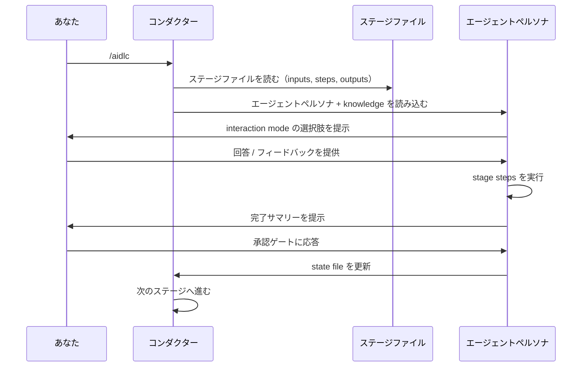
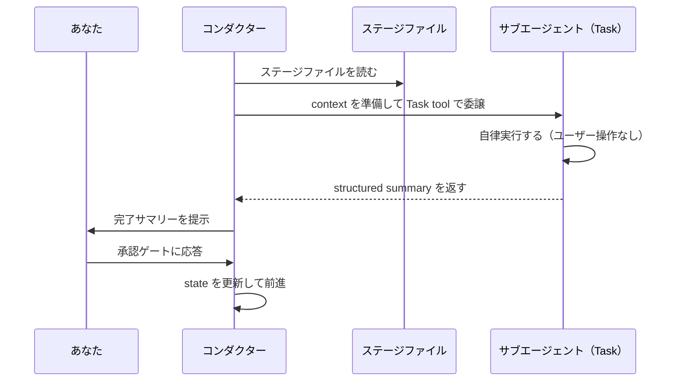

<a id="your-first-workflow"></a>
# 最初のワークフロー

この章では、AI-DLC の完全な workflow run を 1 回通しで追いながら、各ステップで何が表示され、どのような判断を行うのかを説明します。例では `feature` scope の workflow で REST API を構築します。

---

<a id="starting-the-workflow"></a>
## ワークフローを開始する

```
/aidlc Build a REST API for inventory management
```

session 開始時、Claude Code は `settings.json` の `companyAnnouncements` entry を通して AI-DLC の welcome message を表示します。そこでは AI-DLC の仕組みと、stage map、および scope options が説明されます。

```
# Welcome to AI-DLC

**AI-DLC** (AI-Driven Development Life Cycle) is an adaptive methodology that
structures AI-assisted software development into repeatable, traceable phases
while keeping you in control at every decision point.

## How It Works

- **You decide, AI executes.** Every material decision goes through an approval gate.
- **Adaptive scope.** Choose a scope or let AI auto-detect from your intent.
- **Traceable artifacts.** Every stage produces versioned documents in the intent's record dir.
- **11 domain experts.** Specialized agent personas guide each stage.
```

---

<a id="initialization-phase-automatic"></a>
## 初期化フェーズ (Initialization)（自動）

3 つの initialization stages は、`aidlc-utility init` の中で決定論的に実行されます。これは 1 回の tool call で完了し、所要時間は 1 秒未満です。Initialization に対してあなたが操作することはありません。このフェーズは active space に最初の intent を auto-birth し、その workflow 用に record dir を bootstrap します。

<a id="stage-01-workspace-scaffold"></a>
### ステージ 0.1: ワークスペースの作成 (Workspace Scaffold)

framework は最初の intent を birth し、`aidlc/spaces/<space>/intents/<YYMMDD>-<label>/` に record dir を作成します（named space を使わない限り `<space>` は `default` です）。

```
Intent born — record dir scaffolded:
  aidlc/spaces/default/intents/<YYMMDD>-<label>/initialization/   (3 stage artifact dirs)
  aidlc/spaces/default/intents/<YYMMDD>-<label>/ideation/         (7 stage artifact dirs)
  ...
Space-level dirs ensured:
  aidlc/spaces/default/knowledge/                             (team knowledge — empty; you add files)
```

<a id="stage-02-workspace-detection"></a>
### ステージ 0.2: ワークスペースの検出 (Workspace Detection)

決定論的な rule-based scanner が、project と既知の source directories（`src/`、`app/`、`lib/`、`pages/`、`components/`、`tests/`）を 1 階層だけ走査します。source files、framework configs、package manifests を見て greenfield と brownfield を分類します。top-level signal が見つからない場合は、任意名の各 subdirectory にも 1 階層だけ降りるため、source が container folder（例: `wordbook/`、`backend/`）の中にある project でも brownfield として検出されます。

<a id="stage-03-state-initialization"></a>
### ステージ 0.3: 状態の初期化 (State Initialization)

orchestrator は、あなたの scope、depth、test strategy、および scanner の分類に基づく完全な stage plan を持つ intent の `aidlc-state.md`（record dir 配下）を書き込みます。同時に、あなたの入力を解析して scope を確認します。

```
─── Scope Detection ───────────────────────────────────────────────────────────
Detected scope: feature (Standard depth, Standard test strategy, all 32 stages)
▸ Approve scope? [Yes / Change scope / Change depth / Change test strategy]
> Yes
```

検出された scope をそのまま受け入れることも、別の scope（例: `mvp`）へ変更することも、depth level や test strategy を調整することもできます。選び方の指針は [スコープ、深度、テスト戦略](05-scopes-and-depth.md) を参照してください。

---

<a id="ideation-phase-interactive"></a>
## アイデア形成フェーズ (Ideation)（対話型）

Initialization の後、workflow は Ideation に入ります。ここから先の各 stage は対話的に実行され、承認ゲートを伴います。

<a id="stage-11-intent-capture-aidlc-product-agent"></a>
### ステージ 1.1: 意図の取り込み (Intent Capture)（aidlc-product-agent）

terminal の下部にある status line が更新されます。

```
[AIDLC] IDEATION > Intent Capture [▓▓▓▓▓░░░░░] 4/7 -- product
```

ここには、現在の phase、stage display name、phase progress bar、phase progress ratio、lead agent が表示されます。bar と ratio は同じ scope を共有しており、どちらも current phase 内の `[x]` stages を数えるため、ratio が進むたびに bar も進みます。残りの context（`ctx:N%`）は常に右側に表示され、減るにつれて色分けされます。

aidlc-product-agent は、まず interaction mode を選ぶよう尋ねます。

```
▸ Choose interaction mode:
  (1) Guide Me — agent asks structured questions
  (2) Edit File — write directly to the artifact
  (3) Chat — freeform discussion
```

- **Guide Me** は質問を 1 つずつ順に進めます
- **Edit File** は artifact を直接編集する形で進めます
- **Chat** は自由に議論し、agent が意思決定を抽出します

各 mode の詳細は [対話モード](07-interaction-modes.md) を参照してください。stage の途中で mode を切り替えることもできます。

<a id="approval-gate"></a>
### 承認ゲート (Approval Gate)

agent が作業を完了すると、完了サマリーと承認ゲートが表示されます。

```
# Intent Capture & Framing Complete

| Artifact | Contents |
|----------|----------|
| intent-capture.md | Problem statement, target users, success criteria |
| intent-capture-questions.md | 5 questions, all answered |

**Review:** `<record>/ideation/intent-capture/` (the intent's record dir)

▸ How would you like to proceed?
  (1) Approve — Continue to Market Research
  (2) Request Changes — Provide revision feedback
```

続行するには **Approve**、修正フィードバックを返すには **Request Changes** を選びます。revision process の詳細は [対話モード](07-interaction-modes.md) を参照してください。

承認後には progress line が表示されます。

```
Progress: 4/32 overall | 1/7 IDEATION stages complete. Next: Market Research
```

<a id="remaining-ideation-stages"></a>
### 残りのアイデア形成ステージ

workflow は、Market Research、Feasibility & Constraints、Scope Definition、Team Formation、Rough Mockups、Approval & Handoff と続きます。どれも同じパターンです。agent が作業し、あなたがレビューし、承認します。

一部の stages は **conditional** で、scope に応じて skip されることがあります。stage が skip される場合、orchestrator は理由を表示し、自動的に次へ進みます。

---

<a id="inception-phase"></a>
## インセプションフェーズ (Inception)

Inception では要件を具体化し、解決策を設計します。Stage 2.1（Reverse Engineering）は **subagent** として動く点が特徴的です。conductor は aidlc-developer-agent に code scan を委譲し、その後 aidlc-architect-agent に synthesis を委譲します。この stage は **brownfield** projects（既存 codebase）でのみ実行されます。

```
─── Stage 2.1: Reverse Engineering (subagent) ──────────────────────────────
Delegating to aidlc-developer-agent for code scan...
[Running in background — no interaction needed]
...
Developer scan complete. Delegating to aidlc-architect-agent for synthesis...
...
✓ 9 reverse engineering artifacts produced
```

残りの Inception stages（Requirements Analysis から Delivery Planning まで）は、あなたと対話しながら inline で進行します。

---

<a id="construction-phase"></a>
## コンストラクションフェーズ (Construction)

Construction は解決策を **Bolt by Bolt** で構築します。[Bolt](glossary.md) とは、1 つの Unit（または依存関係で結ばれた小さな Unit 群）に対する stages 3.1–3.5 の 1 周です。各 Bolt はレビュー可能な slice を出荷します。2.8 の plan がその順序を決め、最初の Bolt を **walking skeleton** としてマークします。これはアーキテクチャを実証する最小の end-to-end slice です。

```
─── Construction: Bolt 1 — notification-core (walking skeleton) ───────────
```

walking skeleton は **必ず gated** です。他の Bolt が走る前に、その design artifacts と generated code をあなたがレビューします。承認の直後、**ladder prompt** がちょうど 1 回だけ発火します。

```
The walking skeleton shipped. How should the remaining Bolts run?
  ▸ Continue autonomously
  ▸ Gate every Bolt
```

あなたの回答は `aidlc-state.md` に `Construction Autonomy Mode` として記録され、この workflow の残りすべての Bolt に適用されます（session を resume しても保持されます）。Stage 3.5（Code Generation）は、Bolt 内の各 Unit ごとに subagent として実行されますが、その stage file にある per-Unit gate は抑制され、代わりに 1 つの Bolt-level（または batch-level）gate が使われます。

依存関係が解決されていて互いに依存しない Bolts は **parallel batch** として実行されます。orchestrator は 1 つの turn の中で複数の `Task` call を発行します。失敗した場合は、自律モードを選んでいても必ず停止し、retry / skip / abort を尋ねます。

すべての Bolts が完了した後、stages 3.6（Build and Test）と 3.7（CI Pipeline）が solution 全体に対して 1 回だけ実行されます。

---

<a id="operation-phase"></a>
## 運用フェーズ (Operation)

Operation では、solution を deploy し、監視し、改善します。7 つすべての stages が conditional であり、`poc` や `bugfix` のような小さな scopes では、この phase 全体が skip されることもあります。

最後の stage（4.7 Feedback & Optimization）の後、workflow は完了です。

---

<a id="how-execution-modes-work"></a>
## 実行モードの仕組み

workflow 全体を通して、2 つの execution mode に出会います。

<a id="inline-execution"></a>
### インライン実行 (Inline Execution)

大半の stages は inline で実行されます。conductor は agent persona を読み込み、stage steps を会話の中で直接実行します。あなたはリアルタイムで agent とやり取りします。



<!-- Text fallback: あなたが /aidlc を実行します。conductor が stage file を読み、knowledge とともに agent persona を読み込みます。agent が interaction mode を提示し、あなたが入力し、agent が steps を実行して完了サマリーを提示します。あなたが approval gate に応答すると、conductor が outcome を engine に伝え、state が進みます。 -->

<a id="subagent-delegation"></a>
### サブエージェントへの委譲 (Subagent Delegation)

2 つの stages（2.1 Reverse Engineering、3.5 Code Generation）は subagent として実行されます。conductor はバックグラウンド subprocess に委譲し、実行中にあなたが対話することはありません。Workspace detection（0.2）は現在では subagent ではなく、`aidlc-utility init` の中で決定論的に実行されます。



<!-- Text fallback: conductor が stage file を読み、context を準備して Task tool 経由で委譲します。subagent はユーザー操作なしで自律実行し、structured summary を返します。conductor はそのサマリーをあなたに提示し、あなたが approval gate に応答すると、conductor が outcome を engine に伝えて state を進めます。 -->

---

<a id="artifacts-produced"></a>
## 生成される成果物

`feature` scope の workflow が終わると、intent の record dir（`aidlc/spaces/<space>/intents/<YYMMDD>-<label>/`）には次が入ります。

```
aidlc/spaces/<space>/intents/<YYMMDD>-<label>/
├── aidlc-state.md          # Workflow state (all stages marked [x])
├── audit/                  # Full decision audit trail (per-clone shards, merged by timestamp)
├── ideation/               # Intent, market research, scope, mockups
├── inception/              # Requirements, stories, design, units
├── construction/           # Per-unit code + test artifacts
├── operation/              # Deployment, observability, incident plans
└── verification/           # Phase boundary verification reports
```

（team knowledge は 1 つ上の space level、すなわち `aidlc/spaces/<space>/knowledge/` に置かれます。これは `intents/` の sibling であり、その space のすべての intents を通して蓄積されます。同様に、team-affirmed practices と learnings は `aidlc/spaces/<space>/memory/` にあるその space の memory layer に置かれ、intents をまたいで持続します。）

---

<a id="status-line"></a>
## ステータスライン (Status Line)

workflow の間、terminal の status line は現在位置を表示し続けます。

```
[AIDLC] IDEATION > Intent Capture [▓▓▓▓▓░░░░░] 4/7 -- product
```

| 表示部分 | 意味 |
|---------|---------|
| `IDEATION` | 現在の phase |
| `> Intent Capture` | 現在の stage display name |
| `[▓▓▓▓▓░░░░░]` | phase progress bar（10 文字、`n/m` ratio と同じ scope） |
| `4/7` | phase 内での stage progress |
| `-- product` | この stage の lead agent |
| `ctx:N%` | 残り context（常に表示され、減るにつれて色分けされる） |

---

<a id="next-steps"></a>
## 次のステップ

- [スペースとインテント](03-spaces-and-intents.md) — workspace が複数の run をどう保持し、それらをどう開始・切り替えるか
- [フェーズとステージ](04-phases-and-stages.md) — 5 つの phases と 32 の stages の詳細な内訳
- [対話モード](07-interaction-modes.md) — Guide Me、Edit File、Chat の解説
- [セッション管理](11-session-management.md) — stages 間の resume、redo、jump
- [用語集](glossary.md) — 用語リファレンス
