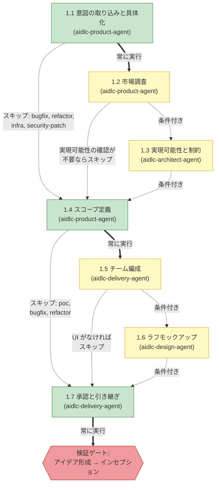
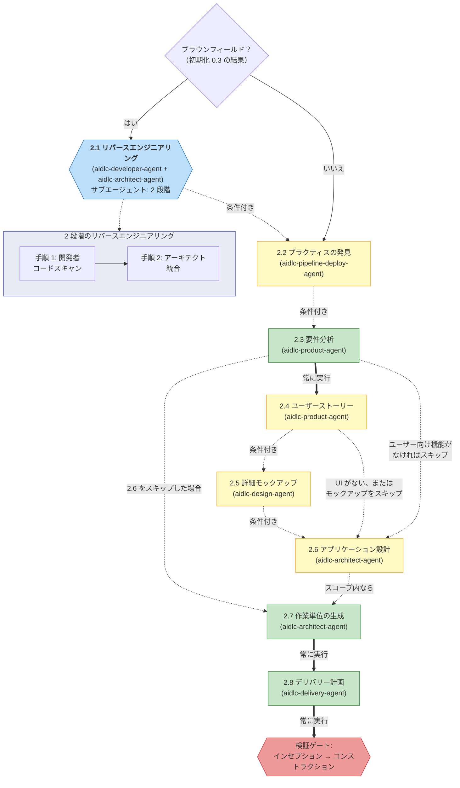
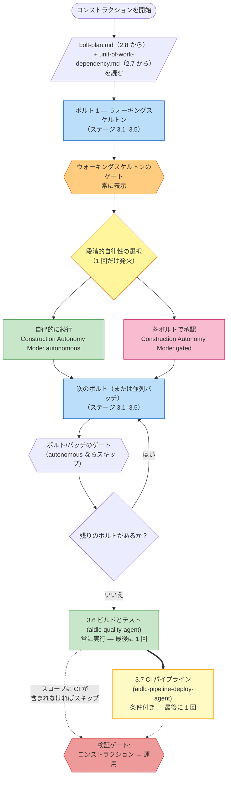
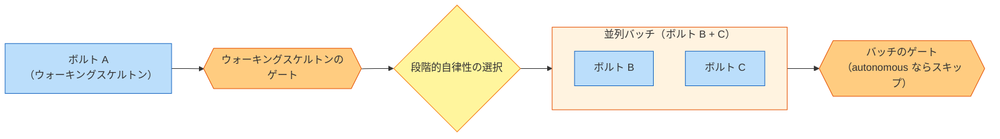
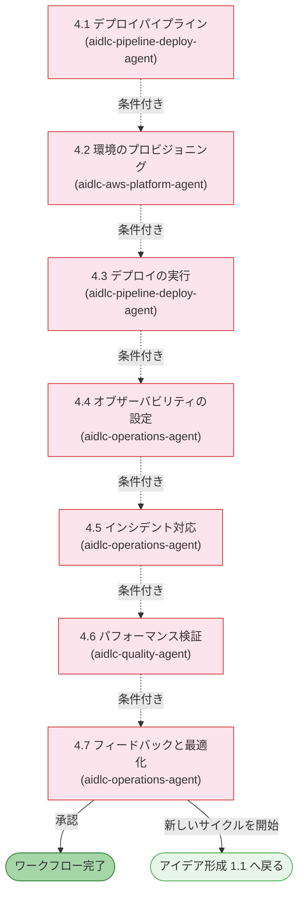

# フェーズとステージ

AI-DLC の lifecycle は、32 の stages を含む 5 つの phases で構成されています。この章では各 phase を説明し、その stages を列挙し、どのように接続されているかを示します。

> **Harness note.** このガイドが説明する methodology、すなわち phases、stages、agents、gates は、どの harness でも同一です。mechanic に harness 差がある場合（gate がどう render されるか、subagent をどう dispatch するか、config がどこにあるか）は、その差異を明示し、対応する harness の章に表でまとめています: [他のハーネスでの実行](harnesses/README.md)。特記がない限り、ここでの例は Claude Code を使います。

---

## ライフサイクルの概要

```mermaid
graph LR
    subgraph INITIALIZATION["初期化 (0.1-0.3)"]
        Z1["ワークスペースの作成"]
        Z4["状態の初期化"]
        Z1 -.->|"3 ステージ"| Z4
    end

    subgraph IDEATION["アイデア形成 (1.1-1.7)"]
        I1["意図の取り込み"]
        I7["承認と引き継ぎ"]
        I1 -.->|"7 ステージ"| I7
    end

    subgraph INCEPTION["インセプション (2.1-2.8)"]
        N1["リバースエンジニアリング"]
        N7["デリバリー計画"]
        N1 -.->|"8 ステージ"| N7
    end

    subgraph CONSTRUCTION["コンストラクション (3.1-3.7)"]
        C1["機能設計"]
        C7["CI パイプライン"]
        C1 -.->|"ユニットごとに 7 ステージ"| C7
    end

    subgraph OPERATION["運用 (4.1-4.7)"]
        O1["デプロイパイプライン"]
        O7["フィードバックと最適化"]
        O1 -.->|"7 ステージ"| O7
    end

    Z4 -->|"自動で次へ"| I1
    I7 -->|"検証ゲート 1"| N1
    N7 -->|"検証ゲート 2"| C1
    C7 -->|"検証ゲート 3"| O1
    O7 -.->|"フィードバックループ"| I1

    style INITIALIZATION fill:#f3e5f5,stroke:#9c27b0
    style IDEATION fill:#e8f5e9,stroke:#4caf50
    style INCEPTION fill:#e3f2fd,stroke:#2196f3
    style CONSTRUCTION fill:#fff3e0,stroke:#ff9800
    style OPERATION fill:#fce4ec,stroke:#e91e63
```

<!-- Text fallback: 直線的な流れです。INITIALIZATION（0.1-0.3）が自動で IDEATION（1.1-1.7）へ進み、そこから Verification Gate 1 を通って INCEPTION（2.1-2.8）へ、Verification Gate 2 を通って CONSTRUCTION（3.1-3.7）へ、Verification Gate 3 を通って OPERATION（4.1-4.7）へ進みます。4.7 からは 1.1 へ戻る feedback loop があります。 -->

phases は順番に実行されます。各 phase boundary では（Initialization → Ideation を除く）、**verification gate** が自動で走り、下流の stages がその上に積み上がる前に、missing links、orphaned artifacts、inconsistencies を検出します。

---

## フェーズ 0: 初期化 (Initialization)

**目的:** workspace を bootstrap します。docs directory を scaffold し、workspace を検出し、state を初期化します。welcome message は `settings.json` の `companyAnnouncements` entry により session start 時に表示されます（stage ではありません）。

Initialization stages は **自動的に** 実行され、approval gates はありません。3 つとも 1 回の決定論的な tool call（`aidlc-utility init`）の中で実行され、完了まで 1 秒もかかりません。

| # | ステージ | 主担当 | 主な成果物 | 条件 |
|---|-------|------|---------------|-----------|
| 0.1 | ワークスペースの作成 | orchestrator | 最初の intent の record dir（`aidlc/spaces/<space>/intents/<YYMMDD>-<label>/`） | ALWAYS |
| 0.2 | ワークスペースの検出 | orchestrator | `aidlc-state.md`（workspace state） | ALWAYS |
| 0.3 | 状態の初期化 | orchestrator | `aidlc-state.md`、`audit/` shards | ALWAYS |

**実行上の注意:**
- 3 つすべての stages は `aidlc-utility init` 内で inline 実行されます。LLM subagent への delegation も、per-stage prompt もありません
- Workspace detection は rule-based scanner です（file extensions、known config filenames、package manifests）
- この phase で user interaction は不要です

---

## フェーズ 1: アイデア形成 (Ideation)

**目的:** initiative を妥当化します。intent を取り込み、実現可能性を評価し、scope を定義し、team を編成し、先へ進む承認を得ます。

<!-- Text fallback: 1.1 Intent Capture（ALWAYS）から 1.2 Market Research（CONDITIONAL）へ進むか、直接 1.4 へ進みます。1.2 からは 1.3 Feasibility（CONDITIONAL）または 1.4 へ進みます。1.3 からは 1.4 Scope Definition（ALWAYS）へ進みます。1.4 からは 1.5 Team Formation（CONDITIONAL）または 1.7 へ進みます。1.5 からは 1.6 Rough Mockups（CONDITIONAL、UI がなければ skip）または 1.7 へ進みます。1.6 から 1.7 Approval & Handoff（ALWAYS）へ進み、その後 Verification Gate 1 です。 -->

| # | ステージ | 主担当 | 支援 | 主な成果物 | 条件 |
|---|-------|------|-----------|---------------|-----------|
| 1.1 | 意図の取り込みと具体化 | aidlc-product-agent | aidlc-architect-agent | Intent statement、stakeholder map | ALWAYS |
| 1.2 | 市場調査 | aidlc-product-agent | — | Competitive analysis、build-vs-buy | CONDITIONAL |
| 1.3 | 実現可能性と制約 | aidlc-architect-agent | aidlc-aws-platform-agent、aidlc-compliance-agent | Feasibility assessment、constraint register、RAID log | CONDITIONAL |
| 1.4 | スコープ定義 | aidlc-product-agent | aidlc-delivery-agent | Scope definition、intent backlog | ALWAYS |
| 1.5 | チーム編成 | aidlc-delivery-agent | — | Team assessment、mob composition plan | CONDITIONAL |
| 1.6 | ラフモックアップ | aidlc-design-agent | aidlc-product-agent | Wireframes、user flows、concept deck | CONDITIONAL |
| 1.7 | 承認と引き継ぎ | aidlc-delivery-agent | aidlc-product-agent | Initiative brief、decision log | ALWAYS |

**ステージの色:** 緑 = ALWAYS（すべての scope で実行）。黄 = CONDITIONAL（いくつかの scope では skip）。

---

## フェーズ 2: インセプション (Inception)

**目的:** 要件を詳細化します。codebase を分析し、requirements を引き出し、architecture を設計し、units of work に分解し、delivery を計画します。

<!-- Text fallback: Brownfield check（stage 0.3 の結果）を行います。Yes なら 2.1 Reverse Engineering が two-step delegation（developer code scan の後に architect synthesis）で実行されます。その後、2.2 Practices Discovery（CONDITIONAL。team の作業方法を発見し、affirmation gate で team/project rule files へ昇格させます）、2.3 Requirements Analysis（ALWAYS）、必要に応じて 2.4 User Stories、必要に応じて 2.5 Refined Mockups、必要に応じて 2.6 Application Design、2.7 Units Generation（ALWAYS）、2.8 Delivery Planning（ALWAYS）と続き、最後に Verification Gate 2 を通ります。 -->

| # | ステージ | 主担当 | 支援 | 主な成果物 | 条件 |
|---|-------|------|-----------|---------------|-----------|
| 2.1 | リバースエンジニアリング | aidlc-developer-agent | aidlc-architect-agent | 9 RE artifacts | Brownfield projects |
| 2.2 | プラクティスの発見 | aidlc-pipeline-deploy-agent | aidlc-quality-agent、aidlc-developer-agent、aidlc-devsecops-agent | `team-practices.md`、`discovered-rules.md`、`evidence.md`（affirmation 時に `aidlc/spaces/<space>/memory/team.md` / `memory/project.md` へ昇格） | CONDITIONAL |
| 2.3 | 要件分析 | aidlc-product-agent | — | `requirements.md` | ALWAYS |
| 2.4 | ユーザーストーリー | aidlc-product-agent | aidlc-design-agent | `stories.md`、`personas.md` | User-facing features |
| 2.5 | 詳細モックアップ | aidlc-design-agent | aidlc-product-agent | Hi-fi mockups、interaction spec | UI projects |
| 2.6 | アプリケーション設計 | aidlc-architect-agent | aidlc-aws-platform-agent、aidlc-design-agent | App design artifacts、ADRs | Per execution plan |
| 2.7 | 作業単位の生成 | aidlc-architect-agent | aidlc-delivery-agent | `unit-of-work.md`、`unit-of-work-dependency.md`（DAG）、`unit-of-work-story-map.md` | ALWAYS |
| 2.8 | デリバリー計画 | aidlc-delivery-agent | aidlc-architect-agent | `bolt-plan.md`、`team-allocation.md`、`risk-and-sequencing-rationale.md`、`external-dependency-map.md` | ALWAYS |

**主な動作:** Stage 2.1 は **subagent** として、two-step Reverse Engineering pattern で動作します。最初に aidlc-developer-agent が code scan を行い、その後 aidlc-architect-agent が synthesis を行います。これは brownfield（既存 codebase）projects でのみ実行されます。

---

## フェーズ 3: コンストラクション (Construction)

**目的:** review 可能な slices で、solution を設計し、実装し、テストします。

### なぜコンストラクションはこの形なのか

Construction は以前、[unit of work](glossary.md) ごとに stage-by-stage で実行され、各 stage の後に approval gate がありました。3-unit の project では、テスト済み code が 1 行も出荷される前に 15 個の gate が必要でした。利用者はそれを babysitting だと感じました。

最初の改善では、質問、design artifacts、そして code generation を全 units に対してまとめて batch 化し、最後に 1 回だけ review するようにしました。しかしそれは振り子を反対側へ振り切り過ぎました。15-unit の run では、build-and-test gate に 15,000 行の code が一気に到達しうるからです。1 回の review で検証するには多過ぎます。

現在の形はその中間です。Construction は **Bolt by Bolt** で進みます。各 [Bolt](glossary.md) は、1 つの Unit（または依存関係で結ばれた少数の Units）に対する stages 3.1–3.5 の 1 周です。最初の Bolt は **walking skeleton** であり、gated かつ interactive です。つまり、architecture を証明する最小の end-to-end slice です。これが出荷されると、**ladder prompt** がちょうど 1 回だけ発火します。「continue autonomously, or gate every Bolt?」という問いです。あなたの回答は state に記録され、この workflow の残りすべての Bolts を支配します。Stages 3.6（Build and Test）と 3.7（CI Pipeline）は、最後に全体に対して 1 回だけ実行されます。

この形により、早い段階で confidence checkpoint を得つつ、autonomy を意図的に選択でき、2.8 で計画済みの Bolts の大きさに合った reviewable slices を保てます。

### コンストラクションの流れ

<!-- Text fallback: Construction を開始し、bolt-plan.md と unit-of-work-dependency.md を読みます。次に Bolt 1（walking skeleton、stages 3.1–3.5）を実行し、必ず walking-skeleton gate を通り、ladder prompt が 1 回だけ発火して autonomous か gated かを選びます。その後、残りの Bolts（それぞれ 3.1–3.5）を mode に応じて gate ありまたはなしでループ実行します。すべての Bolts が終わったら、3.6 Build and Test を実行し、必要なら 3.7 CI Pipeline を実行し、最後に Verification Gate 3 を通ります。 -->

### ボルト (Bolt) の並列バッチ

2 つの Bolts が同じ dependency prerequisite を共有し（たとえば B と C がどちらも A のみを前提とする場合）、互いに依存していないとき、それらは 1 つの **batch** として並行実行されます。batch の終わりにある 1 つの gate が、その中のすべての Bolts をまとめてカバーします。

<!-- Text fallback: まず Bolt A（walking skeleton）が実行され、その gate と ladder prompt が続きます。B と C の両方が A のみに依存する場合、それらは parallel batch を構成して同時に実行されます。その batch 全体を、最後の 1 つの batch-level gate がカバーします（ユーザーが "Continue autonomously" を選んだ場合は skip されます）。 -->

conductor（ライブの `/aidlc` session）は、parallel Bolts を 1 turn の中で複数の `Task` calls を発行することで dispatch します。Claude Code の built-in parallelism により、各 Bolt の Code Generation stage を同時に実行します。一方で、question collection と design-artifact generation は Bolt ごとに実行されます。これらは軽量であり、question answers はどのみち user を通じて直列化される必要があるからです。

### 失敗時は停止して確認する

autonomous mode を選んでいても、失敗した場合は Construction は必ず停止します。これだけは autonomous mode でも中断される箇所です。

- 単独の Bolt が失敗した場合、Construction は即座に停止し、**retry**（その Bolt だけ再実行）、**skip**（`[S]` としてマークして続行。依存する Bolts も高確率で失敗します）、**abort**（Construction 全体を停止）の選択肢を提示します
- parallel batch の中で 1 つの Bolt が失敗し、他が成功した場合、conductor は batch 全体の完了を待ち、成功した Bolts の artifacts は disk に保持したまま、失敗した Bolt だけに対して同じ retry / skip / abort を提示します

### ステージリファレンス

| # | ステージ | 主担当 | 支援 | 主な成果物 | 実行単位 |
|---|-------|------|-----------|---------------|------|
| 3.1 | 機能設計 | aidlc-architect-agent | aidlc-developer-agent | `business-logic-model.md`、`business-rules.md` | Per Bolt（execution plan により CONDITIONAL） |
| 3.2 | NFR 要件 | aidlc-architect-agent | aidlc-devsecops-agent、aidlc-compliance-agent、aidlc-quality-agent | Security、performance、reliability NFRs | Per Bolt（CONDITIONAL） |
| 3.3 | NFR 設計 | aidlc-architect-agent | aidlc-aws-platform-agent | NFR design specifications | Per Bolt（CONDITIONAL） |
| 3.4 | インフラストラクチャ設計 | aidlc-aws-platform-agent | aidlc-devsecops-agent、aidlc-compliance-agent | Infrastructure specifications、IaC designs | Per Bolt（CONDITIONAL） |
| 3.5 | コード生成 | aidlc-developer-agent | — | Application code + code docs | Per Bolt（ALWAYS、Bolt 内では Unit ごと） |
| 3.6 | ビルドとテスト | aidlc-quality-agent | aidlc-devsecops-agent | Test results、quality report | ALWAYS、最後に 1 回 |
| 3.7 | CI パイプライン | aidlc-pipeline-deploy-agent | — | CI config、quality gates | CONDITIONAL、最後に 1 回 |

**主な動作:**

- 各 Bolt の中では、stages 3.1–3.4 に対する questions が、artifacts を生成する前に、その Bolt の Units 全体を横断する 1 回の interactive pass で集められます。その後、1 つの Bolt-level answers gate が、design artifacts の生成前にすべての answers を確認します
- `stages/construction/code-generation.md` の中にある per-Unit approval gate は、通常の Bolt execution 中は **conductor により抑制** されます。代わりに 1 つの Bolt-level（または batch-level）gate が使われます
- ladder prompt は workflow ごとにちょうど 1 回、walking-skeleton gate の直後に発火します。あなたの回答は `aidlc-state.md` に `Construction Autonomy Mode` として記録され、session resume 後も尊重されます
- parallel batches を使うには、複数の `Task` 対応 subagent slots が利用可能である必要があります。並行実行の制約は [エージェント](06-agents.md) を参照してください

---

## フェーズ 4: 運用 (Operation)

**目的:** deploy と運用を行います。deployment pipelines を整え、environments を用意し、observability を設定し、feedback loops を確立します。

<!-- Text fallback: すべての Operation stages は CONDITIONAL です。4.1 から 4.7 へ順に進みます。Stage 4.7 では、そのまま workflow を完了するか、新しい Ideation cycle を 1.1 から始めるかを選べます。 -->

| # | ステージ | 主担当 | 支援 | 主な成果物 | 条件 |
|---|-------|------|-----------|---------------|-----------|
| 4.1 | デプロイパイプライン | aidlc-pipeline-deploy-agent | — | CD config、deployment strategy、rollback runbook | CONDITIONAL |
| 4.2 | 環境のプロビジョニング | aidlc-aws-platform-agent | aidlc-devsecops-agent、aidlc-compliance-agent | Environment inventory、validation report | CONDITIONAL |
| 4.3 | デプロイの実行 | aidlc-pipeline-deploy-agent | aidlc-developer-agent | Deployment log、smoke tests、health checks | CONDITIONAL |
| 4.4 | オブザーバビリティの設定 | aidlc-operations-agent | — | Dashboards、alarms、SLO config | CONDITIONAL |
| 4.5 | インシデント対応 | aidlc-operations-agent | — | SSM runbooks、incident plan、escalation matrix | CONDITIONAL |
| 4.6 | パフォーマンス検証 | aidlc-quality-agent | — | Load test results、NFR validation matrix | CONDITIONAL |
| 4.7 | フィードバックと最適化 | aidlc-operations-agent | aidlc-aws-platform-agent | SLO report、cost analysis、feedback loop doc | CONDITIONAL |

**主な動作:**
- 7 つすべての stages は **conditional** です。`mvp`、`poc`、`bugfix`、`refactor` scopes では phase 全体が skip されることがあります
- Stage 4.7 は **terminal stage** です。ここを承認すると workflow は完了します
- 4.7 から 1.1 へ戻る **feedback loop** により、反復的な開発サイクルを回せます

---

## フェーズ遷移と検証ゲート

各 phase boundary（Ideation → Inception、Inception → Construction、Construction → Operation）で、framework は **phase boundary verification** を実行します。この自動チェックは次を検証します。

- 完了した phase に必要な artifacts がすべて存在すること
- artifacts 間の traceability links が保たれていること（例: すべての requirement が story に対応していること）
- orphaned artifacts や missing references がないこと
- 関連する artifacts 同士に一貫性があること

verification が失敗すると、conductor は問題点を報告し、このまま進むか、戻って直すかを尋ねます。

---

## ステージ実行モードのリファレンス

| モード | ステージ | ユーザー操作 | 説明 |
|------|--------|-----------------|-------------|
| Inline（auto-proceed） | 0.1、0.2、0.3 | なし | `aidlc-utility init` の中で決定論的に実行、approval gate なし |
| Inline | それ以外のすべての stages | Full | agent が会話の中で作業し、最後に approval gate を出す |
| Subagent（simple） | 3.5 | Approval gate のみ | code generation が background で動く |
| Subagent（two-step） | 2.1 | Approval gate のみ | developer scan + architect synthesis |

---

## 次のステップ

- [スコープ、深度、テスト戦略](05-scopes-and-depth.md) — scopes がどの stages を実行するかをどう制御するか
- [エージェント](06-agents.md) — 11 agents とその役割
- [最初のワークフロー](02-your-first-workflow.md) — 注釈付きウォークスルー
- [用語集](glossary.md) — 用語リファレンス
