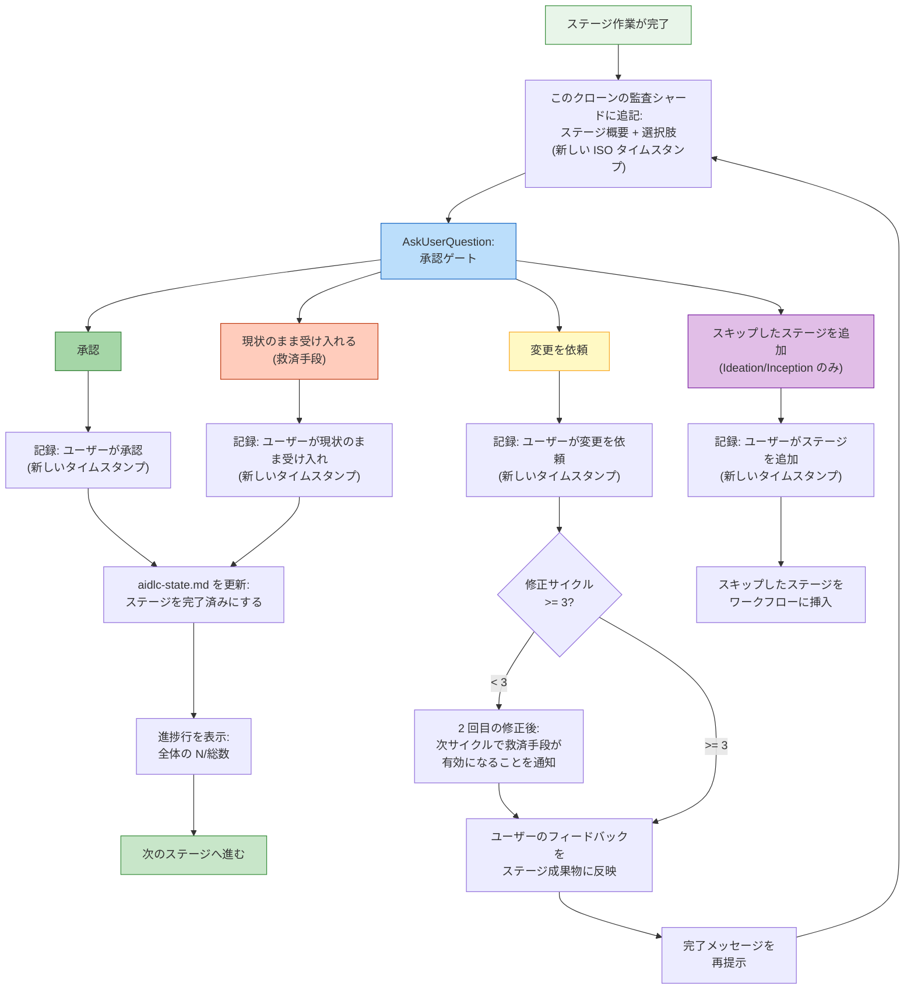

<a id="interaction-modes"></a>
# 対話モード

AI-DLC は、ステージ中にエージェントとやり取りする 3 つの方法に加え、あらゆる意思決定ポイントであなたが主導権を保てるようにする承認ゲートを提供します。

> **ハーネスに関する注記:** ゲートと質問の表示方法はハーネスごとに異なります。Claude Code は `AskUserQuestion` ウィジェットを使い、Kiro と Codex は番号付きの文章として選択肢を表示します（番号または自由記述で回答します）。いずれの場合も、質問ファイルが正本です。ゲートが発火するタイミング、尋ねる内容、ユーザーが主導権を保つという *意味論* は engine に実装されているため共通です。[他のハーネスでの実行](harnesses/README.md) を参照してください。

---

<a id="tri-mode-question-flow"></a>
## 3 モードの質問フロー

ステージであなたの入力を集めるとき、エージェントは 3 つの対話モードを提示します。現在のステージに最も合うものをあなたが選びます。

```
▸ Choose interaction mode:
  (1) Guide Me — agent asks structured questions
  (2) Edit File — write directly to the artifact
  (3) Chat — freeform discussion
```

<a id="guide-me"></a>
### ガイド付き（Guide Me）

エージェントが structured prompts を使って、各質問を対話的に案内します。エージェントに会話を主導してもらい、取りこぼしがないようにしたいときに最適です。

- エージェントが質問を 1 つずつ、またはバッチで提示します
- あなたは各質問に直接答えます
- 回答は traceability のために、そのステージの質問ファイルに記録されます

<a id="edit-file"></a>
### ファイル編集（Edit File）

エージェントが質問ファイルを作成（または開き）、あなたがそれを直接編集します。すでに書きたい内容が明確で、質問に答えるより書き下ろしたいときに最適です。

- 質問ファイルが、空欄の回答フィールド付きで intent の記録ディレクトリに現れます
- あなたは自分のペースで回答を埋めます
- エージェントは完成したファイルを読み取り、先へ進みます

<a id="chat"></a>
### チャット（Chat）

エージェントと自由形式で会話します。アイデアを探索したいときや、要件がまだ十分に定まっていないときに最適です。

- あなたはエージェントと自由に話します
- エージェントは会話から意思決定を抽出します
- 抽出された意思決定は、正式な情報源として質問ファイルに書き戻されます

<a id="switching-modes-mid-stage"></a>
### ステージ途中でのモード切り替え

1 つのステージの途中でも、いつでもモードを切り替えられます。3 つのモードはすべて、意思決定の canonical record として質問ファイルに収束します。切り替えても進捗は失われず、すでに取り込まれた回答はファイルに残ります。

---

<a id="approval-gates"></a>
## 承認ゲート

すべてのステージ（Initialization の 3 ステージを除く）は承認ゲートで終わります。これはワークフローが先に進む前に、エージェントの作業を確認するための checkpoint です。

<a id="standard-gate"></a>
### 標準ゲート

既定の承認ゲートでは、次の 2 つの選択肢が提示されます。

```
▸ How would you like to proceed?
  (1) Approve — Continue to [next stage]
  (2) Request Changes — Provide revision feedback
```

`[next stage]` には、ワークフローが次に実行する実際のステージ名が表示されます（たとえば「NFR 要件へ進む」（"Continue to NFR Requirements"））。最終ステージでは「ワークフローを完了」（"Complete workflow"）になります。これを計算するのは engine なので、推測ではなく常に正しい値です。

- **承認（Approve）** はステージを完了済みにし、`aidlc-state.md` を更新し、進捗行を表示して、次のステージへ進みます
- **変更を依頼（Request Changes）** では具体的なフィードバックを伝えられます。エージェントは作業を修正し、承認ゲートを再提示します

ゲートは実際の human acknowledgement を必要とします。prompt を入力するか `AskUserQuestion` widget に答えると、audit ledger に human turn（`HUMAN_TURN` event）が記録されます。approve と（必要なら）clarifying-question への回答は、最後のゲート resolution 以降にそれが記録されていない限り拒否されるため、autopilot で走る model が人間の操作なしに approval を捏造することはできません。ゲート widget が human turn を記録しないハーネスでは、短いメッセージを 1 回入力してください（たとえば "approve"）。そうすれば記録されます。（そのハーネスの ledger にまだ human turn が一度もない場合、このゲートは fail-open し、これを要求しません。）

<a id="approval-gate-flow"></a>
### 承認ゲートの流れ



<!-- テキスト代替: ステージが完了すると、audit log に選択肢が記録され、AskUserQuestion が承認ゲートを提示します。承認の場合は、応答を記録し、状態を更新し、進捗を表示して次へ進みます。変更依頼の場合は、応答を記録して修正回数を確認します。3 回未満なら、まもなく救済手段が有効になることを知らせて修正・再提示します。3 回以上なら「現状のまま受け入れる」が選択可能になります。現状のまま受け入れた場合は記録して完了扱いにします。スキップしたステージを追加した場合（Ideation／Inception のみ）は、記録してステージを挿入します。 -->

---

<a id="the-3-strike-revision-escape-hatch"></a>
## 3 回で有効になる修正ループの救済手段

同じステージで 3 回以上変更を依頼すると、3 つ目の選択肢が現れます。

```
▸ This is revision cycle 4. How would you like to proceed?
  (1) Approve — Continue to [next stage]
  (2) Request Changes — Provide revision feedback
  (3) Accept as-is — Archive current version and move on
```

**Accept as-is** は、その時点のステージ成果物をアーカイブし、ワークフローを先へ進めます。これにより、「より良い」が「十分に良い」の敵になるときに、終わりのない改訂ループに陥るのを防ぎます。

<a id="how-it-activates"></a>
### どう有効になるか

| 改訂サイクル | 起こること |
|----------------|-------------|
| 初回 | 標準の 2 選択肢ゲート |
| 2 回目 | 標準の 2 選択肢ゲート + 「あと 1 回改訂すると `Accept as-is` オプションが利用可能になります」という注記 |
| 3 回目以降 | `Accept as-is` を含む 3 選択肢ゲート |

修正回数は次のステージへ進むとリセットされます。

---

<a id="add-skipped-stage-option"></a>
## スキップしたステージを追加する選択肢

**Ideation** と **Inception** の各フェーズでは、承認ゲートに、以前スキップしたステージをワークフローに戻すための条件付きオプションが含まれる場合があります。

```
▸ How would you like to proceed?
  (1) Approve — Continue to Scope Definition
  (2) Request Changes — Provide revision feedback
  (3) Add Market Research — Include Market Research which was skipped
```

このオプションが現れるのは、次のすべてを満たすときだけです。
- 現在のステージが Ideation または Inception にある
- 先のステージがスコープ routing の途中でスキップされていた
- スキップされたステージが現在の文脈に関連している

このオプションを選ぶと、スキップされていたステージがワークフロー計画に挿入されます。ワークフローは追加されたステージを含めて通常どおり進みます。

---

<a id="skipping-and-navigating-stages"></a>
## ステージのスキップと移動

承認ゲート以外にも、追加の移動オプションがあります。

| コマンド | 効果 |
|---------|--------|
| `/aidlc --stage <name>` | 特定のステージへ移動する（間にあるステージは `[S]` として記録） |
| `/aidlc --phase <name>` | あるフェーズの先頭へ移動する |

[セッション管理](11-session-management.md) と [CLI コマンド](12-cli-commands.md) で詳細を確認してください。

---

<a id="progress-tracking"></a>
## 進捗追跡

承認のたびに、次のような進捗行が表示されます。

```
Progress: 13/32 overall | 3/7 IDEATION stages complete. Next: Approval & Handoff
```

ここには次が示されます。
- すべてのステージを通した全体進捗
- 現在のフェーズ内での進捗
- 次のステージ名

---

<a id="next-steps"></a>
## 次のステップ

- [最初のワークフロー](02-your-first-workflow.md) — 対話モードが文脈の中でどう使われるかを見る
- [状態管理と監査証跡](10-state-and-audit.md) — 意思決定がどう追跡されるか
- [セッション管理](11-session-management.md) — resume、redo、jump
- [用語集](glossary.md) — 用語リファレンス
