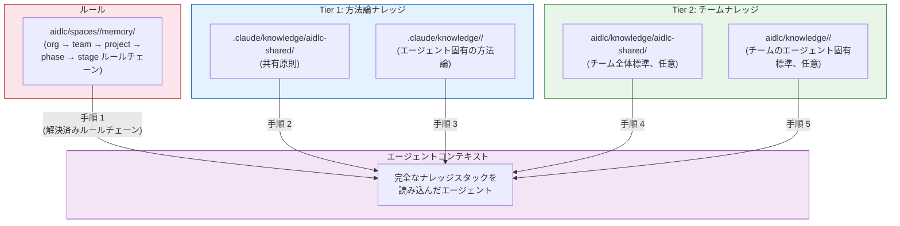
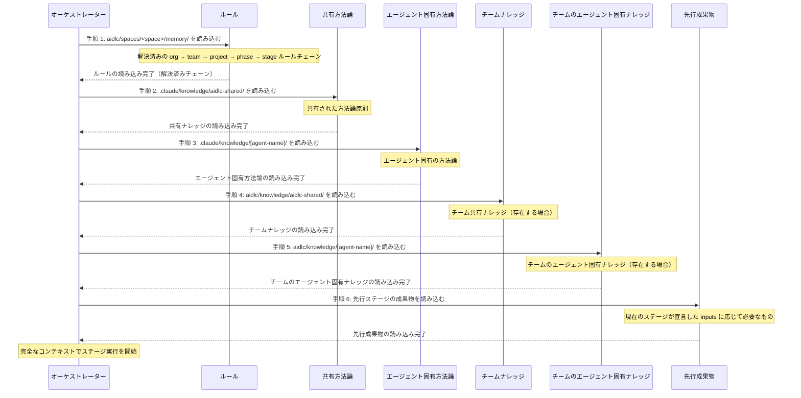

<a id="knowledge"></a>
# ナレッジ

AI-DLC は 2 層のナレッジシステムを使います。これにより、エージェントは framework と共に出荷される methodology expertise と、あなたのチーム固有の standards の両方を参照できます。

---

<a id="two-tier-knowledge-architecture"></a>
## 2 層ナレッジアーキテクチャ



<!-- テキスト代替: 最初に解決済みのルールチェーンを読み込み、次に Tier 1 の方法論ナレッジ（共有、エージェント固有の順）、その後に Tier 2 のチームナレッジ（共有、エージェント固有の順）を読み込みます。すべてがステージ実行時のエージェントコンテキストに渡されます。 -->

<a id="tier-1-methodology-knowledge"></a>
### Tier 1: 方法論ナレッジ

**場所:** `.claude/knowledge/`

framework とともに出荷されます。AI-DLC のステージ実行方法を定義する、共有原則とエージェントごとの methodology references を含みます。framework を upgrade すると更新されます。

```
.claude/knowledge/
├── aidlc-shared/                       # Loaded by every agent
│   ├── ai-dlc-principles.md        # Core methodology principles
│   ├── audit-format.md             # 68-event audit taxonomy
│   ├── brownfield.md               # Brownfield safeguards and reverse-engineering guidance
│   ├── knowledge-readme-template.md # Optional README template a team can copy into Tier 2
│   ├── state-template.md           # State file schema
│   └── verification.md             # Phase boundary verification rules
├── aidlc-architect-agent/                 # Loaded when aidlc-architect-agent is active
├── aidlc-developer-agent/                 # Loaded when aidlc-developer-agent is active
├── aidlc-product-agent/                   # Loaded when aidlc-product-agent is active
└── ...                              # One directory per agent
```

> **チーム固有のナレッジを注入するために Tier 1 ファイルを編集してはいけません。** `.claude/knowledge/` と `.claude/agents/*.md` は framework ファイルです。upgrade のたびに上書きされるため、変更は消えます。会社標準、アーキテクチャ上の好み、domain context を追加したいなら、**Tier 2**（下記）に追加してください。エージェントの振る舞いを制約したいなら、**ルール** を追加してください（[ルールと学習ループ](09-rules-and-the-learning-loop.md) を参照）。

<a id="tier-2-team-knowledge"></a>
### Tier 2: チームナレッジ

**場所:** active space の `aidlc/knowledge/`（`aidlc/spaces/<space>/knowledge/` の省略表記）

user-managed です。会社固有の standards、policies、conventions を含みます。space の `memory/`、`codekb/`、`intents/` の sibling なので、チームナレッジは 1 つの intent の record の中ではなく、その space 内のすべての intent を通して蓄積されます。これは **bootstrap 時には free-form かつ空** です。engine は初回 `/aidlc` 時に空の `aidlc/knowledge/` ディレクトリを作るだけです。固定のファイル set も、必須の structure もありません。下の慣習、つまり `aidlc-shared/` ディレクトリとエージェントごとに 1 つのディレクトリは、エージェント personas が参照する形なので、必要な subdirectories を作りながら使ってください。

```
aidlc/knowledge/                  # empty at bootstrap; create the subdirs you need
├── aidlc-shared/                 # if present, loaded by every agent
│   ├── company-coding-standards.md
│   └── company-architecture-principles.md
├── aidlc-architect-agent/           # if present, loaded when aidlc-architect-agent is active
│   └── company-architecture-patterns.md
├── aidlc-developer-agent/           # if present, loaded when aidlc-developer-agent is active
│   └── company-coding-conventions.md
├── aidlc-devsecops-agent/           # if present, loaded when aidlc-devsecops-agent is active
│   └── company-security-policy.md
├── aidlc-quality-agent/             # if present, loaded when aidlc-quality-agent is active
│   └── company-testing-standards.md
└── ...                        # add a directory per agent only if you have content for it
```

---

<a id="adding-company-standards"></a>
## 会社標準を追加する

会社固有のファイルを、適切な `aidlc/knowledge/` ディレクトリに置いてください。エージェントが有効化されると自動で読み込まれます。configuration の変更は不要です。

<a id="team-wide-standards-loaded-by-all-agents"></a>
### チーム全体標準（すべてのエージェントが読み込む）

`aidlc/knowledge/aidlc-shared/` に追加します。

```
aidlc/knowledge/aidlc-shared/company-coding-standards.md
aidlc/knowledge/aidlc-shared/company-architecture-principles.md
aidlc/knowledge/aidlc-shared/naming-conventions.md
```

<a id="agent-specific-standards-loaded-only-when-that-agent-is-active"></a>
### エージェント固有標準（そのエージェントが active のときだけ読み込む）

`aidlc/knowledge/<agent-name>/` に追加します。

| ディレクトリ | ファイル例 |
|-----------|--------------|
| `knowledge/aidlc-architect-agent/` | アーキテクチャパターン、ADR テンプレート、設計原則 |
| `knowledge/aidlc-developer-agent/` | コーディング規約、フレームワークガイド、API パターン |
| `knowledge/aidlc-devsecops-agent/` | セキュリティポリシー、脅威モデルのテンプレート、スキャンルール |
| `knowledge/aidlc-quality-agent/` | テスト標準、カバレッジしきい値、性能基準 |
| `knowledge/aidlc-aws-platform-agent/` | AWS アカウント構成、CDK 規約、タグ付けポリシー |
| `knowledge/aidlc-compliance-agent/` | 規制要件、データ分類、監査標準 |
| `knowledge/aidlc-operations-agent/` | SLO 定義、インシデント手順、監視標準 |
| `knowledge/aidlc-product-agent/` | プロダクト戦略、ペルソナ定義、優先順位付けの枠組み |
| `knowledge/aidlc-design-agent/` | デザインシステム、アクセシビリティ標準、UX ガイドライン |
| `knowledge/aidlc-delivery-agent/` | スプリントテンプレート、キャパシティモデル、見積もりガイドライン |
| `knowledge/aidlc-pipeline-deploy-agent/` | CI/CD パターン、デプロイチェックリスト、ロールバック手順 |

<a id="where-the-directories-come-from"></a>
### そのディレクトリはどこから来るのか

チームが作ります。初回 `/aidlc` では、engine は空の space-level `aidlc/knowledge/` ディレクトリだけを作成し、その中には何も作りません。scaffold command も、seed 済み per-agent subdirectories も、guidance README もありません。`aidlc-shared/` と per-agent subdirectories は、エージェント personas が探す慣習です。中身が必要なものだけ作ってください。エージェント slug と正確に一致させてください（`aidlc-architect-agent/` であり `architect/` ではありません）。typo のあるディレクトリ name は黙って無視されます。

---

<a id="worked-example-adding-your-first-knowledge-file"></a>
## 実例: 最初のナレッジファイルを追加する

たとえば、あなたのチームが特定の Amazon API Gateway pattern を使っているとします。すべての route の前に authorizer Lambdas を置き、request-validation JSON schema を使い、標準 response envelope を持つ、というパターンです。新しい API を設計するときに、aidlc-architect-agent が既定でその pattern を採用してほしいとします。

**手順 1 — 必要な knowledge ディレクトリを作成します。** 初回 `/aidlc` で engine は空の `aidlc/knowledge/` ディレクトリを作ります。エージェントごとの scaffold も、初期配置済みの README もないので、エージェント subdirectory は自分で作成してください。ここでは `aidlc/knowledge/aidlc-architect-agent/` です。エージェント slug と正確に一致させてください。

**手順 2 — 適切なエージェントディレクトリに、焦点の絞られたナレッジファイルを作成します。**

```
aidlc/knowledge/aidlc-architect-agent/api-gateway-standards.md
```

ファイル名のルール:
- 小文字を使い、単語をハイフンで区切り、内容が分かる名前にします
- 1 ファイルにつき 1 トピックにします。`architecture.md` ではなく `api-gateway-standards.md` のようにします
- ディレクトリ内の `.md` ファイルはすべて読み込まれます。命名規則は必須ではありませんが、内容が分かる名前にすると weekly review に役立ちます

**手順 3 — 内容は簡潔な参考資料（reference material）として書きます。** エージェントはファイルをそのまま読み込むため、引き締めて書いてください。

```markdown
# API Gateway Standards

All new HTTP APIs use Amazon API Gateway REST APIs (not HTTP APIs) with:

## Authorization
- Lambda authorizer in front of every route
- Token source: `Authorization` header, Bearer scheme
- Authorizer result cached for 300 seconds

## Request validation
- Every request body validated against a JSON schema attached to the method
- Reject at the gateway layer — do not validate in handlers

## Response envelope
All successful responses follow:
  { "data": <payload>, "requestId": "<uuid>", "timestamp": "<iso-8601>" }

Error responses follow:
  { "error": { "code": "<short-code>", "message": "<human-readable>" }, "requestId": "<uuid>" }
```

**手順 4 — ワークフローを実行します。** 次の `/aidlc` 呼び出しでは、aidlc-architect-agent がステージ開始時にこのファイルを自動で読み込みます（下の読み込み順序の手順 5）。設定変更も CLI flag も登録作業も不要です。ファイルが存在すること自体が登録になります。

**避けるべきよくある間違い:**

| 誤り | 正しい方法 |
|-------|-------|
| `.claude/agents/aidlc-architect-agent.md` を編集する | `aidlc/knowledge/aidlc-architect-agent/` の下にファイルを追加する |
| `.claude/knowledge/aidlc-architect-agent/architecture-guide.md` を編集する | `aidlc/knowledge/aidlc-architect-agent/` の下にファイルを追加する |
| すべてを `knowledge/aidlc-shared/` に入れる | その標準が 11 エージェントすべてに本当に当てはまる場合を除き、エージェント固有のディレクトリを使う |
| API、認証、データ、ログを 1 つの大きな `company-standards.md` で扱う | `api-gateway-standards.md`、`auth-standards.md` などに分割する |

---

<a id="verifying-knowledge-is-loaded"></a>
## ナレッジが読み込まれていることを確認する

チームが knowledge を展開する前に、エージェントがそのファイルを本当に見ていることを確認してください。

**方法 1 — 承認ゲートでエージェントに尋ねます。** ワークフロー中のどのゲートでも、次のように返答します。

```
What team knowledge are you using for this stage?
```

エージェントは、読み込んだ Tier 2 ファイルを列挙します。ファイルが現れない場合は、filename extension が `.md` であることと、ディレクトリがエージェント name に正確に一致していることを確認してください（例: `aidlc-architect-agent/` であり `architect/` ではありません）。

**方法 2 — そのエージェントの監査証跡を確認します。** ステージ開始時には毎回 `STAGE_STARTED` audit event が出力され、ステージとその lead エージェントが記録されます。ステージを 1 つ実行したら、次を確認してください。

```
<record>/audit/        # per-clone shards; glob and merge by timestamp
```

そのステージについて最新の `STAGE_STARTED` entry を探し、**Agent** field が、あなたのファイルを置いた knowledge ディレクトリを持つエージェントになっていることを確認してください。そうすれば、正しい persona が有効化され、その `aidlc/knowledge/<agent>-agent/` ディレクトリがスコープに入っていたことが分かります。監査証跡はどのエージェントが走ったかを記録しますが、読んだ個々のファイルは記録しません。特定のファイルが読み込まれたかの確認には Option 1 を使ってください。

**方法 3 — 軽いワークフローで smoke test します。** 軽量な end-to-end check として、対象エージェントが動く小さなスコープを使います。

```
/aidlc poc Prototype a new inventory API
```

aidlc-architect-agent は Application Design 中に実行されます。読み込まれた Tier 2 ファイルは、その出力に目に見える形で影響します（この例では、生成される architecture に Lambda authorizer を備えた API Gateway への言及が現れるはずです）。

---

<a id="managing-knowledge-over-time"></a>
## 時間とともにナレッジを管理する

ナレッジファイルは一度置いたら終わりではありません。standards が変わるにつれ、チームナレッジの保管庫も code と同じように pruning と refactoring が必要になります。

<a id="updating-an-existing-file"></a>
### 既存ファイルを更新する

ファイルをその場で編集してください。knowledge はステージ開始ごとに再読み込みされるため、次の `/aidlc` invocation が変更を拾います。restart も cache も registration も不要です。

<a id="removing-outdated-knowledge"></a>
### 古くなったナレッジを削除する

ファイルを削除してください。更新すべき registry も、掃除すべき configuration もありません。エージェントがその standard に依存していた場合でも、その後の実行では単に適用されなくなるだけです。

<a id="splitting-a-file-that-has-grown-too-large"></a>
### 大きくなりすぎたファイルを分割する

1 つのファイルが複数トピックを覆うようになったら（よくある drift です）、分割してください。

```
api-standards.md          →   api-gateway-standards.md
                              api-versioning-standards.md
                              api-error-handling-standards.md
```

小さく焦点の絞られたファイルのほうが、更新しやすく、レビューしやすく、矛盾を含みにくくなります。

<a id="promoting-agent-specific-to-shared"></a>
### エージェント固有から shared へ昇格させる

もともと 1 つのエージェント向けに書いた standard が、チーム全体に当てはまることが分かったなら、上位へ移してください。

```
aidlc/knowledge/aidlc-architect-agent/naming-conventions.md
  →  aidlc/knowledge/aidlc-shared/naming-conventions.md
```

`aidlc-shared/` ディレクトリは、すべてのエージェントに読み込まれます（loading order の step 4）。

<a id="review-cadence"></a>
### レビューの頻度

四半期ごとの prune を予定してください。動いている project には、どれも古くなった knowledge が蓄積されます。古いファイルや矛盾するファイルは、同じ重みでそのまま読み込まれるため、エージェントを積極的に混乱させます。weekly あるいは sprint review を retro の中で短く行うだけでも十分なことがよくあります。各ファイルを開き、まだ現実を反映しているかを確認し、そうでないものを削除または更新してください。

---

<a id="knowledge-vs-rules-which-to-use"></a>
## ナレッジとルールのどちらを使うべきか

ナレッジファイルもルールもエージェントの振る舞いをカスタマイズしますが、両者は互換ではありません。次の表を判断の助けにしてください。

| ナレッジを使う場合 | ルールを使う場合 |
|-----------------------|--------------------|
| エージェントに参照してほしい **参考資料** を提供する | エージェントが従うべき **振る舞いのルール** を述べる |
| 「私たちはこのパターンを使う」 | 「X は絶対にしない」／「必ず Y をする」 |
| 内容は情報的で文脈依存 | 内容は規範的で譲れない |
| 特定のドメインやエージェントに適用される | ステージやエージェントを横断して適用される |
| 長めの文章、図、表でもよい | 短く、命令形で、1 行ずつにすべき |
| 例: API Gateway 標準、コーディング規約、ドメイン用語集 | 例: 「PII を決してログに記録しない」「すべてのデータアクセスはリポジトリ層を経由する」「DynamoDB の `scan` 操作を使う設計は却下する」 |

実用的な見分け方があります。**違反したときに human reviewer がステージの出力を差し戻すなら、それは space memory layer（`aidlc/spaces/<space>/memory/`）に置くべきです。** reviewer が review のときに背景文脈として使うだけなら、それは knowledge です。

ルールと knowledge は別の平面にあり、そのため読み込み方も異なります。ナレッジファイルは、ステージ中にエージェントが重み付けして使う reference material です。ルールは strict-additive な chain、つまり org、team、project、フェーズ、ステージを通じて解決され、それを framework がワークフロー前に compile します。適用可能なすべてのルールがエージェントに届き、何かが黙って落とされることはありません。layer 間の conflict は、team または project ルールが最初に書かれた admission 時点で検出されるので、ステージ途中で調停されることはありません。

完全なルール model、つまりファイル locations、5 層 chain、learning loop、admission-time conflict checks については [ルールと学習ループ](09-rules-and-the-learning-loop.md) を参照してください。

---

<a id="knowledge-loading-order"></a>
## ナレッジの読み込み順序

ステージが始まると、conductor は厳密な 6 ステップの順序で knowledge を読み込みます。



<!-- テキスト代替: 6 つの手順で読み込みます。1. ルール（解決済みの org → team → project → フェーズ → ステージ chain）、2. 共有方法論ナレッジ、3. エージェント固有の方法論ナレッジ、4. チーム共有ナレッジ（存在する場合）、5. チームのエージェント固有ナレッジ（存在する場合）、6. 先行ステージの成果物。 -->

| 手順 | 読み込み元 | 読み込まれるもの | 優先度 |
|------|--------|-----------|----------|
| 1 | `aidlc/spaces/<space>/memory/` | 解決済みの org → team → project → フェーズ → ステージルールチェーン | 振る舞いのルール — 適用可能なルールはすべて読み込まれる（strict-additive） |
| 2 | `.claude/knowledge/aidlc-shared/` | 共有方法論の原則 | フレームワークレベルの既定値 |
| 3 | `.claude/knowledge/<agent>/` | エージェント固有の方法論 | エージェントの専門知識 |
| 4 | `aidlc/knowledge/aidlc-shared/` | チーム全体標準 | 会社の既定値 |
| 5 | `aidlc/knowledge/<agent>/` | チームのエージェント固有標準 | 会社の知識 + エージェントの専門知識 |
| 6 | 先行ステージの成果物 | 以前のステージの出力 | 実行時コンテキスト |

**要点:**
- Steps 1-5 は disk 上のファイルから読み込みます
- Step 6 は、現在のステージが宣言している inputs に基づいて orchestrator が runtime に追加する context です
- Steps 4-5 は、そのディレクトリが存在しファイルを含む場合にだけ読み込まれます
- [ルール](09-rules-and-the-learning-loop.md) は reference material ではなく behavioral constraints です。解決済み chain が最初に読み込まれ、適用可能なルールはすべてエージェントに届きます

---

<a id="best-practices"></a>
## ベストプラクティス

<a id="keep-knowledge-files-focused"></a>
### ナレッジファイルは焦点を絞る

各ファイルは 1 つのトピックだけを扱うべきです。大きな 1 ファイルより、小さなファイルを複数に分けるほうを選んでください。古くなった standards を更新・削除しやすくなります。

<a id="use-the-shared-directory-for-cross-cutting-concerns"></a>
### 横断的関心事には shared ディレクトリを使う

すべてのエージェントに当てはまる standards（naming conventions、coding style、commit message format）は `knowledge/aidlc-shared/` に置きます。特定の domain に固有の standards（architecture patterns、security policies）は、そのエージェントディレクトリに置きます。

<a id="review-knowledge-before-workflows"></a>
### ワークフロー前に knowledge を見直す

ナレッジファイルはステージ開始のたびに読み込まれます。古い knowledge や矛盾した knowledge はエージェントを混乱させます。knowledge ディレクトリは定期的に見直し、prune してください。

<a id="dont-duplicate-tier-1-content"></a>
### Tier 1 の内容を重複させない

methodology principle の適用の仕方を **制約したい** なら、Tier 1 ファイルを複製するのではなくルールを追加してください。[ルールと学習ループ](09-rules-and-the-learning-loop.md) を参照してください。

<a id="dont-edit-agent-files-to-inject-team-context"></a>
### チーム文脈を注入するためにエージェントファイルを編集しない

`.claude/agents/*.md` は、エージェントの persona、tool access、knowledge-loading sequence を定義します。そこにチームナレッジを追加するために編集してしまうのは、よくある間違いです。その変更は framework upgrade 時に上書きされます。必ず `aidlc/knowledge/<agent>/` を使ってください。

<a id="name-the-directories-to-match-the-agent-slug"></a>
### ディレクトリ名はエージェント slug に一致させる

space-level の `aidlc/knowledge/` ディレクトリは bootstrap 時には空で、standards が増えるにつれて `aidlc-shared/` と per-agent subdirectories を自分で作っていきます。ディレクトリ name はエージェント slug と正確に一致しなければなりません（例: `aidlc-architect-agent/` であり `architect/` ではありません）。typo のある name は、loader が名前でエージェント自身のディレクトリをたどったときに何も見つからないため、黙って無視されます。

---

<a id="next-steps"></a>
## 次のステップ

- [ルールと学習ループ](09-rules-and-the-learning-loop.md) — strict-additive ルール chain と、framework がワークフローを通じて新しいルールをどう学ぶか
- [はじめに](01-getting-started.md) — workspace shell と knowledge ディレクトリが現れる場所
- [カスタマイズ](13-customization.md) — 完全なカスタマイズガイド
- [用語集](glossary.md) — 用語リファレンス
