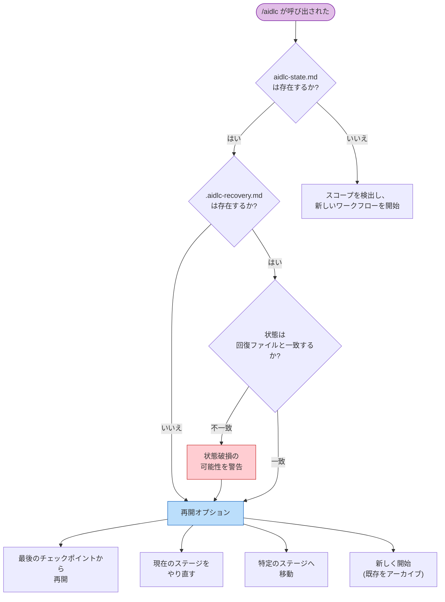

<a id="session-management"></a>
# セッション管理

1 つのワークフローは複数のハーネス session にまたがる場合があります。AI-DLC はすべての progress を disk に保存するため、いつでも resume、redo、jump、または新規開始ができます。

> **ハーネスに関する注記:** セッション再開はすべてのハーネスで機能します。状態はハーネスではなく intent の記録ディレクトリに保存されるためです。ただし、セッションの *ライフサイクルイベント* は異なります。Claude Code は `SESSION_STARTED/RESUMED/ENDED` と `SESSION_COMPACTED` を出力し、Kiro は `SESSION_STARTED` だけを出力します。Codex は `SESSION_ENDED` を推論し、compaction 後に mission を再注入します。[他のハーネスでの実行](harnesses/README.md) を参照してください。

---

<a id="resume-flow"></a>
## 再開フロー（Resume Flow）

前回の session から active intent の `aidlc-state.md`（その記録ディレクトリの下）が残っている状態で `/aidlc` を実行すると、AI-DLC は status summary を表示し、4 つの resume options を提示します。



<!-- テキスト代替: /aidlc が呼び出されます。状態ファイルが存在すれば回復ファイルを確認します。回復ファイルが存在し、そのステージが状態と一致しなければ、破損の可能性を警告します。その後、4 つの再開オプションを表示します。状態ファイルが存在しなければ、スコープを検出して新しいワークフローを開始します。 -->

<a id="four-resume-options"></a>
### 4 つの再開オプション

| オプション | 起こること | 保持されるもの | 失われるもの |
|--------|-------------|-------------------|-------------|
| **最後のチェックポイントから再開（Resume from last checkpoint）** | 進行中のステージまたは次の保留中ステージから継続します。Task サイドバーは状態ファイルから再構築されます。 | すべての成果物、状態、監査証跡 | 前セッションのメモリ内会話コンテキスト |
| **現在のステージをやり直す（Redo current stage）** | 現在のステージの成果物ディレクトリを削除し、そのチェックボックスを `[ ]` に戻して、最初から再実行します。 | 他のすべての成果物と状態 | 現在のステージの成果物と途中作業 |
| **ステージへ移動（Jump to stage）** | 特定のステージへ移動します。スキップされるステージと、下流成果物が無効になる可能性について警告します。 | 既存のすべての成果物 | 現在位置と移動先の間のステージは `[S]`（skipped）として記録される |
| **新しく開始（Start fresh）** | アクティブなインテントの記録ディレクトリを `aidlc/spaces/<space>/intents/` の下へアーカイブし（確認が必要）、新しいインテントを作成します。 | 以前のすべての成果物のアーカイブ済みコピー | アクティブなワークフロー状態（新しいインテントと状態ファイルが作成される） |

---

<a id="recovery-breadcrumb"></a>
## 回復用の手がかり（Recovery Breadcrumb）

Claude Code が conversation context を compact する前に、`validate-state.ts` hook は active intent の記録ディレクトリにある `.aidlc-recovery.md` という hidden recovery ファイルを書きます。このファイルには次が含まれます。

- 最後に validation した timestamp
- 現在のステージ name（`aidlc-state.md` から抽出）
- 状態ファイルが有効かどうか

次の `/aidlc` invocation で、AI-DLC は `.aidlc-recovery.md` を `aidlc-state.md` と比較します。`"Current stage"` fields が異なっていれば、context compaction に起因する state corruption の可能性を警告します。

---

<a id="context-compaction"></a>
## コンテキスト圧縮（Context Compaction）

Claude Code は、context window がいっぱいになると、以前の conversation context を自動で要約します。これを **compaction** と呼びます。この実装には、compaction events をまたいでもワークフロー state を保つ safeguards が入っています。

<a id="what-is-preserved-vs-lost"></a>
### 保持されるものと失われるもの

| 保持されるもの | 失われるもの |
|-----------|------|
| 記録ディレクトリのすべての成果物（ディスク上のファイル） | メモリ内の会話コンテキスト（以前の議論） |
| `aidlc-state.md`（ステージ進捗、スコープ、プロジェクト情報） | まだファイルに書かれていない途中作業 |
| `audit/` シャード（意思決定とアクションの完全な履歴） | Task ID（状態ファイルから再開時に再構築される） |
| `.aidlc-recovery.md`（ステージのチェックポイント） | エージェントのペルソナコンテキスト（エージェントファイルから再読み込みされる） |

<a id="how-to-recover-after-compaction"></a>
### compaction 後の回復方法

1. `/aidlc` を実行する — AI-DLC が状態ファイルを読み、resume options を提示します
2. recovery breadcrumb が mismatch を警告したら、**現在のステージをやり直す（Redo current stage）** を選び、compaction 中だったステージを再実行します
3. warning がなければ、**Resume from last checkpoint** を選んで通常どおり継続します

compaction は長い session では通常の一部です。状態ファイルと disk 上の成果物により、完了済みの作業は失われません。

---

<a id="stage-jumps"></a>
## ステージ間の移動（Stage Jumps）

utility commands を使って、ワークフロー内を前後に jump できます。

<a id="jump-to-a-specific-stage"></a>
### 特定のステージへ jump する

```
/aidlc --stage code-generation
/aidlc --stage 3.5
```

前方へ jump する場合、現在位置と target の間にあるステージは `[S]`（skipped）として記録されます。orchestrator は次について警告します。

- スキップされるステージ
- 下流ステージが期待するが見つからなくなる成果物
- traceability への潜在的な影響

後方へ jump する場合、target ステージは `[ ]`（not started）に戻され、再実行されます。すでに completed 済みの下流ステージは `[x]` のままですが、その成果物は stale になる可能性があります。

<a id="jump-to-the-start-of-a-phase"></a>
### フェーズの先頭へ jump する

```
/aidlc --phase construction
/aidlc --phase 3
```

これにより、指定フェーズの最初のステージへ jump します。同じく、スキップされるステージと成果物 invalidation の警告が適用されます。

<a id="combining-jumps-with-scope"></a>
### jump とスコープを組み合わせる

状態ファイルのない project では、`--stage` または `--phase` を `--scope` と組み合わせられます。

```
/aidlc --stage code-generation --scope bugfix
```

これにより、指定スコープで新しいワークフローが作成され、target ステージへ直接 jump します。

---

<a id="session-skills"></a>
## セッションスキル（Session Skills）

3 つの read-only skills が、現在のワークフローを変更せずに report します。どれも command のように入力でき、`/` skill picker に現れます。

| スキル | 機能 | 出力 |
|-------|--------------|--------|
| `/aidlc-session-cost` | 所要時間、ステージの結果、メモリエントリ、センサーの発火、取り込んだ学習を含む決定論的なコスト表示を出力する | ターミナルのみ |
| `/aidlc-replay` | 同席しなかった関係者向けに、何をなぜ決めたかを読みやすいセッション記録として表示する | ターミナルのみ |
| `/aidlc-outcomes-pack` | ワークフローを再実行せずにチームがシステムを引き継いで継続できるよう、引き継ぎ文書を生成する | `OUTCOMES.md` に書き込む |

**これらは read-only です。** どれもワークフローステージ pointer を進めず、audit event も出しません。そのため mid-stage を含め、どの時点でも安全に実行できます。`/aidlc-session-cost` と `/aidlc-replay` は terminal に出力するだけで何も書きません。ファイルを書くのは `/aidlc-outcomes-pack` だけで、workspace root に `OUTCOMES.md` を出力します。

**報告する数値はすべて data plane から直接取得されます。** 各 skill は `bun .claude/tools/aidlc-runtime.ts summary --json` から figures を読みます。これは `runtime-graph.json` に対する materialised view です。skills は見積もったり再集計したりせず、numbers の周囲にある prose（narrative や decision rationale）だけが監査証跡と artefacts から synthesise されます。token estimate は意図的にありません。以前の file-size-to-token heuristic は推測に過ぎず、削除されました。

```
/aidlc-session-cost      # quick "where are we" snapshot, any time
/aidlc-replay            # narrate the session for async review
/aidlc-outcomes-pack     # at workflow close — write the handover doc
```

どの skill も、読み取るための compiled `runtime-graph.json` を必要とします。ワークフローが最初のステージをまだ開始していないうちに実行すると、短い "no session data yet" note を表示して停止します。

---

<a id="next-steps"></a>
## 次のステップ

- [状態管理と監査証跡](10-state-and-audit.md) — 状態ファイル structure と checkpoint notation
- [スキルとランナーコマンド](17-skills.md) — read-only な session views（`/aidlc-session-cost`、`/aidlc-replay`、`/aidlc-outcomes-pack`）と runner family
- [CLI コマンド](12-cli-commands.md) — `--stage`、`--phase`、その他 flags の完全リファレンス
- [トラブルシューティング](15-troubleshooting.md) — compaction recovery と state corruption
- [用語集](glossary.md) — compaction、recovery breadcrumb、session の定義
