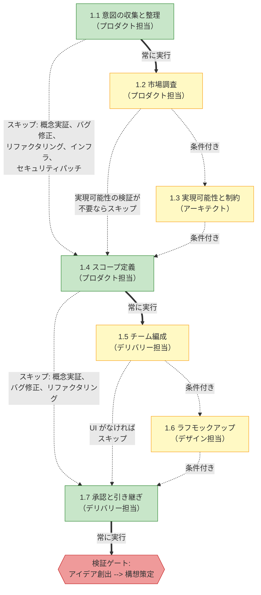
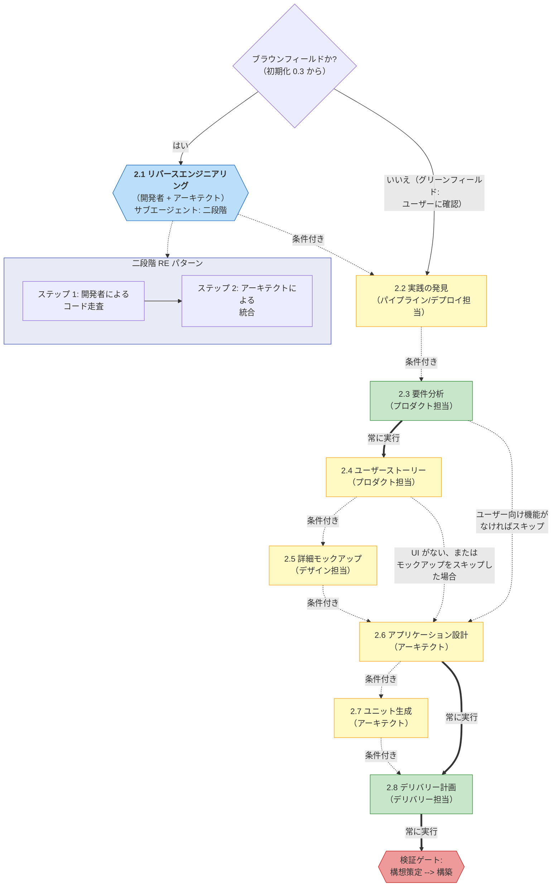
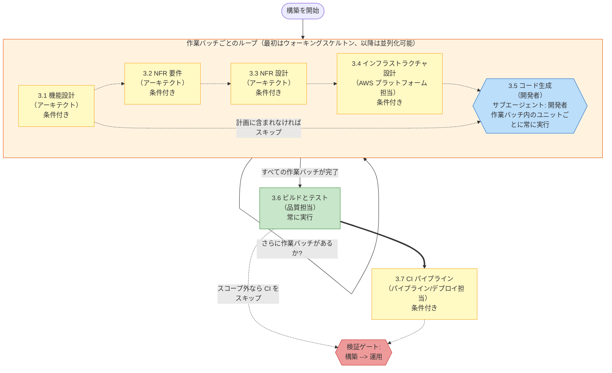
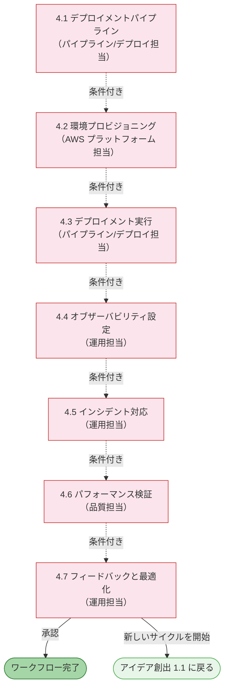
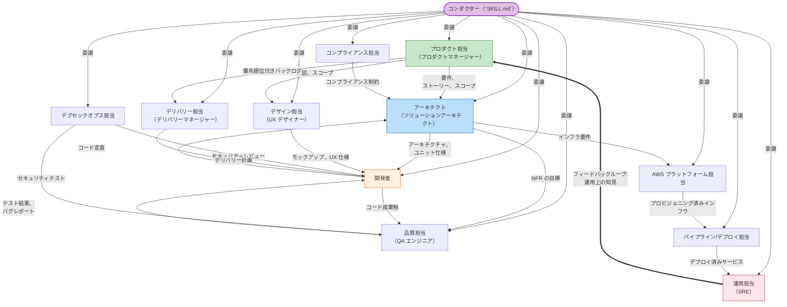
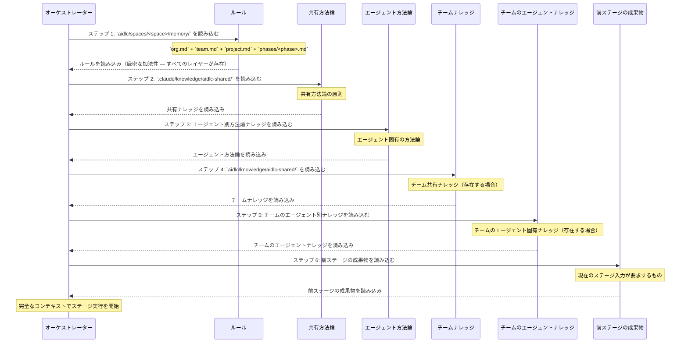
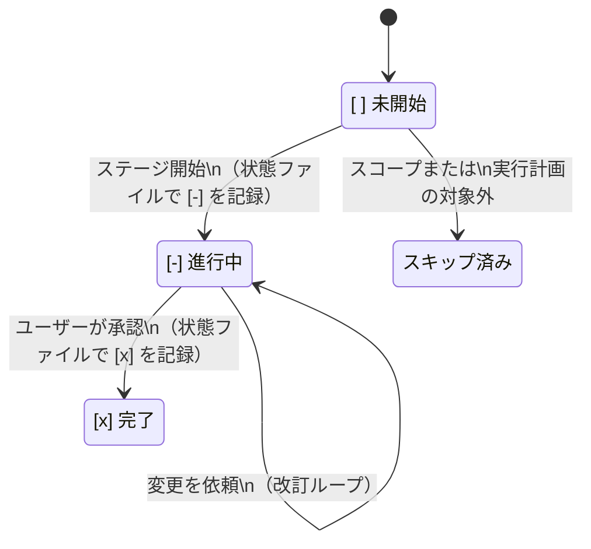

<a id="ai-dlc-workflow-diagrams"></a>
# AI-DLC ワークフロー図

このドキュメントには、AI-DLC（AI 主導の開発ライフサイクル）方法論を可視化するすべての Mermaid 図を収録しています。各セクションには簡単な説明とレンダリングされた図を含みます。これらの図は、エンジンおよびコンダクター（`aidlc-orchestrate.ts` + `SKILL.md`）、ステージプロトコル（`stage-protocol.md`）、ステージファイル、エージェント定義に基づいています。

> **注記:** これらの図は、関連する各リファレンス章にもインラインで埋め込まれています。このファイルはすべての図を一箇所にまとめた索引です。以下の図における `<record>/` は、アクティブな意図の記録ディレクトリ `aidlc/spaces/<space>/intents/<YYMMDD>-<label>/` を表します。
>
> - 図 1 と 7: [アーキテクチャ](01-architecture.md)
> - 図 8: [オーケストレーター](03-orchestrator.md) -- セッション管理セクション
> - 図 9: [オーケストレーター](03-orchestrator.md) -- スコープルーティングセクション
> - 図 10: [ナレッジシステム](10-knowledge-system.md)
> - 図 11: [ステージプロトコル](04-stage-protocol.md) -- 承認ゲートセクション
> - 図 12: [オーケストレーター](03-orchestrator.md) -- 状態追跡セクション

---

<a id="1-end-to-end-lifecycle"></a>
## 1. エンドツーエンドのライフサイクル

AI-DLC 方法論は作業を五つの連続したフェーズに編成します。各フェーズの境界には、次のフェーズを始める前に通過すべき検証ゲートがあります。ライフサイクル全体は五つのフェーズにまたがる 32 ステージから成り、実際に実行するステージはスコープが決定します。

```mermaid
graph LR
    subgraph INITIALIZATION["初期化（0.1〜0.3）"]
        Z1["ワークスペースの足場作成"]
        Z4["状態の初期化"]
        Z1 -.->|"3 ステージ"| Z4
    end

    subgraph IDEATION["アイデア創出（1.1〜1.7）"]
        I1["意図の収集"]
        I7["承認と引き継ぎ"]
        I1 -.->|"7 ステージ"| I7
    end

    subgraph INCEPTION["構想策定（2.1〜2.8）"]
        N1["リバースエンジニアリング"]
        N7["デリバリー計画"]
        N1 -.->|"8 ステージ"| N7
    end

    subgraph CONSTRUCTION["構築（3.1〜3.7）"]
        C1["機能設計"]
        C7["CI パイプライン"]
        C1 -.->|"作業バッチごとに 3.1〜3.5、すべてのバッチ完了後に一度だけ 3.6〜3.7"| C7
    end

    subgraph OPERATION["運用（4.1〜4.7）"]
        O1["デプロイメントパイプライン"]
        O7["フィードバックと最適化"]
        O1 -.->|"7 ステージ"| O7
    end

    Z4 -->|"自動進行"| I1
    I7 -->|"検証ゲート 1"| N1
    N7 -->|"検証ゲート 2"| C1
    C7 -->|"検証ゲート 3"| O1
    O7 -.->|"フィードバックループ"| I1

    style INITIALIZATION fill:#f3e5f5,stroke:#9c27b0
    style IDEATION fill:#e8f5e9,stroke:#4caf50
    style INCEPTION fill:#e3f2fd,stroke:#2196f3
    style CONSTRUCTION fill:#fff3e0,stroke:#ff9800
    style OPERATION fill:#fce4ec,stroke:#e91e63
```



---

<a id="2-ideation-flow"></a>
## 2. アイデア創出フロー

アイデア創出フェーズでは、ビジネス上の意図を収集し、実現可能性を検証し、スコープを定義し、チームを編成し、ラフモックアップを作成して、承認用のイニシアチブ概要を作成します。常時実行と付いたステージはすべてのスコープで実行され、条件付きステージは特定のスコープでスキップされます（例: 概念実証、バグ修正、リファクタリングでは市場調査をスキップ）。実線矢印は常時実行のルーティング、破線矢印は条件付きルーティングを表します。



---

<a id="3-inception-flow"></a>
## 3. 構想策定フロー

構想策定フェーズでは、コードベースを分析し（ブラウンフィールドプロジェクトの場合）、チームの実践を発見し、要件を引き出し、ユーザーストーリーとモックアップを作成し、アプリケーションアーキテクチャを設計し、実装ユニットに分解して、デリバリーを計画します。ステージ 2.1（リバースエンジニアリング）はサブエージェントとして実行され、六角形で示します。これは二段階の RE パターンを使います。最初に開発者サブエージェントがコードを走査し、次にアーキテクトサブエージェントが結果を統合します。



---

<a id="4-construction-flow"></a>
## 4. 構築フロー

構築フェーズは `bolt-plan.md` に従って作業バッチ単位で実行します。各作業バッチは一つ以上の作業ユニットの整合性ある一部分を対象とし、ステージ 3.1〜3.5 を一度実行します。ウォーキングスケルトンの作業バッチは常に単一バッチとして最初に実行されます。以降の作業バッチは依存関係グラフが許す範囲で並列バッチとして実行できます。最後の作業バッチの後、ステージ 3.6（ビルドとテスト）および 3.7（CI パイプライン）を全作業バッチに対して一度だけ実行します。ステージ 3.5（コード生成）はサブエージェントとして実行され、六角形で示します。



---

<a id="5-operation-flow"></a>
## 5. 運用フロー

運用フェーズは、デプロイメント、環境プロビジョニング、オブザーバビリティ、インシデント対応、パフォーマンス検証、フィードバックを扱います。七つのステージはすべて条件付きです（概念実証およびバグ修正スコープではフェーズ全体をスキップする場合があります）。すべてのステージはインラインで実行します。ステージ 4.7 は終端ステージであり、承認後にワークフローが完了するか、新しいアイデア創出サイクルを開始できます。



---

<a id="6-agent-collaboration-map"></a>
## 6. エージェント連携マップ

AI-DLC システムは 11 のドメイン専門エージェントを使用します。コンダクター（`SKILL.md`）はエンジンの指示に従って各エージェントを呼び出します。エージェント同士が直接呼び出し合うことはありません。エージェント間の情報は、意図の記録ディレクトリ（`aidlc/spaces/<space>/intents/<YYMMDD>-<label>/`）に格納された成果物を通じて流れます。以下の図は、運用エージェントからプロダクトエージェントへ戻るフィードバックループで終わる、エージェント間の主な情報フローを示します。



---

<a id="7-execution-model"></a>
## 7. 実行モデル

この実装では、ステージに三つの実行モードを使用します。**インライン**ステージはオーケストレーターとの会話内で直接実行されます（ユーザーは対話可能です）。**サブエージェント（単純）**ステージは Claude Code の `Task` ツールを通じて一つのエージェントへ委譲します。**サブエージェント（二段階リバースエンジニアリング）**は、二つのエージェントへ順番に委譲するリバースエンジニアリング専用のパターンです。

```mermaid
flowchart LR
    subgraph INLINE["モード 1: インライン"]
        direction TB
        IN1["オーケストレーターが\nステージファイルを読む"]
        IN2["エージェントのペルソナと\nナレッジを読み込む"]
        IN3["会話内で直接\nステージ手順を実行"]
        IN4["ユーザーとの対話が\n可能"]
        IN5["承認ゲート\n（`AskUserQuestion`）"]
        IN1 --> IN2 --> IN3 --> IN4 --> IN5
    end

    subgraph SUBAGENT["モード 2: サブエージェント（単純）"]
        direction TB
        SA1["オーケストレーターが\nステージファイルを読む"]
        SA2["コンテキストを準備:\n成果物 + ペルソナ"]
        SA3["`Task` ツール呼び出し\n（`subagent` 種別を指定）"]
        SA4["サブエージェントが実行\n（ユーザー対話なし）"]
        SA5["構造化された要約を\nオーケストレーターへ返す"]
        SA6["オーケストレーターが\n完了と承認を提示"]
        SA1 --> SA2 --> SA3 --> SA4 --> SA5 --> SA6
    end

    subgraph TWOSTEP["モード 3: サブエージェント（二段階リバースエンジニアリング）"]
        direction TB
        TS1["オーケストレーターが\nリバースエンジニアリング\nステージファイルを読む"]
        TS2["`Task`: 開発者による\nコード走査"]
        TS3["開発者が走査結果を\n返す"]
        TS4["`Task`: アーキテクトによる\n統合"]
        TS5["アーキテクトが9個の\n成果物を作成"]
        TS6["オーケストレーターが\n完了と承認を提示"]
        TS1 --> TS2 --> TS3 --> TS4 --> TS5 --> TS6
    end

    style INLINE fill:#e8f5e9,stroke:#4caf50
    style SUBAGENT fill:#e3f2fd,stroke:#2196f3
    style TWOSTEP fill:#fff3e0,stroke:#ff9800
```

---

<a id="8-session-resume-flow"></a>
## 8. セッション再開フロー

ユーザーが `/aidlc` を呼び出すと、オーケストレーターはアクティブな意図の `aidlc-state.md` を確認します。見つかった場合は四つの再開オプションを提示します。見つからない場合は最初の意図を生成します。コンテキスト圧縮による状態破損の可能性を検出するため、オーケストレーターは `.aidlc-recovery.md` も確認します。

```mermaid
flowchart TD
    START(["`/aidlc` を呼び出し"])
    ARG_CHECK{"引数が\nあるか?"}
    STATUS_CHECK{"引数が\n`--status` か?"}
    STATE_EXISTS{"アクティブな意図が\n存在するか?"}
    RECOVERY_CHECK{"`.aidlc-recovery.md` が\n存在するか?"}
    CORRUPTION{"状態がリカバリ\nファイルと一致するか?"}
    WARN["破損の可能性を\nユーザーへ警告"]

    RESUME_MENU["`AskUserQuestion`:\n再開オプション"]
    OPT_RESUME["最後のチェックポイントから\n再開"]
    OPT_REDO["現在のステージを\nやり直す"]
    OPT_JUMP["特定のステージへ\nジャンプ"]
    OPT_FRESH["新しく開始\n（既存をアーカイブ）"]

    STATUS_DISPLAY["読み取り専用の\n状態要約を表示"]
    SCOPE_DETECT{"既知のスコープか\n自由形式テキストか?"}
    KNOWN_SCOPE["明示されたスコープを使用"]
    FREEFORM["キーワードからスコープを\n自動検出"]
    CONFIRM_SCOPE["ユーザーにスコープを\n確認"]
    BIRTH["意図を生成:\n記録ディレクトリ、状態、\n監査を作成し最初の\nステージを開始"]

    START --> ARG_CHECK
    ARG_CHECK -->|はい| STATUS_CHECK
    ARG_CHECK -->|いいえ| STATE_EXISTS

    STATUS_CHECK -->|はい| STATUS_DISPLAY
    STATUS_CHECK -->|いいえ| STATE_EXISTS

    STATE_EXISTS -->|はい| RECOVERY_CHECK
    STATE_EXISTS -->|いいえ| SCOPE_DETECT

    RECOVERY_CHECK -->|はい| CORRUPTION
    RECOVERY_CHECK -->|いいえ| RESUME_MENU
    CORRUPTION -->|不一致| WARN --> RESUME_MENU
    CORRUPTION -->|一致| RESUME_MENU

    RESUME_MENU --> OPT_RESUME
    RESUME_MENU --> OPT_REDO
    RESUME_MENU --> OPT_JUMP
    RESUME_MENU --> OPT_FRESH

    OPT_FRESH -->|"アーカイブ + 確認"| BIRTH

    SCOPE_DETECT -->|"既知のスコープ"| KNOWN_SCOPE --> CONFIRM_SCOPE
    SCOPE_DETECT -->|"自由形式テキスト"| FREEFORM --> CONFIRM_SCOPE
    CONFIRM_SCOPE --> BIRTH

    style START fill:#e1bee7,stroke:#7b1fa2
    style RESUME_MENU fill:#bbdefb,stroke:#1565c0
    style BIRTH fill:#c8e6c9,stroke:#388e3c
    style WARN fill:#ffcdd2,stroke:#c62828
```

---

<a id="9-scope-routing"></a>
## 9. スコープルーティング

> スコープルーティング表は、[オーケストレーターリファレンス -- スコープマッピング](03-orchestrator.md#scope-to-stage-mapping) を参照してください。

---

<a id="10-knowledge-loading-order"></a>
## 10. ナレッジ読み込み順序

各ステージはナレッジを厳格な 6 ステップの順序で読み込みます。これにより、最初にガードレール、次に共有方法論、エージェント固有ナレッジ、チームカスタマイズ、最後に前ステージの成果物という優先順位が確保されます。以下のシーケンス図は、任意のステージアクティベーションにおける読み込み順序を示します。

> **注記:** ステップ 1〜5 はエージェントナレッジの読み込み（各エージェントファイルで定義）であり、ステップ 6（前ステージの成果物）はファイル読み込みステップではなく、ランタイムにオーケストレーターが追加するコンテキストです。



---

<a id="11-approval-gate-flow"></a>
## 11. 承認ゲートフロー

すべてのステージ（初期化の 3 ステージを除く）は承認ゲートで終わります。オーケストレーターは選択肢をユーザーに提示する前に監査証跡へ記録し、その後ユーザーの応答を記録します。3 回の改訂サイクル後には、「現状のまま受け入れる」というエスケープハッチが利用可能になります。アイデア創出と構想策定のステージには、以前にスキップしたステージを追加する条件付きの第三選択肢が含まれることもあります。

```mermaid
flowchart TD
    COMPLETE["ステージ作業が完了"]
    AUDIT_PRE["`audit.md` に追記:\nステージ要約 + 選択肢\n（新しい ISO タイムスタンプ）"]
    ASK["`AskUserQuestion`:\n承認ゲート"]

    APPROVE["承認"]
    CHANGES["変更を依頼"]
    ACCEPT["現状のまま受け入れる\n（エスケープハッチ）"]
    ADD_STAGE["スキップ済みステージを追加\n（アイデア創出/構想策定のみ）"]

    AUDIT_POST_A["記録: ユーザーが承認\n（新しいタイムスタンプ）"]
    AUDIT_POST_C["記録: ユーザーが変更を依頼\n（新しいタイムスタンプ）"]
    AUDIT_POST_ACC["記録: ユーザーが現状のまま受け入れ\n（新しいタイムスタンプ）"]
    AUDIT_POST_ADD["記録: ユーザーがステージを追加\n（新しいタイムスタンプ）"]

    REVISION_COUNT{"改訂サイクルが3回\n以上か?"}
    NOTE_2ND["2 回目の改訂後:\n次のサイクルでエスケープハッチが\n有効になることを通知"]

    UPDATE_STATE["状態ファイルを更新:\nステージを完了として記録"]
    PROGRESS["進捗行を表示:\n全体で N/総数"]
    NEXT_STAGE["次のステージへ進む"]

    REVISE["ユーザーフィードバックを\nステージ成果物へ適用"]
    RE_PRESENT["完了メッセージを\n再提示"]

    ADD_EXEC["スキップ済みステージを\nワークフローへ挿入"]

    COMPLETE --> AUDIT_PRE --> ASK
    ASK --> APPROVE
    ASK --> CHANGES
    ASK --> ACCEPT
    ASK --> ADD_STAGE

    APPROVE --> AUDIT_POST_A --> UPDATE_STATE --> PROGRESS --> NEXT_STAGE
    ACCEPT --> AUDIT_POST_ACC --> UPDATE_STATE

    CHANGES --> AUDIT_POST_C --> REVISION_COUNT
    REVISION_COUNT -->|"< 3"| NOTE_2ND --> REVISE --> RE_PRESENT --> AUDIT_PRE
    REVISION_COUNT -->|">= 3"| REVISE

    ADD_STAGE --> AUDIT_POST_ADD --> ADD_EXEC

    style COMPLETE fill:#e8f5e9,stroke:#388e3c
    style ASK fill:#bbdefb,stroke:#1565c0
    style APPROVE fill:#a5d6a7,stroke:#2e7d32
    style CHANGES fill:#fff9c4,stroke:#f9a825
    style ACCEPT fill:#ffccbc,stroke:#bf360c
    style ADD_STAGE fill:#e1bee7,stroke:#7b1fa2
    style NEXT_STAGE fill:#c8e6c9,stroke:#388e3c
```

---

<a id="12-state-tracking"></a>
## 12. 状態追跡

`aidlc-state.md` ファイルは、チェックボックス表記 `[ ]`（未開始）、`[-]`（進行中）、`[x]`（完了）で各ステージを追跡します。ステージは常に中間の `[-]` 状態を経由し、`[ ]` から直接 `[x]` へ移ることはありません。この図はスキップ、やり直し、ジャンプ操作の補助フローも示します。スキップ時はタスクを作成したうえで、直ちにスキップ理由付きで完了にします（説明: 「スキップ: [理由]」）。

```mermaid
flowchart TD
    subgraph NORMAL["通常フロー"]
        direction LR
        NS1["[ ] 未開始"]
        IP1["[-] 進行中"]
        CO1["[x] 完了"]
        NS1 -->|"ステージ開始"| IP1
        IP1 -->|"ユーザーが承認"| CO1
    end

    subgraph SKIP["スキップフロー"]
        direction LR
        NS2["[ ] 未開始"]
        SK2["[x] 完了\n（スキップ: 理由）"]
        NS2 -->|"スコープ外"| SK2
    end

    subgraph REDO["やり直しフロー"]
        direction LR
        CO3["[x] 完了\nまたは [-] 進行中"]
        NS3["[ ] 未開始"]
        IP3["[-] 進行中"]
        CO3 -->|"ユーザーがやり直しを依頼\n（成果物を削除）"| NS3
        NS3 -->|"ステージを再実行"| IP3
    end

    subgraph JUMP["ジャンプフロー"]
        direction LR
        IP4["[-] 進行中\n（ステージ A）"]
        NS4["[ ] 未開始\n（ステージ B）"]
        IP4B["[-] 進行中\n（ステージ B）"]
        IP4 -->|"ユーザーがジャンプを依頼\n（スキップするステージを警告）"| NS4
        NS4 -->|"対象ステージを開始"| IP4B
    end

    style NORMAL fill:#e8f5e9,stroke:#4caf50
    style SKIP fill:#fff9c4,stroke:#f9a825
    style REDO fill:#e3f2fd,stroke:#2196f3
    style JUMP fill:#fce4ec,stroke:#e91e63
```





---

<a id="summary-of-execution-modes-by-stage"></a>
## ステージ別実行モードの一覧

このリファレンス表は、迅速に参照できるよう、各ステージを実行モードとリードエージェントに対応付けます。

| ステージ | 名称 | モード | リードエージェント |
|-------|------|------|------------|
| 0.1 | ワークスペースの足場作成 | インライン（自動進行） | オーケストレーター |
| 0.2 | ワークスペース検出 | インライン（自動進行、決定的スキャナー） | オーケストレーター |
| 0.3 | 状態の初期化 | インライン（自動進行） | オーケストレーター |
| 1.1 | 意図の収集 | インライン | プロダクト担当 |
| 1.2 | 市場調査 | インライン | プロダクト担当 |
| 1.3 | 実現可能性 | インライン | アーキテクト |
| 1.4 | スコープ定義 | インライン | プロダクト担当 |
| 1.5 | チーム編成 | インライン | デリバリー担当 |
| 1.6 | ラフモックアップ | インライン | デザイン担当 |
| 1.7 | 承認と引き継ぎ | インライン | デリバリー担当 |
| 2.1 | リバースエンジニアリング | サブエージェント（二段階） | 開発者 + アーキテクト |
| 2.2 | 実践の発見 | インライン | パイプライン/デプロイ担当 |
| 2.3 | 要件分析 | インライン | プロダクト担当 |
| 2.4 | ユーザーストーリー | インライン | プロダクト担当 |
| 2.5 | 詳細モックアップ | インライン | デザイン担当 |
| 2.6 | アプリケーション設計 | インライン | アーキテクト |
| 2.7 | ユニット生成 | インライン | アーキテクト |
| 2.8 | デリバリー計画 | インライン | デリバリー担当 |
| 3.1 | 機能設計 | インライン | アーキテクト |
| 3.2 | NFR 要件 | インライン | アーキテクト |
| 3.3 | NFR 設計 | インライン | アーキテクト |
| 3.4 | インフラストラクチャ設計 | インライン | AWS プラットフォーム担当 |
| 3.5 | コード生成 | サブエージェント（開発者） | 開発者 |
| 3.6 | ビルドとテスト | インライン | 品質担当 |
| 3.7 | CI パイプライン | インライン | パイプライン/デプロイ担当 |
| 4.1 | デプロイメントパイプライン | インライン | パイプライン/デプロイ担当 |
| 4.2 | 環境プロビジョニング | インライン | AWS プラットフォーム担当 |
| 4.3 | デプロイメント実行 | インライン | パイプライン/デプロイ担当 |
| 4.4 | オブザーバビリティ設定 | インライン | 運用担当 |
| 4.5 | インシデント対応 | インライン | 運用担当 |
| 4.6 | パフォーマンス検証 | インライン | 品質担当 |
| 4.7 | フィードバックと最適化 | インライン | 運用担当 |
